# ERPAuto 配置系统架构分析

## 1. 概述

ERPAuto 是一个基于 Electron 的桌面应用程序，采用多层次配置管理系统来支持 ERP 系统自动化数据处理。配置系统采用 `.env` 文件作为持久化存储，通过 `ConfigManager` 统一管理，支持运行时动态修改和持久化保存。

## 2. 配置系统整体架构

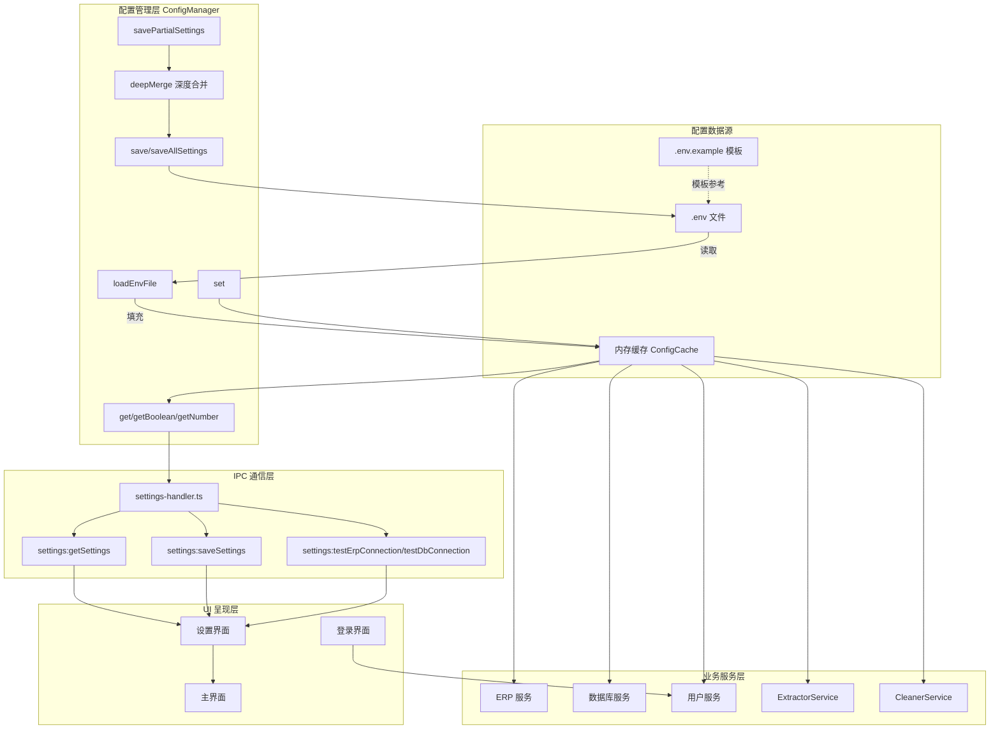
```mermaid
graph TB
    subgraph "配置数据源"
        ENV[.env 文件]
        ENV_EXAMPLE[.env.example 模板]
        CACHE[内存缓存 ConfigCache]
    end

    subgraph "配置管理层 ConfigManager"
        CM_LOAD[loadEnvFile]
        CM_GET[get/getBoolean/getNumber]
        CM_SET[set]
        CM_SAVE[save/saveAllSettings]
        CM_PARTIAL[savePartialSettings]
        CM_MERGE[deepMerge 深度合并]
    end

    subgraph "IPC 通信层"
        SETTINGS_HANDLER[settings-handler.ts]
        IPC_GET[settings:getSettings]
        IPC_SAVE[settings:saveSettings]
        IPC_TEST[settings:testErpConnection/testDbConnection]
    end

    subgraph "业务服务层"
        ERP_SVC[ERP 服务]
        DB_SVC[数据库服务]
        USER_SVC[用户服务]
        EXTRACTOR[ExtractorService]
        CLEANER[CleanerService]
    end

    subgraph "UI 呈现层"
        SETTINGS_UI[设置界面]
        LOGIN_UI[登录界面]
        MAIN_UI[主界面]
    end

    ENV -->|读取 | CM_LOAD
    ENV_EXAMPLE -.->|模板参考 | ENV
    CM_LOAD -->|填充 | CACHE
    CACHE --> CM_GET
    CM_SET --> CACHE
    CM_PARTIAL --> CM_MERGE --> CM_SAVE --> ENV

    CM_GET --> SETTINGS_HANDLER
    SETTINGS_HANDLER --> IPC_GET
    SETTINGS_HANDLER --> IPC_SAVE
    SETTINGS_HANDLER --> IPC_TEST

    IPC_GET --> SETTINGS_UI
    IPC_SAVE --> SETTINGS_UI
    IPC_TEST --> SETTINGS_UI

    CACHE --> ERP_SVC
    CACHE --> DB_SVC
    CACHE --> USER_SVC
    CACHE --> EXTRACTOR
    CACHE --> CLEANER

    SETTINGS_UI --> MAIN_UI
    LOGIN_UI --> USER_SVC
```

## 3. 配置文件结构

### 3.1 .env 文件组织

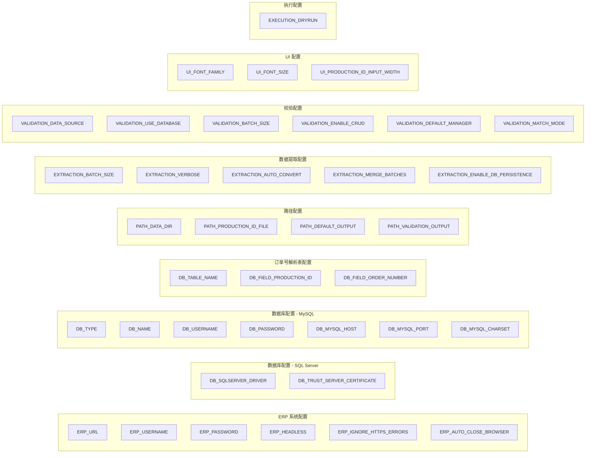
```mermaid
graph LR
    subgraph "ERP 系统配置"
        ERP_URL[ERP_URL]
        ERP_USER[ERP_USERNAME]
        ERP_PASS[ERP_PASSWORD]
        ERP_HEADLESS[ERP_HEADLESS]
        ERP_HTTPS[ERP_IGNORE_HTTPS_ERRORS]
        ERP_CLOSE[ERP_AUTO_CLOSE_BROWSER]
    end

    subgraph "数据库配置 - SQL Server"
        SQL_DRIVER[DB_SQLSERVER_DRIVER]
        SQL_TRUST[DB_TRUST_SERVER_CERTIFICATE]
    end

    subgraph "数据库配置 - MySQL"
        DB_TYPE[DB_TYPE]
        DB_NAME[DB_NAME]
        DB_USER[DB_USERNAME]
        DB_PASS[DB_PASSWORD]
        MYSQL_HOST[DB_MYSQL_HOST]
        MYSQL_PORT[DB_MYSQL_PORT]
        MYSQL_CHARSET[DB_MYSQL_CHARSET]
    end

    subgraph "订单号解析表配置"
        TABLE_NAME[DB_TABLE_NAME]
        FIELD_PROD_ID[DB_FIELD_PRODUCTION_ID]
        FIELD_ORDER[DB_FIELD_ORDER_NUMBER]
    end

    subgraph "路径配置"
        DATA_DIR[PATH_DATA_DIR]
        PROD_ID_FILE[PATH_PRODUCTION_ID_FILE]
        DEFAULT_OUT[PATH_DEFAULT_OUTPUT]
        VALID_OUT[PATH_VALIDATION_OUTPUT]
    end

    subgraph "数据提取配置"
        BATCH_SIZE[EXTRACTION_BATCH_SIZE]
        VERBOSE[EXTRACTION_VERBOSE]
        AUTO_CONVERT[EXTRACTION_AUTO_CONVERT]
        MERGE_BATCHES[EXTRACTION_MERGE_BATCHES]
        DB_PERSIST[EXTRACTION_ENABLE_DB_PERSISTENCE]
    end

    subgraph "校验配置"
        DATA_SOURCE[VALIDATION_DATA_SOURCE]
        USE_DB[VALIDATION_USE_DATABASE]
        VAL_BATCH[VALIDATION_BATCH_SIZE]
        ENABLE_CRUD[VALIDATION_ENABLE_CRUD]
        DEFAULT_MGR[VALIDATION_DEFAULT_MANAGER]
        MATCH_MODE[VALIDATION_MATCH_MODE]
    end

    subgraph "UI 配置"
        FONT_FAMILY[UI_FONT_FAMILY]
        FONT_SIZE[UI_FONT_SIZE]
        INPUT_WIDTH[UI_PRODUCTION_ID_INPUT_WIDTH]
    end

    subgraph "执行配置"
        DRY_RUN[EXECUTION_DRYRUN]
    end
```

### 3.2 默认配置值

| 配置类别   | 配置项            | 默认值                      | 说明                 |
| ---------- | ----------------- | --------------------------- | -------------------- |
| ERP        | url               | `https://68.11.34.30:8082/` | ERP 系统地址         |
| ERP        | headless          | `true`                      | 无头浏览器模式       |
| ERP        | ignoreHttpsErrors | `true`                      | 忽略 HTTPS 证书错误  |
| ERP        | autoCloseBrowser  | `true`                      | 操作后自动关闭浏览器 |
| Database   | dbType            | `mysql`                     | 数据库类型           |
| Database   | mysqlHost         | `192.168.31.83`             | MySQL 主机地址       |
| Database   | mysqlPort         | `3306`                      | MySQL 端口           |
| Database   | database          | `BLD_DB`                    | 数据库名             |
| Database   | username          | `remote_user`               | 数据库用户名         |
| Paths      | dataDir           | `D:/python/playwrite/data/` | 数据目录             |
| Extraction | batchSize         | `100`                       | 批次大小             |
| Extraction | verbose           | `true`                      | 详细日志             |
| Validation | dataSource        | `database_full`             | 校验数据源           |
| Validation | batchSize         | `2000`                      | 校验批次大小         |
| Validation | matchMode         | `substring`                 | 匹配模式             |
| UI         | fontFamily        | `Microsoft YaHei UI`        | 字体                 |
| UI         | fontSize          | `10`                        | 字体大小             |
| Execution  | dryRun            | `false`                     | 干运行模式           |

## 4. ConfigManager 核心类设计

### 4.1 类结构与单例模式

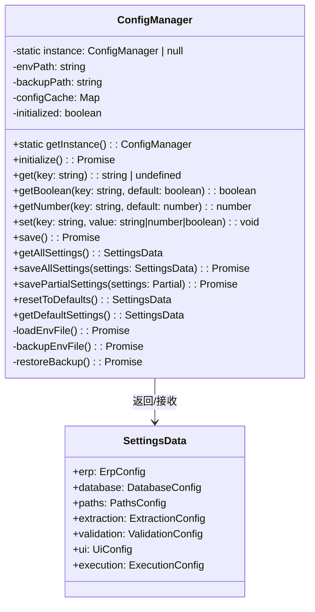
```mermaid
classDiagram
    class ConfigManager {
        -static instance: ConfigManager | null
        -envPath: string
        -backupPath: string
        -configCache: Map<string, string>
        -initialized: boolean
        +static getInstance(): ConfigManager
        +initialize(): Promise<void>
        +get(key: string): string | undefined
        +getBoolean(key: string, default: boolean): boolean
        +getNumber(key: string, default: number): number
        +set(key: string, value: string|number|boolean): void
        +save(): Promise<boolean>
        +getAllSettings(): SettingsData
        +saveAllSettings(settings: SettingsData): Promise<boolean>
        +savePartialSettings(settings: Partial<SettingsData>): Promise<Object>
        +resetToDefaults(): SettingsData
        +getDefaultSettings(): SettingsData
        -loadEnvFile(): Promise<void>
        -backupEnvFile(): Promise<boolean>
        -restoreBackup(): Promise<boolean>
    }

    class SettingsData {
        +erp: ErpConfig
        +database: DatabaseConfig
        +paths: PathsConfig
        +extraction: ExtractionConfig
        +validation: ValidationConfig
        +ui: UiConfig
        +execution: ExecutionConfig
    }

    ConfigManager --> SettingsData: 返回/接收
```

### 4.2 核心方法流程图

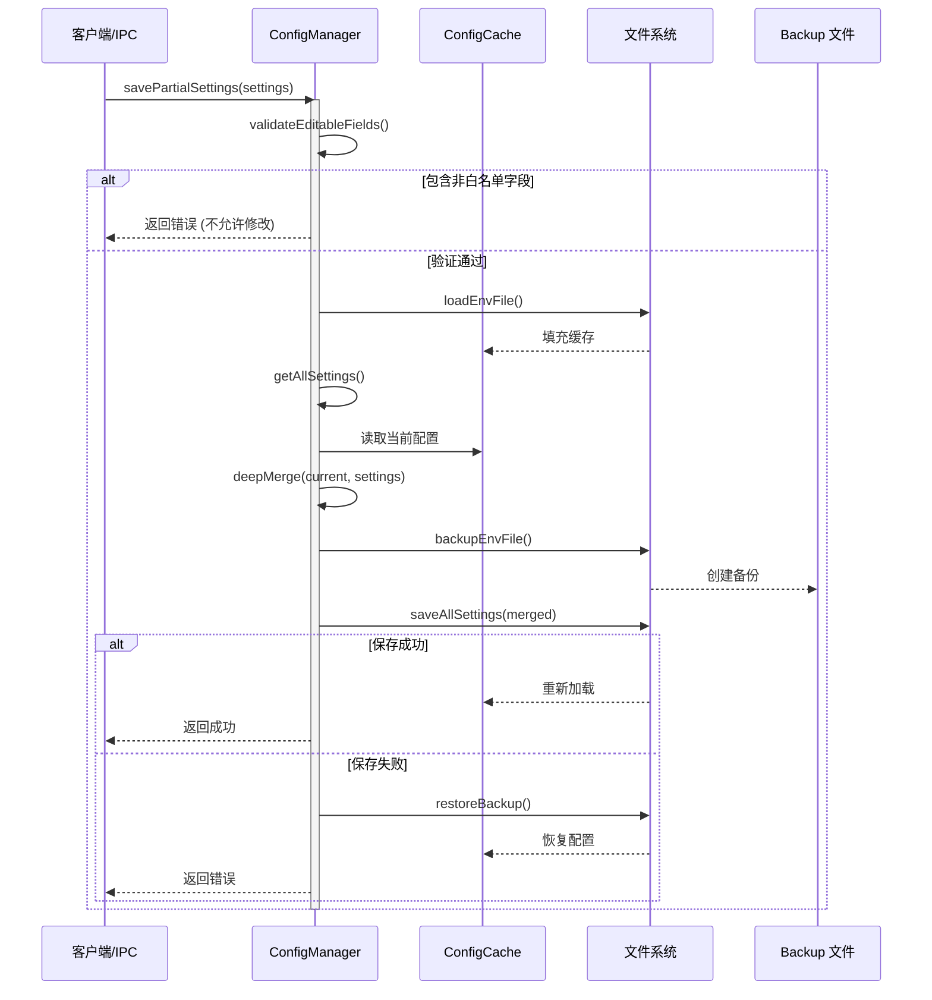
```mermaid
sequenceDiagram
    participant Client as 客户端/IPC
    participant CM as ConfigManager
    participant Cache as ConfigCache
    participant FS as 文件系统
    participant Backup as Backup 文件

    Client->>CM: savePartialSettings(settings)
    activate CM

    CM->>CM: validateEditableFields()
    alt 包含非白名单字段
        CM-->>Client: 返回错误 (不允许修改)
    else 验证通过
        CM->>FS: loadEnvFile()
        FS-->>Cache: 填充缓存
        CM->>CM: getAllSettings()
        CM->>Cache: 读取当前配置
        CM->>CM: deepMerge(current, settings)

        CM->>FS: backupEnvFile()
        FS-->>Backup: 创建备份

        CM->>FS: saveAllSettings(merged)
        alt 保存成功
            FS-->>Cache: 重新加载
            CM-->>Client: 返回成功
        else 保存失败
            CM->>FS: restoreBackup()
            FS-->>Cache: 恢复配置
            CM-->>Client: 返回错误
        end
    end
    deactivate CM
```

### 4.3 深度合并算法

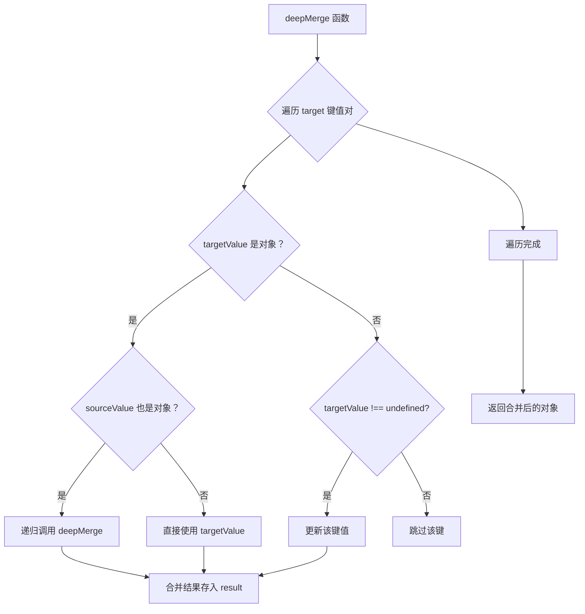
```mermaid
graph TD
    A[deepMerge 函数] --> B{遍历 target 键值对}
    B --> C{targetValue 是对象？}
    C -->|是 | D{sourceValue 也是对象？}
    D -->|是 | E[递归调用 deepMerge]
    D -->|否 | F[直接使用 targetValue]
    C -->|否 | G{targetValue !== undefined?}
    G -->|是 | H[更新该键值]
    G -->|否 | I[跳过该键]
    E --> J[合并结果存入 result]
    F --> J
    H --> J
    B --> K[遍历完成]
    K --> L[返回合并后的对象]
```

## 5. 配置读取与使用模式

### 5.1 环境变量直接读取模式

各业务服务通过 `process.env` 直接读取配置：

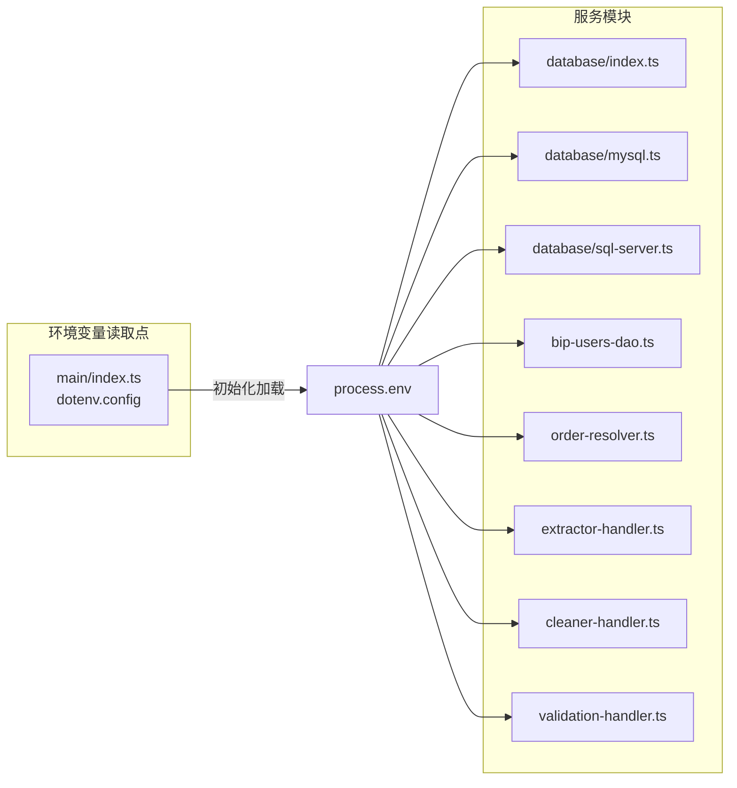
```mermaid
graph LR
    subgraph "环境变量读取点"
        MAIN[main/index.ts<br/>dotenv.config]
    end

    subgraph "服务模块"
        DB_INDEX[database/index.ts]
        DB_MYSQL[database/mysql.ts]
        DB_SQL[database/sql-server.ts]
        BIP_DAO[bip-users-dao.ts]
        ORDER_RES[order-resolver.ts]
        EXTRACTOR[extractor-handler.ts]
        CLEANER[cleaner-handler.ts]
        VALIDATION[validation-handler.ts]
    end

    MAIN -->|初始化加载 | ENV[process.env]

    ENV --> DB_INDEX
    ENV --> DB_MYSQL
    ENV --> DB_SQL
    ENV --> BIP_DAO
    ENV --> ORDER_RES
    ENV --> EXTRACTOR
    ENV --> CLEANER
    ENV --> VALIDATION
```

### 5.2 ConfigManager 获取模式

通过 IPC 层统一获取：

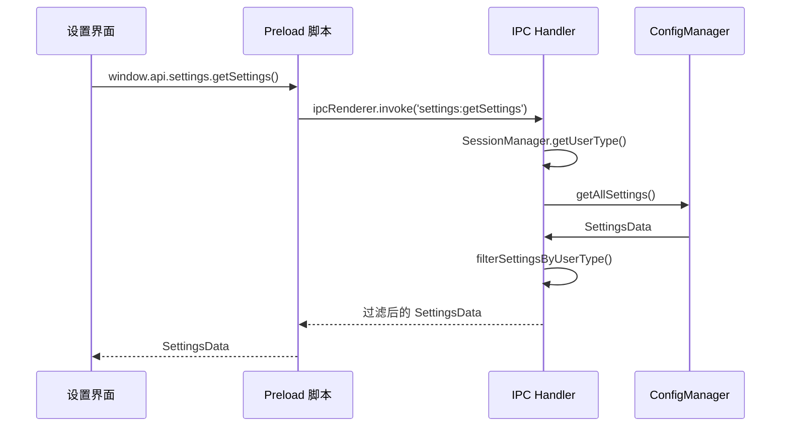
```mermaid
sequenceDiagram
    participant UI as 设置界面
    participant Preload as Preload 脚本
    participant IPC as IPC Handler
    participant CM as ConfigManager

    UI->>Preload: window.api.settings.getSettings()
    Preload->>IPC: ipcRenderer.invoke('settings:getSettings')
    IPC->>IPC: SessionManager.getUserType()
    IPC->>CM: getAllSettings()
    CM->>IPC: SettingsData
    IPC->>IPC: filterSettingsByUserType()
    IPC-->>Preload: 过滤后的 SettingsData
    Preload-->>UI: SettingsData
```

### 5.3 数据库配置工厂模式

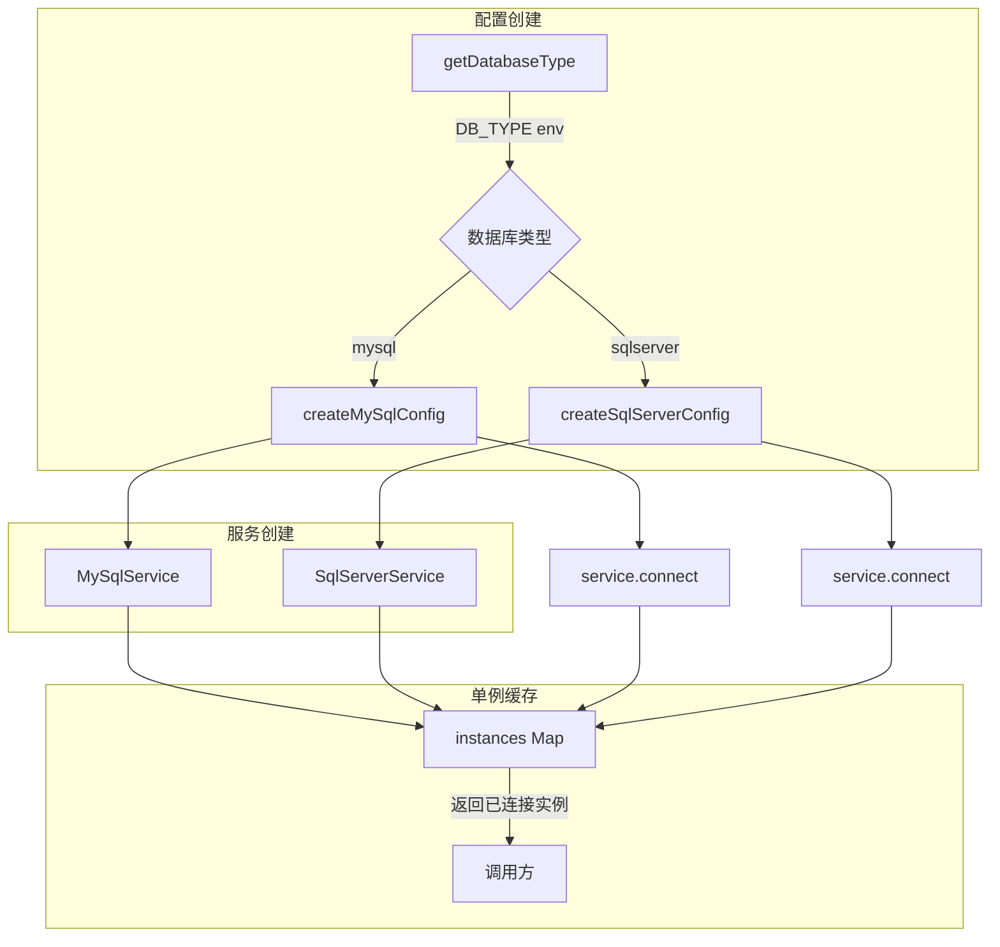
```mermaid
graph TB
    subgraph "配置创建"
        GET_TYPE[getDatabaseType] -->|DB_TYPE env| TYPE_CHECK{数据库类型}
        TYPE_CHECK -->|mysql| CREATE_MYSQL[createMySqlConfig]
        TYPE_CHECK -->|sqlserver| CREATE_SQL[createSqlServerConfig]
    end

    subgraph "服务创建"
        CREATE_MYSQL --> MYSQL_SVC[MySqlService]
        CREATE_SQL --> SQL_SVC[SqlServerService]
    end

    subgraph "单例缓存"
        MYSQL_SVC --> CACHE[instances Map]
        SQL_SVC --> CACHE
        CACHE -->|返回已连接实例 | CLIENT[调用方]
    end

    CREATE_MYSQL --> CONNECT_MYSQL[service.connect]
    CREATE_SQL --> CONNECT_SQL[service.connect]

    CONNECT_MYSQL --> CACHE
    CONNECT_SQL --> CACHE
```

## 6. 用户权限与配置访问控制

### 6.1 用户类型与权限

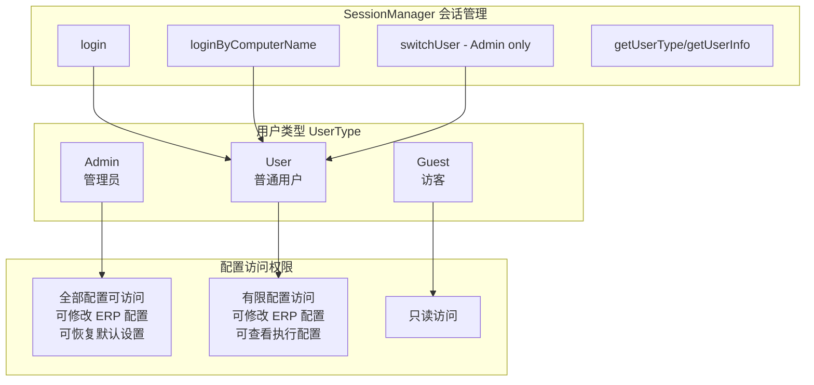
```mermaid
graph TB
    subgraph "用户类型 UserType"
        ADMIN[Admin<br/>管理员]
        USER[User<br/>普通用户]
        GUEST[Guest<br/>访客]
    end

    subgraph "配置访问权限"
        ADMIN_SETTINGS[全部配置可访问<br/>可修改 ERP 配置<br/>可恢复默认设置]
        USER_SETTINGS[有限配置访问<br/>可修改 ERP 配置<br/>可查看执行配置]
        GUEST_SETTINGS[只读访问]
    end

    ADMIN --> ADMIN_SETTINGS
    USER --> USER_SETTINGS
    GUEST --> GUEST_SETTINGS

    subgraph "SessionManager 会话管理"
        SM_LOGIN[login]
        SM_SILENT[loginByComputerName]
        SM_SWITCH[switchUser - Admin only]
        SM_GET[getUserType/getUserInfo]
    end

    SM_LOGIN --> USER
    SM_SILENT --> USER
    SM_SWITCH --> USER
```

### 6.2 配置过滤机制

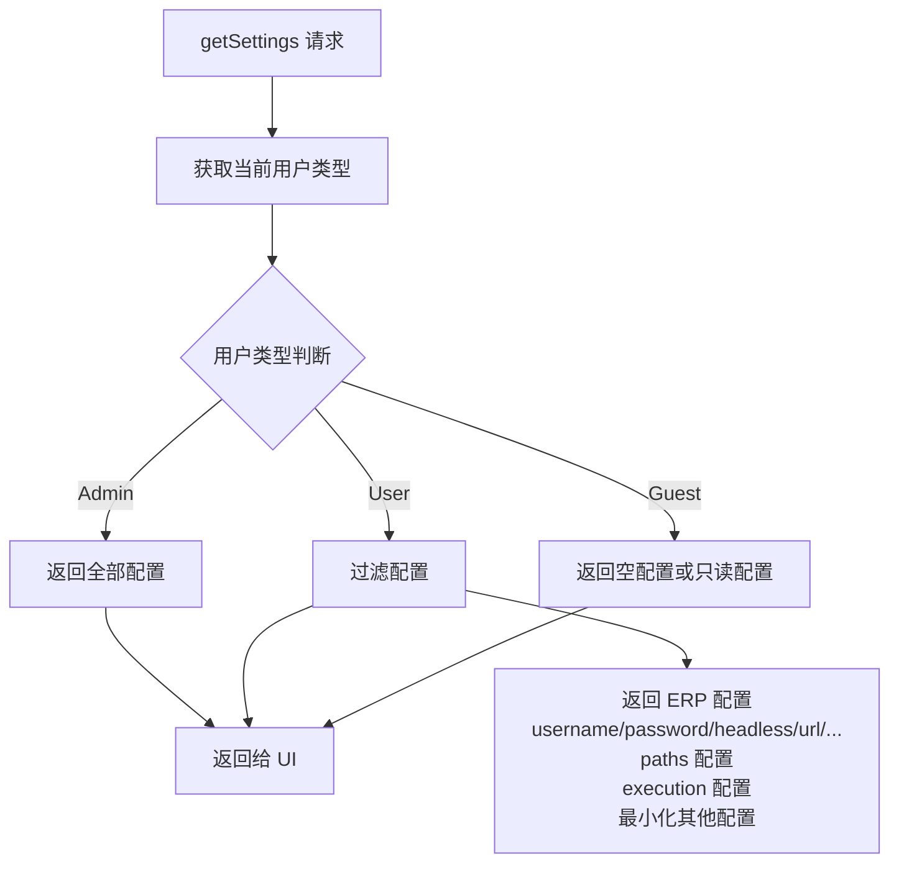
```mermaid
flowchart TD
    A[getSettings 请求] --> B[获取当前用户类型]
    B --> C{用户类型判断}

    C -->|Admin| D[返回全部配置]

    C -->|User| E[过滤配置]
    E --> F[返回 ERP 配置<br/>username/password/headless/url/...<br/>paths 配置<br/>execution 配置<br/>最小化其他配置]

    C -->|Guest| G[返回空配置或只读配置]

    D --> H[返回给 UI]
    E --> H
    G --> H
```

## 7. 配置修改白名单机制

### 7.1 可编辑字段白名单

```javascript
const UI_EDITABLE_FIELDS: string[] = [
  'erp.url',
  'erp.username',
  'erp.password'
  // 可根据需要扩展
]
```

### 7.2 白名单验证流程

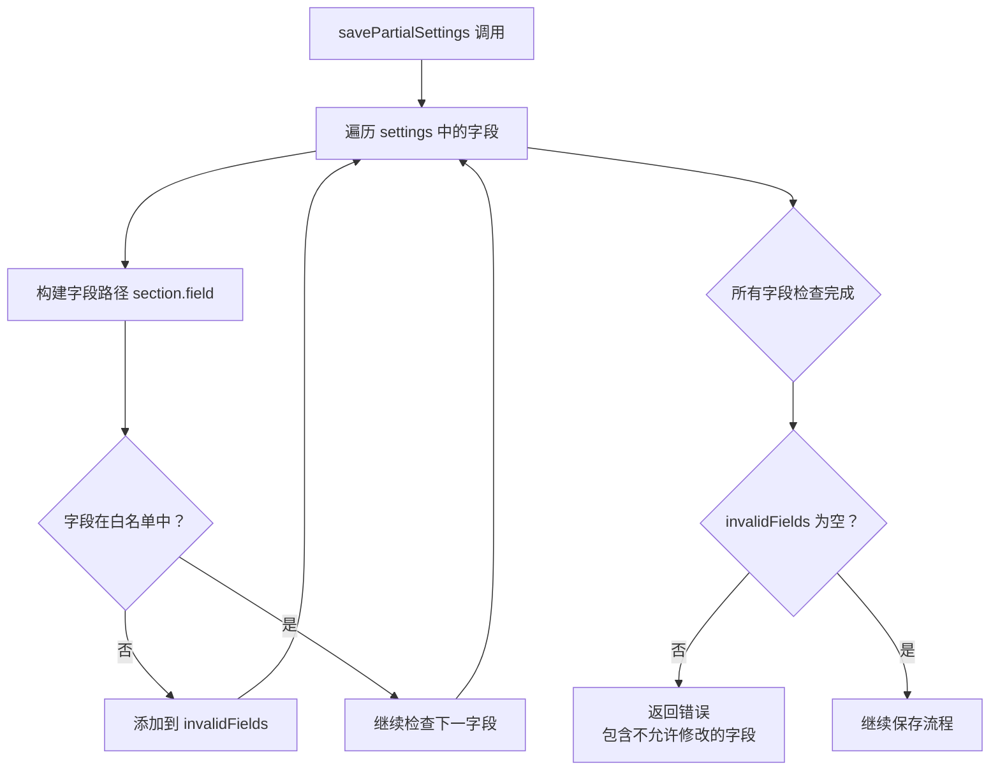
```mermaid
flowchart TD
    A[savePartialSettings 调用] --> B[遍历 settings 中的字段]
    B --> C[构建字段路径 section.field]
    C --> D{字段在白名单中？}
    D -->|否 | E[添加到 invalidFields]
    D -->|是 | F[继续检查下一字段]
    E --> B
    F --> B
    B --> G{所有字段检查完成}
    G --> H{invalidFields 为空？}
    H -->|否 | I[返回错误<br/>包含不允许修改的字段]
    H -->|是 | J[继续保存流程]
```

## 8. 数据库配置详解

### 8.1 双数据库支持架构

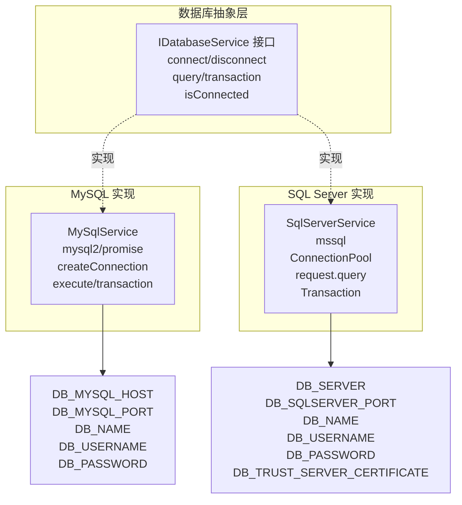
```mermaid
graph TB
    subgraph "数据库抽象层"
        IDB[IDatabaseService 接口<br/>connect/disconnect<br/>query/transaction<br/>isConnected]
    end

    subgraph "MySQL 实现"
        MYSQL[MySqlService<br/>mysql2/promise<br/>createConnection<br/>execute/transaction]
    end

    subgraph "SQL Server 实现"
        MSSQL[SqlServerService<br/>mssql<br/>ConnectionPool<br/>request.query<br/>Transaction]
    end

    IDB -.->|实现 | MYSQL
    IDB -.->|实现 | MSSQL

    MYSQL --> ENV_MYSQL[DB_MYSQL_HOST<br/>DB_MYSQL_PORT<br/>DB_NAME<br/>DB_USERNAME<br/>DB_PASSWORD]
    MSSQL --> ENV_MSSQL[DB_SERVER<br/>DB_SQLSERVER_PORT<br/>DB_NAME<br/>DB_USERNAME<br/>DB_PASSWORD<br/>DB_TRUST_SERVER_CERTIFICATE]
```

### 8.2 数据库配置参数映射

| 环境变量                    | MySQL 用途  | SQL Server 用途   |
| --------------------------- | ----------- | ----------------- |
| DB_TYPE                     | mysql       | sqlserver/mssql   |
| DB_NAME                     | 数据库名    | 数据库名          |
| DB_USERNAME                 | 用户名      | 用户名            |
| DB_PASSWORD                 | 密码        | 密码              |
| DB_MYSQL_HOST               | 主机地址    | -                 |
| DB_MYSQL_PORT               | 端口 (3306) | -                 |
| DB_SERVER                   | -           | 服务器地址        |
| DB_SQLSERVER_PORT           | -           | 端口 (1433)       |
| DB_TRUST_SERVER_CERTIFICATE | -           | 信任证书 (yes/no) |

## 9. ERP 配置与浏览器自动化

### 9.1 ERP 认证配置流程

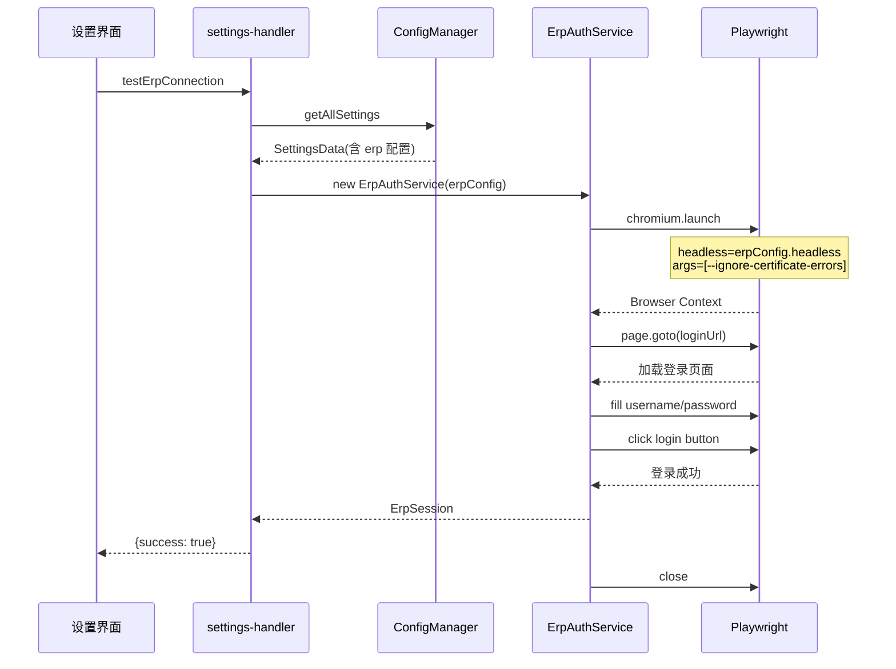
```mermaid
sequenceDiagram
    participant UI as 设置界面
    participant IPC as settings-handler
    participant CM as ConfigManager
    participant ERP_AUTH as ErpAuthService
    participant PW as Playwright

    UI->>IPC: testErpConnection
    IPC->>CM: getAllSettings
    CM-->>IPC: SettingsData(含 erp 配置)

    IPC->>ERP_AUTH: new ErpAuthService(erpConfig)
    ERP_AUTH->>PW: chromium.launch
    Note over PW: headless=erpConfig.headless<br/>args=[--ignore-certificate-errors]

    PW-->>ERP_AUTH: Browser Context

    ERP_AUTH->>PW: page.goto(loginUrl)
    PW-->>ERP_AUTH: 加载登录页面

    ERP_AUTH->>PW: fill username/password
    ERP_AUTH->>PW: click login button

    PW-->>ERP_AUTH: 登录成功

    ERP_AUTH-->>IPC: ErpSession
    IPC-->>UI: {success: true}

    ERP_AUTH->>PW: close
```

### 9.2 ERP 配置项说明

| 配置项            | 类型    | 默认值 | 说明           |
| ----------------- | ------- | ------ | -------------- |
| url               | string  | -      | ERP 系统 URL   |
| username          | string  | -      | ERP 用户名     |
| password          | string  | -      | ERP 密码       |
| headless          | boolean | true   | 无头模式       |
| ignoreHttpsErrors | boolean | true   | 忽略 SSL 错误  |
| autoCloseBrowser  | boolean | true   | 自动关闭浏览器 |

## 10. 订单号解析表配置

### 10.1 配置结构

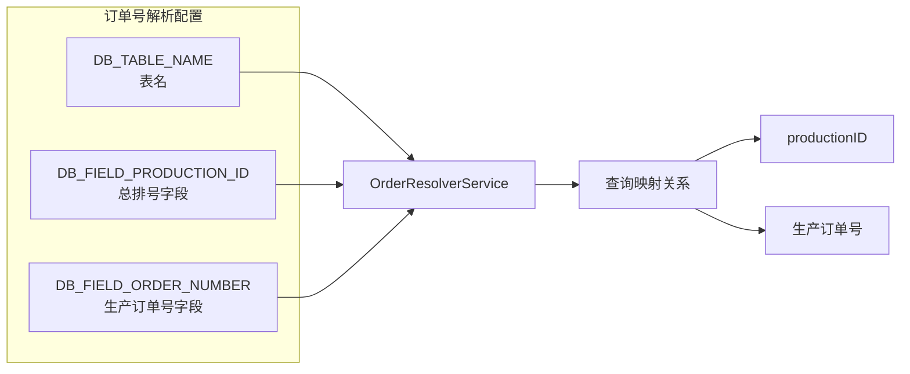
```mermaid
graph LR
    subgraph "订单号解析配置"
        TABLE[DB_TABLE_NAME<br/>表名]
        FIELD_ID[DB_FIELD_PRODUCTION_ID<br/>总排号字段]
        FIELD_ORDER[DB_FIELD_ORDER_NUMBER<br/>生产订单号字段]
    end

    TABLE --> ORDER_RESOLVER[OrderResolverService]
    FIELD_ID --> ORDER_RESOLVER
    FIELD_ORDER --> ORDER_RESOLVER

    ORDER_RESOLVER --> DB_QUERY[查询映射关系]
    DB_QUERY --> PRODUCTION_ID[productionID]
    DB_QUERY --> ORDER_NUMBER[生产订单号]
```

### 10.2 默认配置示例

```env
DB_TABLE_NAME=productionContractData_26 年压力表合同数据
DB_FIELD_PRODUCTION_ID=总排号
DB_FIELD_ORDER_NUMBER=生产订单号
```

## 11. 配置持久化与备份机制

### 11.1 保存流程

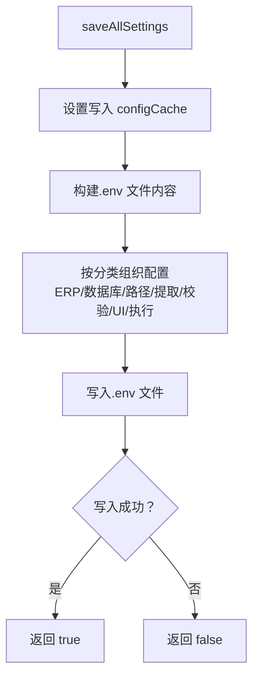
```mermaid
flowchart TD
    A[saveAllSettings] --> B[设置写入 configCache]
    B --> C[构建.env 文件内容]
    C --> D[按分类组织配置<br/>ERP/数据库/路径/提取/校验/UI/执行]
    D --> E[写入.env 文件]
    E --> F{写入成功？}
    F -->|是 | G[返回 true]
    F -->|否 | H[返回 false]
```

### 11.2 备份与恢复流程

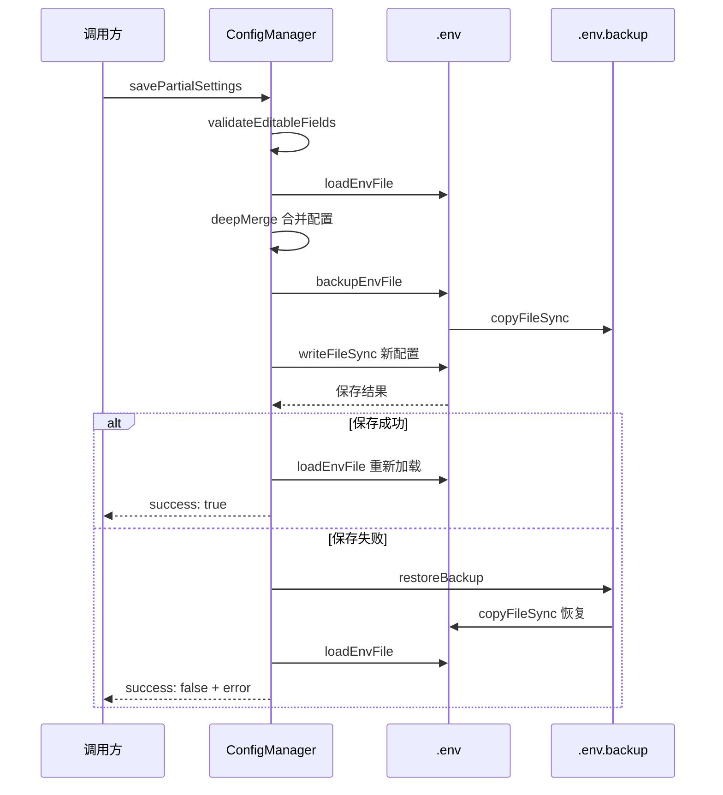
```mermaid
sequenceDiagram
    participant Caller as 调用方
    participant CM as ConfigManager
    participant ENV as .env
    participant BAK as .env.backup

    Caller->>CM: savePartialSettings
    CM->>CM: validateEditableFields

    CM->>ENV: loadEnvFile
    CM->>CM: deepMerge 合并配置

    CM->>ENV: backupEnvFile
    ENV->>BAK: copyFileSync

    CM->>ENV: writeFileSync 新配置
    ENV-->>CM: 保存结果

    alt 保存成功
        CM->>ENV: loadEnvFile 重新加载
        CM-->>Caller: success: true
    else 保存失败
        CM->>BAK: restoreBackup
        BAK->>ENV: copyFileSync 恢复
        CM->>ENV: loadEnvFile
        CM-->>Caller: success: false + error
    end
```

## 12. 配置系统初始化时序

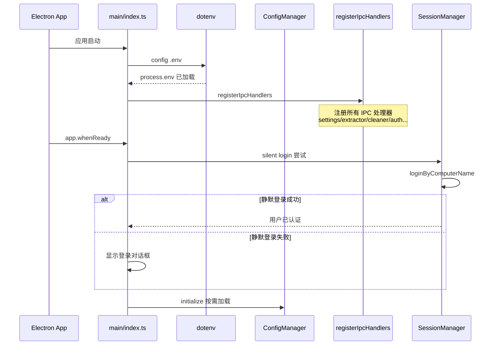
```mermaid
sequenceDiagram
    participant App as Electron App
    participant Main as main/index.ts
    participant Dotenv as dotenv
    participant CM as ConfigManager
    participant IPC as registerIpcHandlers
    participant SM as SessionManager

    App->>Main: 应用启动
    Main->>Dotenv: config .env
    Dotenv-->>Main: process.env 已加载

    Main->>IPC: registerIpcHandlers
    Note over IPC: 注册所有 IPC 处理器<br/>settings/extractor/cleaner/auth...

    App->>Main: app.whenReady
    Main->>SM: silent login 尝试
    SM->>SM: loginByComputerName

    alt 静默登录成功
        SM-->>Main: 用户已认证
    else 静默登录失败
        Main->>Main: 显示登录对话框
    end

    Main->>CM: initialize 按需加载
```

## 13. 关键代码模式

### 13.1 环境变量读取模式

```typescript
// 直接读取 process.env
const dbType = process.env.DB_TYPE?.toLowerCase()
const mysqlHost = process.env.DB_MYSQL_HOST || 'localhost'
const mysqlPort = parseInt(process.env.DB_MYSQL_PORT || '3306', 10)
```

### 13.2 ConfigManager 读取模式

```typescript
// 通过 ConfigManager 获取结构化配置
const configManager = ConfigManager.getInstance()
const settings = configManager.getAllSettings()
const erpUrl = settings.erp.url
const batchSize = settings.extraction.batchSize
```

### 13.3 部分保存模式

```typescript
// 只更新允许修改的字段
const result = await configManager.savePartialSettings({
  erp: {
    url: 'http://new-url.com',
    username: 'newuser',
    password: 'newpass'
  }
})
```

## 14. 配置类别与业务模块映射

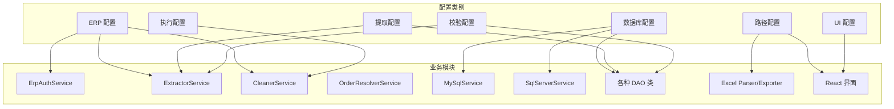
```mermaid
graph TB
    subgraph "配置类别"
        ERP_CONF[ERP 配置]
        DB_CONF[数据库配置]
        PATH_CONF[路径配置]
        EXTRACT_CONF[提取配置]
        VALID_CONF[校验配置]
        UI_CONF[UI 配置]
        EXEC_CONF[执行配置]
    end

    subgraph "业务模块"
        ERP_AUTH[ErpAuthService]
        ERP_EXTRACT[ExtractorService]
        ERP_CLEAN[CleanerService]
        ERP_ORDER[OrderResolverService]
        DB_MYSQL[MySqlService]
        DB_SQL[SqlServerService]
        DB_DAO[各种 DAO 类]
        EXCEL[Excel Parser/Exporter]
        UI[React 界面]
    end

    ERP_CONF --> ERP_AUTH
    ERP_CONF --> ERP_EXTRACT
    ERP_CONF --> ERP_CLEAN

    DB_CONF --> DB_MYSQL
    DB_CONF --> DB_SQL
    DB_CONF --> DB_DAO

    PATH_CONF --> EXCEL
    PATH_CONF --> UI

    EXTRACT_CONF --> ERP_EXTRACT
    EXTRACT_CONF --> DB_DAO

    VALID_CONF --> ERP_EXTRACT
    VALID_CONF --> DB_DAO

    UI_CONF --> UI

    EXEC_CONF --> ERP_CLEAN
```

## 15. 配置系统特点总结

### 15.1 优点

1. **集中化管理**: ConfigManager 单例模式统一管理所有配置
2. **类型安全**: TypeScript 类型定义确保配置结构正确
3. **权限控制**: 基于用户类型的配置访问和修改权限控制
4. **备份恢复**: 自动备份机制防止配置丢失
5. **双数据库支持**: MySQL 和 SQL Server 灵活切换
6. **部分更新**: deepMerge 支持配置部分字段更新

### 15.2 可扩展性

1. **新增配置项**: 在 `.env.example` 添加 → `DEFAULT_SETTINGS` 定义 → `SettingsData` 类型 → `save` 方法输出
2. **新增用户权限**: 扩展 `UserType` → 更新 `filterSettingsByUserType` 逻辑
3. **新增白名单字段**: 在 `UI_EDITABLE_FIELDS` 数组添加路径

### 15.3 注意事项

1. 修改配置后需要重新加载 `.env` 文件使 `process.env` 生效
2. 非白名单字段只能通过 `saveAllSettings` 或 `resetToDefaults` 修改
3. 数据库服务使用单例缓存，配置变更需重启应用或手动重连
4. ERP 配置变更需重启浏览器才能生效
