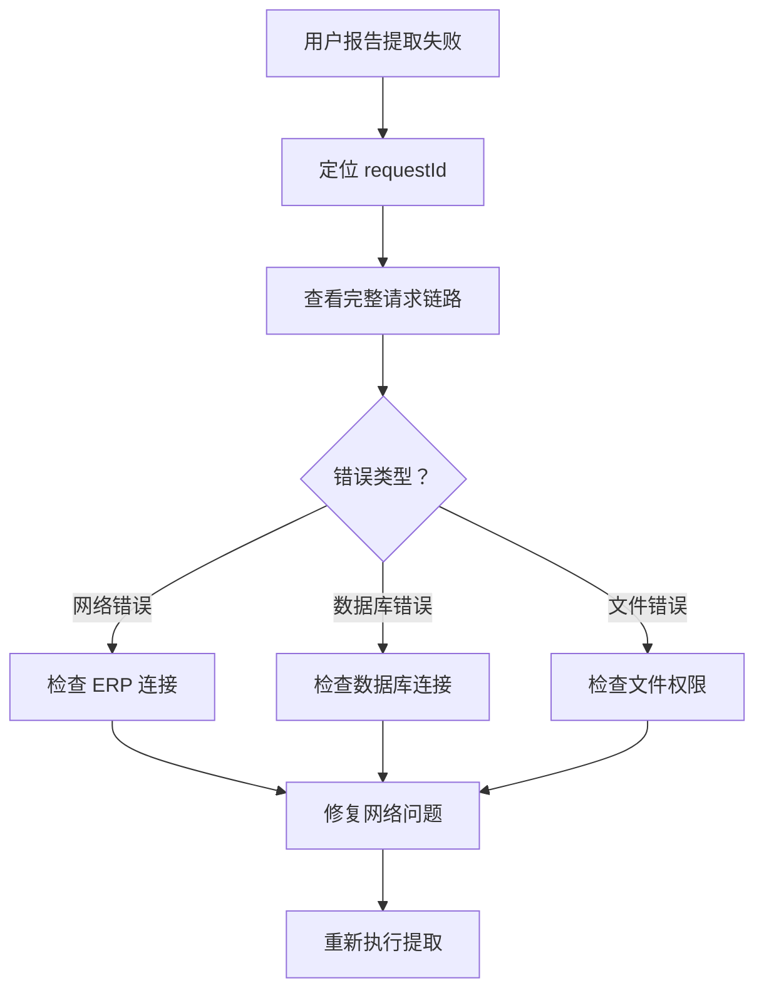
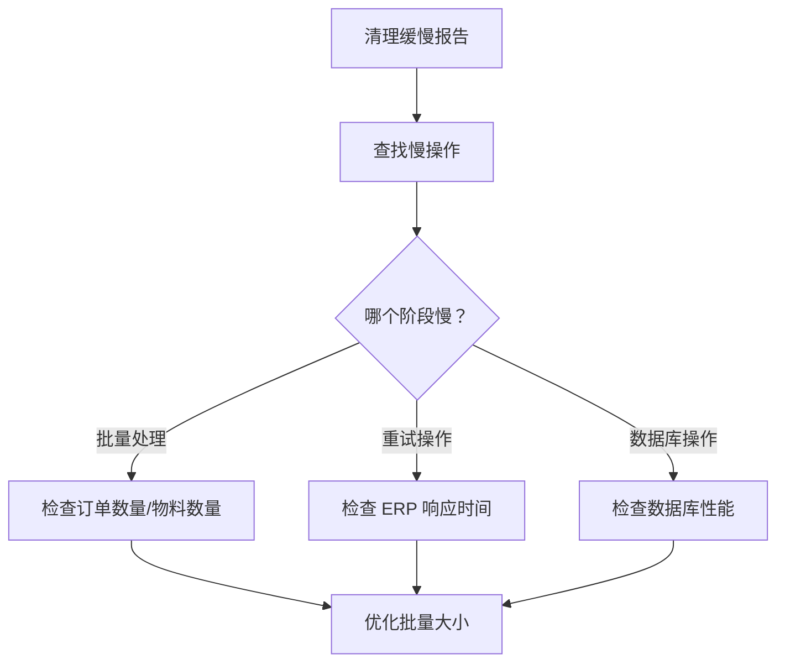
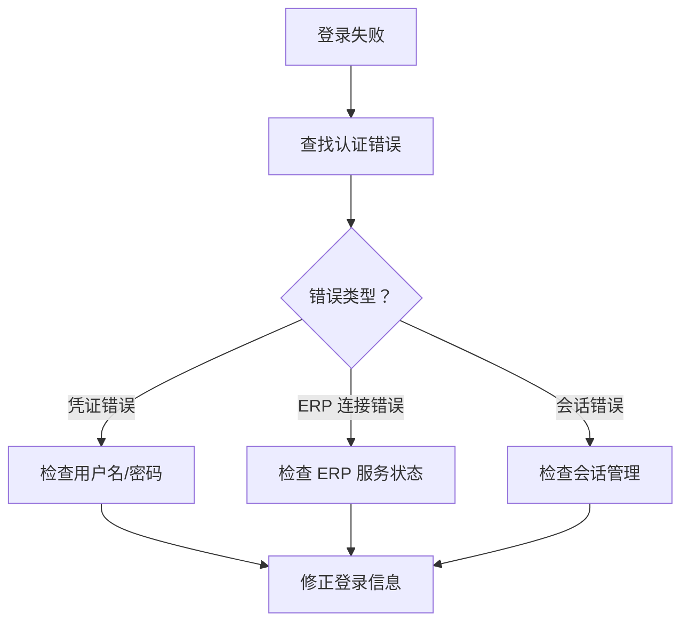
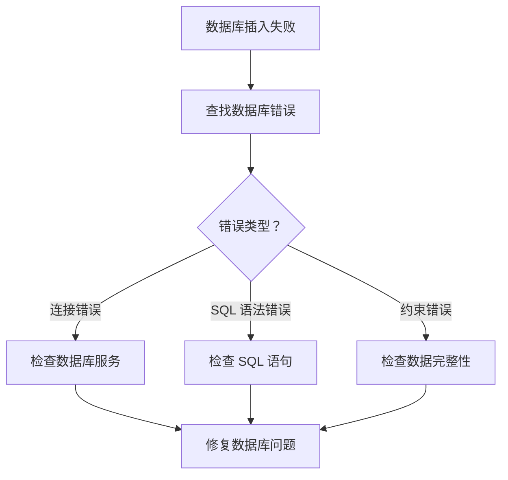
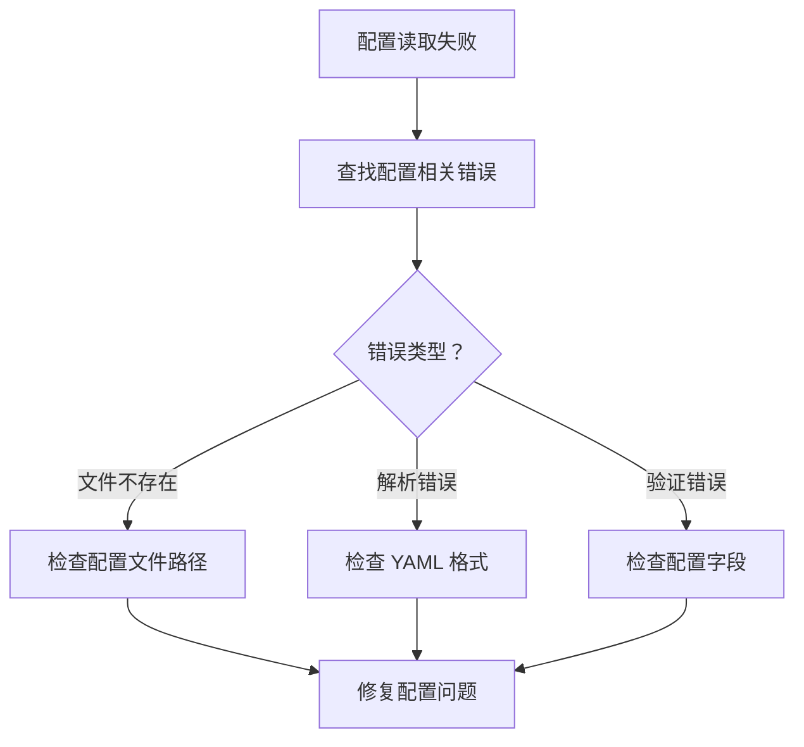
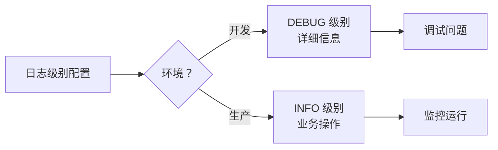
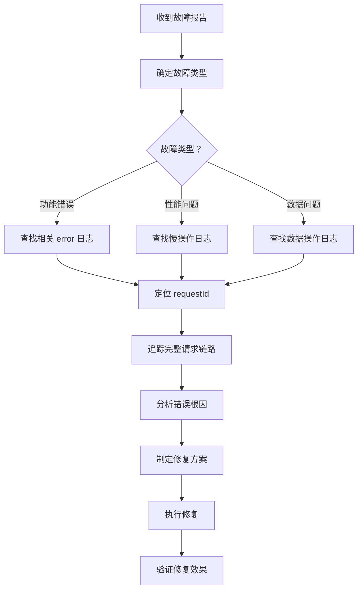

# ERPAuto 日志查询指南

## 概述

> 本指南用于帮助运维和开发人员使用日志系统快速排查问题。
>
> **P0 升级**：日志系统已增强 requestId 追踪、性能监控、完整错误上下文。

---

## 日志字段说明

### 新增核心字段（P0 升级）

| 字段            | 类型    | 说明                      | 示例                                     |
| --------------- | ------- | ------------------------- | ---------------------------------------- |
| `requestId`     | string  | 请求唯一标识符（UUID v4） | `"f833980c-7b11-4c13-9c39-7c8890eb8b2f"` |
| `userId`        | string  | 执行操作的用户 ID         | `"admin"`                                |
| `operation`     | string  | 操作类型                  | `"extract"`, `"clean"`, `"validate"`     |
| `duration`      | number  | 操作耗时（毫秒）          | `1523`                                   |
| `slow`          | boolean | 是否为慢操作（> 阈值）    | `true`                                   |
| `batchId`       | string  | 批次 ID                   | `"B20260404-001"`                        |
| `tableName`     | string  | 数据库表名                | `"DiscreteMaterialPlan"`                 |
| `operationType` | string  | 数据库操作类型            | `"INSERT"`, `"DELETE"`, `"UPDATE"`       |
| `recordCount`   | number  | 记录数                    | `150`                                    |
| `fileSize`      | number  | 文件大小（字节）          | `1048576`                                |

### 业务上下文字段

| 字段                     | 场景              | 说明                               |
| ------------------------ | ----------------- | ---------------------------------- |
| `orderNumbers`           | Extractor/Cleaner | 订单号列表                         |
| `materialCodes`          | Cleaner           | 物料代码列表                       |
| `downloadDir`            | Extractor         | 下载目录路径                       |
| `dryRun`                 | Cleaner           | 是否为干运行模式                   |
| `mode`                   | Validation        | 验证模式（`database_filtered` 等） |
| `useSharedProductionIds` | Validation        | 是否使用共享 Production ID         |
| `configPath`             | Config            | 配置文件路径                       |
| `isDev`                  | Config            | 是否为开发环境                     |
| `version`                | Update            | 应用版本号                         |
| `channel`                | Update            | 更新通道（`stable`/`preview`）     |

---

## 日志查询工具与脚本

### PowerShell 查询脚本

#### 1. 按 requestId 追踪完整请求链路

```powershell
# 查找特定 requestId 的所有日志
$requestId = "f833980c-7b11-4c13-9c39-7c8890eb8b2f"
Get-Content "C:\Users\pengq\AppData\Roaming\erpauto\logs\app-*.log" |
  ConvertFrom-Json |
  Where-Object { $_.requestId -eq $requestId } |
  Sort-Object timestamp |
  Format-Table timestamp, level, message, context -AutoSize
```

**用途**：完整追踪一个请求的所有操作

---

#### 2. 查找慢操作（> 2 秒）

```powershell
# 查找所有慢操作
Get-Content "C:\Users\pengq\AppData\Roaming\erpauto\logs\app-*.log" |
  ConvertFrom-Json |
  Where-Object { $_.duration -gt 2000 } |
  Format-Table timestamp, operation, duration, message -AutoSize
```

**用途**：识别性能瓶颈

---

#### 3. 查找特定用户的所有操作

```powershell
# 按 userId 筛选日志
$userId = "admin"
Get-Content "C:\Users\pengq\AppData\Roaming\erpauto\logs\app-*.log" |
  ConvertFrom-Json |
  Where-Object { $_.userId -eq $userId } |
  Sort-Object timestamp |
  Format-Table timestamp, operation, level, message -AutoSize
```

**用途**：审计用户操作

---

#### 4. 查找特定时间段内的错误

```powershell
# 查找最近 1 小时的错误
$startTime = (Get-Date).AddHours(-1)
Get-Content "C:\Users\pengq\AppData\Roaming\erpauto\logs\error-*.log" |
  ConvertFrom-Json |
  Where-Object { [datetime]::Parse($_.timestamp) -gt $startTime } |
  Format-Table timestamp, message, error -AutoSize
```

**用途**：故障排查

---

#### 5. 按 operation 统计操作频率

```powershell
# 统计各 operation 的执行次数
Get-Content "C:\Users\pengq\AppData\Roaming\erpauto\logs\app-*.log" |
  ConvertFrom-Json |
  Where-Object { $_.operation } |
  Group-Object operation |
  Sort-Object Count -Descending |
  Format-Table Name, Count -AutoSize
```

**用途**：了解系统使用情况

---

### Linux/Mac Bash 查询

```bash
# 按 requestId 过滤
cat app-*.log | jq 'select(.requestId == "f833980c-7b11-4c13-9c39-7c8890eb8b2f")'

# 查找错误日志
cat error-*.log | jq '.'

# 查找慢操作
cat app-*.log | jq 'select(.duration > 2000)'

# 统计 operation 频率
cat app-*.log | jq -r '.operation' | sort | uniq -c | sort -rn
```

---

## 常见故障排查场景

### 场景 1：数据提取失败

**症状**：用户报告 "提取任务失败"

**排查步骤**：



**日志查询**：

```powershell
# 1. 找到提取相关的错误日志
Get-Content "C:\Users\pengq\AppData\Roaming\erpauto\logs\error-*.log" |
  ConvertFrom-Json |
  Where-Object { $_.operation -eq "extract" -and $_.message -like "*失败*" } |
  Format-List timestamp, requestId, error, orderNumbers
```

**排查要点**：

1. 查找 `operation: "extract"`的日志
2. 提取`requestId`用于全链路追踪
3. 检查`error`字段的具体错误信息
4. 查看`orderNumbers`确定哪些订单失败

---

### 场景 2：物料清理执行缓慢

**症状**：用户报告 "清理任务太慢"

**排查步骤**：



**日志查询**：

```powershell
# 1. 查找清理相关的慢操作
Get-Content "C:\Users\pengq\AppData\Roaming\erpauto\logs\app-*.log" |
  ConvertFrom-Json |
  Where-Object { $_.operation -eq "cleaner" -and $_.duration -gt 5000 } |
  Format-List timestamp, requestId, duration, slow, totalOrders, totalMaterials
```

**排查要点**：

1. 查找 `duration > 5000ms` 的清理操作
2. 检查`totalOrders`和`totalMaterials` 确认数据量
3. 查看 `slow: true` 的批处理日志

---

### 场景 3：登录失败

**症状**：用户无法登录

**排查步骤**：



**日志查询**：

```powershell
# 1. 查找认证相关的错误
Get-Content "C:\Users\pengq\AppData\Roaming\erpauto\logs\error-*.log" |
  ConvertFrom-Json |
  Where-Object { $_.userId -eq "admin" -and $_.message -like "*login*" } |
  Format-List timestamp, requestId, error, userId, username
```

**排查要点**：

1. 查找 `operation: "login"`或`message` 包含"login"的日志
2. 检查 `userId` 和`username`
3. 查看`error`字段的具体错误信息

---

### 场景 4：数据库插入失败

**症状**：数据无法保存到数据库

**排查步骤**：



**日志查询**：

```powershell
# 1. 查找数据库相关的错误
Get-Content "C:\Users\pengq\AppData\Roaming\erpauto\logs\error-*.log" |
  ConvertFrom-Json |
  Where-Object { $_.operationType -eq "INSERT" } |
  Format-List timestamp, requestId, operationType, tableName, error
```

**排查要点**：

1. 查找 `operationType: "INSERT"`的日志
2. 检查`tableName` 确定哪个表失败
3. 查看`error`字段的具体错误信息

---

### 场景 5：配置文件读取失败

**症状**：应用启动失败，提示配置错误

**排查步骤**：



**日志查询**：

```powershell
# 1. 查找配置相关的错误
Get-Content "C:\Users\pengq\AppData\Roaming\erpauto\logs\error-*.log" |
  ConvertFrom-Json |
  Where-Object { $_.configPath } |
  Format-List timestamp, requestId, configPath, isDev, error
```

**排查要点**：

1. 查找 `configPath` 字段的日志
2. 检查 `isDev` 确定环境（开发/生产）
3. 查看`error`字段的具体错误信息

---

### 场景 6：文件上传失败

**症状**：文件无法上传到 RustFS

**排查步骤**：

**日志查询**：

```powershell
# 1. 查找上传相关的错误
Get-Content "C:\Users\pengq\AppData\Roaming\erpauto\logs\error-*.log" |
  ConvertFrom-Json |
  Where-Object { $_.fileSize -or $_.message -like "*upload*" } |
  Format-List timestamp, requestId, fileSize, endpoint, bucket, error
```

**排查要点**：

1. 查找 `fileSize` 字段的日志（表示文件操作）
2. 检查 `endpoint`和`bucket` 配置
3. 查看`error`字段的具体错误信息

---

### 场景 7：验证任务无数据返回

**症状**：验证任务执行成功但无数据

**排查步骤**：

**日志查询**：

```powershell
# 1. 查找验证相关的日志
Get-Content "C:\Users\pengq\AppData\Roaming\erpauto\logs\app-*.log" |
  ConvertFrom-Json |
  Where-Object { $_.operation -eq "validate" } |
  Format-List timestamp, requestId, mode, useSharedProductionIds, recordCount
```

**排查要点**：

1. 查找 `operation: "validate"`的日志
2. 检查 `mode`字段（数据来源）
3. 查看`useSharedProductionIds`和`recordCount`

---

## 日志最佳实践

### 1. 开发环境 vs 生产环境



**配置示例**：

```yaml
# config.yaml
logging:
  level: debug # 开发环境
  # level: info  # 生产环境
```

---

### 2. 敏感信息保护

**永远不要记录**：

- ❌ 密码
- ❌ Token/密钥
- ❌ 数据库连接字符串
- ❌ 用户个人信息

**正确做法**：

```typescript
// ❌ 错误：记录敏感信息
log.error('Login failed', { password: userPassword })

// ✅ 正确：使用脱敏信息
log.error('Login failed', {
  userId: 'admin',
  reason: 'invalid_credentials' // 仅记录原因
})
```

---

### 3. 错误日志应该包含

**完整上下文**：

```typescript
log.error('Database insert failed', {
  requestId: getRequestId(), // 自动注入
  operation: 'insert-materials',
  userId: 'admin',
  tableName: 'DiscreteMaterialPlan',
  recordCount: 150,
  error: error.message,
  orderNumbers: ['SO001', 'SO002']
})
```

---

### 4. 性能监控

**关键指标**：

- `duration > 1000ms`：一般警告
- `duration > 5000ms`：严重警告
- `duration > 10000ms`：需要立即调查

**监控脚本**：

```powershell
# 每小时生成性能报告
Get-Content "C:\Users\pengq\AppData\Roaming\erpauto\logs\app-*.log" |
  ConvertFrom-Json |
  Where-Object { $_.duration -gt 1000 } |
  Group-Object operation |
  ForEach-Object {
    [PSCustomObject]@{
      Operation = $_.Name
      SlowOperations = $_.Count
      AvgDuration = [math]::Round(($_.Group | Measure-Object duration -Average).Average, 2)
      MaxDuration = [math]::Round(($_.Group | Measure-Object duration -Maximum).Maximum, 2)
    }
  } | Format-Table -AutoSize
```

---

## 日志文件管理

### 文件位置

| 环境     | 路径                                              |
| -------- | ------------------------------------------------- |
| **开发** | `D:\FileLib\Projects\CodeMigration\ERPAuto\logs\` |
| **生产** | `C:\Users\<user>\AppData\Roaming\erpauto\logs\`   |

### 文件命名

| 类型     | 命名格式                 | 说明               |
| -------- | ------------------------ | ------------------ |
| 应用日志 | `app-YYYY-MM-DD.log`     | 所有业务日志       |
| 错误日志 | `error-YYYY-MM-DD.log`   | 仅错误级别日志     |
| 审计日志 | `audit-YYYY-MM-DD.jsonl` | 用户操作审计       |
| 压缩归档 | `*.log.gz`               | 超过保留期限的日志 |

### 保留策略

```yaml
# config.yaml
logging:
  appRetention: 14 # 应用日志保留 14 天
  auditRetention: 30 # 审计日志保留 30 天
```

---

## 故障排查流程图

### 通用排查流程



---

## 总结

### 快速参考

| 需求       | 查询字段                 |
| ---------- | ------------------------ |
| 完整追踪   | `requestId`              |
| 性能排查   | `duration`, `slow`       |
| 用户审计   | `userId`                 |
| 错误分析   | `error`, `operationType` |
| 数据库问题 | `tableName`, `records`   |
| 文件问题   | `fileSize`, `filePath`   |

### 联系支持

如遇日志相关问题，请联系技术支持团队并提供：

1. 故障时间段
2. 相关 `requestId`
3. 错误日志内容

---

_文档版本：P0 Enhanced Logging_
_更新日期：2026-04-04_
