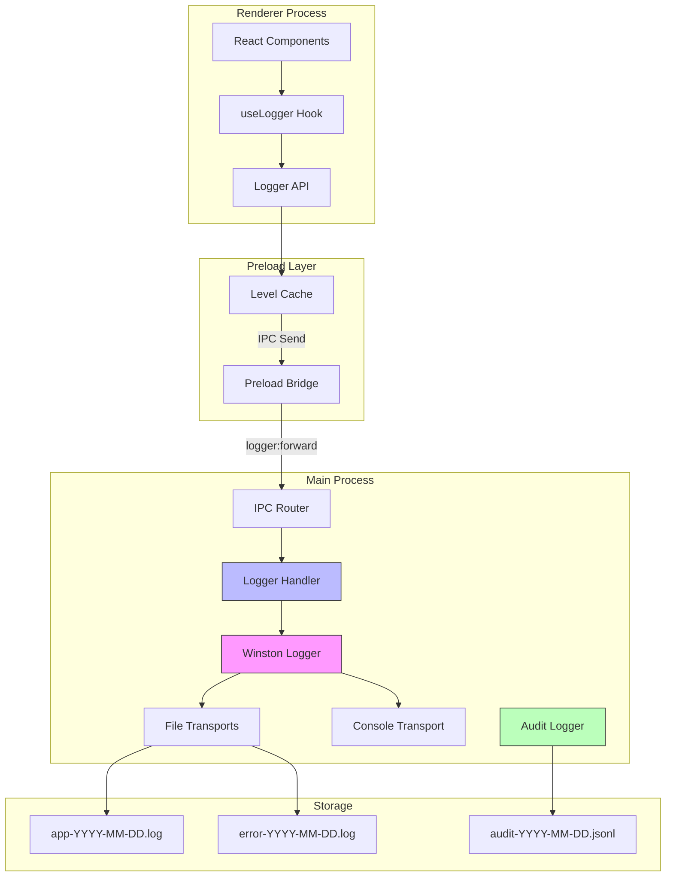
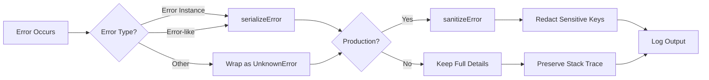
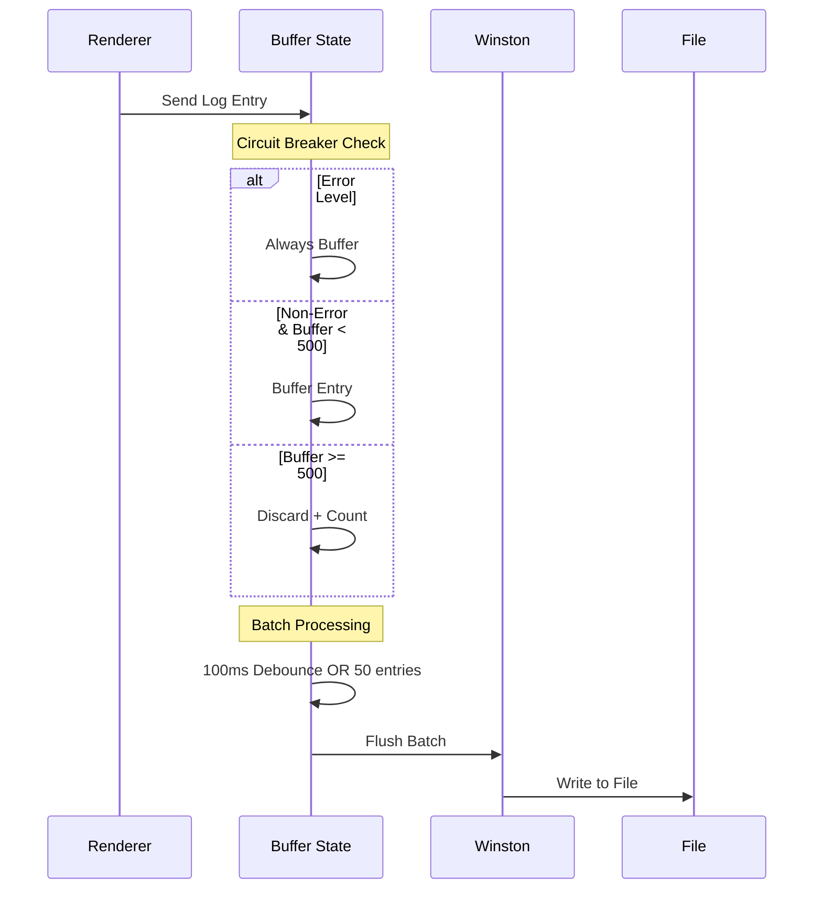
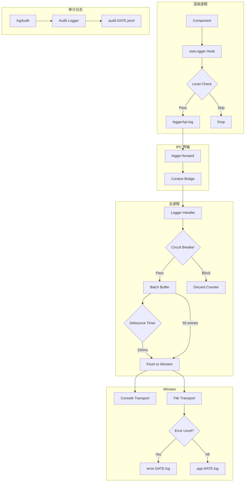
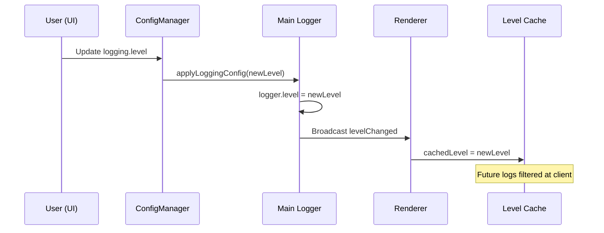
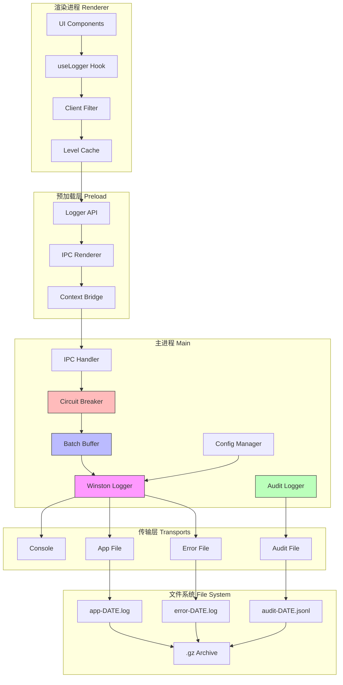

# ERPAuto 日志系统实现文档

## 概述

ERPAuto 使用 **Winston** 作为核心日志库，实现了统一的主进程 - 渲染进程日志系统。系统支持日志级别管理、文件轮转、审计日志、错误全链路追踪等功能。

---

## 架构总览



---

## 核心组件

### 1. 主进程日志服务 (`src/main/services/logger/`)

#### 1.1 核心日志器 (`index.ts`)

```typescript
// 日志器创建与配置
import winston from 'winston'
import DailyRotateFile from 'winston-daily-rotate-file'

const logger = winston.createLogger({
  level: 'info',
  defaultMeta: { service: 'erpauto' },
  transports: [new winston.transports.Console({ format: consoleFormat })]
})
```

**关键特性：**

- **双格式输出**：控制台（彩色文本）+ 文件（JSON）
- **每日轮转**：日志文件按日期拆分，自动压缩归档
- **错误序列化**：完整捕获 stack trace 和自定义属性
- **环境感知**：生产环境自动脱敏敏感信息

#### 1.2 日志级别与优先级

```typescript
export type LogLevel = 'error' | 'warn' | 'info' | 'debug' | 'verbose'

export const LOG_LEVEL_PRIORITY: Record<string, number> = {
  verbose: 0,
  debug: 1,
  info: 2,
  warn: 3,
  error: 4
}
```

#### 1.3 错误工具类 (`error-utils.ts`)



**序列化流程：**

1. 捕获所有 enumerable 和 non-enumerable 属性
2. 递归处理 error cause 链
3. 生产环境脱敏 password/token/secret 等敏感字段
4. 提取堆栈中的文件/行号/列号信息

---

### 2. 审计日志服务 (`audit-logger.ts`)

**用途**：记录用户操作审计日志，满足合规要求

```typescript
interface AuditEntry {
  timestamp: string // ISO 8601 时间戳
  action: string // 操作类型：LOGIN, EXTRACT, DELETE
  userId: string // 用户 ID
  username: string // 用户名
  computerName: string // 计算机名
  resource: string // 受影响的资源
  status: 'success' | 'failure' | 'partial'
  metadata: Record<string, unknown>
}
```

**格式特点：**

- **JSONL 格式**：每行一个 JSON 对象，便于流式解析
- **30 天轮转**：默认保留 30 天审计日志
- **独立文件**：`audit-YYYY-MM-DD.jsonl`

---

### 3. IPC 日志处理器 (`src/main/ipc/logger-handler.ts`)



**批处理策略：**
| 参数 | 值 | 说明 |
|------|-----|------|
| `DEBOUNCE_MS` | 100ms | 防抖等待时间 |
| `MAX_BATCH_SIZE` | 50 | 最大批次大小 |
| `CIRCUIT_BREAKER_THRESHOLD` | 500 | 熔断阈值 |

**熔断机制：**

- 当缓冲区 > 500 条时，丢弃非错误日志
- 错误日志始终绕过熔断器
- 每丢弃 100 条记录一次警告

---

### 4. 渲染进程日志 Hook (`src/renderer/src/hooks/useLogger.ts`)

```typescript
// 使用示例
function MyComponent() {
  const logger = useLogger('MyComponent')

  const handleClick = () => {
    logger.info('User clicked button', { buttonId: 'submit' })
  }

  const handleError = (err: Error) => {
    logger.error('Operation failed', { error: err.message })
  }
}
```

**客户端级别过滤：**

```typescript
// 在发送 IPC 前检查日志级别，避免无效 IPC 调用
if (!shouldLog(level)) return
ipcRenderer.send(IPC_CHANNELS.LOGGER_FORWARD, { ... })
```

**FPS 监控：**

- 检测因过度日志导致的 UI 卡顿
- 当 FPS < 30 时发出警告
- 5 秒冷却期避免重复警告

---

### 5. 预加载层 API (`src/preload/api/logger.ts`)

```typescript
// 级别缓存机制
let cachedLevel: LogLevel = 'info'

// 监听主进程级别变更广播
ipcRenderer.on(IPC_CHANNELS.LOGGER_LEVEL_CHANGED, (level) => {
  cachedLevel = level
})

// 客户端过滤
function shouldLog(level: LogLevel): boolean {
  return priorities[level] >= priorities[cachedLevel]
}
```

---

### 6. 配置管理 (`src/main/services/config/config-manager.ts`)

```yaml
# config.yaml 配置示例
logging:
  level: info # 日志级别
  auditRetention: 30 # 审计日志保留天数
  appRetention: 14 # 应用日志保留天数
```

**配置加载时机：**

1. 应用启动时加载 `config.yaml`
2. 调用 `applyLoggingConfig()` 配置 Winston
3. 调用 `applyAuditConfig()` 配置审计日志

---

## 日志数据流



---

## 日志文件组织

### 目录结构

```
AppData/Roaming/erpauto/logs/
├── app-2024-04-01.log
├── app-2024-04-01.log.gz    # 压缩归档
├── app-2024-04-02.log
├── error-2024-04-01.log      # 仅错误级别
├── error-2024-04-01.log.gz
├── audit-2024-04-01.jsonl    # 审计日志
└── audit-2024-04-01.jsonl.gz
```

### 文件格式

**应用日志 (JSON 格式):**

```json
{
  "level": "info",
  "message": "Extractor started",
  "timestamp": "2024-04-01 10:30:00",
  "service": "erpauto",
  "context": "Extractor",
  "orders": ["SO001", "SO002"]
}
```

**错误日志 (含堆栈):**

```json
{
  "level": "error",
  "message": "Database connection failed",
  "timestamp": "2024-04-01 10:31:00",
  "error": {
    "name": "ConnectionError",
    "message": "ECONNREFUSED",
    "stack": "ConnectionError: ECONNREFUSED\n  at TCP.connectWrap (...)",
    "code": "ECONNREFUSED"
  }
}
```

**审计日志 (JSONL 格式):**

```jsonl
{"timestamp":"2024-04-01T10:30:00Z","action":"LOGIN","userId":"1","username":"admin","computerName":"DESKTOP-001","resource":"/auth","status":"success","metadata":{}}
{"timestamp":"2024-04-01T10:35:00Z","action":"EXTRACT","userId":"1","username":"admin","computerName":"DESKTOP-001","resource":"orders","status":"success","metadata":{"orderCount":50}}
```

---

## IPC 通道定义

```typescript
// src/shared/ipc-channels.ts
export const IPC_CHANNELS = {
  // 日志转发（renderer → main）
  LOGGER_FORWARD: 'logger:forward',

  // 获取当前日志级别
  LOGGER_GET_LEVEL: 'logger:getLevel',

  // 级别变更广播（main → renderer）
  LOGGER_LEVEL_CHANGED: 'logger:levelChanged'
}
```

---

## 使用指南

### 在主进程中记录日志

```typescript
import { createLogger } from '@/main/services/logger'

const log = createLogger('MyService')

// 基础用法
log.info('Operation started')
log.warn('Disk space low')
log.error('Failed to connect', { error: err })

// 带上下文的日志
log.info('Processing batch', {
  batchId: 'B001',
  itemCount: 100,
  estimatedTime: '5min'
})

// 错误日志（自动序列化堆栈）
try {
  await riskyOperation()
} catch (error) {
  log.error('Operation failed', { error })
}
```

### 在渲染进程中记录日志

```typescript
import { useLogger } from '@/renderer/src/hooks/useLogger'

function MyComponent() {
  const logger = useLogger('MyComponent')

  useEffect(() => {
    logger.info('Component mounted')
    return () => logger.debug('Component unmounted')
  }, [])

  const handleAction = async () => {
    try {
      await api.doSomething()
      logger.info('Action succeeded')
    } catch (err) {
      logger.error('Action failed', { error: err.message })
    }
  }
}
```

### 记录审计日志

```typescript
import { logAudit } from '@/main/services/logger/audit-logger'

// 用户登录审计
logAudit('LOGIN', userId, {
  username: 'admin',
  computerName: 'DESKTOP-001',
  resource: '/auth',
  status: 'success',
  metadata: { loginMethod: 'password' }
})

// 数据提取审计
logAudit('EXTRACT', userId, {
  username: 'user1',
  computerName: 'DESKTOP-002',
  resource: 'materials',
  status: 'success',
  metadata: { orderCount: 50, materialCount: 1200 }
})
```

---

## 高级功能

### 1. 日志级别动态切换



**代码示例：**

```typescript
// 主进程设置级别
import { setLogLevel } from '@/main/services/logger'
setLogLevel('debug')

// 渲染进程自动同步
// useLogger Hook 会自动接收级别变更广播
// 客户端过滤自动生效
```

### 2. 生产环境错误脱敏

```typescript
// 自动脱敏以下关键字段
const sensitiveKeys = [
  'password', 'secret', 'token', 'apiKey',
  'credentials', 'authorization', 'privateKey'
]

// 生产环境错误消息
{
  "name": "AuthError",
  "message": "An error occurred due to invalid credentials or configuration"
  // 原始错误消息被脱敏
}
```

### 3. 错误上下文提取

```typescript
// 从堆栈跟踪提取位置信息
const errorContext = extractErrorContext(serializedError)
// 输出:
{
  fileName: 'extractor.ts',
  lineNumber: 142,
  columnName: 15,
  functionName: 'runExtraction'
}
```

---

## 最佳实践

### ✅ 推荐做法

```typescript
// 1. 使用 createLogger 创建带上下文的子日志器
const log = createLogger('DatabaseService')

// 2. 记录错误时传递完整 Error 对象
log.error('Query failed', { error })

// 3. 使用结构化元数据
log.info('Batch processed', {
  batchId: 'B001',
  duration: 1250,
  itemCount: 100
})

// 4. 渲染进程使用 useLogger Hook
const logger = useLogger('LoginForm')

// 5. 敏感信息使用审计日志
logAudit('DELETE', userId, { ... })
```

### ❌ 避免的做法

```typescript
// 1. 避免直接 console.log
console.log('debug') // ❌ 不会被 Winston 捕获

// 2. 避免只记录错误消息
log.error(err.message) // ❌ 丢失堆栈和类型

// 3. 避免循环引用元数据
const obj: any = {}
obj.self = obj
log.info('test', { obj }) // ❌ 序列化失败

// 4. 避免过度日志
for (let i = 0; i < 1000; i++) {
  logger.info(`Item ${i}`) // ❌ 触发熔断
}
```

---

## 故障排查

### 问题：日志文件不生成

**检查清单：**

1. 确认 `config.yaml` 中 logging 配置正确
2. 检查日志目录权限
3. 查看控制台输出是否有 Winston 错误
4. 验证 `applyLoggingConfig()` 是否被调用

### 问题：渲染进程日志未到达主进程

**调试步骤：**

```typescript
// 1. 检查 IPC 通道是否注册
// src/main/ipc/index.ts 应包含：
registerLoggerHandlers()

// 2. 检查 preload 暴露
// src/preload/index.ts 应暴露：
contextBridge.exposeInMainWorld('electron', api)

// 3. 检查级别过滤
console.log(window.electron.logger) // 应存在
```

### 问题：生产环境错误信息不完整

**原因**：生产环境自动脱敏
**解决方案**：

- 查看 `error-DATE.log` 获取完整错误
- 开发环境禁用脱敏：设置开发模式构建

---

## 测试支持

### 单元测试示例

```typescript
import { createLogger } from '@/main/services/logger'

describe('Logger', () => {
  it('should log with context', () => {
    const log = createLogger('TestService')
    // 测试逻辑...
    expect(log).toBeDefined()
  })
})
```

### 集成测试

```typescript
// tests/integration/ipc-logging.test.ts
import { loggerApi } from '@/preload/api/logger'

test('Renderer logs should reach Winston', async () => {
  // Mock Winston transport
  // Send log via IPC
  // Assert log appears in main process
})
```

---

## 配置参考

### config.yaml 完整配置

```yaml
logging:
  # 日志级别：error | warn | info | debug | verbose
  level: info

  # 审计日志保留天数
  auditRetention: 30

  # 应用日志保留天数
  appRetention: 14
```

### 日志级别说明

| 级别      | 使用场景       | 示例                         |
| --------- | -------------- | ---------------------------- |
| `error`   | 系统错误、异常 | 数据库连接失败、文件写入错误 |
| `warn`    | 可恢复的警告   | 磁盘空间不足、重试操作       |
| `info`    | 业务操作记录   | 用户登录、提取开始/结束      |
| `debug`   | 技术调试信息   | API 请求参数、SQL 语句       |
| `verbose` | 详细跟踪       | 循环迭代、中间状态           |

---

## 相关文件索引

| 文件路径                                     | 职责               |
| -------------------------------------------- | ------------------ |
| `src/main/services/logger/index.ts`          | Winston 日志器核心 |
| `src/main/services/logger/shared.ts`         | 共享工具函数       |
| `src/main/services/logger/error-utils.ts`    | 错误序列化/脱敏    |
| `src/main/services/logger/audit-logger.ts`   | 审计日志服务       |
| `src/main/ipc/logger-handler.ts`             | IPC 批处理与熔断   |
| `src/renderer/src/hooks/useLogger.ts`        | React Hook         |
| `src/preload/api/logger.ts`                  | Preload API        |
| `src/shared/ipc-channels.ts`                 | IPC 通道定义       |
| `src/main/services/config/config-manager.ts` | 配置管理           |

---

## 架构图附录

### 完整日志系统架构



---

_文档生成日期：2026-04-04_
_项目版本：ERPAuto v1.x_
