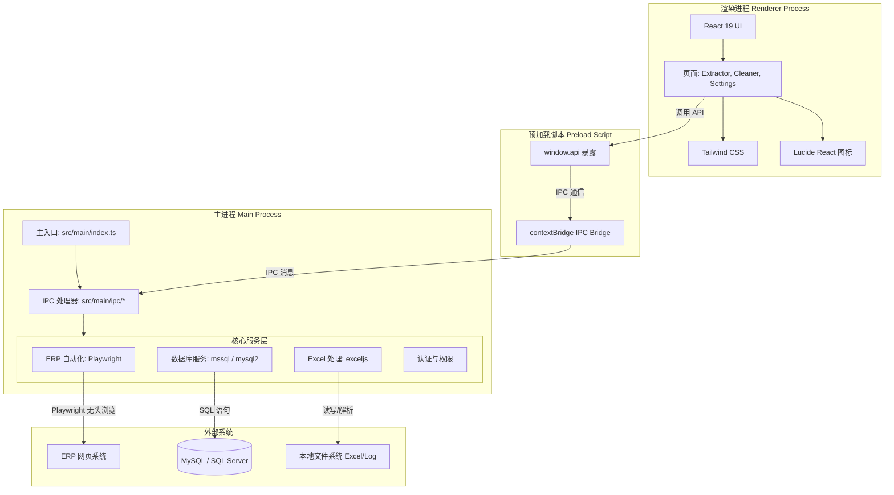

# ERPAuto 架构分析文档

本文档旨在分析 ERPAuto 项目的整体代码架构，深入解析项目的实现细节，为技术人员提供全面的架构认知。

## 1. 整体架构概览

ERPAuto 是一个基于 **Electron**、**React** 和 **TypeScript** 的桌面端应用程序。项目采用了经典的 Electron 多进程架构模式，实现了主进程（Main Process）、渲染进程（Renderer Process）与系统资源的安全隔离。

以下是系统整体架构的 Mermaid 图示：

## 2. 核心模块解析

### 2.1 主进程 (Main Process)

主进程运行在 Node.js 环境中，负责管理应用生命周期、系统原生 API 调用、数据库交互以及耗时的自动化操作。

- **入口文件 (`src/main/index.ts`)**: 负责初始化 Electron 窗口，加载环境变量 (`.env`)，并注册所有的 IPC (Inter-Process Communication) 处理器。
- **IPC 处理器 (`src/main/ipc/`)**: 扮演了 Controller 的角色，接收来自渲染进程的调用请求，将任务分发给底层的 Services，并将结果返回给前端。
- **服务层 (`src/main/services/`)**:
  - **ERP 自动化服务 (`erp/`)**: 系统的核心业务。利用 `Playwright` 模拟用户登录 ERP 系统，进行页面的导航、表单填写和数据抓取。包括 `extractor.ts` (数据提取) 和 `cleaner.ts` (物料清理)。
  - **数据库服务 (`database/`)**: 封装了 `mysql2` 和 `mssql`，支持双数据源切换，负责业务数据的持久化和读取。
  - **Excel 服务 (`excel/`)**: 使用 `exceljs` 解析从 ERP 下载的数据文件或生成报告。

### 2.2 预加载脚本 (Preload Script)

预加载脚本位于 `src/preload/index.ts`。它的核心作用是**安全隔离**。

- 借助 Electron 的 `contextBridge.exposeInMainWorld`，主进程仅仅将受限的、安全的 API (如 `api.extractor.runExtractor`, `api.database.queryMySql`) 暴露给渲染进程的 `window.api` 对象。
- 渲染进程无法直接访问 Node.js API (如 `fs`, `path`)，从而避免了潜在的 XSS 攻击导致系统级安全漏洞。

### 2.3 渲染进程 (Renderer Process)

渲染进程是一个由 Vite 构建的 React 19 单页应用 (SPA)。

- **UI 框架**: 采用 React + TypeScript，保证了前端代码的组件化和类型安全。
- **样式方案**: 使用 Tailwind CSS 进行原子化样式开发，配合 `lucide-react` 提供丰富的图标资源。
- **页面路由 (`src/renderer/src/pages/`)**:
  - `ExtractorPage.tsx`: ERP 数据提取功能界面。
  - `CleanerPage.tsx`: ERP 物料清理及干运行 (Dry-run) 测试界面。
  - `SettingsPage.tsx`: 数据库、ERP 连接配置及应用设置界面。

## 3. 架构设计亮点

1. **严格的类型约束**: 整个项目（主进程、预加载、渲染进程）高度依赖 TypeScript。在 `src/main/types/` 中统一定义了跨进程的接口类型（如 `ExtractorInput`, `MySqlConfig`），实现了端到端的类型安全。
2. **职责分离 (Separation of Concerns)**: UI 展示、IPC 桥接、业务逻辑（Playwright/DB）被严格划分在三个不同的目录下 (`renderer`, `preload`, `main`)，降低了代码的耦合度。
3. **基于 Playwright 的稳定自动化**: 相比于老旧的自动化工具，Playwright 提供了更稳定的网络拦截、异步元素等待机制，非常适合处理 ERP 等传统企业后台系统。

## 4. 数据流向示例 (以数据提取为例)

1. 用户在 **Renderer** (`ExtractorPage.tsx`) 输入订单号，点击"提取"。
2. React 组件调用 `window.api.extractor.runExtractor(input)`。
3. **Preload** 将请求通过 `ipcRenderer.invoke` 转发到频道 `'extractor:run'`。
4. **Main** 的 `extractor-handler.ts` 监听到请求，调用 `src/main/services/erp/extractor.ts`。
5. Extractor 服务启动 Playwright，无头访问 ERP，下载报表。
6. Excel 服务解析下载的报表，保存入库。
7. 返回成功结果，层层回传至 React 组件更新 UI 状态。
