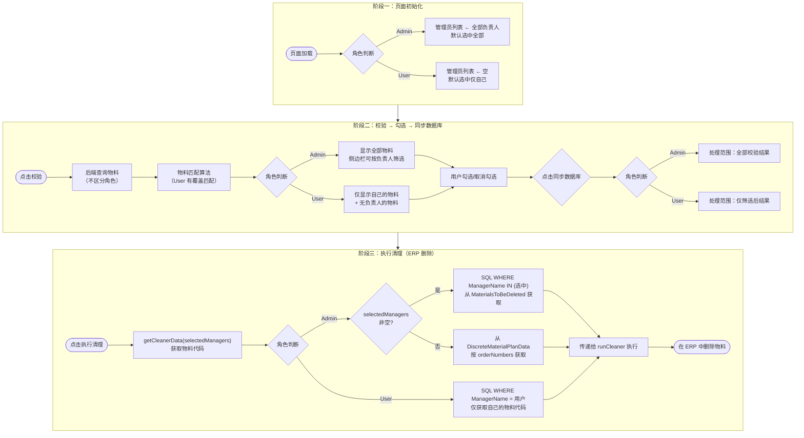
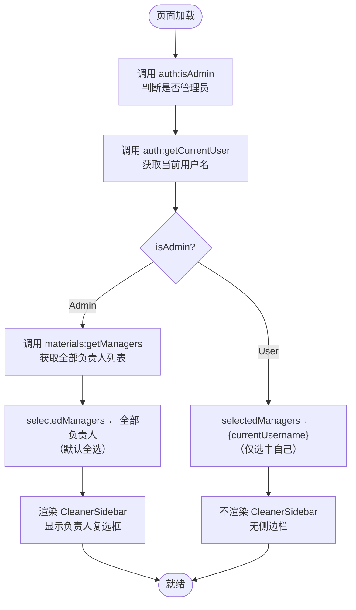
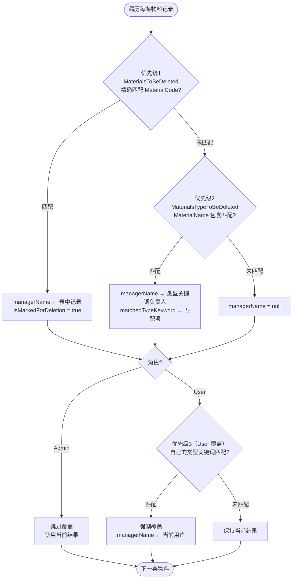
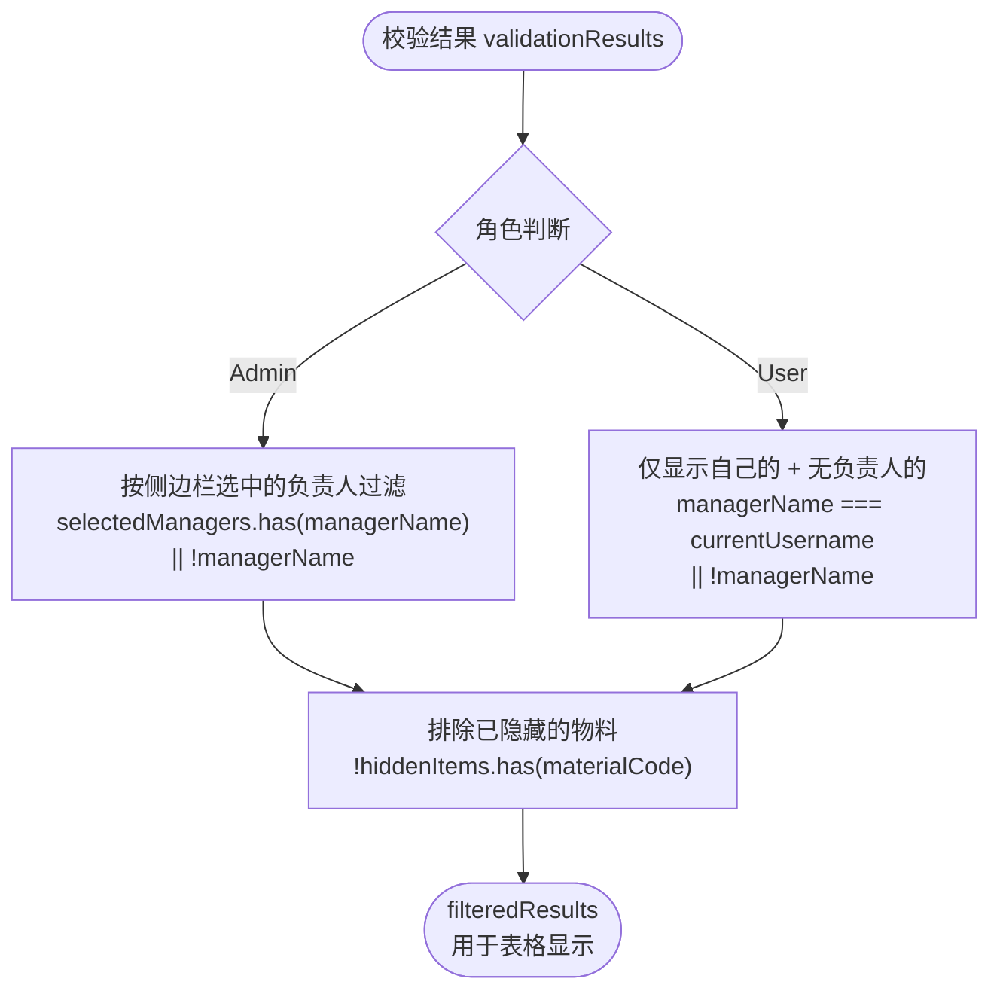
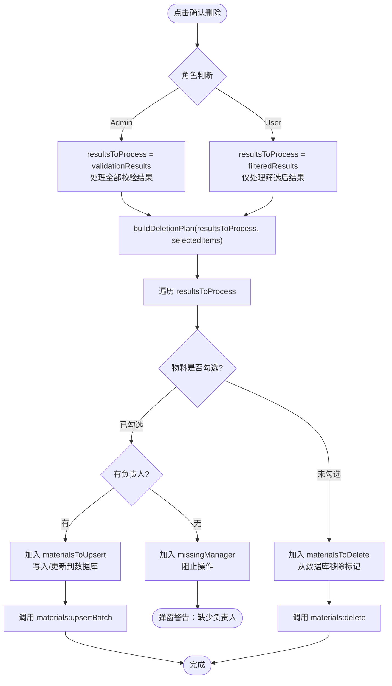
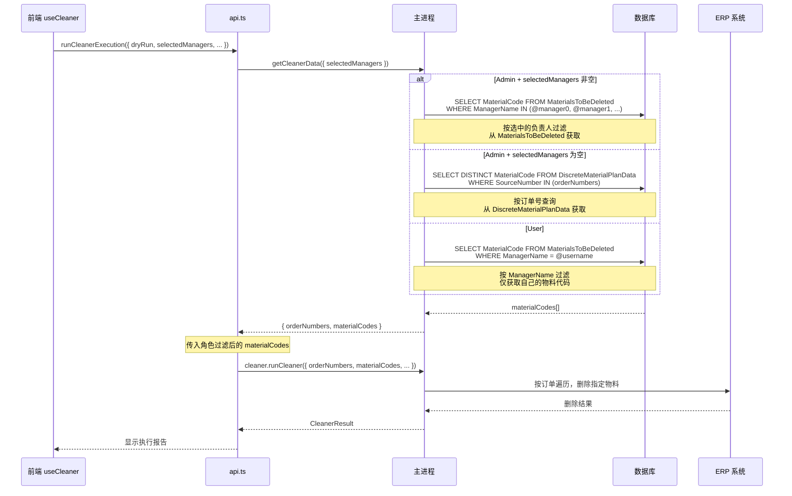
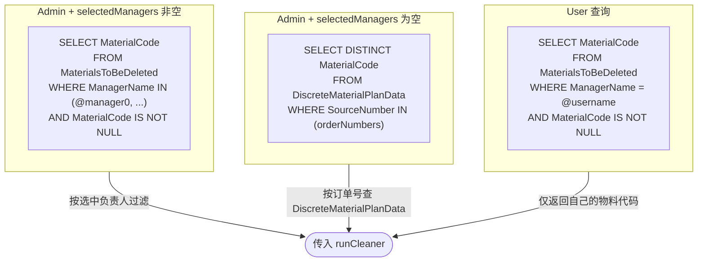
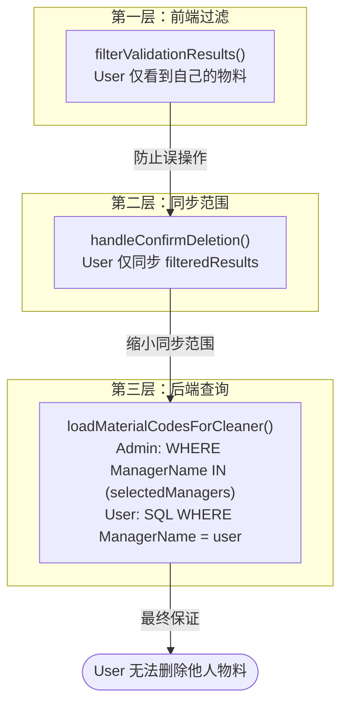

# 清理器角色差异流程 — Admin vs User

**文档版本**: 1.1
**创建日期**: 2026-04-06
**面向对象**: 开发人员

## 概述

清理器（Cleaner）在决定"哪些物料需要被清除"时，Admin 和 User 两个角色存在系统性的差异。这些差异贯穿三个阶段：**初始化 → 校验确认 → 执行清理**。

本文档使用 Mermaid 图表说明每个阶段的角色分支逻辑。

---

## 全局流程概览



---

## 阶段一：页面初始化

**源码位置**: `src/renderer/src/hooks/cleaner/api.ts:25-52` 与 `src/renderer/src/hooks/useCleaner.ts:98-112`



**差异总结**:

| 维度 | Admin | User |
|------|-------|------|
| 侧边栏 | 有 CleanerSidebar | 无 |
| 管理员列表 | 查询全部负责人 | 不查询 |
| 默认选中 | 所有负责人 | 仅自己 |

---

## 阶段二：校验 → 勾选 → 同步数据库

### 2.1 物料校验（后端，不区分角色）

**源码位置**: `src/main/services/validation/validation-application-service.ts`

校验阶段后端查询不区分角色，Admin 和 User 拿到相同的物料数据。区别在于**匹配算法**：



**匹配优先级说明**:

| 优先级 | 数据源 | 匹配方式 | 适用角色 |
|--------|--------|----------|----------|
| 1（最高） | `MaterialsToBeDeleted` | MaterialCode 精确匹配 | 全部 |
| 2 | `MaterialsTypeToBeDeleted` | MaterialName 包含匹配 | 全部 |
| 3（User 覆盖） | 当前用户的类型关键词 | MaterialName 包含匹配 | 仅 User |

> **优先级 3 的作用**：当某个物料按优先级 2 被分配给其他负责人，但当前 User 有匹配的类型关键词时，会强制覆盖为自己的。这确保 User 不会为他人操作物料。

### 2.2 前端显示过滤

**源码位置**: `src/renderer/src/hooks/cleaner/helpers.ts:34-57`

校验结果返回前端后，会根据角色进行显示过滤：



### 2.3 确认删除（同步数据库）

**源码位置**: `src/renderer/src/hooks/useCleaner.ts:289-344`



**关键代码**:

```typescript
// Admin 处理全部结果，User 只处理筛选后的结果
const resultsToProcess = isAdmin ? validationResults : filteredResults
```

**差异总结**:

| 维度 | Admin | User |
|------|-------|------|
| 处理范围 | `validationResults`（全部） | `filteredResults`（自己的+无负责人的） |
| 可操作物料 | 所有负责人的物料 | 仅自己的 + 无负责人的 |
| 能否修改他人数据 | 是 | 否 |

---

## 阶段三：执行清理（ERP 删除）

**源码位置**:
- 前端调用: `src/renderer/src/hooks/cleaner/api.ts:116-166`
- 获取数据: `src/main/services/validation/validation-application-service.ts:497-655`
- 执行删除: `src/main/services/cleaner/cleaner-application-service.ts`



**SQL 差异**:



**差异总结**:

| 维度 | Admin（有 selectedManagers） | Admin（无 selectedManagers） | User |
|------|---------------------------|----------------------------|------|
| 数据源 | `MaterialsToBeDeleted` | `DiscreteMaterialPlanData` | `MaterialsToBeDeleted` |
| 查询条件 | `WHERE ManagerName IN (...)` | `WHERE SourceNumber IN (orderNumbers)` | `WHERE ManagerName = @username` |
| 可删除物料 | 选中负责人的物料 | 订单关联的全部物料 | 仅自己标记的物料 |
| 无订单号时 | — | 返回空数组 | — |

---

## 数据安全边界

角色隔离在**三个层面**同时生效，形成纵深防御：



> **注意**：`runCleaner()` 本身不做角色过滤，它信任上游传入的 `materialCodes` 已经过角色过滤。安全性由 `getCleanerData()` 的 SQL 查询保证。

---

## 涉及文件索引

| 文件 | 关键函数/逻辑 | 行号 |
|------|---------------|------|
| `src/renderer/src/hooks/cleaner/api.ts` | `initializeCleanerPage()`, `runCleanerExecution()` | 25-52, 116-166 |
| `src/renderer/src/hooks/useCleaner.ts` | `handleConfirmDeletion()`, 初始化逻辑 | 98-120, 289-345 |
| `src/renderer/src/hooks/cleaner/helpers.ts` | `filterValidationResults()`, `buildDeletionPlan()` | 34-57, 59-92 |
| `src/main/services/validation/validation-application-service.ts` | `getCleanerData()`, `loadMaterialCodesForCleaner()`, `queryMaterialCodesByManagers()` | 232-305, 497-604, 606-655 |
| `src/main/services/cleaner/cleaner-application-service.ts` | `runCleaner()` | 31-168 |
| `src/main/ipc/cleaner-handler.ts` | `CLEANER_RUN` handler | 16-22 |
| `src/main/ipc/validation-handler.ts` | `getCleanerData` handler | 194-223 |
| `src/preload/api/validation.ts` | `getCleanerData()` IPC 桥接 | 11-12 |
| `src/renderer/src/pages/CleanerPage.tsx` | 页面组件，条件渲染侧边栏 | 74-82 |
