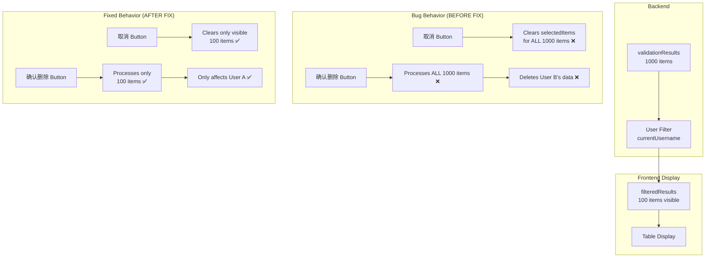
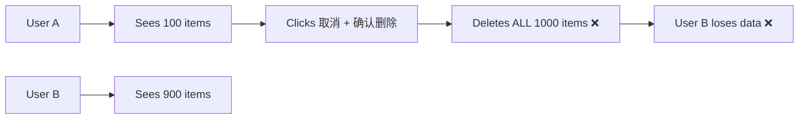
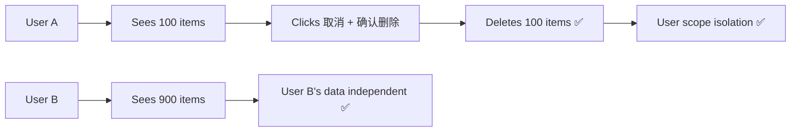

# CleanerPage User Scope Fix

**Issue**: User users were affecting other users' data when using "取消" and "确认删除" buttons

**Date**: 2026-03-03
**Branch**: `fix/cleaner-user-scope`

---

## Problem Analysis

### Bug Description

For **User type (non-Admin)** users:
1. The table shows only materials assigned to the current user (filtered by `filteredResults`)
2. Clicking "取消" (Uncheck All) was unchecking **ALL** materials in `validationResults`, including invisible ones
3. Clicking "确认删除" (Confirm Deletion) processed **ALL** materials in `validationResults`, not just visible ones
4. This caused User A to delete User B's materials that User A never saw!

### Root Causes

#### 1. "取消" Button (Line 420)
```typescript
// ❌ WRONG: Clears ALL selected items
onClick={() => setSelectedItems(new Set())}
```

#### 2. `handleConfirmDeletion` Function (Line 165)
```typescript
// ❌ WRONG: Iterates ALL validation results
for (const result of validationResults) {
  // Processes items user can't even see!
}
```

### Data Flow



---

## Solution

### Fix 1: "取消" Button - Only Uncheck Visible Items

**File**: `src/renderer/src/pages/CleanerPage.tsx:419-432`

```typescript
<button
  onClick={() => {
    // Only uncheck items that are visible in filteredResults
    const visibleCodes = new Set(filteredResults.map((r) => r.materialCode))
    setSelectedItems((prev) => {
      const newSet = new Set(prev)
      for (const code of visibleCodes) {
        newSet.delete(code)
      }
      return newSet
    })
  }}
  className="text-xs bg-white border border-slate-300 text-slate-700 px-2.5 py-1.5 rounded shadow-sm hover:bg-slate-50 flex items-center gap-1"
>
  <Square size={14} className="text-slate-400" /> 取消
</button>
```

**What Changed**:
- Before: `setSelectedItems(new Set())` - clears everything
- After: Iterates through `filteredResults` and removes only visible items from `selectedItems`
- Preserves selections for items not currently visible (e.g., other users' data)

### Fix 2: `handleConfirmDeletion` - Only Process Visible Items (Non-Admin)

**File**: `src/renderer/src/pages/CleanerPage.tsx:158-222`

```typescript
const handleConfirmDeletion = async () => {
  // For non-admin users, only process visible filtered results
  // For admin users, process all validation results
  const resultsToProcess = isAdmin ? validationResults : filteredResults

  if (resultsToProcess.length === 0) return alert('没有可处理的数据')

  const materialsToUpsert: { materialCode: string; managerName: string }[] = []
  const materialsToDelete: string[] = []
  const missingManager: string[] = []

  for (const result of resultsToProcess) {
    // ... rest of processing logic
  }
  // ...
}
```

**What Changed**:
- Before: `for (const result of validationResults)` - processes all 1000 items
- After: `for (const result of resultsToProcess)` where:
  - `Admin` → processes `validationResults` (all items)
  - `User` → processes only `filteredResults` (visible items)

---

## Testing Scenarios

### Scenario 1: User Unchecks Own Data Only

**Setup**:
- User A logs in (non-Admin)
- 100 materials visible (assigned to User A)
- 900 materials invisible (assigned to other users)
- All 1000 materials are initially checked

**Actions**:
1. User A clicks "取消"
2. Table shows all checkboxes unchecked

**Expected**:
- ✅ User A's 100 materials are unchecked
- ✅ Other users' 900 materials **remain checked** (not affected)

**Verification**:
```typescript
// Before fix: selectedItems.size === 0
// After fix: selectedItems.size === 900 (other users' items still checked)
```

### Scenario 2: User Confirms Deletion

**Setup**:
- User A logs in (non-Admin)
- User A unchecks 50 of their 100 materials
- 50 items checked (User A's)
- 900 items checked (other users')

**Actions**:
1. User A clicks "确认删除"
2. Confirm dialog shows: "写入/更新 50 条记录"

**Expected**:
- ✅ Only User A's 50 materials are upserted to database
- ✅ Other users' 900 materials are **NOT touched**
- ✅ No materials are deleted (since other users' items aren't processed)

### Scenario 3: Admin Behavior Unchanged

**Setup**:
- Admin logs in
- All 1000 materials visible
- All filtered by selected managers

**Actions**:
1. Admin clicks "取消" → all visible items unchecked
2. Admin clicks "确认删除" → processes all filtered items

**Expected**:
- ✅ Admin behavior unchanged (can manage all data)
- ✅ Admin can still filter by managers and process filtered results

---

## Security & Scope Implications

### Before Fix (Vulnerability)


### After Fix (Secure)


---

## Code Changes Summary

### File: `src/renderer/src/pages/CleanerPage.tsx`

| Line | Change | Description |
|------|--------|-------------|
| 419-432 | Modified "取消" button | Only uncheck visible filteredResults |
| 158-222 | Modified `handleConfirmDeletion` | Use `resultsToProcess` based on `isAdmin` |

### Variables Used

- `validationResults`: All materials from backend (1000 items)
- `filteredResults`: Materials after user/manager filtering (100 items for User A)
- `selectedItems`: Set of checked material codes
- `isAdmin`: Boolean, true for Admin users
- `currentUsername`: Current logged-in username

---

## Verification Steps

1. **Test as User A**:
   ```bash
   # Login as user1
   npm run dev
   # Navigate to CleanerPage
   # Verify only user1's materials are visible
   # Click "取消" → only visible items unchecked
   # Check selectedItems size = other users' checked items
   ```

2. **Test as User B**:
   ```bash
   # Login as user2
   # Verify user1's changes didn't affect user2's data
   # All user2's materials should still be intact
   ```

3. **Test as Admin**:
   ```bash
   # Login as admin
   # Verify can still see and manage all materials
   # "取消" and "确认删除" work on all filtered results
   ```

---

## Related Files

- **Implementation**: `src/renderer/src/pages/CleanerPage.tsx`
- **Related**: `src/main/ipc/validation-handler.ts` (backend matching logic)
- **Related**: `docs/user-override-match-feature.md` (user override matching)

---

## Future Improvements

1. **Add Confirmation Dialog for Scope**: Show user how many items will be affected
2. **Add Audit Logging**: Log which user modified which materials
3. **Add Warning for Large Operations**: Warn if user is about to delete many items
4. **Backend Validation**: Add backend check to prevent cross-user data modification

---

**Document End**
