# 清理界面 - 业务流程分析文档

**文档版本**: 2.0
**创建日期**: 2026-03-02
**最后更新**: 2026-03-02
**面向对象**: 开发人员

## 概述

本文档详细分析了清理界面(CleanerPage)中两个核心业务流程的完整运行逻辑：

1. **获取并校验物料状态**按钮 - 从数据库读取物料数据并校验
2. **确认删除 (同步数据库)**按钮 - 将用户勾选状态同步到数据库

每个流程都包含前端交互、IPC通信、后端处理和数据库交互的完整分析。

---

## 核心流程概览


---

## 详细流程分解

### 1. 前端交互层 (CleanerPage.tsx)

**触发位置**: `src/renderer/src/pages/CleanerPage.tsx:117-155`

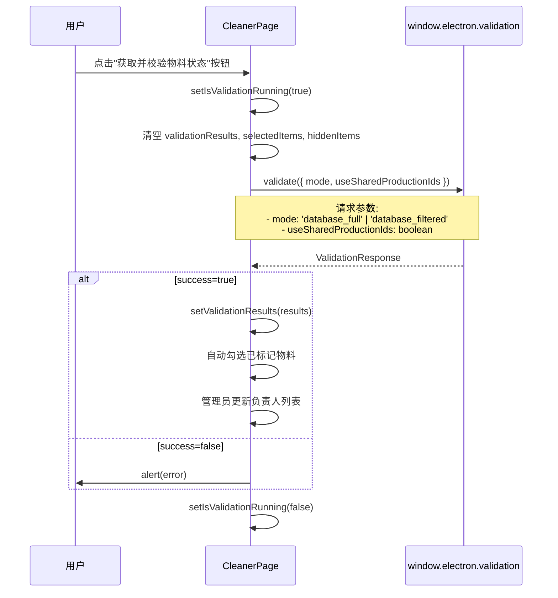

**关键代码逻辑**:

```typescript
const handleValidation = async () => {
  setIsValidationRunning(true)
  setValidationResults([])
  setSelectedItems(new Set())
  setHiddenItems(new Set())

  try {
    const response = await window.electron.validation.validate({
      mode: valMode === 'full' ? 'database_full' : 'database_filtered',
      useSharedProductionIds: valMode === 'filtered'
    })

    if (response.success && response.results) {
      setValidationResults(response.results)
      // 自动勾选已标记物料
      const markedCodes = new Set(
        response.results
          .filter(r => r.isMarkedForDeletion)
          .map(r => r.materialCode)
      )
      setSelectedItems(markedCodes)

      // 管理员更新负责人列表
      if (isAdmin) {
        const uniqueManagers = new Set(
          response.results
            .map(r => r.managerName)
            .filter(Boolean)
        )
        setManagers([...uniqueManagers])
        setSelectedManagers(uniqueManagers)
      }
    }
  } finally {
    setIsValidationRunning(false)
  }
}
```

---

### 2. IPC Handler层 (validation-handler.ts)

**处理位置**: `src/main/ipc/validation-handler.ts:209-392`


---

### 3. 数据库交互层

#### 3.1 数据库连接与类型选择

**位置**: `validation-handler.ts:55-83`


**表名转换逻辑**:

```typescript
// MySQL: dbo_MaterialsToBeDeleted
// SQL Server: [dbo].[MaterialsToBeDeleted]
function getTableName(mysqlTableName: string): string {
  const dbType = process.env.DB_TYPE?.toLowerCase()
  if (dbType === 'sqlserver' || dbType === 'mssql') {
    // 找到第一个下划线分割schema和表名
    const firstUnderscoreIndex = mysqlTableName.indexOf('_')
    if (firstUnderscoreIndex > 0) {
      const schema = mysqlTableName.substring(0, firstUnderscoreIndex)
      const tableName = mysqlTableName.substring(firstUnderscoreIndex + 1)
      return `[${schema}].[${tableName}]`
    }
    return `[dbo].[${mysqlTableName}]`
  }
  return mysqlTableName
}
```

#### 3.2 核心查询流程

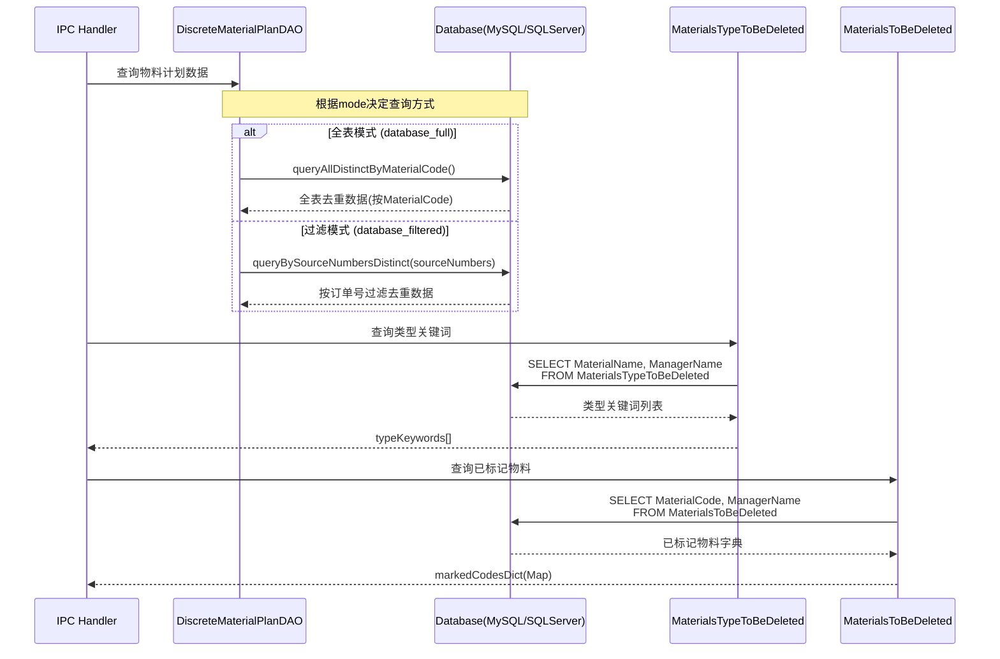

#### 3.3 查询SQL详解

**全表去重查询** (MySQL/SQL Server通用):

```sql
WITH RankedRecords AS (
  SELECT
    *,
    ROW_NUMBER() OVER (
      PARTITION BY MaterialCode
      ORDER BY CreateDate ASC, SequenceNumber ASC
    ) AS rn
  FROM dbo_DiscreteMaterialPlanData
  WHERE MaterialCode IS NOT NULL
)
SELECT
  Factory, MaterialStatus, PlanNumber, SourceNumber, MaterialType,
  ProductCode, ProductName, ProductUnit, ProductPlanQuantity,
  UseDepartment, Remark, Creator, CreateDate, Approver, ApproveDate,
  SequenceNumber, MaterialCode, MaterialName, Specification, Model,
  DrawingNumber, MaterialQuality, PlanQuantity, Unit, RequiredDate,
  Warehouse, UnitUsage, CumulativeOutputQuantity, BOMVersion
FROM RankedRecords
WHERE rn = 1
```

**按订单号过滤查询** (批量处理，每批2000条):

```sql
WITH RankedRecords AS (
  SELECT
    *,
    ROW_NUMBER() OVER (
      PARTITION BY MaterialCode
      ORDER BY CreateDate ASC, SequenceNumber ASC
    ) AS rn
  FROM dbo_DiscreteMaterialPlanData
  WHERE SourceNumber IN (?, ?, ...)  -- 批量占位符
    AND MaterialCode IS NOT NULL
)
SELECT [字段列表]
FROM RankedRecords
WHERE rn = 1
```

---

### 4. 物料匹配算法

**位置**: `validation-handler.ts:325-361`


**匹配优先级**:

1. **优先级1 (最高)**: `MaterialsToBeDeleted` 表精确匹配
   - 匹配条件: `MaterialCode` 完全相等
   - 结果: `isMarkedForDeletion = true`, `managerName` 从表中获取

2. **优先级2 (次高)**: `MaterialsTypeToBeDeleted` 表包含匹配
   - 匹配条件: `MaterialName` 包含关系 (`typeKeyword.materialName.includes(materialName)`)
   - 结果: `isMarkedForDeletion = false`, `managerName` 从表中获取, `matchedTypeKeyword` 记录匹配项

3. **未匹配**: 无任何匹配
   - 结果: `isMarkedForDeletion = false`, `managerName = ''`, `matchedTypeKeyword = undefined`

**核心代码**:

```typescript
for (const record of materialRecords) {
  const materialName = (record.MaterialName as string) || ''
  const materialCode = (record.MaterialCode as string) || ''
  const specification = (record.Specification as string) || ''
  const model = (record.Model as string) || ''

  // 优先级1: 检查 MaterialsToBeDeleted (MaterialCode 精确匹配)
  let managerName = markedCodesDict.get(materialCode) || null
  const isMarkedForDeletion = managerName !== null
  let matchedTypeKeyword: string | undefined = undefined

  // 优先级2: 匹配 MaterialsTypeToBeDeleted (MaterialName 包含匹配)
  if (!managerName) {
    for (const typeKeyword of typeKeywords) {
      if (
        typeKeyword.materialName &&
        typeKeyword.materialName.includes(materialName)
      ) {
        matchedTypeKeyword = typeKeyword.materialName
        managerName = typeKeyword.managerName
        break
      }
    }
  }

  results.push({
    materialName,
    materialCode,
    specification,
    model,
    managerName: managerName || '',
    isMarkedForDeletion,
    matchedTypeKeyword
  })
}
```

---

### 5. 数据流向图

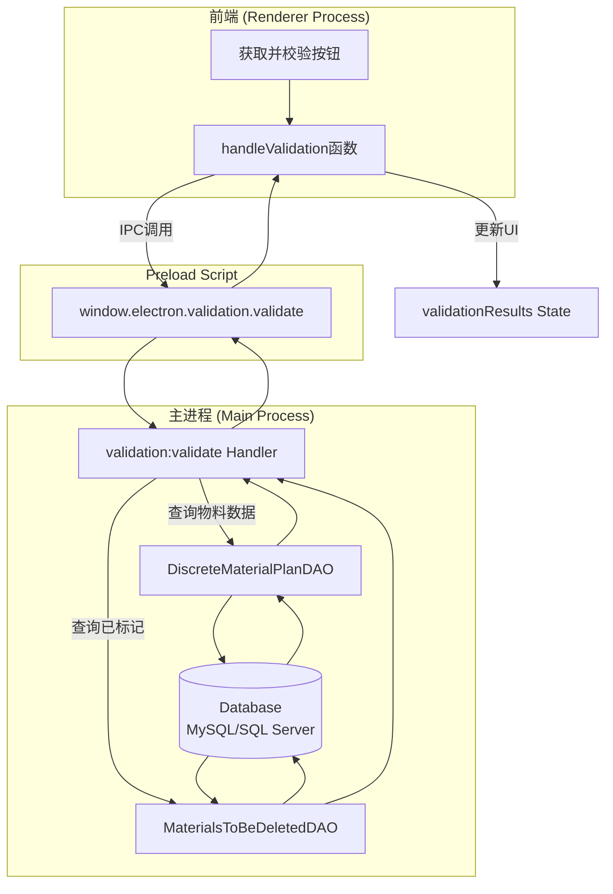

---

### 6. 关键数据结构

#### 6.1 ValidationRequest (IPC输入)

```typescript
interface ValidationRequest {
  mode: 'database_full' | 'database_filtered'
  useSharedProductionIds?: boolean
  productionIdFile?: string  // 可选，文件路径
}
```

#### 6.2 ValidationResponse (IPC输出)

```typescript
interface ValidationResponse {
  success: boolean
  results?: ValidationResult[]
  stats?: {
    totalRecords: number
    matchedCount: number    // 有负责人(包括类型匹配)
    markedCount: number     // 已标记删除
  }
  error?: string
}
```

#### 6.3 ValidationResult (单个物料结果)

```typescript
interface ValidationResult {
  materialName: string
  materialCode: string
  specification: string
  model: string
  managerName: string          // 负责人名称
  isMarkedForDeletion: boolean // 是否精确匹配MaterialsToBeDeleted
  matchedTypeKeyword?: string  // 如果匹配了类型关键词，记录匹配项
}
```

---

### 7. 错误处理流程

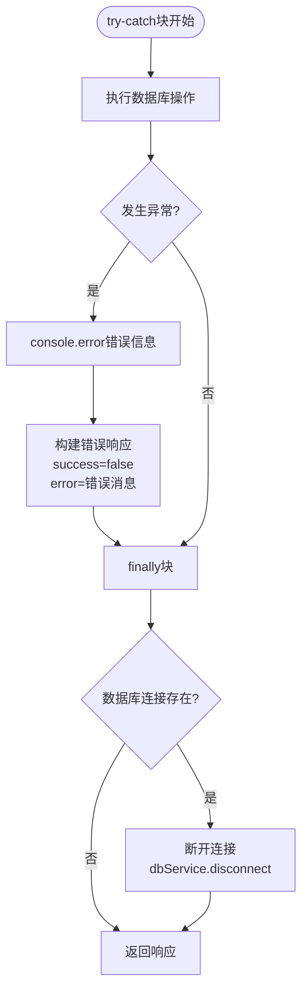

**常见错误场景**:

1. **没有共享Production ID**:
   - 场景: `mode='database_filtered'` 且 `useSharedProductionIds=true`，但共享ID为空
   - 错误信息: "没有可用的共享 Production ID。请在数据提取页面输入 Production ID。"

2. **没有找到物料记录**:
   - 场景: 数据库查询返回空结果
   - 错误信息: "No material records found"

3. **数据库连接失败**:
   - 场景: 数据库服务未启动、配置错误
   - 错误信息: 具体的数据库错误消息

---

## "确认删除 (同步数据库)" 按钮流程

### 1. 核心流程概览

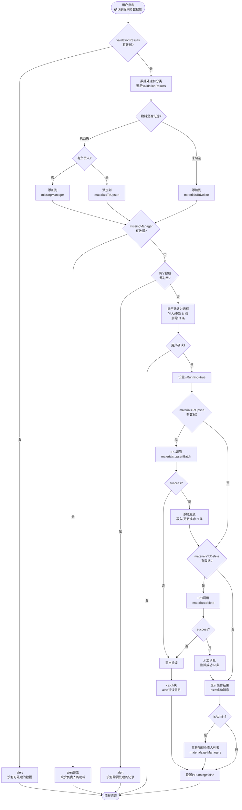

---

### 2. 前端交互层 (CleanerPage.tsx)

**触发位置**: `src/renderer/src/pages/CleanerPage.tsx:166-226`

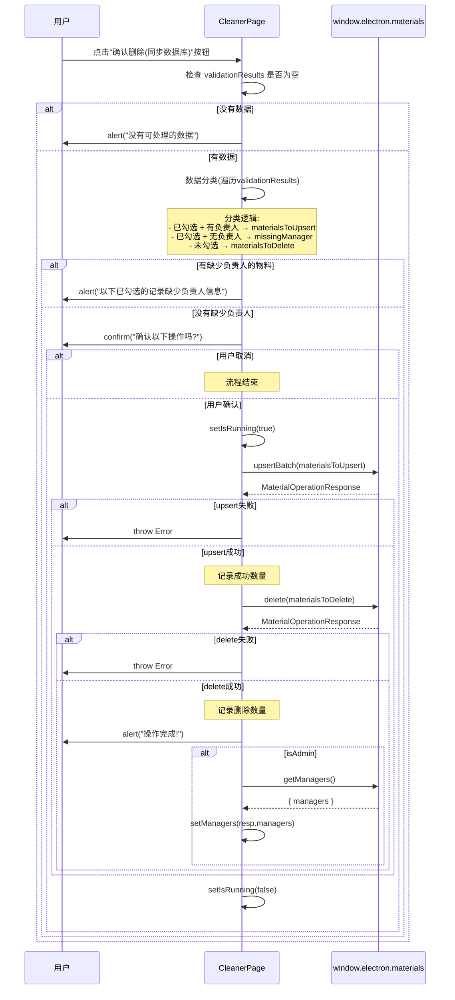

**关键代码逻辑**:

```typescript
const handleConfirmDeletion = async () => {
  // 1. 数据验证
  if (validationResults.length === 0) return alert('没有可处理的数据')

  // 2. 数据分类
  const materialsToUpsert: { materialCode: string; managerName: string }[] = []
  const materialsToDelete: string[] = []
  const missingManager: string[] = []

  for (const result of validationResults) {
    if (!result.materialCode?.trim()) continue

    const code = result.materialCode.trim()
    if (selectedItems.has(code)) {
      // 已勾选: 检查是否有负责人
      if (!result.managerName?.trim()) missingManager.push(code)
      else materialsToUpsert.push({ materialCode: code, managerName: result.managerName.trim() })
    } else {
      // 未勾选: 标记为删除
      materialsToDelete.push(code)
    }
  }

  // 3. 负责人验证
  if (missingManager.length > 0) {
    alert(`以下已勾选的记录缺少负责人信息，无法保存：\n\n${missingManager.slice(0, 10).join('\n')}`)
    return
  }

  // 4. 空数据处理
  if (materialsToUpsert.length === 0 && materialsToDelete.length === 0) {
    return alert('没有需要处理的记录')
  }

  // 5. 用户确认
  const confirmParts: string[] = []
  if (materialsToUpsert.length > 0) confirmParts.push(`写入/更新 ${materialsToUpsert.length} 条记录`)
  if (materialsToDelete.length > 0) confirmParts.push(`删除 ${materialsToDelete.length} 条记录`)

  if (!window.confirm(`确认以下操作吗？\n\n${confirmParts.join('\n')}`)) return

  // 6. 执行数据库操作
  try {
    setIsRunning(true)
    let msgParts: string[] = []

    // 6.1 批量写入/更新
    if (materialsToUpsert.length > 0) {
      const res = await window.electron.materials.upsertBatch(materialsToUpsert)
      if (!res.success) throw new Error(res.error || '写入物料失败')
      msgParts.push(`写入/更新成功：${res.stats?.success || 0} 条`)
    }

    // 6.2 批量删除
    if (materialsToDelete.length > 0) {
      const res = await window.electron.materials.delete(materialsToDelete)
      if (!res.success) throw new Error(res.error || '删除物料失败')
      msgParts.push(`删除成功：${res.count || 0} 条`)
    }

    // 7. 显示结果
    alert(`操作完成！\n\n${msgParts.join('\n')}`)

    // 8. 重新加载负责人列表(管理员)
    if (isAdmin) {
      const resp = await window.electron.materials.getManagers()
      setManagers(resp.managers)
    }
  } catch (err) {
    alert(err instanceof Error ? err.message : '操作失败')
  } finally {
    setIsRunning(false)
  }
}
```

**数据分类逻辑**:

| 物料状态 | 勾选状态 | 负责人信息 | 处理方式 |
|---------|---------|-----------|---------|
| 已标记删除 | ✅ 勾选 | ✅ 有 | 保存/更新到数据库 |
| 已标记删除 | ✅ 勾选 | ❌ 无 | 拒绝操作，弹出警告 |
| 已标记删除 | ❌ 未勾选 | - | 从数据库删除 |
| 未标记删除 | ✅ 勾选 | ✅ 有 | 保存/更新到数据库 |
| 未标记删除 | ✅ 勾选 | ❌ 无 | 拒绝操作，弹出警告 |
| 未标记删除 | ❌ 未勾选 | - | 从数据库删除 |

---

### 3. IPC Handler层 (validation-handler.ts)

**处理位置**: `src/main/ipc/validation-handler.ts:399-449`

#### 3.1 materials:upsertBatch 处理器

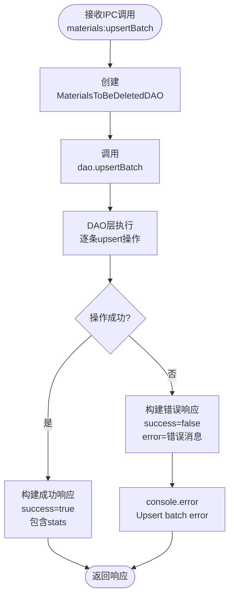

**关键代码**:

```typescript
ipcMain.handle(
  'materials:upsertBatch',
  async (_event, request: MaterialUpsertBatchRequest): Promise<MaterialOperationResponse> => {
    try {
      const dao = new MaterialsToBeDeletedDAO()
      const stats = await dao.upsertBatch(request.materials)

      return {
        success: true,
        stats
      }
    } catch (error) {
      const message = error instanceof Error ? error.message : 'Unknown error'
      console.error('[Materials] Upsert batch error:', error)
      return {
        success: false,
        error: `Upsert failed: ${message}`
      }
    }
  }
)
```

#### 3.2 materials:delete 处理器

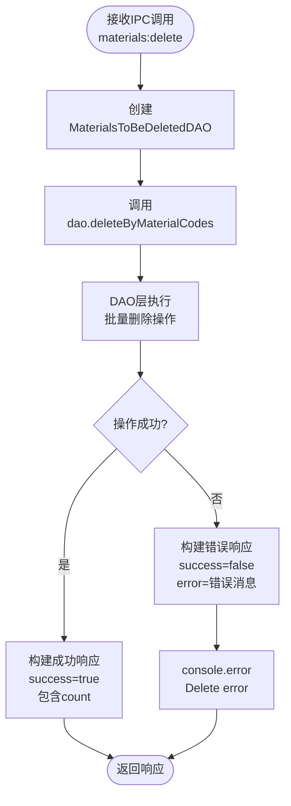

**关键代码**:

```typescript
ipcMain.handle(
  'materials:delete',
  async (_event, request: MaterialDeleteRequest): Promise<MaterialOperationResponse> => {
    try {
      const dao = new MaterialsToBeDeletedDAO()
      const count = await dao.deleteByMaterialCodes(request.materialCodes)

      return {
        success: true,
        count
      }
    } catch (error) {
      const message = error instanceof Error ? error.message : 'Unknown error'
      console.error('[Materials] Delete error:', error)
      return {
        success: false,
        error: `Delete failed: ${message}`
      }
    }
  }
)
```

---

### 4. 数据库DAO层 (materials-to-be-deleted-dao.ts)

#### 4.1 upsertBatch 方法

**位置**: `src/main/services/database/materials-to-be-deleted-dao.ts:180-240`

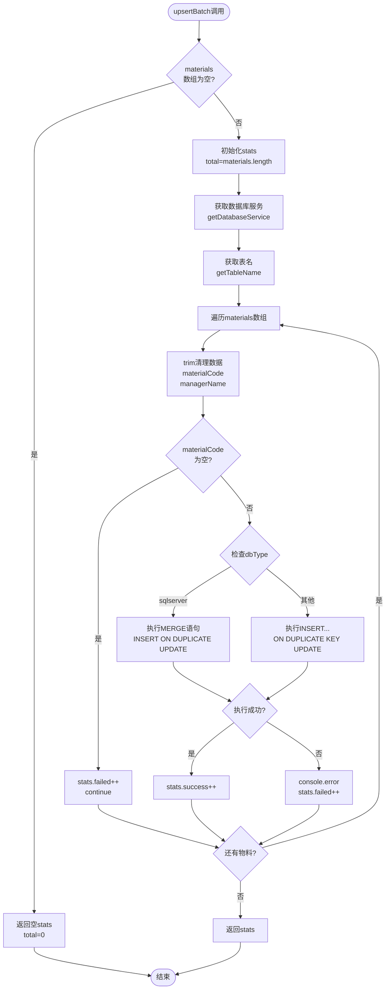

**SQL差异对比**:

**MySQL (使用 INSERT ... ON DUPLICATE KEY UPDATE)**:

```sql
INSERT INTO dbo_MaterialsToBeDeleted (MaterialCode, ManagerName)
VALUES (?, ?)
ON DUPLICATE KEY UPDATE ManagerName = VALUES(ManagerName)
```

**SQL Server (使用 MERGE)**:

```sql
MERGE [dbo].[MaterialsToBeDeleted] AS target
USING (VALUES (@materialCode, @managerName)) AS source (MaterialCode, ManagerName)
ON target.MaterialCode = source.MaterialCode
WHEN MATCHED THEN UPDATE SET ManagerName = source.ManagerName
WHEN NOT MATCHED THEN INSERT (MaterialCode, ManagerName) VALUES (source.MaterialCode, source.ManagerName);
```

**核心代码**:

```typescript
async upsertBatch(materials: { materialCode: string; managerName: string }[]): Promise<UpsertStats> {
  if (!materials || materials.length === 0) {
    return { total: 0, success: 0, failed: 0 }
  }

  const stats: UpsertStats = {
    total: materials.length,
    success: 0,
    failed: 0
  }

  try {
    const dbService = await this.getDatabaseService()
    const tableName = this.getTableName()

    for (const material of materials) {
      const materialCode = material.materialCode?.trim()
      const managerName = material.managerName?.trim() || ''

      if (!materialCode) {
        stats.failed++
        continue
      }

      try {
        if (this.dbType === 'sqlserver') {
          // SQL Server: MERGE 语句
          const sqlString = `
            MERGE ${tableName} AS target
            USING (VALUES (@materialCode, @managerName)) AS source (MaterialCode, ManagerName)
            ON target.MaterialCode = source.MaterialCode
            WHEN MATCHED THEN UPDATE SET ManagerName = source.ManagerName
            WHEN NOT MATCHED THEN INSERT (MaterialCode, ManagerName) VALUES (source.MaterialCode, source.ManagerName);
          `

          await (dbService as SqlServerService).queryWithParams(sqlString, {
            materialCode: { value: materialCode, type: sql.NVarChar },
            managerName: { value: managerName || null, type: sql.NVarChar }
          })
        } else {
          // MySQL: INSERT ... ON DUPLICATE KEY UPDATE
          const sqlString = `
            INSERT INTO ${tableName} (MaterialCode, ManagerName)
            VALUES (?, ?)
            ON DUPLICATE KEY UPDATE ManagerName = VALUES(ManagerName)
          `

          await (dbService as MySqlService).query(sqlString, [materialCode, managerName || null])
        }

        stats.success++
      } catch (error) {
        console.error('[MaterialsToBeDeletedDAO] Error upserting material:', materialCode, error)
        stats.failed++
      }
    }
  } catch (error) {
    console.error('[MaterialsToBeDeletedDAO] Batch upsert error:', error)
    stats.failed = stats.total - stats.success
  }

  return stats
}
```

**处理特点**:

- **逐条处理**: 不使用批量事务，每条记录单独执行 upsert
- **错误隔离**: 单条记录失败不影响其他记录继续处理
- **数据清理**: 自动 trim materialCode 和 managerName
- **空值处理**: managerName 为空时使用 NULL
- **统计准确**: 返回成功/失败/总计的详细统计

#### 4.2 deleteByMaterialCodes 方法

**位置**: `src/main/services/database/materials-to-be-deleted-dao.ts:539-586`

```mermaid
flowchart TB
    Start([deleteByMaterialCodes调用]) --> CheckEmpty{materialCodes<br/>数组为空?}
    CheckEmpty -->|是| ReturnZero[返回 0]
    CheckEmpty -->|否| InitTotal[初始化<br/>totalDeleted=0<br/>batchSize=1000]

    InitTotal --> GetDB[获取数据库服务<br/>getDatabaseService]
    GetDB --> GetTable[获取表名<br/>getTableName]

    GetTable --> BatchLoop[分批处理循环<br/>每批1000条]
    BatchLoop --> SliceBatch[切片<br/>materialCodes.slice<br/>i, i+batchSize]

    SliceBatch --> CheckDB{检查dbType}
    CheckDB -->|sqlserver| BuildSQLServer[构建参数化SQL<br/>@p0, @p1, ...]
    CheckDB -->|其他| BuildMySQL[构建占位符SQL<br/>?, ?, ...]

    BuildSQLServer --> ExecSQLServer[执行DELETE...IN]
    BuildMySQL --> ExecMySQL[执行DELETE...IN]

    ExecSQLServer --> AddTotal[totalDeleted +=<br/>result.rowCount]
    ExecMySQL --> AddTotal

    AddTotal --> NextBatch{还有批次?}
    NextBatch -->|是| BatchLoop
    NextBatch -->|否| ReturnTotal[返回totalDeleted]

    ReturnZero --> End([结束])
    ReturnTotal --> End
```

**批处理机制**:

```typescript
// 每批处理1000条记录
const batchSize = 1000

for (let i = 0; i < materialCodes.length; i += batchSize) {
  const batch = materialCodes.slice(i, i + batchSize)
  // 执行 DELETE ... WHERE MaterialCode IN (...)
}
```

**SQL示例**:

**MySQL**:
```sql
DELETE FROM dbo_MaterialsToDeleted
WHERE MaterialCode IN (?, ?, ?, ..., ?)  -- 最多1000个占位符
```

**SQL Server**:
```sql
DELETE FROM [dbo].[MaterialsToBeDeleted]
WHERE MaterialCode IN (@p0, @p1, @p2, ..., @p999)  -- 最多1000个参数
```

**核心代码**:

```typescript
async deleteByMaterialCodes(materialCodes: string[]): Promise<number> {
  if (!materialCodes || materialCodes.length === 0) {
    return 0
  }

  let totalDeleted = 0
  const batchSize = 1000

  try {
    const dbService = await this.getDatabaseService()
    const tableName = this.getTableName()

    for (let i = 0; i < materialCodes.length; i += batchSize) {
      const batch = materialCodes.slice(i, i + batchSize)

      if (this.dbType === 'sqlserver') {
        const placeholders = batch.map((_, idx) => `@p${idx}`).join(',')
        const params: Record<string, { value: string; type: sql.ISqlType }> = {}

        batch.forEach((code, idx) => {
          params[`p${idx}`] = { value: code.trim(), type: sql.NVarChar }
        })

        const sqlString = `
          DELETE FROM ${tableName}
          WHERE MaterialCode IN (${placeholders})
        `

        const result = await (dbService as SqlServerService).queryWithParams(sqlString, params)
        totalDeleted += result.rowCount
      } else {
        const placeholders = batch.map(() => '?').join(',')

        const sqlString = `
          DELETE FROM ${tableName}
          WHERE MaterialCode IN (${placeholders})
        `

        const result = await (dbService as MySqlService).query(sqlString, batch)
        totalDeleted += result.rowCount
      }
    }
  } catch (error) {
    console.error('[MaterialsToBeDeletedDAO] Delete by material codes error:', error)
  }

  return totalDeleted
}
```

**处理特点**:

- **批量删除**: 使用 IN 子句一次删除最多1000条记录
- **自动分批**: 超过1000条自动分批处理
- **数据清理**: 自动 trim 每个物料代码
- **累加统计**: 累加每批删除的记录数
- **错误容错**: 发生错误返回已删除的数量，不抛出异常

---

### 5. 数据流向图

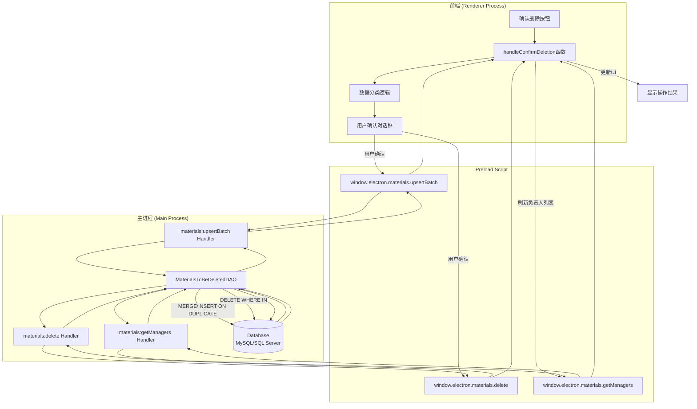

---

### 6. 关键数据结构

#### 6.1 MaterialUpsertBatchRequest (IPC输入)

```typescript
interface MaterialUpsertBatchRequest {
  materials: {
    materialCode: string   // 物料代码
    managerName: string    // 负责人名称
  }[]
}
```

#### 6.2 MaterialDeleteRequest (IPC输入)

```typescript
interface MaterialDeleteRequest {
  materialCodes: string[]  // 要删除的物料代码数组
}
```

#### 6.3 MaterialOperationResponse (IPC输出)

```typescript
interface MaterialOperationResponse {
  success: boolean
  stats?: UpsertStats     // upsert操作返回
  count?: number          // delete操作返回
  error?: string
}
```

#### 6.4 UpsertStats (操作统计)

```typescript
interface UpsertStats {
  total: number    // 总处理数量
  success: number  // 成功数量
  failed: number   // 失败数量
}
```

---

### 7. 错误处理流程

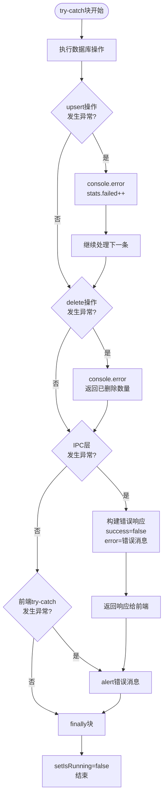

**常见错误场景**:

1. **缺少负责人信息**:
   - 场景: 已勾选的物料没有 managerName
   - 错误信息: "以下已勾选的记录缺少负责人信息，无法保存："
   - 处理: 阻止操作，弹出警告，列出前10条缺失的物料代码

2. **Upsert操作失败**:
   - 场景: 数据库连接断开、约束冲突、权限不足
   - 错误信息: "Upsert failed: ${message}"
   - 处理: 记录到 stats.failed，继续处理下一条

3. **Delete操作失败**:
   - 场景: 数据库连接断开、表锁定、权限不足
   - 错误信息: "Delete failed: ${message}"
   - 处理: 返回已删除的数量，不抛出异常

4. **网络/IPC通信失败**:
   - 场景: 主进程未响应、IPC通道关闭
   - 错误信息: 具体的错误消息
   - 处理: catch块捕获，alert显示错误信息

---

### 8. 与"获取校验状态"流程的对比

| 对比维度 | 获取校验状态 | 确认删除(同步数据库) |
|---------|------------|-------------------|
| **操作方向** | 数据库 → 前端 (读取) | 前端 → 数据库 (写入) |
| **主要操作** | SELECT 查询 | MERGE/INSERT + DELETE |
| **数据量** | 可能很大(全表查询) | 取决于用户勾选数量 |
| **事务性** | 只读，无需事务 | 写操作，逐条处理 |
| **用户交互** | 单次点击 | 点击 → 确认对话框 → 执行 |
| **错误处理** | 整体失败或成功 | 部分失败继续处理 |
| **结果反馈** | 校验结果列表 | 操作统计(成功/删除条数) |
| **副作用** | 无 | 修改数据库内容 |
| **权限要求** | 读取权限 | 写入+删除权限 |

---

## 文件索引

| 文件路径 | 说明 | 关键行号 |
|---------|------|---------|
| `src/renderer/src/pages/CleanerPage.tsx` | 前端清理页面 | 117-155 (handleValidation)<br>166-226 (handleConfirmDeletion) |
| `src/main/ipc/validation-handler.ts` | IPC处理器 | 209-392 (validation:validate)<br>399-422 (materials:upsertBatch)<br>427-449 (materials:delete) |
| `src/main/services/database/discrete-material-plan-dao.ts` | 物料计划DAO | 191-227 (queryAllDistinctByMaterialCode) |
| `src/main/services/database/discrete-material-plan-dao.ts` | 物料计划DAO | 294-377 (queryBySourceNumbersDistinct) |
| `src/main/services/database/materials-to-be-deleted-dao.ts` | 待删除物料DAO | 180-240 (upsertBatch)<br>248-268 (getAllMaterialCodes)<br>539-586 (deleteByMaterialCodes) |

---

## 附录: 共享Production IDs机制

**用途**: 在数据提取页面和清理页面之间共享订单号列表

**存储位置**: `validation-handler.ts:28-43` (内存Set)

**相关IPC接口**:

- `validation:setSharedProductionIds`: 设置共享ID (提取页面调用)
- `validation:getSharedProductionIds`: 获取共享ID (清理页面调用)

**流程**:

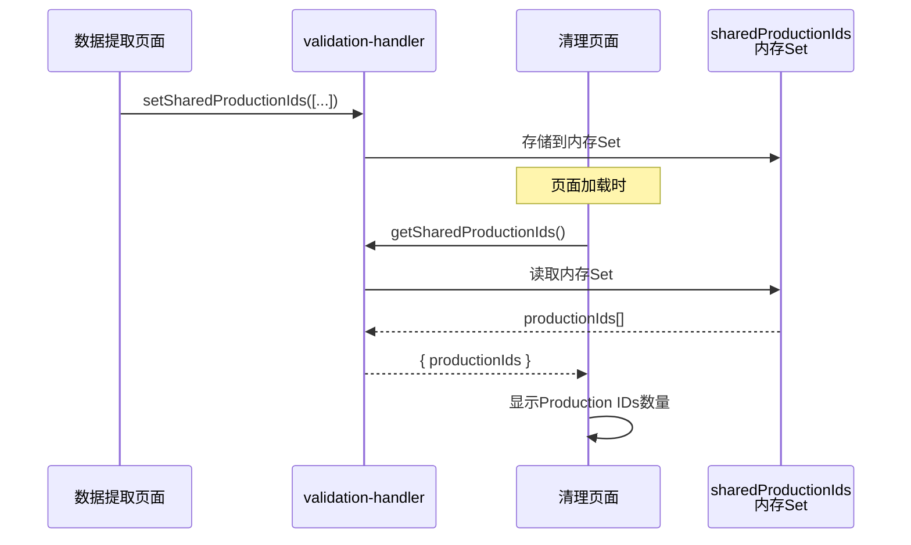

---

**文档结束**
