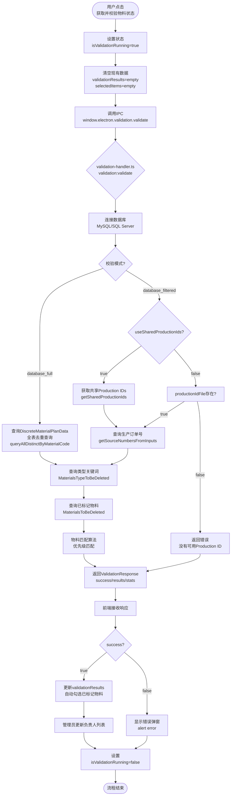
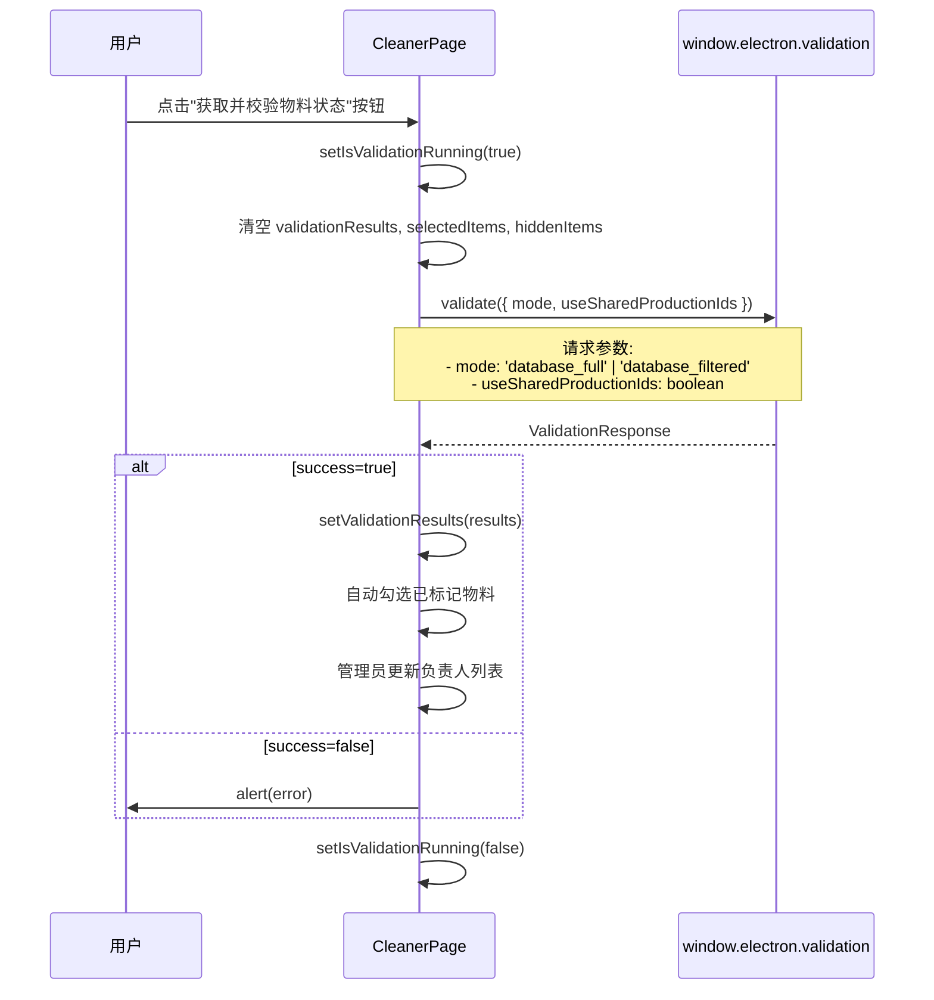
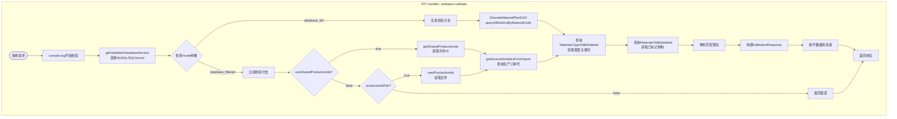
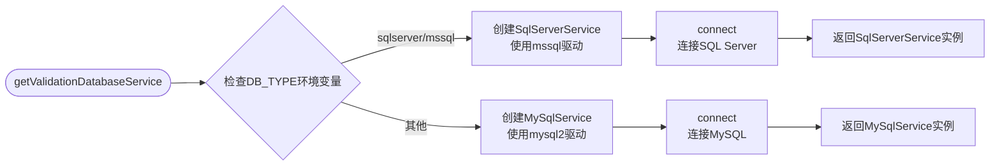
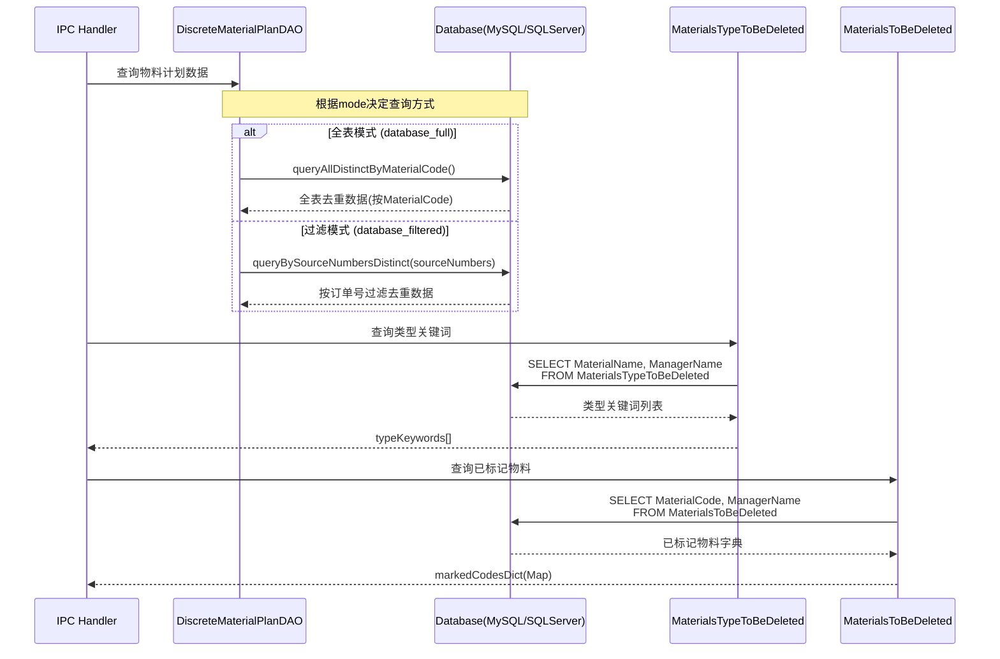
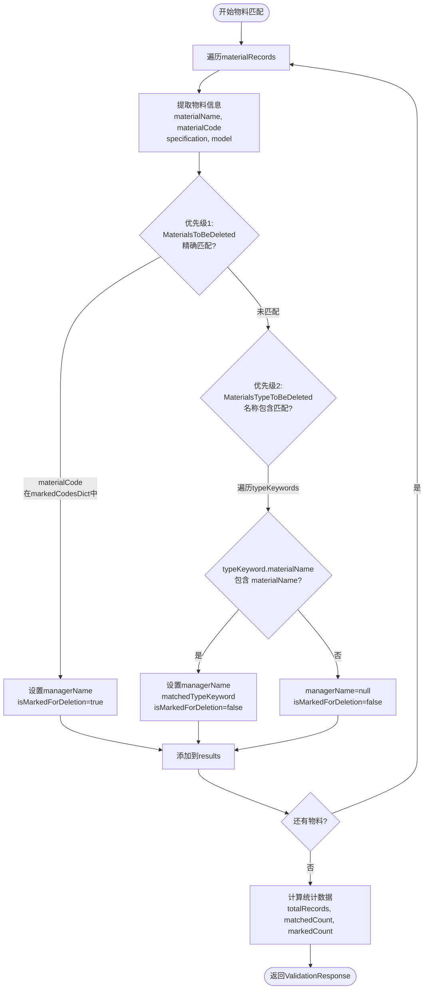
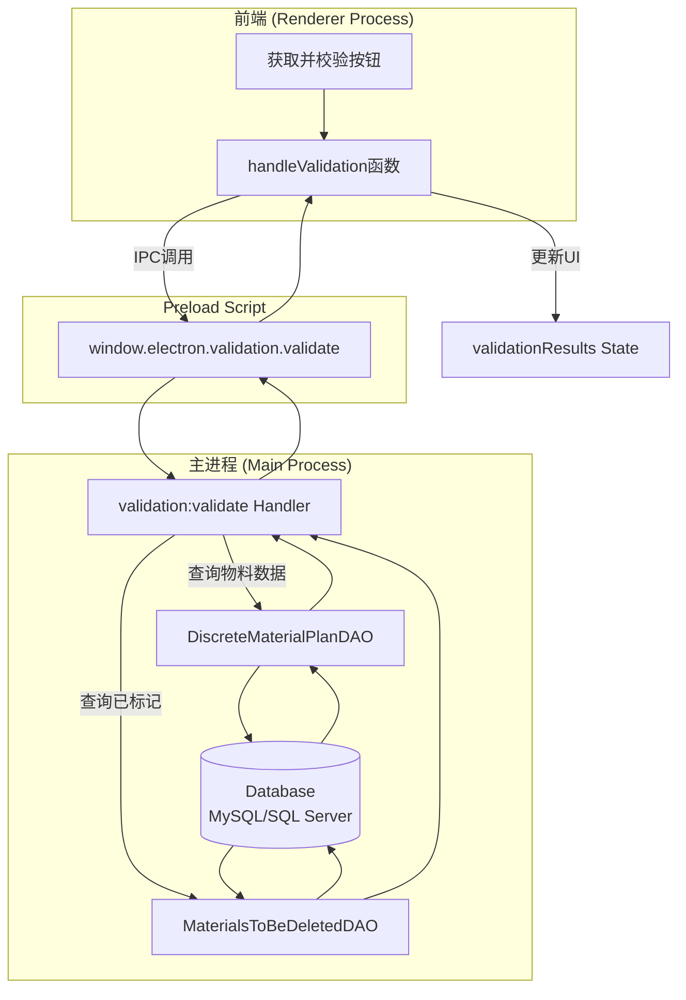
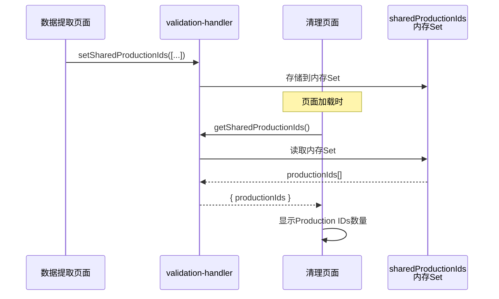

# 清理界面 - 获取校验状态流程分析文档

**文档版本**: 1.0
**创建日期**: 2026-03-02
**面向对象**: 开发人员

## 概述

本文档详细分析了在清理界面(CleanerPage)中，用户点击"获取并校验物料状态"按钮后，程序的完整运行逻辑，包括前端交互、IPC通信、后端处理和数据库交互。

---

## 核心流程概览



---

## 详细流程分解

### 1. 前端交互层 (CleanerPage.tsx)

**触发位置**: `src/renderer/src/pages/CleanerPage.tsx:117-155`



**关键代码逻辑**:

```typescript
const handleValidation = async () => {
  setIsValidationRunning(true)
  setValidationResults([])
  setSelectedItems(new Set())
  setHiddenItems(new Set())

  try {
    const response = await window.electron.validation.validate({
      mode: valMode === 'full' ? 'database_full' : 'database_filtered',
      useSharedProductionIds: valMode === 'filtered'
    })

    if (response.success && response.results) {
      setValidationResults(response.results)
      // 自动勾选已标记物料
      const markedCodes = new Set(
        response.results
          .filter(r => r.isMarkedForDeletion)
          .map(r => r.materialCode)
      )
      setSelectedItems(markedCodes)

      // 管理员更新负责人列表
      if (isAdmin) {
        const uniqueManagers = new Set(
          response.results
            .map(r => r.managerName)
            .filter(Boolean)
        )
        setManagers([...uniqueManagers])
        setSelectedManagers(uniqueManagers)
      }
    }
  } finally {
    setIsValidationRunning(false)
  }
}
```

---

### 2. IPC Handler层 (validation-handler.ts)

**处理位置**: `src/main/ipc/validation-handler.ts:209-392`



---

### 3. 数据库交互层

#### 3.1 数据库连接与类型选择

**位置**: `validation-handler.ts:55-83`



**表名转换逻辑**:

```typescript
// MySQL: dbo_MaterialsToBeDeleted
// SQL Server: [dbo].[MaterialsToBeDeleted]
function getTableName(mysqlTableName: string): string {
  const dbType = process.env.DB_TYPE?.toLowerCase()
  if (dbType === 'sqlserver' || dbType === 'mssql') {
    // 找到第一个下划线分割schema和表名
    const firstUnderscoreIndex = mysqlTableName.indexOf('_')
    if (firstUnderscoreIndex > 0) {
      const schema = mysqlTableName.substring(0, firstUnderscoreIndex)
      const tableName = mysqlTableName.substring(firstUnderscoreIndex + 1)
      return `[${schema}].[${tableName}]`
    }
    return `[dbo].[${mysqlTableName}]`
  }
  return mysqlTableName
}
```

#### 3.2 核心查询流程



#### 3.3 查询SQL详解

**全表去重查询** (MySQL/SQL Server通用):

```sql
WITH RankedRecords AS (
  SELECT
    *,
    ROW_NUMBER() OVER (
      PARTITION BY MaterialCode
      ORDER BY CreateDate ASC, SequenceNumber ASC
    ) AS rn
  FROM dbo_DiscreteMaterialPlanData
  WHERE MaterialCode IS NOT NULL
)
SELECT
  Factory, MaterialStatus, PlanNumber, SourceNumber, MaterialType,
  ProductCode, ProductName, ProductUnit, ProductPlanQuantity,
  UseDepartment, Remark, Creator, CreateDate, Approver, ApproveDate,
  SequenceNumber, MaterialCode, MaterialName, Specification, Model,
  DrawingNumber, MaterialQuality, PlanQuantity, Unit, RequiredDate,
  Warehouse, UnitUsage, CumulativeOutputQuantity, BOMVersion
FROM RankedRecords
WHERE rn = 1
```

**按订单号过滤查询** (批量处理，每批2000条):

```sql
WITH RankedRecords AS (
  SELECT
    *,
    ROW_NUMBER() OVER (
      PARTITION BY MaterialCode
      ORDER BY CreateDate ASC, SequenceNumber ASC
    ) AS rn
  FROM dbo_DiscreteMaterialPlanData
  WHERE SourceNumber IN (?, ?, ...)  -- 批量占位符
    AND MaterialCode IS NOT NULL
)
SELECT [字段列表]
FROM RankedRecords
WHERE rn = 1
```

---

### 4. 物料匹配算法

**位置**: `validation-handler.ts:325-361`



**匹配优先级**:

1. **优先级1 (最高)**: `MaterialsToBeDeleted` 表精确匹配
   - 匹配条件: `MaterialCode` 完全相等
   - 结果: `isMarkedForDeletion = true`, `managerName` 从表中获取

2. **优先级2 (次高)**: `MaterialsTypeToBeDeleted` 表包含匹配
   - 匹配条件: `MaterialName` 包含关系 (`typeKeyword.materialName.includes(materialName)`)
   - 结果: `isMarkedForDeletion = false`, `managerName` 从表中获取, `matchedTypeKeyword` 记录匹配项

3. **未匹配**: 无任何匹配
   - 结果: `isMarkedForDeletion = false`, `managerName = ''`, `matchedTypeKeyword = undefined`

**核心代码**:

```typescript
for (const record of materialRecords) {
  const materialName = (record.MaterialName as string) || ''
  const materialCode = (record.MaterialCode as string) || ''
  const specification = (record.Specification as string) || ''
  const model = (record.Model as string) || ''

  // 优先级1: 检查 MaterialsToBeDeleted (MaterialCode 精确匹配)
  let managerName = markedCodesDict.get(materialCode) || null
  const isMarkedForDeletion = managerName !== null
  let matchedTypeKeyword: string | undefined = undefined

  // 优先级2: 匹配 MaterialsTypeToBeDeleted (MaterialName 包含匹配)
  if (!managerName) {
    for (const typeKeyword of typeKeywords) {
      if (
        typeKeyword.materialName &&
        typeKeyword.materialName.includes(materialName)
      ) {
        matchedTypeKeyword = typeKeyword.materialName
        managerName = typeKeyword.managerName
        break
      }
    }
  }

  results.push({
    materialName,
    materialCode,
    specification,
    model,
    managerName: managerName || '',
    isMarkedForDeletion,
    matchedTypeKeyword
  })
}
```

---

### 5. 数据流向图



---

### 6. 关键数据结构

#### 6.1 ValidationRequest (IPC输入)

```typescript
interface ValidationRequest {
  mode: 'database_full' | 'database_filtered'
  useSharedProductionIds?: boolean
  productionIdFile?: string  // 可选，文件路径
}
```

#### 6.2 ValidationResponse (IPC输出)

```typescript
interface ValidationResponse {
  success: boolean
  results?: ValidationResult[]
  stats?: {
    totalRecords: number
    matchedCount: number    // 有负责人(包括类型匹配)
    markedCount: number     // 已标记删除
  }
  error?: string
}
```

#### 6.3 ValidationResult (单个物料结果)

```typescript
interface ValidationResult {
  materialName: string
  materialCode: string
  specification: string
  model: string
  managerName: string          // 负责人名称
  isMarkedForDeletion: boolean // 是否精确匹配MaterialsToBeDeleted
  matchedTypeKeyword?: string  // 如果匹配了类型关键词，记录匹配项
}
```

---

### 7. 错误处理流程


**常见错误场景**:

1. **没有共享Production ID**:
   - 场景: `mode='database_filtered'` 且 `useSharedProductionIds=true`，但共享ID为空
   - 错误信息: "没有可用的共享 Production ID。请在数据提取页面输入 Production ID。"

2. **没有找到物料记录**:
   - 场景: 数据库查询返回空结果
   - 错误信息: "No material records found"

3. **数据库连接失败**:
   - 场景: 数据库服务未启动、配置错误
   - 错误信息: 具体的数据库错误消息

---

## 文件索引

| 文件路径 | 说明 | 关键行号 |
|---------|------|---------|
| `src/renderer/src/pages/CleanerPage.tsx` | 前端清理页面 | 117-155 (handleValidation) |
| `src/main/ipc/validation-handler.ts` | IPC处理器 | 209-392 (validation:validate) |
| `src/main/services/database/discrete-material-plan-dao.ts` | 物料计划DAO | 191-227 (queryAllDistinctByMaterialCode) |
| `src/main/services/database/discrete-material-plan-dao.ts` | 物料计划DAO | 294-377 (queryBySourceNumbersDistinct) |
| `src/main/services/database/materials-to-be-deleted-dao.ts` | 待删除物料DAO | 248-268 (getAllMaterialCodes) |

---

## 附录: 共享Production IDs机制

**用途**: 在数据提取页面和清理页面之间共享订单号列表

**存储位置**: `validation-handler.ts:28-43` (内存Set)

**相关IPC接口**:

- `validation:setSharedProductionIds`: 设置共享ID (提取页面调用)
- `validation:getSharedProductionIds`: 获取共享ID (清理页面调用)

**流程**:



---

**文档结束**
