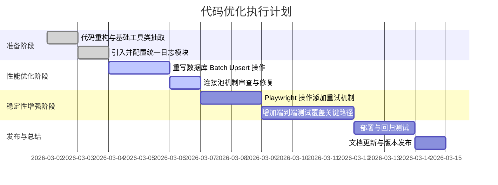
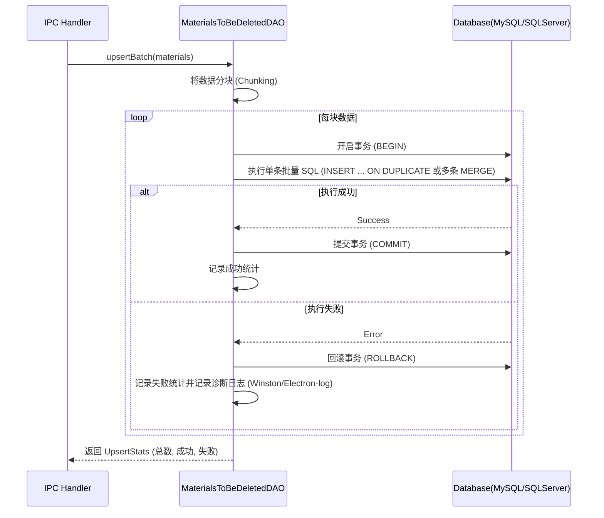

# 代码优化建议与执行计划

**文档版本**: 1.0
**创建日期**: 2026-03-02
**最后更新**: 2026-03-02
**面向对象**: 开发人员

## 概述

在对 ERPAuto 现有代码库的审查后（包括 `src/main/services/erp/` 目录下的提取与清理服务，以及 `src/main/services/database/` 下的数据库操作等模块），总结了以下优化建议，并制定了实施计划。核心优化点包括代码重构、性能优化（数据库批量操作、异步处理）、日志规范化与异常处理增强。

---

## 优化建议分类

### 1. 数据库交互与性能优化
- **批量 Upsert 优化**：目前 `upsertBatch` 在循环中逐条执行 SQL，对于大数据量效率低下。建议在支持的数据库驱动下，重构为真正的批量插入/更新语句，或者采用事务包裹多条记录，减少网络往返开销。
- **连接池管理**：确认并优化数据库连接的生命周期。确保 `dbService` 在不再需要时正确归还连接池，避免内存或连接泄漏。

### 2. ERP 交互与 Playwright 稳定性
- **异常恢复与重试机制**：ERP 系统的页面响应时间存在不确定性。建议在 `ExtractorService` 和 `CleanerService` 中的 `waitFor` 操作中加入重试机制，或者设计更平滑的降级与错误恢复策略。
- **并发请求控制**：在处理大量订单查询时，评估是否可以引入受控并发（例如利用 `Promise.allSettled` 并限制并发数）来替代完全串行的处理逻辑，从而缩短整体执行时间。

### 3. 代码结构与可维护性
- **重复代码抽取**：在 `cleaner.ts` 和 `extractor.ts` 中存在相同的 `waitForLoading` 和 `navigateTo...` 逻辑片段，可提取为基类或公共工具函数，遵循 DRY（Don't Repeat Yourself）原则。
- **类型定义集中管理**：进一步整合与完善 `src/main/types/` 中的类型定义，确保跨服务调用时有统一的强类型接口约束。

### 4. 日志记录与可观测性
- **统一日志模块**：现有代码多处使用 `console.log/error`，不利于生产环境排障。引入如 `winston` 或 `electron-log`，实施结构化日志，并在关键业务流节点（如 IPC 响应、数据库处理前/后、ERP 操作错误）添加诊断日志。

---

## 优化实施计划

以下为各项优化项的执行步骤和时间点：

---

## 优化后的核心业务流演示（以批量插入为例）

以下使用 Mermaid 图展示优化后数据库批量处理的预想流程：

---

## 结语

通过上述重构与优化方案，ERPAuto 应用的稳定性、并发处理能力以及后续的可维护性都将得到极大提升。后续的每个 Sprint 都可以挑选其中的 1 到 2 项进行深入实施。