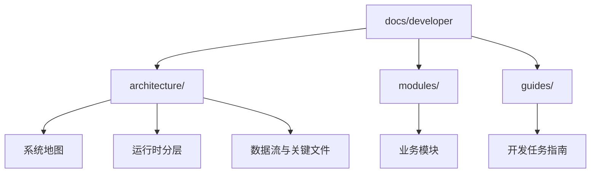
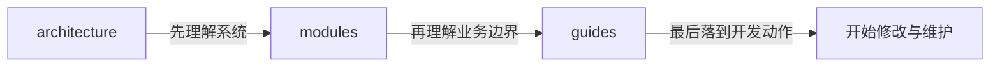

# Developer Docs

这组文档面向项目开发者，目标是帮助团队快速理解项目结构、运行时分层、核心业务模块和常见开发路径。

它不是一次性说明，而是一套会持续维护的开发文档入口。

## 文档目标

- 帮助新开发者快速建立项目地图
- 帮助现有开发者定位功能入口、关键文件和调用链
- 为重构、排障、扩展功能提供统一参考
- 逐步沉淀重要设计决策，而不是只留在提交记录和口头沟通中

## 推荐阅读顺序

如果你是第一次接触这个项目，建议按下面顺序阅读：

1. 项目总览
2. 运行时架构
3. 核心模块文档
4. 开发与调试指南

## 开发者文档总导航



也可以把这三层理解成：



## 计划中的目录结构

```text
docs/developer/
  README.md
  architecture/
    README.md
    overview.md
    runtime-architecture.md
    data-flow.md
    file-map.md
    decision-log.md
  modules/
    README.md
    extractor.md
    cleaner.md
    validation.md
    auth.md
    update.md
    settings.md
  guides/
    README.md
    local-development.md
    debugging.md
    ipc-development.md
    renderer-development.md
    release-process.md
```

## 内容组织原则

这套文档会按“读者任务”来组织，而不是简单照抄源码目录。

文档主要分为三类：

- `architecture/`
  说明系统整体结构、运行时分层、关键数据流和核心设计决策。
- `modules/`
  说明每个业务模块的职责、入口文件、调用链、状态流和常见改动点。
- `guides/`
  说明开发者在实际工作中最常见的任务，例如本地启动、调试、扩展 IPC、修改前端页面、发布版本等。

## 维护约定

为了保证这套文档长期可用，后续维护建议遵循这些约定：

- 新增核心模块时，同步补一篇对应的模块文档
- 发生重要重构时，更新相关架构文档和决策记录
- 文档优先解释“职责、边界、调用关系”，而不是堆砌实现细节
- 文档应当多用、善用 `mermaid` 做图形化表达
- 遇到结构、分层、调用链、时序、流程时，优先考虑先画图再解释
- 图负责帮助读者快速建立整体认知，文字负责解释细节和边界
- 文档尽量附上关键文件路径，并保持图和正文一一对应
- 文档中的路径、模块名、调用链描述应与当前代码保持一致

## 当前状态

当前 `developer` 文档目录刚刚建立，后续会优先补齐这些内容：

- 项目总览
- 运行时架构
- `extractor` 模块
- `cleaner` 模块
- `validation` 模块
- `update` 模块

## 相关文档

当前仓库里已经有一些与架构、重构和流程相关的文档，后续会逐步整理并决定是否纳入这套开发者文档体系：

- `docs/validation-handler-refactor-overview.md`
- `docs/use-cleaner-refactor-overview.md`
- `docs/plans/2026-03-21-electron-best-practices-optimization-plan.md`
- `docs/plans/2026-03-21-vercel-react-best-practices-optimization-plan.md`

后续这份 README 会作为整个 `docs/developer/` 的总索引持续维护。
