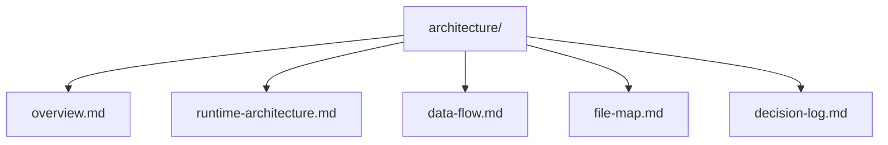
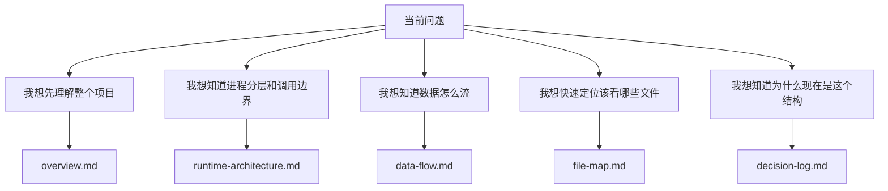

# 架构文档索引

本目录收录项目的架构层文档，主要用于帮助开发者建立系统级认知。

如果 `modules/` 关注“某个业务模块怎么工作”，`guides/` 关注“具体开发时怎么做”，那么 `architecture/` 关注的是：

- 项目整体长什么样
- 运行时是怎么分层的
- 关键数据流怎么走
- 核心文件分布在哪里
- 过去为什么做出某些架构决策

## 推荐阅读顺序

建议按下面顺序阅读：

1. `overview.md`
2. `runtime-architecture.md`
3. `data-flow.md`
4. `file-map.md`
5. `decision-log.md`

这个顺序基本对应：

- 先建立地图
- 再理解运行时分层
- 再看核心数据如何流动
- 再定位关键文件
- 最后理解历史决策

## 架构层导航图

## 文档职责一览

| 文档                      | 主要回答的问题                                     |
| ------------------------- | -------------------------------------------------- |
| `overview.md`             | 这个项目整体是什么、做什么、核心目录和主链路是什么 |
| `runtime-architecture.md` | `main / preload / renderer` 如何协作               |
| `data-flow.md`            | 核心业务数据如何在各层之间流动                     |
| `file-map.md`             | 关键文件在哪里、应该先看哪些入口                   |
| `decision-log.md`         | 最近几轮重要重构和架构决策是什么                   |

## 按问题选择阅读路径

## 与其他目录的关系

理解方式：

- 先通过 `architecture/` 建立系统级认知
- 再进入 `modules/` 深入业务模块
- 最后通过 `guides/` 落到开发动作

## 使用建议

- 如果准备改动较大的功能，先看架构层文档再下手
- 如果遇到“代码都看到了，但不知道该从哪里改”，优先看 `file-map.md`
- 如果遇到“现在为什么这样设计”，优先看 `decision-log.md`

后续如果新增新的架构层文档，也建议同步更新这份索引页。
