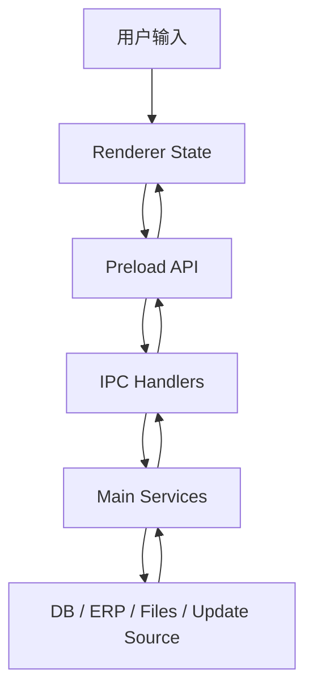
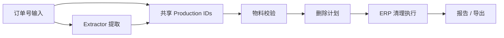
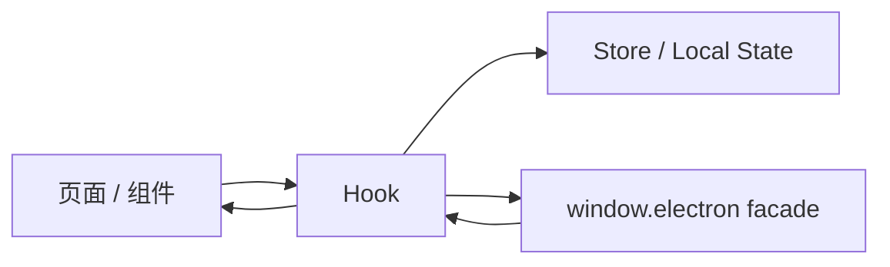
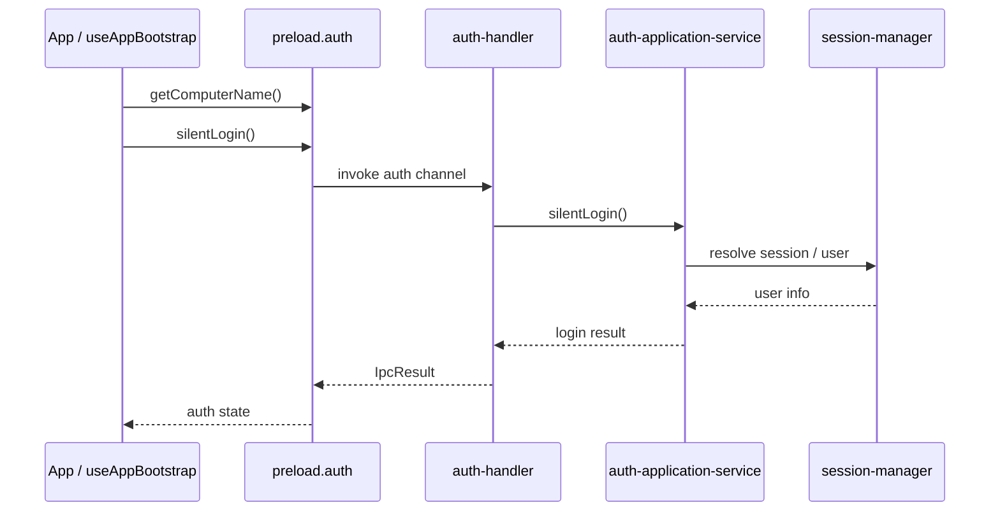
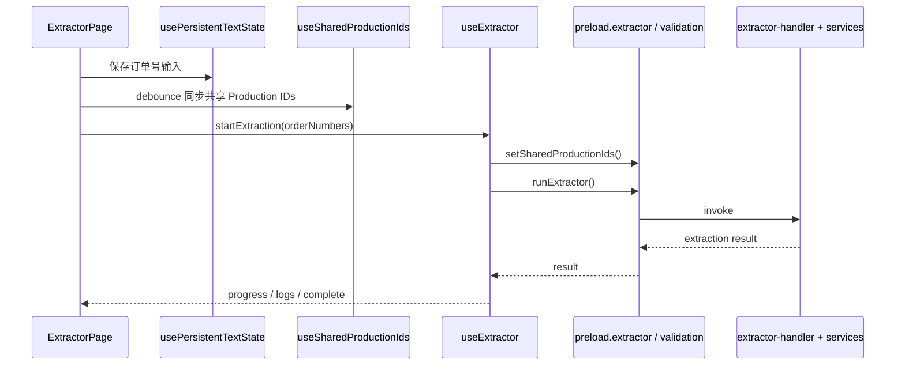
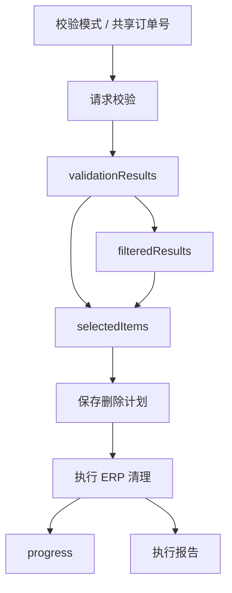
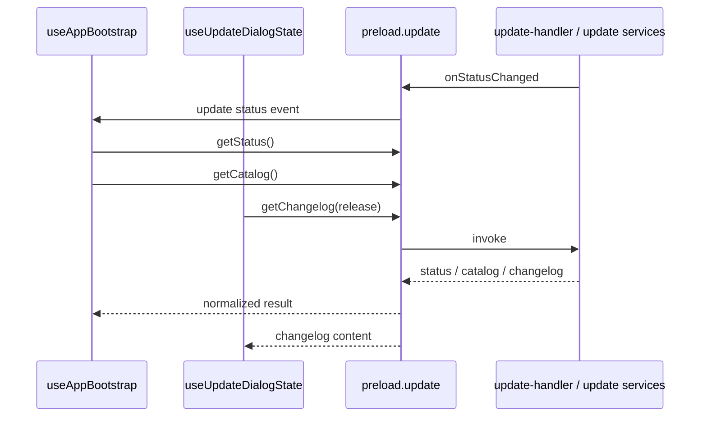
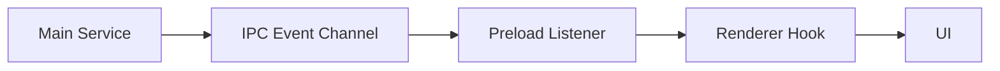
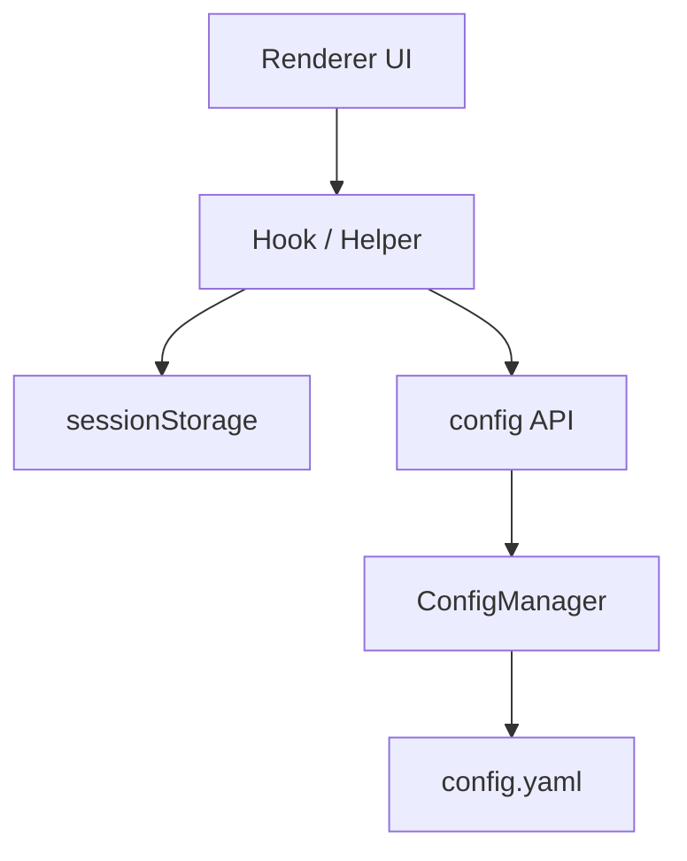

# 数据流

本文档聚焦项目中的核心数据流，帮助开发者理解关键业务数据如何在 `renderer`、`preload`、`main` 和外部系统之间流动。

## 1. 数据流总览

项目中的数据大致分成五类：

- 用户输入数据
- 页面状态数据
- IPC 请求与响应数据
- 主进程领域数据
- 外部系统数据

整体关系如下：

## 2. 提取到清理的主数据流

项目里最核心的一条数据流是：

1. 用户输入订单号
2. Extractor 执行提取
3. 共享 Production IDs
4. Cleaner 基于共享数据做校验
5. 保存删除计划
6. 执行 ERP 清理
7. 生成报告与导出

## 3. Renderer 内部数据流

在 renderer 中，数据通常按下面路径流动：

具体表现为：

- 页面组件负责接收用户输入和渲染状态
- hook 负责请求编排、局部状态和副作用管理
- store 负责消息提示、日志或跨组件状态
- preload facade 负责把 bridge 调用标准化

## 4. Authentication 数据流

认证流程是应用启动时最先发生的一条数据流。

这条链路最终驱动：

- `UnauthenticatedApp`
- `AuthenticatedAppShell`
- 管理员代切用户流程

## 5. Extractor 数据流

Extractor 模块的数据流重点在“订单号输入”和“提取执行结果”。

这里当前有两类数据：

- 持久化输入数据
  通过 `sessionStorage`
- 跨模块共享数据
  通过 `validation` 模块中的 shared production IDs

## 6. Validation / Cleaner 数据流

Cleaner 页面的数据流相对更复杂，包含筛选、校验、选择、保存和执行几个阶段。

这一块当前的关键状态都集中在：

- `useCleaner`
- `src/renderer/src/hooks/cleaner/api.ts`
- `src/renderer/src/hooks/cleaner/helpers.ts`

## 7. Update 数据流

更新模块的数据流分成两部分：

- 被动状态流
  main 进程通过事件推送状态变化
- 主动拉取流
  renderer 在打开对话框或刷新时拉取 catalog / status / changelog

## 8. 事件推送型数据流

项目中有一部分状态不是通过“请求一次拿一次”获取，而是主进程主动推送。

当前主要推送通道包括：

- cleaner progress
- extractor progress
- extractor log
- update status changed

## 9. 配置与持久化数据流

项目中的持久化既包含主进程配置，也包含 renderer 局部偏好。

当前典型例子：

- `cleaner_dryRun`
- `cleaner_headless`
- `cleaner_validationMode`
- `extractor_orderNumbers`

## 10. 开发建议

在处理数据流时，建议优先遵守这些原则：

- 页面输入态不要直接驱动高频 bridge 副作用
- 共享数据流要明确谁负责写入、谁负责消费
- preload 只做 facade，不在 bridge 层堆业务分支
- handler 只做转发和错误包装
- 复杂状态流尽量配套时序图或单测
