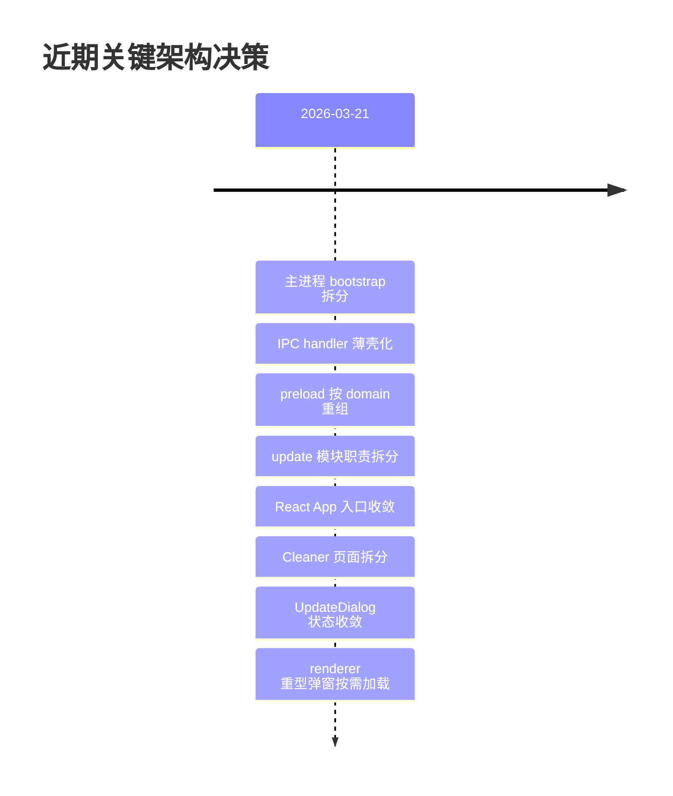
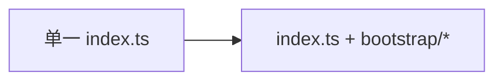
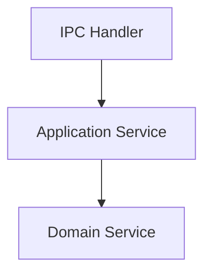
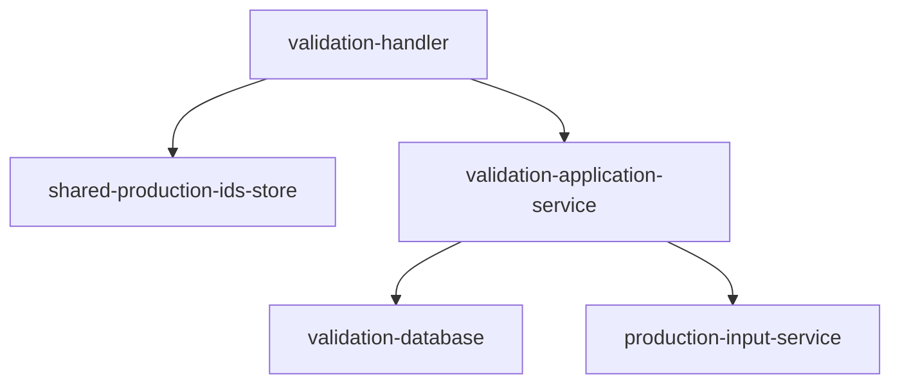
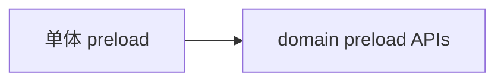
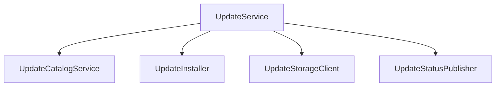
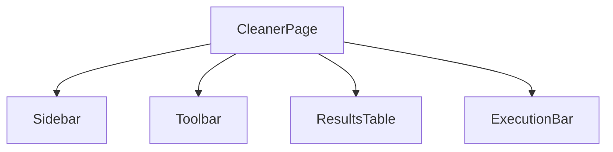

# 设计决策记录

本文档记录项目中值得被长期记住的关键架构决策。它不追求覆盖所有历史细节，而是保留那些会影响后续开发判断的决定。

## 1. 记录原则

这里主要记录三类决策：

- 影响整体结构的重构决策
- 影响跨层边界的接口决策
- 影响后续维护方式的工程化决策

## 2. 决策一览

## 3. 主进程入口拆分

### 背景

此前主进程入口承载了过多职责，启动、窗口、运行时检查、IPC 注册和进程守卫都集中在单文件中。

### 决策

将主进程启动相关逻辑拆分到：

- `bootstrap/main-window.ts`
- `bootstrap/runtime.ts`
- `bootstrap/process-guards.ts`

### 结果

### 影响

- `index.ts` 更容易读
- 启动链路更容易定位问题
- 后续添加启动逻辑不必继续堆到一个入口文件里

## 4. IPC handler 薄壳化

### 背景

部分 handler 曾经承担大量业务编排逻辑，尤其是认证、校验和清理流程。

### 决策

把核心编排下沉到 application service，handler 保持为薄壳。

当前典型结构：

### 影响

- handler 更容易测试
- 业务逻辑更容易复用
- 主进程边界更清晰

## 5. Validation 模块拆分

### 背景

`validation-handler` 曾同时承担 IPC、共享状态、数据库分支、SQL 拼接和数据富化。

### 决策

将职责拆分到独立模块：

- `shared-production-ids-store.ts`
- `validation-database.ts`
- `production-input-service.ts`
- `validation-application-service.ts`

### 结果

### 影响

- 共享订单号状态不再埋在 handler 中
- 数据库与输入识别边界更清晰
- 后续校验链路文档化和测试化更容易

## 6. Preload 按领域重组

### 背景

preload 曾接近一个“大接口总表”，内部职责不够清晰。

### 决策

将 preload 改为按 domain 组织：

- `api/auth.ts`
- `api/cleaner.ts`
- `api/extractor.ts`
- `api/validation.ts`
- `api/materials.ts`
- `api/process.ts`
- `api/logger.ts`

### 结果

### 影响

- renderer 使用的 bridge 更有语义
- preload 更适合继续维护
- 类型边界更稳定

## 7. Update 模块拆分

### 背景

更新服务长期承担目录拉取、状态广播、下载、安装和版本决策等多类职责。

### 决策

将 update 模块拆成多个协作者：

- `update-service.ts`
- `update-catalog-service.ts`
- `update-installer.ts`
- `update-storage-client.ts`
- `update-status-publisher.ts`
- `update-support.ts`

### 结果

### 影响

- 更新职责边界更清晰
- 测试粒度更细
- 维护内部更新逻辑的成本下降

## 8. React 入口收敛

### 背景

`App.tsx` 曾同时承担认证启动、更新状态刷新、导航、未认证态和已认证态 UI。

### 决策

拆出：

- `useAppBootstrap.ts`
- `AuthenticatedAppShell.tsx`
- `UnauthenticatedApp.tsx`

### 影响

- 入口组件回归组装层
- 认证与更新状态更容易追踪
- 后续页面和对话框拆分更容易

## 9. Cleaner 页面拆分

### 背景

`CleanerPage` 曾是典型的大页面，包含筛选区、工具栏、表格、执行区和多个弹窗。

### 决策

拆分出：

- `CleanerSidebar.tsx`
- `CleanerToolbar.tsx`
- `CleanerResultsTable.tsx`
- `CleanerExecutionBar.tsx`

### 结果

### 影响

- 页面阅读成本下降
- UI 结构更清楚
- 后续继续拆 `useCleaner` 更安全

## 10. UpdateDialog 状态收敛

### 背景

更新弹窗里选中版本和 changelog 请求状态容易产生旧请求覆盖新状态的问题。

### 决策

新增：

- `useUpdateDialogState.ts`

并把 changelog 请求保护和选中版本逻辑集中到 hook 中。

### 影响

- 异步状态更稳定
- 版本切换逻辑更容易测试

## 11. Renderer 重型弹窗按需加载

### 背景

多个重型弹窗并不是首屏关键路径，但此前会参与静态导入。

### 决策

对这些组件使用 `React.lazy + Suspense`：

- `UpdateDialog`
- `MaterialTypeManagementDialog`
- `ExecutionReportDialog`
- `ReportViewerDialog`

### 结果

### 影响

- renderer 初始负担下降
- 常用主流程更轻

## 12. 后续记录方式

后续新增重大决策时，建议按这个格式补充：

1. 背景
2. 决策
3. 结果图
4. 影响
5. 相关文件

建议记录的场景包括：

- 新增跨层通信机制
- 重构核心模块边界
- 修改更新、认证、校验、清理主链路
- 引入新的状态管理或测试策略
