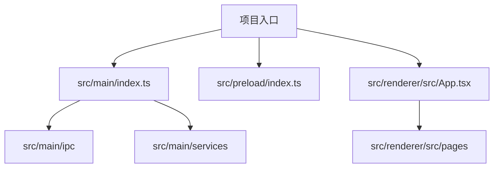
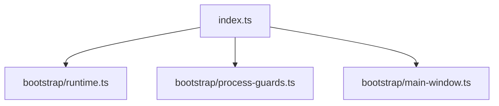
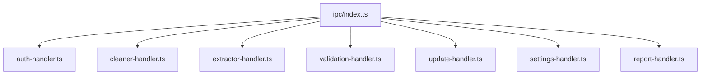
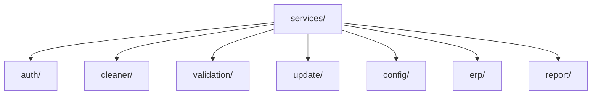
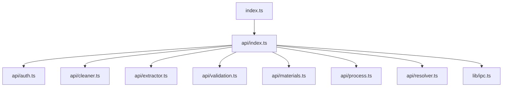
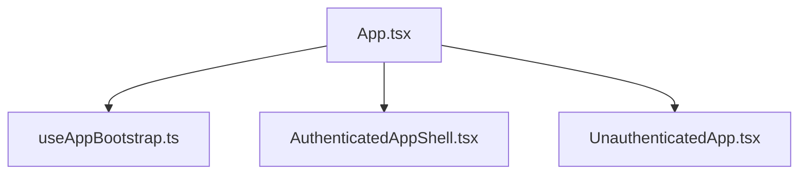
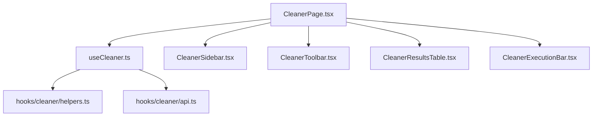
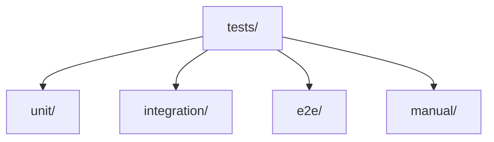
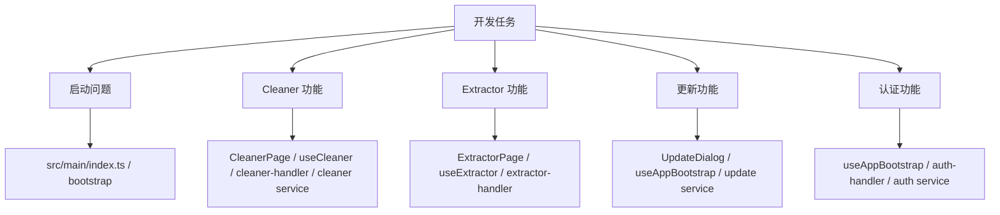

# 文件地图

本文档提供一个“高频核心文件地图”，帮助开发者快速定位项目里最值得先看的文件，而不是在目录树里盲找。

## 1. 快速定位图

## 2. 最先阅读的文件

如果你刚进入仓库，建议优先看这些文件：

| 文件                                                        | 作用                       |
| ----------------------------------------------------------- | -------------------------- |
| `src/main/index.ts`                                         | 主进程启动入口             |
| `src/main/bootstrap/runtime.ts`                             | 运行时初始化与 IPC 注册    |
| `src/main/ipc/index.ts`                                     | 所有 IPC handler 注册中心  |
| `src/preload/index.ts`                                      | preload 入口               |
| `src/preload/api/index.ts`                                  | renderer 可用 API 聚合入口 |
| `src/renderer/src/App.tsx`                                  | React 应用入口             |
| `src/renderer/src/components/app/AuthenticatedAppShell.tsx` | 已认证态主壳层             |

## 3. Main 进程文件地图

### 3.1 启动与窗口

关键文件：

- `src/main/index.ts`
- `src/main/bootstrap/runtime.ts`
- `src/main/bootstrap/process-guards.ts`
- `src/main/bootstrap/main-window.ts`

### 3.2 IPC 注册层

建议优先关注：

- `src/main/ipc/index.ts`
- `src/main/ipc/auth-handler.ts`
- `src/main/ipc/cleaner-handler.ts`
- `src/main/ipc/extractor-handler.ts`
- `src/main/ipc/validation-handler.ts`
- `src/main/ipc/update-handler.ts`

### 3.3 核心服务层

高频核心文件：

- `src/main/services/auth/auth-application-service.ts`
- `src/main/services/cleaner/cleaner-application-service.ts`
- `src/main/services/validation/validation-application-service.ts`
- `src/main/services/validation/shared-production-ids-store.ts`
- `src/main/services/update/update-service.ts`
- `src/main/services/update/update-catalog-service.ts`
- `src/main/services/config/config-manager.ts`

## 4. Preload 文件地图

preload 现在已经按领域组织。

关键文件：

- `src/preload/index.ts`
- `src/preload/index.d.ts`
- `src/preload/api/index.ts`
- `src/preload/lib/ipc.ts`

## 5. Renderer 文件地图

### 5.1 应用壳层

关键文件：

- `src/renderer/src/App.tsx`
- `src/renderer/src/hooks/useAppBootstrap.ts`
- `src/renderer/src/components/app/AuthenticatedAppShell.tsx`
- `src/renderer/src/components/app/UnauthenticatedApp.tsx`

### 5.2 页面入口

关键页面：

- `src/renderer/src/pages/ExtractorPage.tsx`
- `src/renderer/src/pages/CleanerPage.tsx`
- `src/renderer/src/pages/SettingsPage.tsx`

### 5.3 Cleaner 相关

关键文件：

- `src/renderer/src/pages/CleanerPage.tsx`
- `src/renderer/src/hooks/useCleaner.ts`
- `src/renderer/src/hooks/cleaner/api.ts`
- `src/renderer/src/hooks/cleaner/helpers.ts`

### 5.4 Extractor 相关

关键文件：

- `src/renderer/src/pages/ExtractorPage.tsx`
- `src/renderer/src/hooks/useExtractor.ts`
- `src/renderer/src/hooks/useSharedProductionIds.ts`
- `src/renderer/src/hooks/usePersistentTextState.ts`
- `src/renderer/src/components/OrderNumberInput.tsx`

### 5.5 更新相关

关键文件：

- `src/renderer/src/components/UpdateDialog.tsx`
- `src/renderer/src/hooks/useUpdateDialogState.ts`
- `src/renderer/src/hooks/useAppBootstrap.ts`

## 6. 测试文件地图

和当前重构关系较强的测试包括：

- `tests/unit/preload-surface.test.ts`
- `tests/unit/auth-handler.test.ts`
- `tests/unit/cleaner-handler.test.ts`
- `tests/unit/bootstrap-runtime.test.ts`
- `tests/unit/update-catalog-service.test.ts`
- `tests/unit/use-shared-production-ids.test.ts`
- `tests/unit/use-update-dialog-state.test.ts`

## 7. 阅读建议

不同任务建议优先看不同文件：

