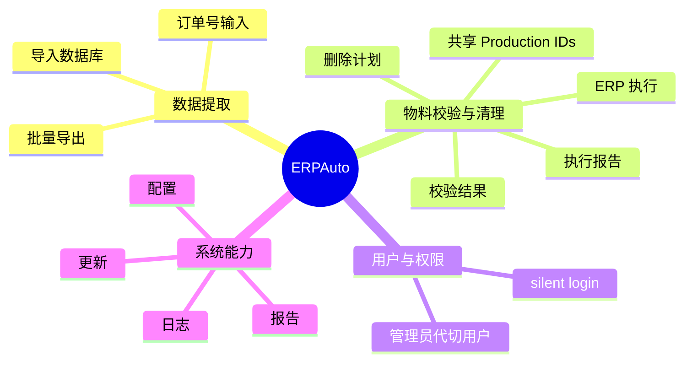
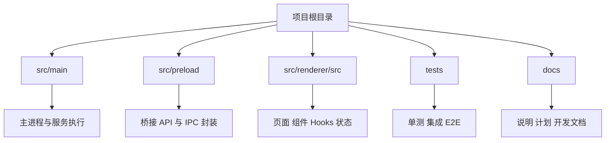
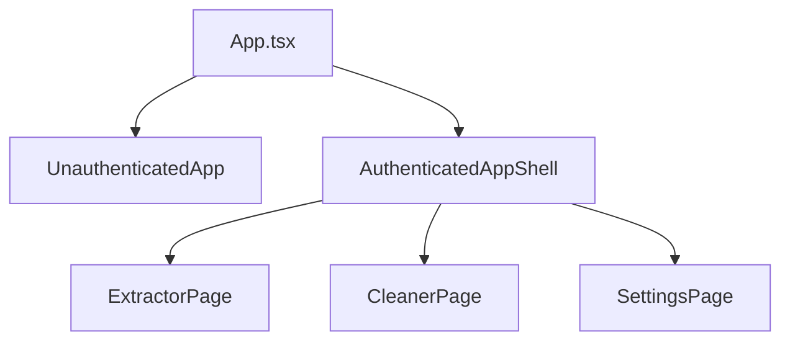
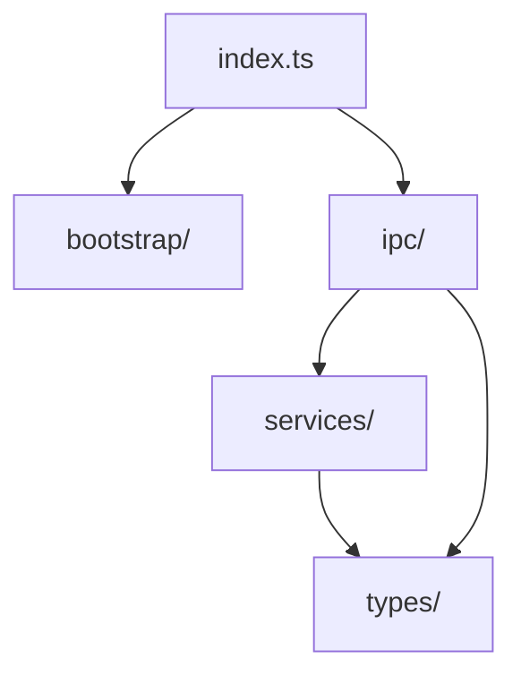
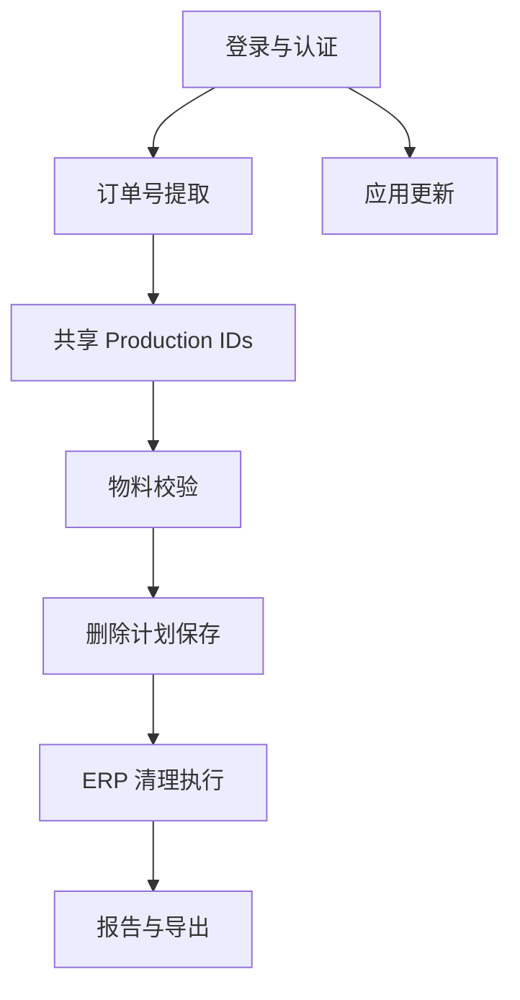
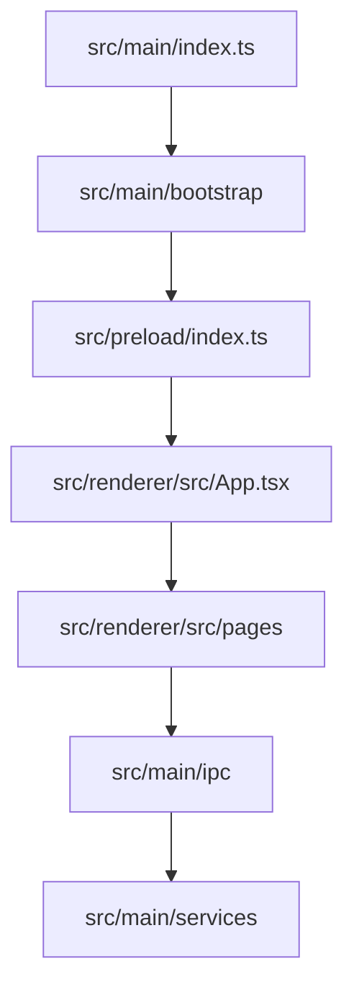

# 项目总览

本文档用于帮助开发者快速建立对项目的整体认知，包括系统目标、核心能力、目录结构和主要运行路径。

## 1. 项目定位

`ERPAuto` 是一个基于 Electron + React + TypeScript 构建的内部桌面工具，主要用于辅助 ERP 相关的数据提取、校验、清理、配置和更新管理。

当前项目的核心业务能力主要包括：

- 批量提取 ERP 数据并导入本地数据库
- 基于数据库和共享订单号进行物料校验
- 执行 ERP 物料清理与结果导出
- 用户认证、管理员代切用户
- 桌面端应用更新
- 本地配置、日志、报告与文件处理

项目可以先粗略理解成下面这张图：

## 2. 技术栈概览

- 桌面容器：Electron
- 前端渲染：React 19
- 构建工具：electron-vite / Vite
- 语言：TypeScript
- 样式：Tailwind CSS
- 测试：Vitest / Playwright
- 数据库：MySQL / SQL Server
- 自动化：Playwright

## 3. 顶层结构

项目核心代码主要分布在这几个目录：

- `src/main/`
  Electron 主进程，负责窗口、IPC、服务编排、配置、日志、更新、ERP 相关主流程。
- `src/preload/`
  preload bridge，向 renderer 暴露按领域组织的安全 API facade。
- `src/renderer/src/`
  React 渲染层，负责页面、组件、hooks、状态管理和交互流程。
- `tests/`
  单元测试、集成测试、e2e 和手工测试。
- `docs/`
  项目说明、执行计划、架构文档和后续维护文档。

也可以从目录责任关系上理解：

## 4. 运行时分层

项目运行时可简单理解为三层：

职责划分如下：

- `renderer`
  负责页面展示、用户交互、状态管理和流程触发。
- `preload`
  负责把 IPC 能力整理成前端可用的 API facade。
- `main`
  负责真正的业务执行、数据库访问、ERP 自动化、文件和更新处理。

从用户操作到系统执行的主路径如下：

## 5. 当前核心页面

当前渲染层主要有三个业务页面：

- `ExtractorPage`
  负责订单号输入、批量提取和提取日志展示。
- `CleanerPage`
  负责物料校验、负责人分配、删除计划保存、ERP 清理执行与结果查看。
- `SettingsPage`
  负责系统设置与配置维护。

应用入口在：

- `src/renderer/src/App.tsx`
- `src/renderer/src/components/app/AuthenticatedAppShell.tsx`
- `src/renderer/src/components/app/UnauthenticatedApp.tsx`

页面级结构可以简化为：

## 6. 当前主进程结构

主进程侧目前已经按职责拆成几类目录：

- `bootstrap/`
  应用启动、窗口创建、进程守卫、运行时初始化。
- `ipc/`
  IPC handler 注册与调用入口。
- `services/`
  具体业务服务实现，按领域组织。
- `types/`
  主进程与 preload/renderer 共享的类型定义。

`services/` 当前主要领域包括：

- `auth`
- `cleaner`
- `config`
- `database`
- `erp`
- `excel`
- `logger`
- `report`
- `rustfs`
- `update`
- `user`
- `validation`

主进程结构关系如下：

## 7. 关键业务链路

项目最重要的几条业务链路可以概括为：

## 8. 目录阅读建议

如果你是第一次进入代码库，建议按下面顺序读：

1. `src/main/index.ts`
2. `src/main/bootstrap/`
3. `src/preload/index.ts`
4. `src/renderer/src/App.tsx`
5. `src/renderer/src/pages/`
6. 对应业务模块的 `src/main/ipc/` 和 `src/main/services/`

阅读路径也可以理解成：

## 9. 相关文档

继续阅读建议：

- `runtime-architecture.md`
  了解 `main / preload / renderer` 的分层与调用关系。
- 后续 `modules/` 目录中的模块文档
  深入理解各业务模块。
