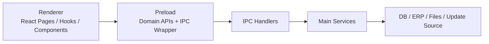
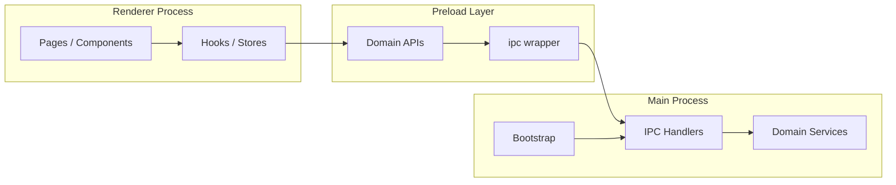
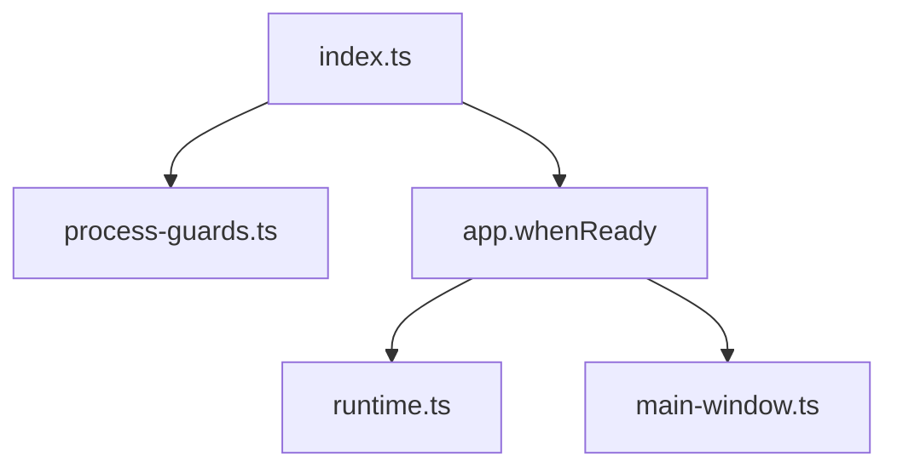
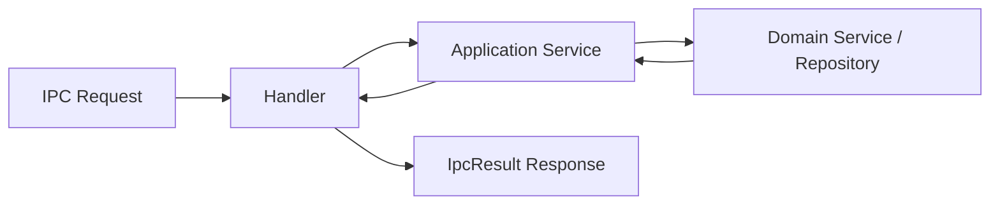
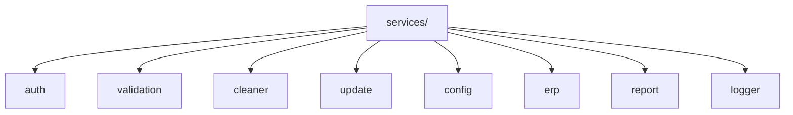
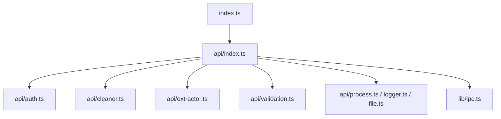
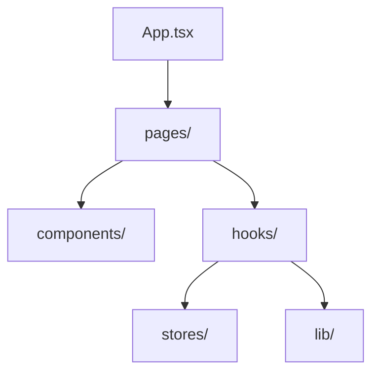
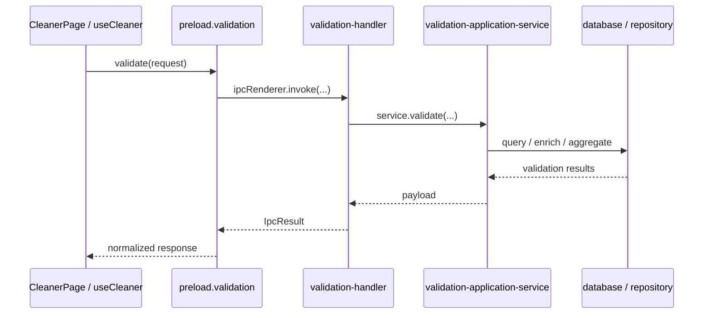
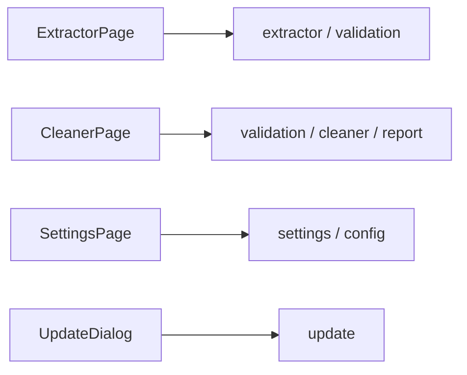
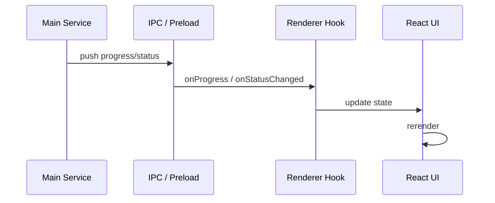

# 运行时架构

本文档说明项目在运行时的主要分层、进程边界和核心调用路径，帮助开发者理解请求是如何从 React 页面一路进入主进程服务的。

## 1. 运行时结构

项目运行时由三部分组成：

- Electron `main` 进程
- Electron `preload`
- Electron `renderer` 渲染进程

它们之间的关系如下：

如果从 Electron 的进程边界来理解，可以进一步看成：

## 2. Main 进程

主进程是应用的执行中心，负责：

- 应用启动和窗口创建
- 进程守卫和异常处理
- IPC 注册
- 配置、日志、数据库、文件、更新等系统能力
- ERP 自动化与业务流程执行

关键入口文件：

- `src/main/index.ts`
- `src/main/bootstrap/main-window.ts`
- `src/main/bootstrap/runtime.ts`
- `src/main/bootstrap/process-guards.ts`

### 2.1 Bootstrap 层

`bootstrap/` 负责把主进程入口收敛成薄启动文件。

当前主要模块：

- `main-window.ts`
  创建 `BrowserWindow`，配置窗口行为与生命周期。
- `runtime.ts`
  负责运行时初始化、服务初始化和 IPC 注册。
- `process-guards.ts`
  负责全局异常、未处理拒绝和进程级兜底。

bootstrap 层内部关系如下：

### 2.2 IPC 层

`src/main/ipc/` 中的 handler 负责注册 IPC 通道，并把请求转发到应用服务或领域服务。

当前主要 handler 包括：

- `auth-handler.ts`
- `cleaner-handler.ts`
- `extractor-handler.ts`
- `validation-handler.ts`
- `update-handler.ts`
- `settings-handler.ts`
- `report-handler.ts`

当前设计目标是：handler 尽量保持“薄壳”，只做参数接收、错误包装和 service 转发。

这层的目标结构是：

### 2.3 Services 层

`src/main/services/` 是主进程的核心实现层。

主要领域：

- `auth/`
  用户登录、silent login、用户切换。
- `cleaner/`
  ERP 清理执行编排。
- `update/`
  更新目录拉取、状态广播、下载和安装。
- `validation/`
  物料校验、共享订单号、数据库查询封装。
- `config/`
  配置加载与保存。
- `logger/`
  日志服务。
- `report/`
  报告查询与下载。

当前主进程服务从领域上大致可视化为：

## 3. Preload 层

preload 是 renderer 与 main 之间的桥接层，负责把 IPC 能力封装成按领域组织的 API。

关键入口文件：

- `src/preload/index.ts`
- `src/preload/index.d.ts`

当前 preload 内部结构：

- `src/preload/api/`
  按领域拆分的 API facade
- `src/preload/lib/ipc.ts`
  统一的 IPC 调用封装

当前已经拆分出的 API 模块包括：

- `auth.ts`
- `cleaner.ts`
- `database.ts`
- `extractor.ts`
- `file.ts`
- `logger.ts`
- `materials.ts`
- `process.ts`
- `resolver.ts`
- `validation.ts`

preload 组织方式如下：

preload 的职责不是承载业务，而是：

- 隐藏 IPC 细节
- 为 renderer 提供稳定的调用接口
- 维持类型边界

## 4. Renderer 层

renderer 是 React 应用本体，负责页面展示、交互和前端状态管理。

关键入口文件：

- `src/renderer/src/main.tsx`
- `src/renderer/src/App.tsx`

当前主要目录：

- `pages/`
  页面级容器，例如 `ExtractorPage`、`CleanerPage`、`SettingsPage`
- `components/`
  通用 UI、业务组件、对话框
- `hooks/`
  页面逻辑、状态收敛、bridge 调用编排
- `stores/`
  状态存储与消息提示
- `lib/`
  前端侧辅助工具和持久化 helper

renderer 层当前结构可以简化为：

## 5. 一次典型调用链

以 Cleaner 校验流程为例，一次从页面到主进程的调用链大致如下：

## 6. 页面与模块关系

当前主要页面与主进程模块的对应关系大致如下：

- `ExtractorPage`
  对应 `extractor`、`validation`
- `CleanerPage`
  对应 `validation`、`cleaner`、`materials`、`report`
- `SettingsPage`
  对应 `settings`、`config`
- `UpdateDialog`
  对应 `update`

## 7. 事件与状态流

项目里常见的状态流主要有三类：

- 页面内局部状态
  例如表单输入、当前选中项、弹窗开关。
- preload bridge 调用结果
  例如查询结果、校验结果、更新目录。
- 主进程主动推送事件
  例如 cleaner 执行进度、update 状态变化。

当前典型事件订阅点包括：

- `window.electron.cleaner.onProgress(...)`
- `window.electron.update.onStatusChanged(...)`
- `window.electron.extractor.onProgress(...)`
- `window.electron.extractor.onLog(...)`

事件流可以概括成：

## 8. 当前架构特点

当前项目运行时架构有几个比较明显的特点：

- 主进程侧已经完成一轮职责收敛，bootstrap、handler、service 边界更清晰
- preload 已从大文件重组为按领域组织的 facade
- renderer 正在从“大页面 + 大 hook”逐步收敛为更小的页面边界
- 更新模块、validation 模块、Cleaner 页面都已经完成阶段性重构

## 9. 开发建议

在这个运行时架构下，建议按下面原则进行开发：

- 新业务优先落在 main service，而不是直接堆到 handler
- renderer 不直接感知 IPC channel，统一走 preload facade
- 页面容器尽量只负责组装，复杂流程下沉到 hook
- 共享类型优先放在稳定的 `types/` 目录
- 重要状态流尽量画出调用链或补单测

## 10. 后续阅读

如果你已经理解了运行时分层，下一步建议继续读：

- 后续的 `modules/cleaner.md`
- 后续的 `modules/extractor.md`
- 后续的 `modules/validation.md`
- 后续的 `modules/update.md`
