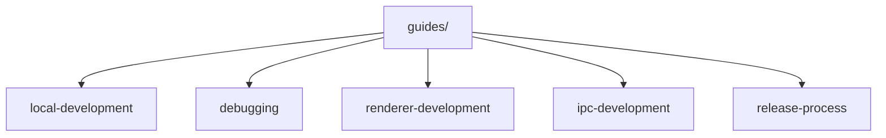
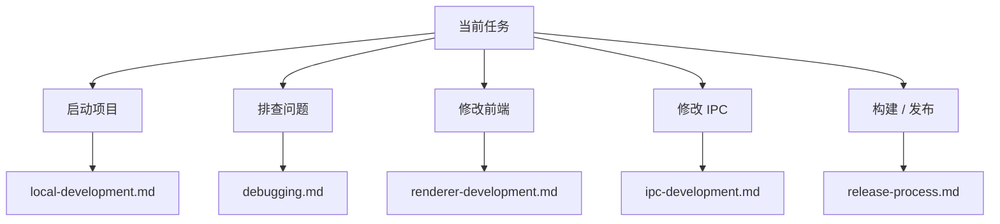
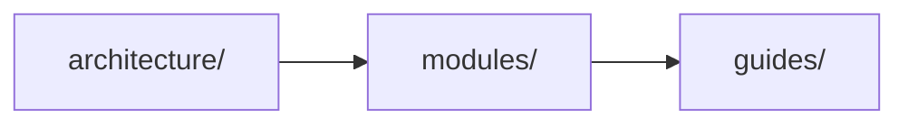

# 开发指南索引

本目录收录“开发者实际做事时会用到的指南文档”。

如果 `architecture/` 负责解释系统是什么，`modules/` 负责解释模块怎么工作，那么 `guides/` 负责回答：

- 本地怎么启动
- 出问题怎么调试
- 怎么新增或修改 IPC
- 怎么开发 renderer
- 怎么构建和发布

## 阅读建议

如果你是第一次参与这个项目的开发，推荐按下面顺序阅读：

1. `local-development.md`
2. `debugging.md`
3. `renderer-development.md`
4. `ipc-development.md`
5. `release-process.md`

## 指南地图

## 按任务查阅

你可以按当前任务来选文档：

## 当前文档一览

| 文档                      | 主要内容                                 |
| ------------------------- | ---------------------------------------- |
| `local-development.md`    | 环境准备、启动、构建、常用命令、本地验证 |
| `debugging.md`            | 分层调试思路、调试入口、主链路定位方法   |
| `renderer-development.md` | React 渲染层开发方式、页面/hook/组件边界 |
| `ipc-development.md`      | 新增或修改 IPC 能力的推荐实现路径        |
| `release-process.md`      | 构建、发布、更新产物与上传流程           |

## 与其他文档目录的关系

理解方式：

- 先看 `architecture/`
  建立系统级认知
- 再看 `modules/`
  理解业务边界
- 最后看 `guides/`
  落到具体开发动作

## 使用建议

- 改代码前，先看对应模块文档，再看对应 guide
- 如果是跨层改动，优先先看 `ipc-development.md`
- 如果是页面交互问题，优先结合 `renderer-development.md` 与模块文档一起看
- 如果是运行时问题，优先从 `debugging.md` 开始

## 后续可继续补充的指南

随着文档继续完善，后续可以考虑新增：

- `testing.md`
- `database-development.md`
- `erp-automation.md`
- `config-management.md`

后续新增指南时，建议同步更新这份索引页，让它持续作为 `guides/` 的入口文档。
