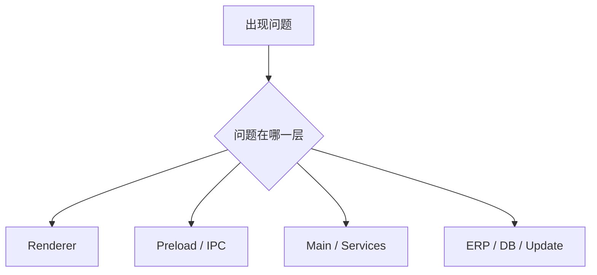
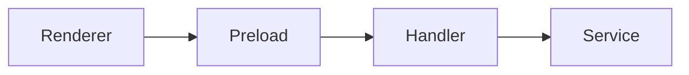
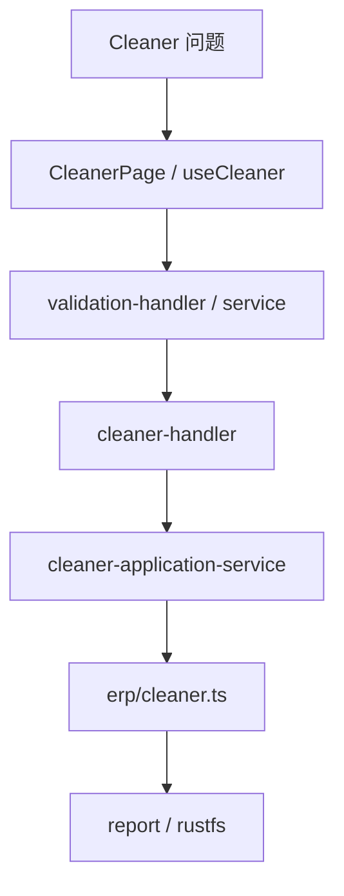
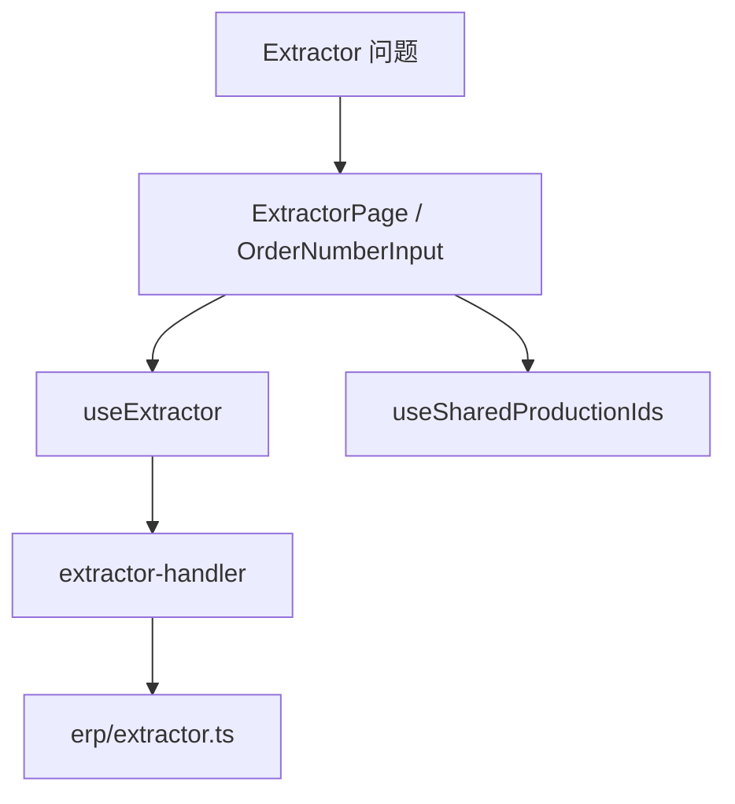
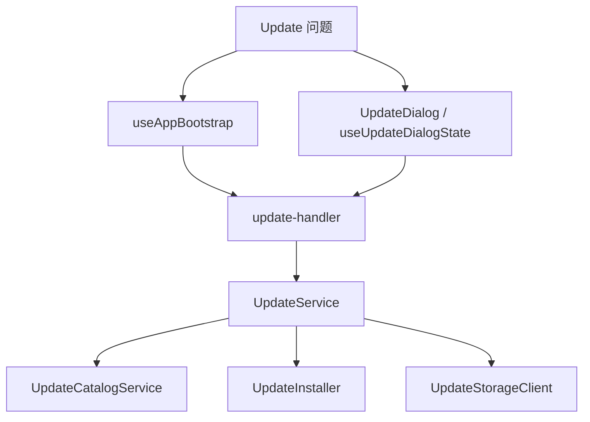
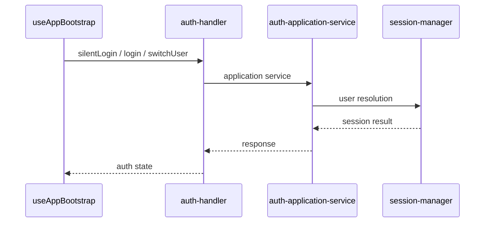

# 调试指南

本文档说明项目里最常见的调试入口、日志观察方式和问题定位路径。

## 1. 调试总览



## 2. 常见调试入口

项目里当前有几个现成的调试入口：

```bash
npm run debug:erp-login
npm run debug:config-path
npm run test:rustfs
```

对应文件：

- `src/main/tools/erp-login-debug.ts`
- `src/main/tools/config-path-debug.ts`
- `src/main/tools/rustfs-test.ts`

## 3. 调试分层思路

### 3.1 Renderer 问题

适合从这里开始：

- `src/renderer/src/App.tsx`
- `src/renderer/src/pages/*`
- `src/renderer/src/hooks/*`

常见现象：

- 页面不更新
- 弹窗打不开
- 表单状态异常
- 请求重复触发

### 3.2 Preload / IPC 问题



定位顺序建议：

1. renderer 是否正确调用 `window.electron.xxx`
2. preload facade 是否暴露了正确接口
3. handler 是否已注册
4. service 是否返回了预期结构

### 3.3 Main 进程问题

适合从这里开始：

- `src/main/index.ts`
- `src/main/bootstrap/*`
- `src/main/ipc/*`
- `src/main/services/*`

常见现象：

- 启动失败
- 数据库连接失败
- ERP 登录失败
- 更新检查失败

## 4. Cleaner 调试路径



## 5. Extractor 调试路径



## 6. Update 调试路径



## 7. 认证调试路径



## 8. 日志观察建议

调试时优先关注：

- renderer 控制台输出
- main 进程日志
- 关键 application service 的 logger 输出
- audit log（如果问题涉及登录、清理等操作记录）

## 9. 定位建议

出现问题时，建议优先回答这几个问题：

1. 问题发生在哪一层
2. 是状态流问题还是外部依赖问题
3. 是请求没发出、没到 handler，还是 service 失败
4. 是同步返回问题，还是事件推送问题

## 10. 调试原则

- 先缩小层级，再深入代码
- 先看入口与边界，再看实现细节
- 能复现就尽量用最小路径复现
- 复杂主链路优先画调用链再改代码
