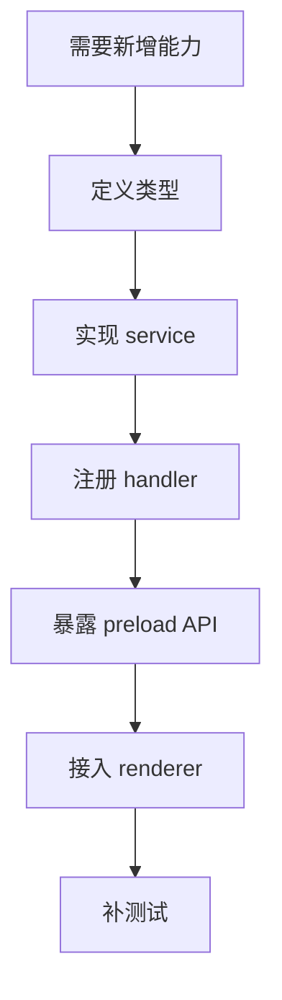
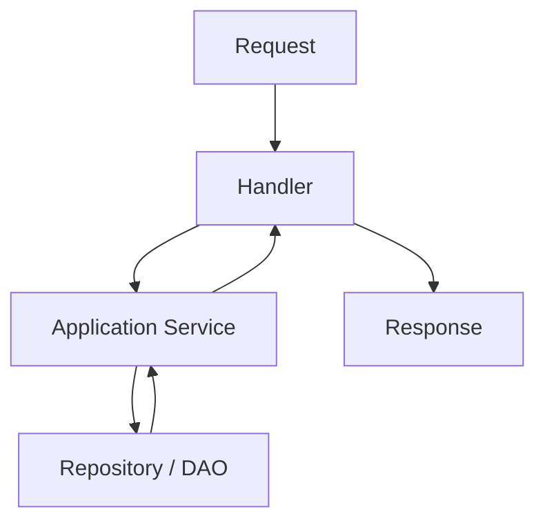
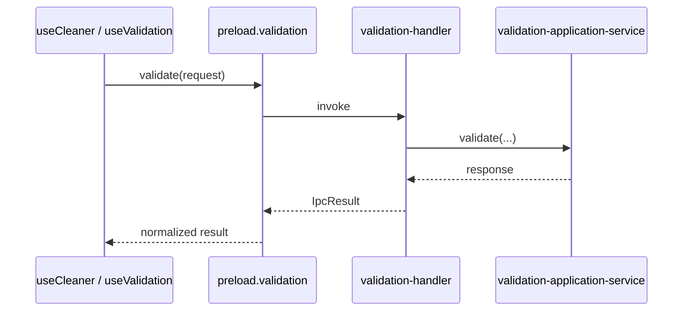

# IPC 开发指南

本文档说明在项目中新增或修改一个 IPC 能力时，推荐的实现路径和注意事项。

## 1. IPC 开发原则

当前项目的 IPC 目标结构是：

原则：

- renderer 不直接感知 IPC channel 细节
- preload 负责 facade 化
- handler 保持薄壳
- 业务逻辑尽量放到 application service 或 domain service

## 2. 新增一个 IPC 能力的推荐步骤

## 3. 第一步：定义类型

优先在稳定类型层定义：

- request 类型
- response 类型
- preload 暴露面类型

常见位置：

- `src/main/types/`
- `src/preload/index.d.ts`

## 4. 第二步：实现 service

如果能力有实际业务逻辑，优先先写 service。

不要直接把逻辑堆到 handler 里。

示意结构：

## 5. 第三步：注册 handler

常见位置：

- `src/main/ipc/<module>-handler.ts`
- `src/main/ipc/index.ts`

handler 里建议只做：

- 接收参数
- 转发给 service
- 用统一错误包装返回 `IpcResult`

## 6. 第四步：接到 preload

常见位置：

- `src/preload/api/<module>.ts`
- `src/preload/api/index.ts`
- `src/preload/index.d.ts`

preload 的职责是把主进程能力变成 renderer 可调用的 facade，而不是承载业务判断。

## 7. 第五步：接到 renderer

renderer 侧通常有两种接法：

- 直接在页面 hook 中调用
- 先落一层 hook / helper，再被页面使用

建议优先把复杂调用路径集中到 hook。

## 8. 典型示例路径

以一个校验相关能力为例：

## 9. 修改 IPC 时优先检查的文件

- `src/main/ipc/index.ts`
- `src/main/ipc/<module>-handler.ts`
- `src/main/services/<module>/...`
- `src/preload/api/<module>.ts`
- `src/preload/api/index.ts`
- `src/preload/index.d.ts`
- renderer 对应 hook / page

## 10. 测试建议

如果是新增 IPC 能力，建议至少补：

- handler 单测
- application service 单测
- preload surface 或 renderer 状态测试（视复杂度而定）

## 11. 常见反模式

- 直接在页面里拼 IPC channel
- handler 里写完整业务流程
- preload 里堆业务分支
- 改了主进程返回结构但不更新 renderer 类型

## 12. 实践建议

- 优先复用现有领域模块
- 先想边界，再写调用
- 先让主进程能力清晰，再接 renderer
