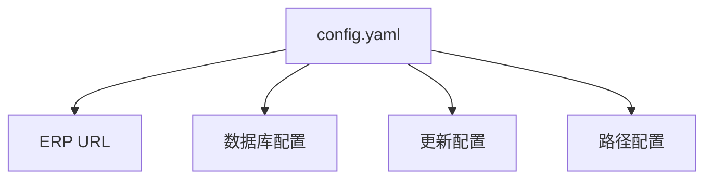
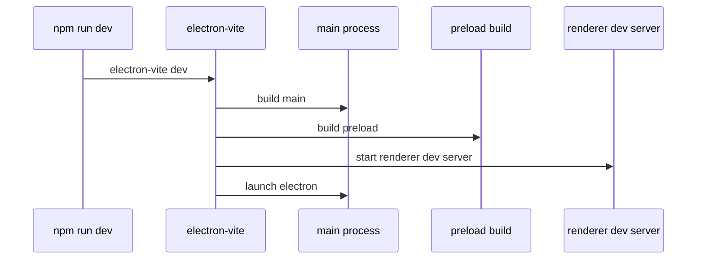
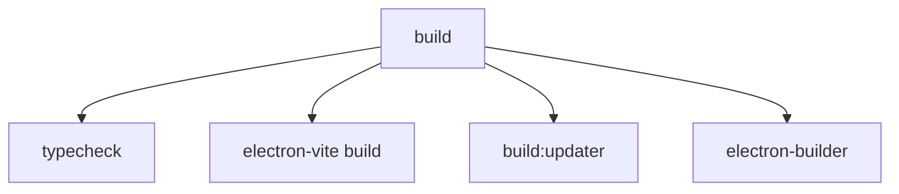
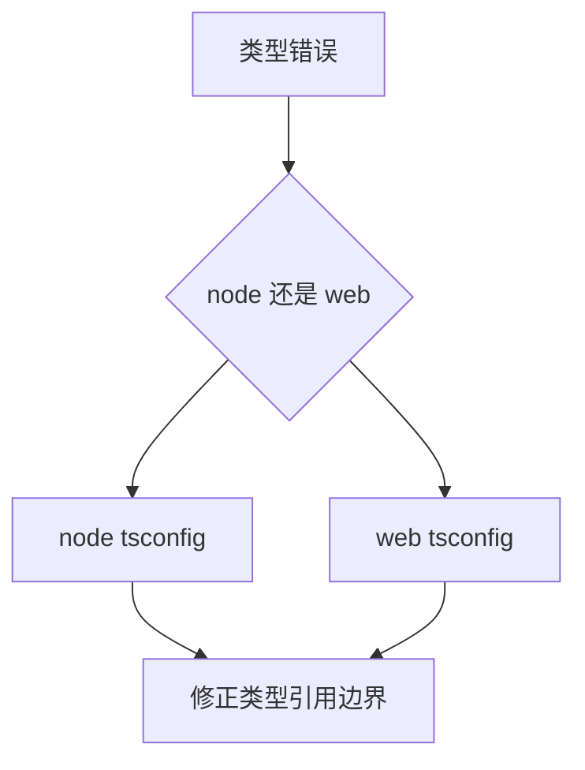

# 本地开发指南

本文档说明如何在本地启动、检查、构建和验证项目。

## 1. 开发环境概览


## 2. 基础要求

- Node.js >= 18
- npm >= 9
- 本地可访问 ERP 系统
- 可访问 MySQL 或 SQL Server

## 3. 安装依赖

```bash
npm install
```

## 4. 准备配置

项目使用 `config.yaml` 作为主配置文件。



至少要确认这些配置可用：

- ERP URL
- 当前使用的数据库类型
- 数据库连接信息

说明：

- ERP 用户名和密码不是放在 `config.yaml`
- 这部分在应用设置页中按用户存储

## 5. 启动开发环境

```bash
npm run dev
```

开发启动链路如下：



## 6. 常用开发命令

```bash
# 启动开发环境
npm run dev

# 类型检查
npm run typecheck

# 代码格式化
npm run format

# lint
npm run lint

# 单测
npm run test:run

# E2E
npm run test:e2e
```

## 7. 构建命令

当前正式维护的是 Windows 构建链路。

```bash
# 常规构建
npm run build

# Windows 安装版
npm run build:win

# 仅生成 unpack 目录
npm run build:unpack
```

构建路径如下：



## 8. 日常验证建议

修改代码后，建议至少跑：

```bash
npm run typecheck
npx eslint <changed files>
```

如果改到关键主链路，再补：

```bash
npx vitest run <related tests>
```

## 9. 常见本地问题

### 9.1 `npm run dev` 无法启动

优先检查：

- `config.yaml` 是否存在
- 数据库配置是否正确
- 当前终端里是否残留异常环境变量

### 9.2 类型检查失败



### 9.3 ERP 登录相关问题

优先检查：

- 设置页中的 ERP 账号密码
- ERP URL
- 网络可达性
- 是否可用调试脚本复现

## 10. 相关文件

- `package.json`
- `config.yaml`
- `src/main/index.ts`
- `src/main/bootstrap/runtime.ts`
- `electron-builder.yml`
