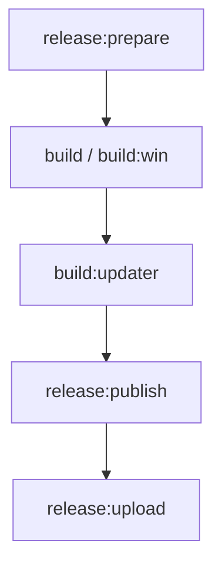
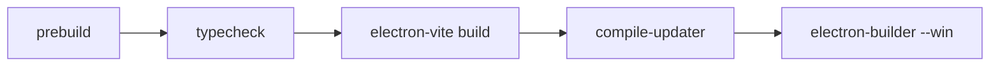
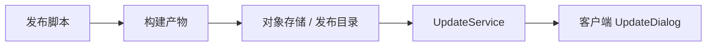

# 发布流程指南

本文档说明当前项目的构建、发布和上传链路。

当前正式维护的是 Windows 发布流程。

## 1. 发布链路总览



## 2. 当前相关命令

```bash
npm run release:prepare
npm run build:win
npm run release:publish
npm run release:upload
```

以及构建相关命令：

```bash
npm run build
npm run build:updater
npm run build:unpack
```

## 3. 相关脚本

当前发布链路涉及这些脚本：

- `scripts/prepare-release.js`
- `scripts/publish-release.js`
- `scripts/upload-release.js`
- `scripts/compile-updater.js`

## 4. 构建阶段



这一阶段大致会完成：

- 清理旧产物
- 类型检查
- 构建 main / preload / renderer
- 构建更新相关产物
- 生成 Windows 安装包

## 5. 发布前建议检查

发布前建议确认：

- `npm run typecheck` 通过
- 关键测试通过
- `config.yaml` / 发布配置没有误改
- 更新目录与版本号符合预期
- release 文案、构建产物和上传目标一致

## 6. 更新链路关系

发布流程和 update 模块关系很强：



也就是说，发布流程最终会直接影响：

- `UpdateCatalogService`
- `UpdateDialog`
- 客户端是否能正确检测与安装更新

## 7. 常见问题

### 7.1 构建失败

优先检查：

- `npm run typecheck`
- 更新编译脚本是否正常
- Windows 构建配置是否被误改

### 7.2 发布后客户端看不到更新

优先检查：

- 发布目录是否正确上传
- 版本号与 channel 是否正确
- update catalog 是否包含该版本
- 客户端 `UpdateService` 是否成功拉取目录

### 7.3 上传成功但安装失败

优先检查：

- `UpdateInstaller` 的下载与校验逻辑
- 产物哈希是否正确
- 客户端本地下载路径与安装流程

## 8. 相关文件

- `package.json`
- `electron-builder.yml`
- `scripts/prepare-release.js`
- `scripts/publish-release.js`
- `scripts/upload-release.js`
- `src/main/services/update/*`
