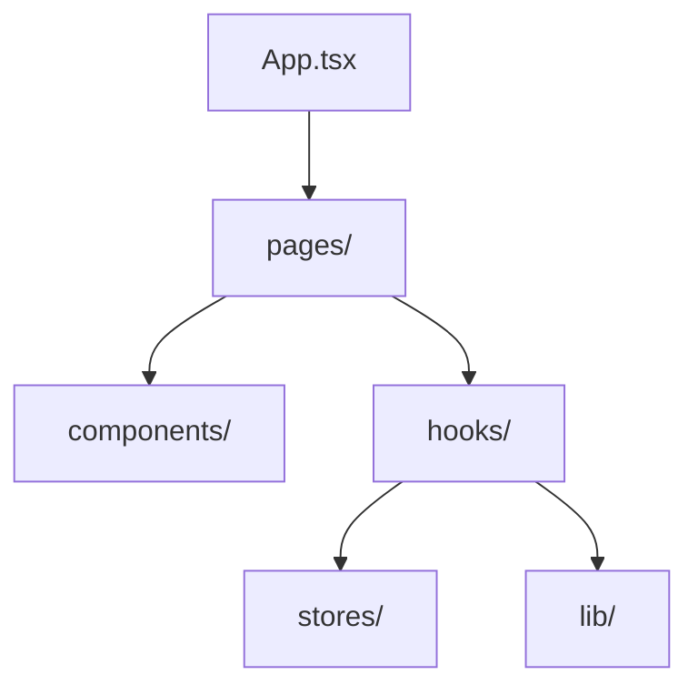
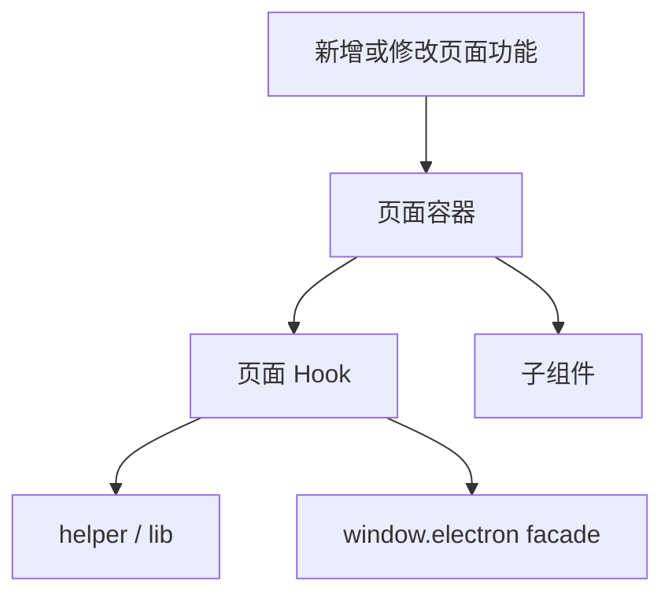
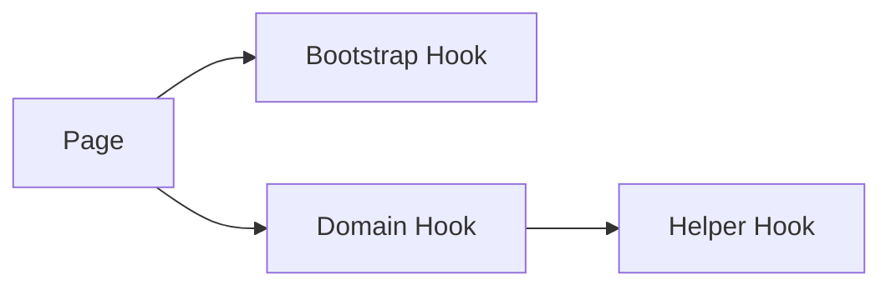
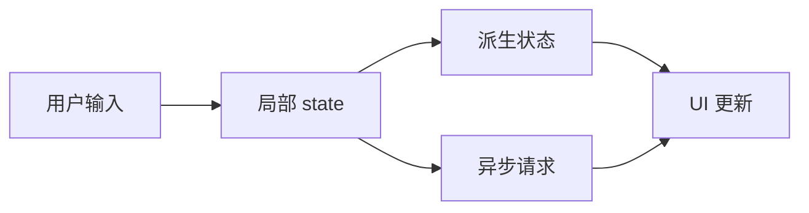

# Renderer 开发指南

本文档说明在当前项目里开发 React 渲染层时，推荐的组织方式和常见改动路径。

## 1. Renderer 结构

## 2. 开发原则

当前 renderer 层推荐遵循这些边界：

- 页面组件优先作为组装层
- 复杂流程优先下沉到 hook
- 纯逻辑优先抽到 helper / lib
- 非首屏重型弹窗优先考虑懒加载
- bridge 调用优先放在 hook，不直接散落在组件树中

## 3. 页面开发路径

## 4. 当前页面入口

主要页面：

- `ExtractorPage.tsx`
- `CleanerPage.tsx`
- `SettingsPage.tsx`

主壳层：

- `App.tsx`
- `AuthenticatedAppShell.tsx`
- `UnauthenticatedApp.tsx`

## 5. Hook 组织建议

推荐把 hook 分成几类：

- 页面启动/编排 hook
  例如 `useAppBootstrap`
- 业务流程 hook
  例如 `useCleaner`、`useExtractor`
- 辅助状态 hook
  例如 `usePersistentTextState`、`useSharedProductionIds`

## 6. 当前推荐风格

结合近期重构，当前 renderer 更推荐：

- `App.tsx` 保持薄入口
- `CleanerPage` 保持页面布局和弹窗编排
- 重型局部区域拆成子组件
- 异步状态收敛到 hook

## 7. 状态更新建议

建议：

- 能派生的状态尽量派生，不额外存储
- 输入态不要直接挂太多高频副作用
- 非紧急 UI 更新可考虑 `startTransition`

## 8. 弹窗开发建议

当前项目弹窗较多，建议遵循：

- 非首屏关键弹窗优先懒加载
- 弹窗状态尽量放在页面或页面 hook 中统一管理
- 弹窗本身专注展示和内部交互

## 9. 典型改动路径

### 改 Cleaner 页面

- `CleanerPage.tsx`
- `components/cleaner/*`
- `useCleaner.ts`
- `hooks/cleaner/*`

### 改 Extractor 页面

- `ExtractorPage.tsx`
- `useExtractor.ts`
- `useSharedProductionIds.ts`

### 改更新弹窗

- `UpdateDialog.tsx`
- `useUpdateDialogState.ts`
- `useAppBootstrap.ts`

## 10. 测试建议

当前 renderer 测试更适合先从：

- 状态 helper
- hook 决策逻辑
- 与 preload 调用边界有关的轻量测试

开始补，而不是一上来就做全量 UI 集成测试。

## 11. 常见反模式

- 页面组件同时承载过多副作用
- 在组件中直接散布大量 `window.electron.xxx`
- 一个 hook 同时管理初始化、交互、请求、持久化和对话框
- 非首屏重型组件全部静态导入
