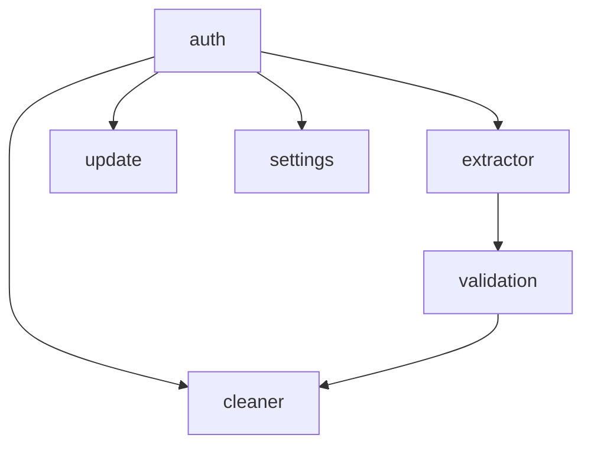
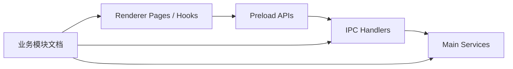
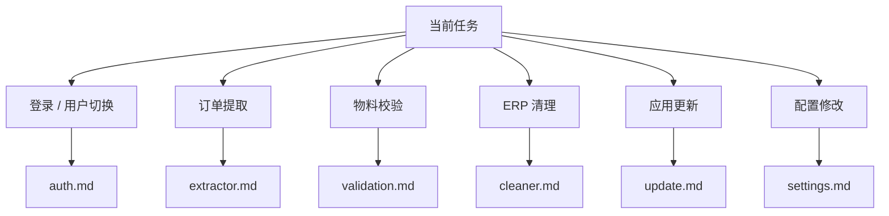
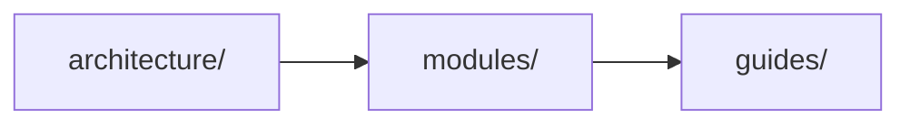

# 模块文档索引

本目录收录项目核心业务模块的开发文档。

这些文档的目标不是替代源码，而是帮助开发者快速理解：

- 每个模块负责什么
- 模块的入口文件在哪里
- 模块之间如何协作
- 主要数据和调用链怎么流动
- 改某个功能时应该先看哪些文件

## 推荐阅读方式

如果你是第一次进入模块层，建议按下面顺序阅读：

1. `auth`
2. `extractor`
3. `validation`
4. `cleaner`
5. `update`
6. `settings`

这个顺序基本对应项目的主要业务路径和依赖关系。

## 模块关系图

可以把它理解成：

- `auth`
  提供用户上下文，是多个模块的前置条件
- `extractor`
  负责输入和提取，是共享订单号的来源之一
- `validation`
  把共享数据和数据库数据转成 Cleaner 可消费结果
- `cleaner`
  消费校验结果并执行 ERP 清理
- `update`
  根据当前用户上下文给出更新能力和状态
- `settings`
  提供 ERP 凭据等配置能力

## 模块目录一览

| 模块       | 文档            | 核心职责                                                  |
| ---------- | --------------- | --------------------------------------------------------- |
| Auth       | `auth.md`       | 登录、silent login、管理员代切用户、用户上下文同步        |
| Extractor  | `extractor.md`  | 订单号输入、提取执行、日志与共享订单号同步                |
| Validation | `validation.md` | 共享 Production IDs、校验查询、结果富化、Cleaner 数据准备 |
| Cleaner    | `cleaner.md`    | 物料校验展示、删除计划保存、ERP 清理执行、报告展示        |
| Update     | `update.md`     | 更新目录、状态广播、下载、安装、用户/管理员更新视图       |
| Settings   | `settings.md`   | ERP 凭据加载与保存、当前用户配置管理                      |

## 模块入口地图

阅读模块文档时，建议同时关注三层入口：

- renderer 入口
  页面、组件、hooks
- IPC 入口
  handler
- main service 入口
  application service / domain service

## 按任务选择阅读路径

如果你是按任务来看文档，可以参考下面这张图：

## 和 architecture 文档的关系

`modules/` 和 `architecture/` 的关系如下：

理解方式可以是：

- 先看 `architecture/`
  建立系统整体认知
- 再看 `modules/`
  深入理解业务模块
- 最后看 `guides/`
  落到具体开发动作

## 后续扩展建议

如果后续业务边界继续演进，可以在这里继续增加模块文档，例如：

- `report.md`
- `materials.md`
- `config.md`
- `logger.md`

新增模块文档时，建议同步更新这份索引页，让 `modules/README.md` 持续保持为模块层总入口。
