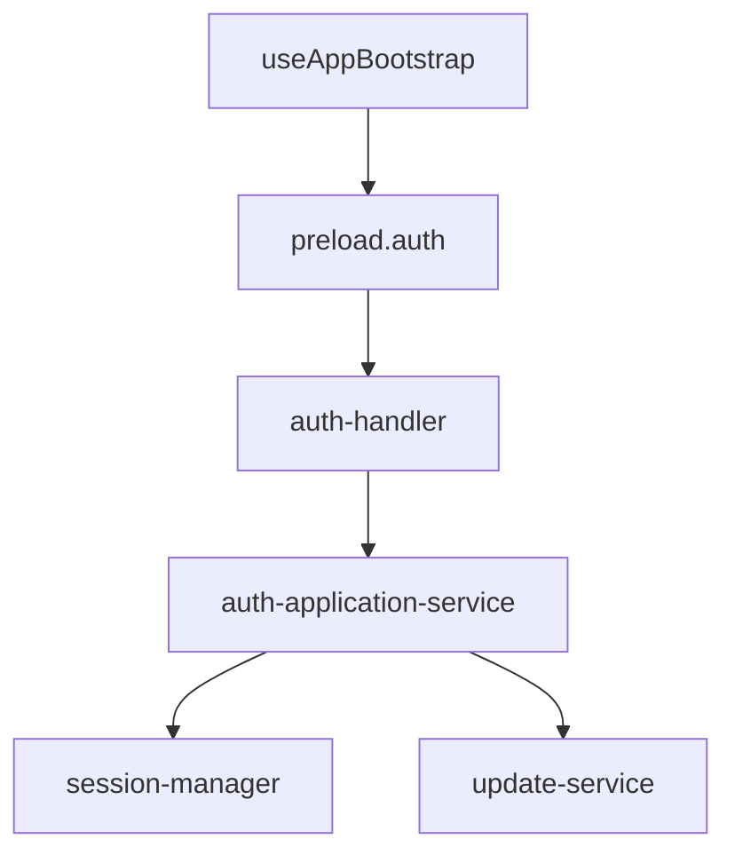
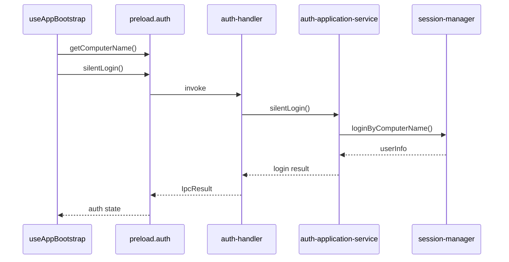
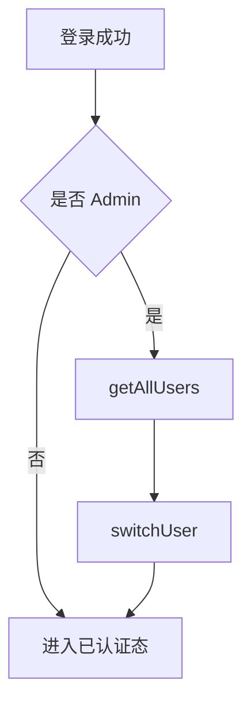
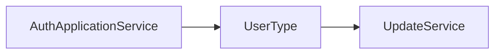

# Auth 模块

`Auth` 模块负责桌面端用户认证、silent login、管理员代切用户，以及把用户上下文同步给更新等后续模块。

## 1. 模块职责

- 获取机器名
- 执行 silent login
- 用户名密码登录
- 管理员查看用户列表并切换用户
- 登出并清理会话
- 同步当前用户类型到更新模块

## 2. 模块结构

## 3. 关键入口文件

- `src/renderer/src/hooks/useAppBootstrap.ts`
- `src/renderer/src/components/app/UnauthenticatedApp.tsx`
- `src/main/ipc/auth-handler.ts`
- `src/main/services/auth/auth-application-service.ts`
- `src/main/services/user/session-manager.ts`

## 4. 认证主流程

## 5. 管理员分支

如果 silent login 或显式登录得到的是管理员账号，认证流程不会直接结束，而是进入“代切用户”分支。

## 6. 与更新模块的关系

Auth 模块和 Update 模块之间有明确联动：

在以下时机会同步用户上下文：

- silent login 成功
- 显式登录成功
- 用户切换成功
- logout

## 7. 最近的结构优化

Auth 相关逻辑最近做过两项关键收敛：

- 把编排逻辑从 `auth-handler` 下沉到 `auth-application-service`
- 在 `silentLogin()` 中加入并发去重，避免重复 silent login 触发连接风暴

## 8. 常见改动点

- 改前端启动认证：`useAppBootstrap.ts`
- 改登录与切换流程：`auth-application-service.ts`
- 改会话层：`session-manager.ts`
- 改 IPC 契约：`auth-handler.ts`

## 9. 修改建议

- 页面不要直接堆认证细节，优先继续收敛到 bootstrap hook
- 用户上下文变化时，记得考虑 update 状态是否需要同步
- silent login 流程不要破坏当前的防重入保护
