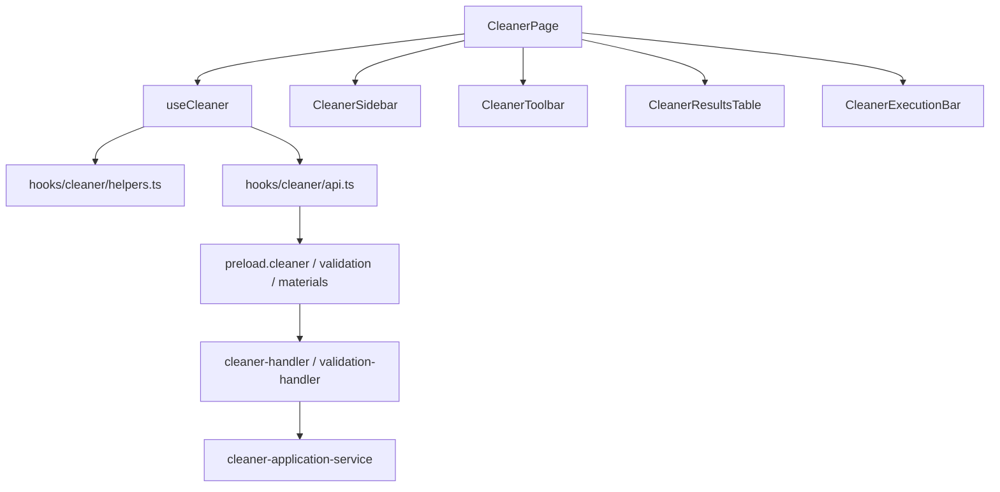
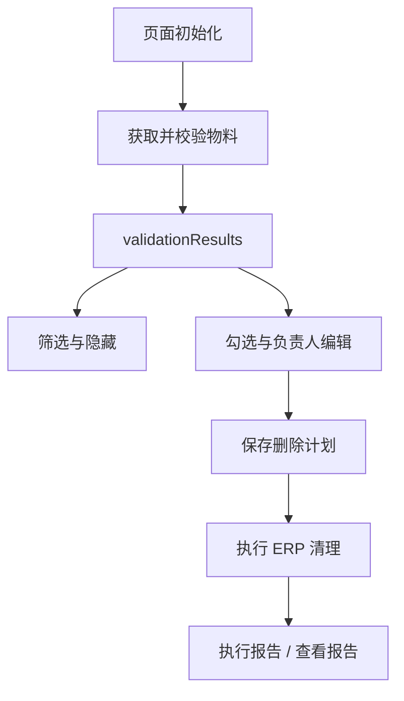
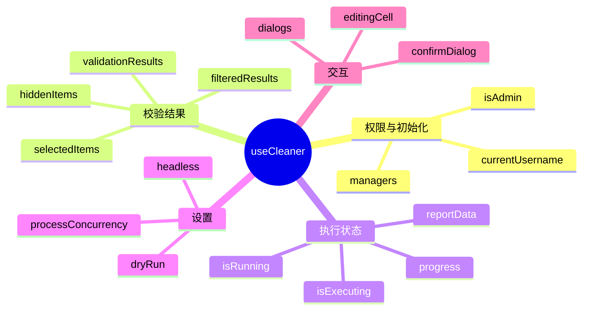
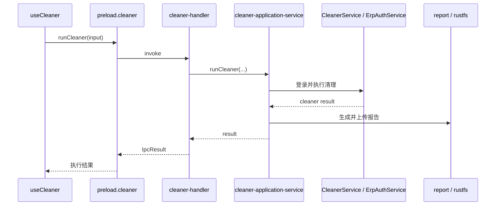
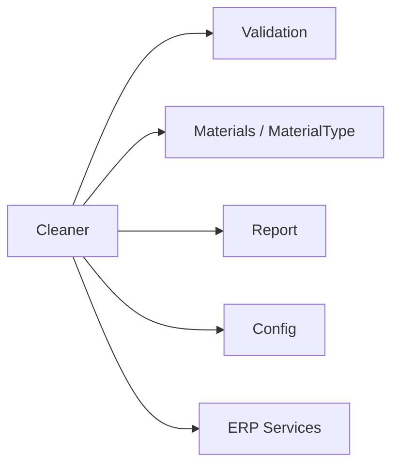

# Cleaner 模块

`Cleaner` 模块负责物料校验结果的展示、筛选、负责人分配、删除计划保存，以及最终 ERP 清理执行与报告展示。

## 1. 模块职责

- 展示校验后的物料列表
- 负责人筛选与内联编辑
- 勾选待处理物料
- 保存删除计划到数据库
- 执行 ERP 清理
- 展示执行进度和执行报告

## 2. 模块结构

## 3. 关键入口文件

- `src/renderer/src/pages/CleanerPage.tsx`
- `src/renderer/src/hooks/useCleaner.ts`
- `src/renderer/src/hooks/cleaner/api.ts`
- `src/renderer/src/hooks/cleaner/helpers.ts`
- `src/renderer/src/components/cleaner/CleanerSidebar.tsx`
- `src/renderer/src/components/cleaner/CleanerToolbar.tsx`
- `src/renderer/src/components/cleaner/CleanerResultsTable.tsx`
- `src/renderer/src/components/cleaner/CleanerExecutionBar.tsx`
- `src/main/ipc/cleaner-handler.ts`
- `src/main/services/cleaner/cleaner-application-service.ts`

## 4. 页面主流程

## 5. 前端状态组织

当前 `useCleaner` 管理的主要状态包括：

- 页面初始化与权限
- 校验结果与筛选结果
- 勾选状态与隐藏状态
- 负责人编辑状态
- 执行设置
- 进度状态
- 报告弹窗状态
- 确认弹窗状态

可以理解成：

## 6. 主进程执行链路

Cleaner 真正执行 ERP 清理时，主进程调用链大致如下：

## 7. 模块边界

Cleaner 依赖多个模块：

其中：

- `validation`
  提供校验结果和 Cleaner 可消费数据
- `materials`
  提供负责人和删除计划相关能力
- `report`
  提供报告查看与生成
- `config`
  提供执行配置

## 8. 最近的结构优化

这一块近期做过两轮收敛：

- `CleanerPage` 拆成 `Sidebar / Toolbar / ResultsTable / ExecutionBar`
- `useCleaner` 内部 API / helpers 已经第一轮抽离

同时页面中的重型弹窗也已经改成按需加载。

## 9. 常见改动点

- 改筛选或展示：`CleanerPage.tsx` 与 `components/cleaner/*`
- 改前端执行逻辑：`useCleaner.ts`
- 改校验请求与导出：`hooks/cleaner/api.ts`
- 改纯逻辑：`hooks/cleaner/helpers.ts`
- 改主进程执行：`cleaner-application-service.ts`
- 改 ERP 清理细节：`src/main/services/erp/cleaner.ts`

## 10. 修改建议

- 优先保持页面组件继续做“组装层”
- 如果新增复杂交互，优先下沉到 hook 或 helper
- 执行链路的真实业务逻辑放在主进程 service
- 报告、导出、上传等后处理不要塞回 UI 层
