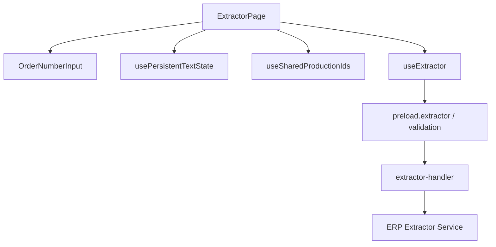
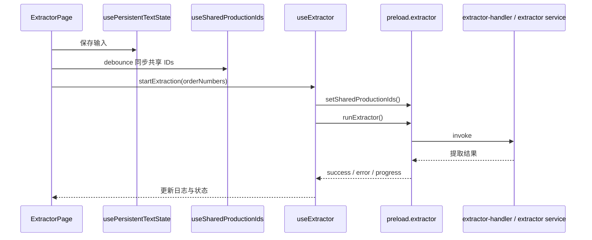

# Extractor 模块

`Extractor` 模块负责接收订单号输入、触发提取流程、同步共享订单号，并把提取结果导入后续链路可消费的数据形态。

## 1. 模块职责

- 接收和持久化订单号输入
- 将订单号同步为共享 `Production IDs`
- 触发批量提取流程
- 展示提取进度和日志
- 为 `Cleaner` 等后续模块提供共享订单号基础

## 2. 模块结构

## 3. 关键入口文件

- `src/renderer/src/pages/ExtractorPage.tsx`
- `src/renderer/src/hooks/useExtractor.ts`
- `src/renderer/src/hooks/usePersistentTextState.ts`
- `src/renderer/src/hooks/useSharedProductionIds.ts`
- `src/renderer/src/components/OrderNumberInput.tsx`
- `src/main/ipc/extractor-handler.ts`
- `src/main/services/erp/extractor.ts`

## 4. 主要流程

## 5. 关键状态

当前前端侧最重要的状态包括：

- `orderNumbers`
  用户输入的订单号文本
- `isRunning`
  是否正在提取
- `progress`
  当前提取进度
- `logs`
  提取过程日志
- `error`
  当前错误
- `isComplete`
  提取是否结束

## 6. 与其他模块的关系

Extractor 与其他模块的关系如下：

它最重要的跨模块输出不是页面本身，而是：

- 共享 `Production IDs`
- 导入数据库的数据

## 7. 最近的结构优化

最近这一块做过两类收敛：

- 把订单号持久化抽到 `usePersistentTextState`
- 把共享订单号同步抽到 `useSharedProductionIds`

这样页面不再自己同时处理：

- 输入状态
- `sessionStorage`
- bridge 副作用

## 8. 常见改动点

如果你要改 Extractor，通常会落在这些位置：

- 改输入与格式统计：`OrderNumberInput.tsx`
- 改页面交互：`ExtractorPage.tsx`
- 改前端提取编排：`useExtractor.ts`
- 改共享订单号同步：`useSharedProductionIds.ts`
- 改主进程执行：`extractor-handler.ts` / `erp/extractor.ts`

## 9. 修改建议

- 输入变化不要直接叠加更多高频副作用
- 共享订单号写入尽量维持单一入口
- 提取日志和进度流优先保持事件推送式结构
- 如果新增提取后处理，优先放在主进程 service，而不是塞回页面
