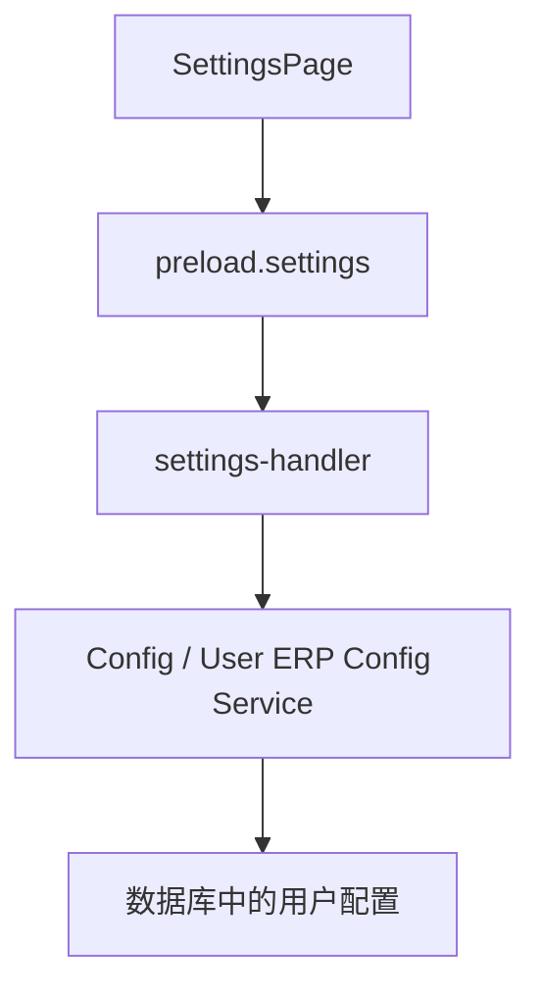
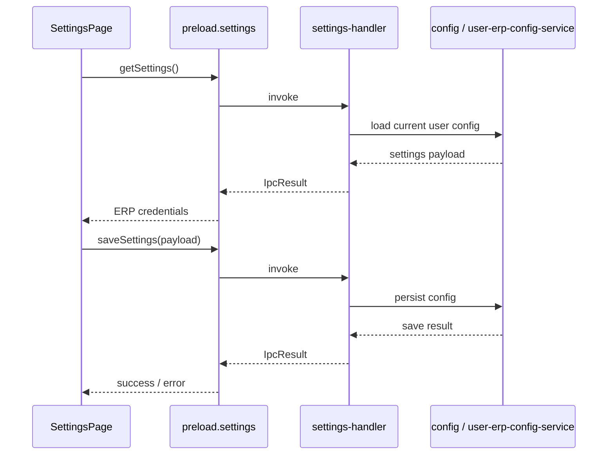

# Settings 模块

`Settings` 模块当前主要负责 ERP 登录凭据的查看、编辑和保存，并通过当前用户上下文对配置进行按用户管理。

## 1. 模块职责

- 加载当前用户的 ERP 配置
- 编辑 ERP 用户名和密码
- 保存配置到后端持久化存储
- 提示保存结果

## 2. 模块结构

## 3. 关键入口文件

- `src/renderer/src/pages/SettingsPage.tsx`
- `src/main/ipc/settings-handler.ts`
- `src/main/services/config/config-manager.ts`
- `src/main/services/user/user-erp-config-service.ts`

## 4. 主流程

## 5. 页面状态

当前设置页非常轻量，主要状态包括：

- `credentials`
- `isModified`
- `isLoading`

## 6. 与其他模块的关系

Settings 模块与这些模块关系较强：

- `auth`
  当前用户决定读取和保存哪份 ERP 配置
- `cleaner`
  Cleaner 执行时会读取 ERP 账号密码
- `extractor`
  提取链路也依赖 ERP 登录能力

## 7. 常见改动点

- 改页面交互：`SettingsPage.tsx`
- 改 IPC 契约：`settings-handler.ts`
- 改配置存储逻辑：`user-erp-config-service.ts`
- 改全局配置：`config-manager.ts`

## 8. 修改建议

- 保持“页面只编辑当前用户配置”的边界清晰
- 不要把 ERP 凭据保存逻辑重新分散到多个模块
- 如果后续扩展更多设置项，建议引入更清晰的分组和局部表单结构
