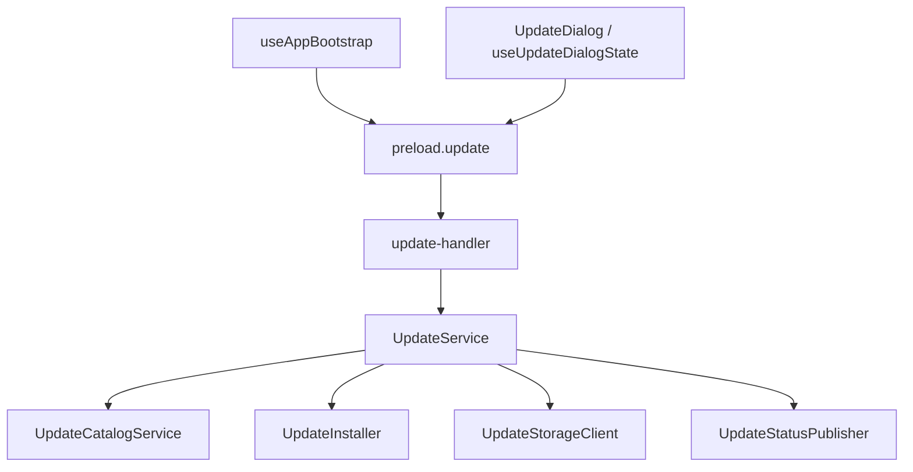
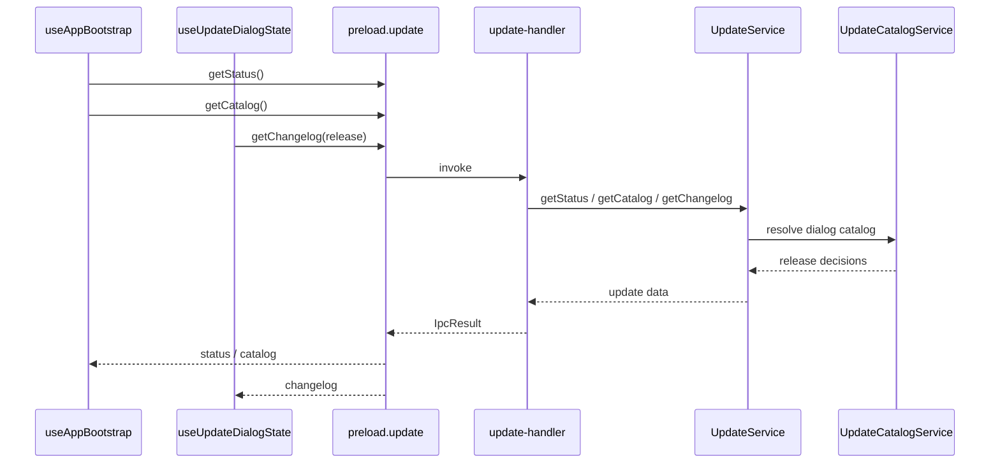
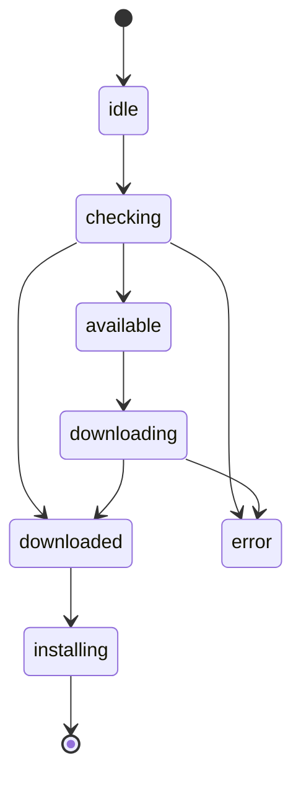
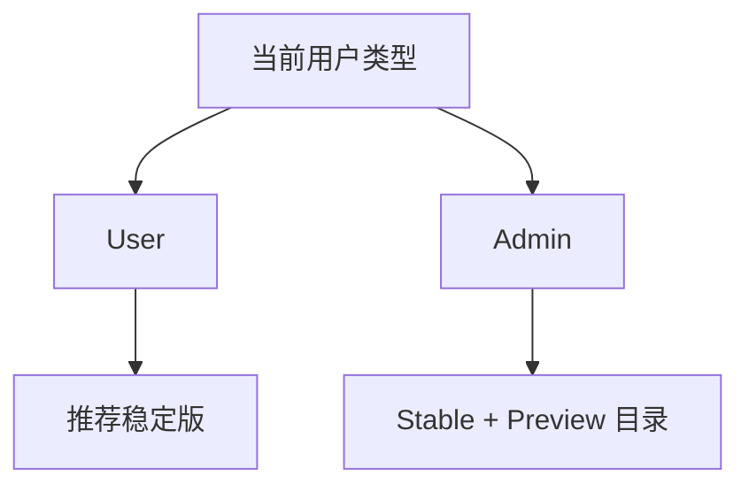

# Update 模块

`Update` 模块负责应用版本目录拉取、状态广播、更新包下载、安装器启动，以及为不同用户类型生成不同的更新视图。

## 1. 模块职责

- 检查更新是否可用
- 拉取更新目录
- 为 `User` / `Admin` 生成不同的更新决策
- 下载更新包并校验
- 启动安装流程
- 广播更新状态给 renderer

## 2. 模块结构

## 3. 关键入口文件

- `src/renderer/src/hooks/useAppBootstrap.ts`
- `src/renderer/src/components/UpdateDialog.tsx`
- `src/renderer/src/hooks/useUpdateDialogState.ts`
- `src/main/ipc/update-handler.ts`
- `src/main/services/update/update-service.ts`
- `src/main/services/update/update-catalog-service.ts`
- `src/main/services/update/update-installer.ts`
- `src/main/services/update/update-storage-client.ts`
- `src/main/services/update/update-status-publisher.ts`

## 4. 更新数据流

## 5. 状态模型

更新模块当前最核心的是 `UpdateStatus`：

同时 `UpdateDialogCatalog` 会根据用户角色形成不同视图：

- `user`
- `admin`
- `disabled`

## 6. 用户与管理员差异

普通用户主要消费：

- 推荐版本
- 已下载版本
- 安装动作

管理员主要消费：

- 完整版本目录
- Stable / Preview 版本切换
- 手动下载并安装

## 7. 最近的结构优化

Update 模块已经做过多轮职责拆分：

- 版本目录决策拆到 `update-catalog-service`
- 下载与安装拆到 `update-installer`
- 状态广播拆到 `update-status-publisher`
- 对象存储访问拆到 `update-storage-client`

同时前端侧：

- `useUpdateDialogState` 收敛了选中版本和 changelog 状态
- `UpdateDialog` 已改成按需加载

## 8. 常见改动点

- 改 renderer 状态流：`useAppBootstrap.ts` / `useUpdateDialogState.ts`
- 改弹窗展示：`UpdateDialog.tsx`
- 改更新检查与轮询：`update-service.ts`
- 改版本决策：`update-catalog-service.ts`
- 改安装流程：`update-installer.ts`

## 9. 修改建议

- 更新决策逻辑优先放在 main service，不要回流到 renderer
- changelog、catalog、status 要保持边界清晰
- 用户类型变化时要考虑 status/catalog 的复位逻辑
- 如果新增发布通道，优先扩展 catalog service
