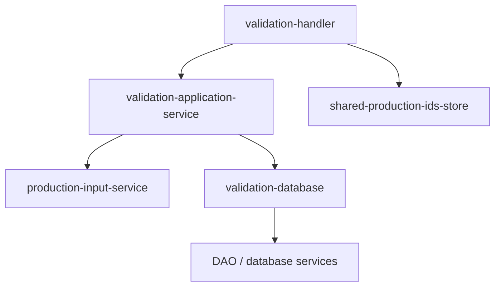
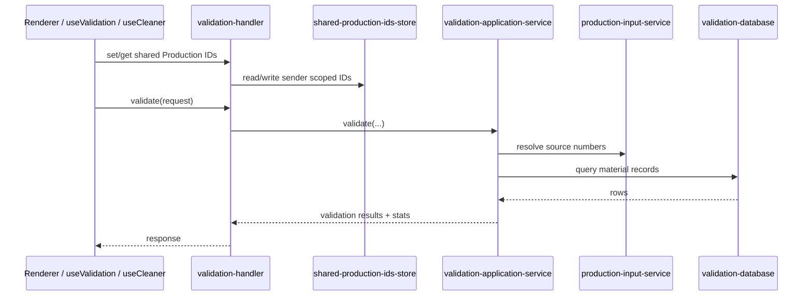
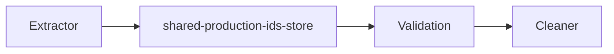
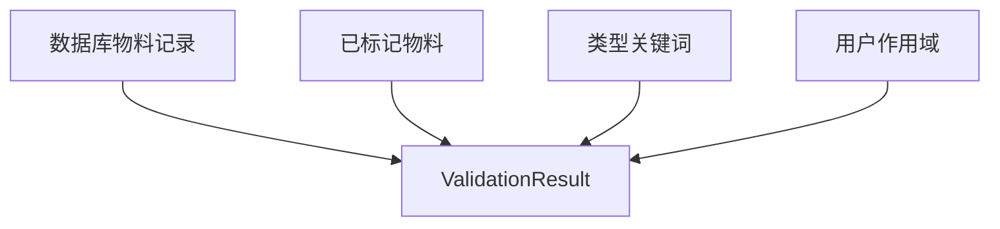

# Validation 模块

`Validation` 模块负责共享订单号管理、输入识别、数据库校验查询、物料结果富化，以及为 Cleaner 提供可消费的数据。

## 1. 模块职责

- 存储与读取共享 `Production IDs`
- 将输入转换为可校验的 source numbers
- 查询数据库中的物料记录
- 结合类型关键词和已标记物料生成校验结果
- 为 Cleaner 提供订单号与物料代码

## 2. 模块结构

## 3. 关键入口文件

- `src/main/ipc/validation-handler.ts`
- `src/main/services/validation/validation-application-service.ts`
- `src/main/services/validation/shared-production-ids-store.ts`
- `src/main/services/validation/production-input-service.ts`
- `src/main/services/validation/validation-database.ts`
- `src/renderer/src/hooks/useValidation.ts`

## 4. 主流程

## 5. 共享 Production IDs

共享订单号是 Validation 模块最重要的跨页面状态之一。

这个状态当前按 `senderId` 维度存储，主要被：

- `Extractor`
  写入
- `Validation`
  读取和解析
- `Cleaner`
  间接消费

## 6. 结果生成逻辑

校验结果不仅是数据库原始数据，还会叠加：

- 已标记删除状态
- 负责人关键词匹配
- 用户权限作用域

## 7. 模块输出

Validation 主要对外输出两类数据：

- `ValidationResponse`
  提供给校验页和 Cleaner 页
- `CleanerData`
  提供给 Cleaner 执行前的数据准备

## 8. 最近的结构优化

这一块已经从早期的大 `validation-handler` 中拆分出来：

- `shared-production-ids-store`
- `validation-database`
- `production-input-service`
- `validation-application-service`

这样之后：

- handler 只做 IPC 壳
- 共享状态有独立归属
- 数据库方言差异有独立封装

## 9. 常见改动点

- 改共享订单号逻辑：`shared-production-ids-store.ts`
- 改输入识别：`production-input-service.ts`
- 改数据库差异：`validation-database.ts`
- 改校验结果富化：`validation-application-service.ts`
- 改 renderer 侧调用：`useValidation.ts`

## 10. 修改建议

- 不要再把共享状态放回 handler
- 数据库分支优先收敛在 `validation-database`
- 校验结果组装逻辑尽量集中在 application service
- 跨模块共享数据要保持单向来源清晰
