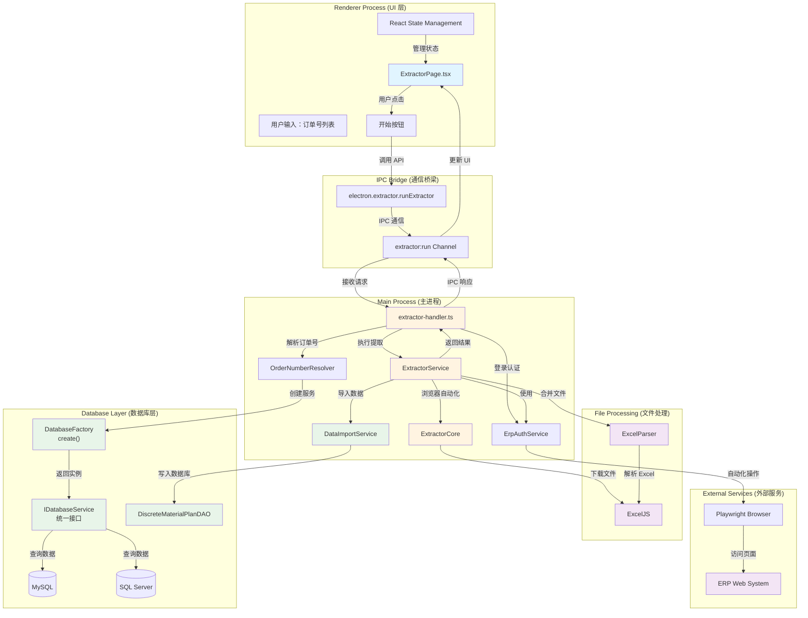
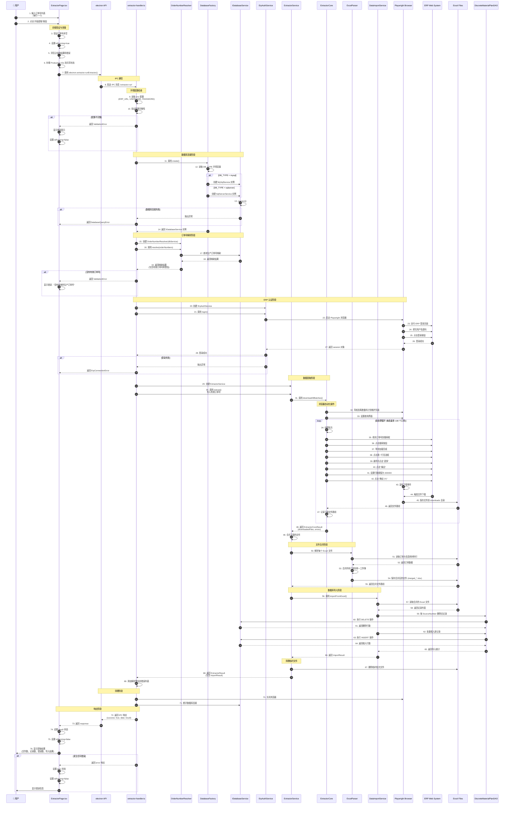
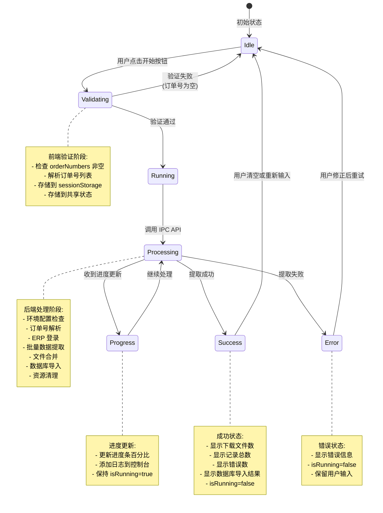
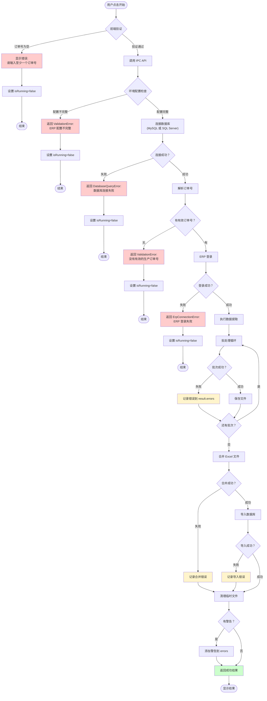

# 数据提取界面 - 开始按钮工作流程详解

> **文档版本**: 1.3
> **更新日期**: 2026-03-04
> **适用范围**: ERPAuto v1.0+
> **相关文件**:
>
> - `src/renderer/src/pages/ExtractorPage.tsx` (UI 层)
> - `src/preload/index.ts` (IPC API 暴露)
> - `src/main/ipc/extractor-handler.ts` (IPC 处理层)
> - `src/main/services/erp/extractor.ts` (业务逻辑层 - 协调文件合并和数据库导入)
> - `src/main/services/erp/extractor-core.ts` (浏览器自动化核心)
> - `src/main/services/erp/order-resolver.ts` (订单号解析服务)
> - `src/main/services/erp/erp-auth.ts` (ERP 认证服务)
> - `src/main/services/database/data-importer.ts` (数据库导入服务)
> - `src/main/services/database/discrete-material-plan-dao.ts` (数据访问层)
> - `src/main/services/excel/excel-parser.ts` (Excel 解析器)
> - `src/main/services/database/index.ts` (数据库工厂)
> - `src/main/types/database.types.ts` (数据库类型定义)
> - `src/main/types/extractor.types.ts` (类型定义)
> - `src/main/types/errors.ts` (错误类型定义)

## 目录

1. [系统架构概览](#系统架构概览)
2. [完整执行流程](#完整执行流程)
3. [状态管理流程](#状态管理流程)
4. [错误处理机制](#错误处理机制)
5. [数据流转过程](#数据流转过程)
6. [关键代码引用](#关键代码引用)
7. [已知限制与待实现功能](#已知限制与待实现功能)

---

## 系统架构概览



### 架构说明

- **Renderer Process**: 负责 UI 展示和用户交互，使用 React 管理状态
- **IPC Bridge**: 安全的进程间通信桥梁，通过 preload 脚本暴露
- **Main Process**: 处理业务逻辑、数据库操作、浏览器自动化
  - `ExtractorService`: 协调提取流程（调用 ExtractorCore、文件合并、数据库导入）
  - `ExtractorCore`: 纯浏览器自动化操作（导航、搜索、下载）
  - `DataImportService`: 将合并后的 Excel 数据导入数据库
- **Database Layer**: 数据库抽象层，通过工厂模式创建服务实例
  - 支持 MySQL 和 SQL Server 双数据库
  - 通过 `IDatabaseService` 统一接口操作
  - 由 `DB_TYPE` 环境变量决定使用哪种数据库
  - `DiscreteMaterialPlanDAO`: 备料计划数据访问对象
- **File Processing**: Excel 文件处理
  - `ExcelParser`: 解析和合并 Excel 文件
  - `ExcelJS`: Excel 文件读写库
- **External Services**: ERP Web 系统

---

## 完整执行流程



---

## 状态管理流程



### 状态变量说明

| 状态变量       | 类型                      | 说明                                  | 持久化            |
| -------------- | ------------------------- | ------------------------------------- | ----------------- |
| `orderNumbers` | string                    | 用户输入的订单号列表                  | ✅ sessionStorage |
| `isRunning`    | boolean                   | 是否正在执行提取                      | ❌ 内存状态       |
| `progress`     | ExtractorProgress \| null | 当前进度信息 (当前实现中未从后端接收) | ❌ 内存状态       |
| `error`        | string \| null            | 错误信息                              | ❌ 内存状态       |
| `logs`         | LogEntry[]                | 执行日志列表 (带时间戳和级别)         | ❌ 内存状态       |

> **注意**: `progress` 状态目前未从后端接收实时更新。虽然 `ExtractorCore` 内部调用 `onProgress` 回调，但函数无法通过 IPC 序列化传递。后续可通过 IPC 事件通道实现实时进度更新。

---

## 错误处理机制



### 错误类型与处理策略

| 错误类型             | 触发条件                             | 用户反馈                 | 恢复策略       |
| -------------------- | ------------------------------------ | ------------------------ | -------------- |
| `ValidationError`    | 订单号为空、配置不完整、无有效订单号 | 显示红色错误消息         | 修正输入后重试 |
| `DatabaseQueryError` | 数据库连接失败 (MySQL/SQL Server)    | 显示数据库连接错误       | 检查数据库配置 |
| `ErpConnectionError` | ERP 登录失败                         | 显示 ERP 登录错误        | 检查 ERP 凭据  |
| `BatchError`         | 单个批次处理失败                     | 记录到错误列表，继续处理 | 查看错误详情   |
| `MergeError`         | Excel 文件合并失败                   | 记录到错误列表           | 查看日志       |
| `ImportError`        | 数据库导入失败                       | 记录到错误列表           | 查看导入错误   |
| `SystemError`        | 未知系统错误                         | 显示通用错误消息         | 查看日志       |

---

## 数据流转过程

```mermaid
flowchart LR
    subgraph "Input (用户输入)"
        A1["原始输入<br/>订单号列表"]
        A2["批次大小<br/>batchSize=100"]
    end

    subgraph "Transformation (数据转换)"
        B1["行解析<br/>按换行符分割"]
        B2["去空白<br/>trim 每行"]
        B3["过滤空行<br/>移除空字符串"]
        B4["存储共享状态<br/>Production IDs"]
    end

    subgraph "Resolution (订单号解析)"
        C0["DatabaseFactory<br/>create()"]
        C1["查询数据库<br/>查找映射关系"]
        C2["提取生产订单号<br/>获取有效值"]
        C3["收集警告<br/>记录未映射项"]
    end

    subgraph "Processing (批量处理)"
        D1["批次分组<br/>按 batchSize 切分"]
        D2["批次迭代<br/>逐批处理"]
        D3["订单拼接<br/>逗号连接"]
    end

    subgraph "Merging (文件合并)"
        E1["解析 Excel<br/>读取订单头 + 材料行"]
        E2["合并订单<br/>合并所有文件"]
        E3["保存合并文件<br/>merged_*.xlsx"]
    end

    subgraph "Import (数据库导入)"
        F1["读取 Excel<br/>解析记录"]
        F2["删除旧记录<br/>按 SourceNumber"]
        F3["批量插入<br/>新记录"]
        F4["返回统计<br/>recordsRead/Deleted/Imported"]
    end

    subgraph "Output (结果输出)"
        G1["下载文件列表<br/>downloadedFiles 数组"]
        G2["合并文件<br/>mergedFile 路径"]
        G3["记录总数<br/>recordCount"]
        G4["错误列表<br/>errors 数组"]
        G5["导入结果<br/>importResult 对象"]
    end

    A1 --> B1
    B1 --> B2
    B2 --> B3
    B3 --> B4
    B4 --> C0
    A2 --> D1
    C0 --> C1
    C1 --> C2
    C2 --> D1
    C3 --> G4
    D1 --> D2
    D2 --> D3
    D3 --> G1
    G1 --> E1
    E1 --> E2
    E2 --> E3
    E3 --> F1
    F1 --> F2
    F2 --> F3
    F3 --> F4
    F4 --> G5
    E3 --> G2
    F1 --> G3

    style A1 fill:#e3f2fd
    style A2 fill:#e3f2fd
    style C0 fill:#e8f5e9
    style E1 fill:#f3e5f5
    style E2 fill:#f3e5f5
    style E3 fill:#f3e5f5
    style F1 fill:#e8f5e9
    style G1 fill:#e8f5e9
    style G2 fill:#e8f5e9
    style G3 fill:#e8f5e9
    style G4 fill:#fff3e0
    style G5 fill:#e8f5e9
```



### 数据转换详情

**阶段 1: 用户输入 → Production IDs**

```
输入："PO-20231024-001\nPO-20231024-002\nPO-20231024-003"
  ↓ 分割 + trim + 过滤
结果：["PO-20231024-001", "PO-20231024-002", "PO-20231024-003"]
  ↓ 存储到共享状态
共享状态：Production IDs (供清理模块使用)
```

**阶段 2: Production IDs → 生产订单号**

```
输入：["PO-20231024-001", "PO-20231024-002", "INVALID"]
  ↓ MySQL 查询 (production_order 表)
映射结果：{
  "PO-20231024-001": "MO-20231024-001",
  "PO-20231024-002": "MO-20231024-002",
  "INVALID": null
}
  ↓ 提取有效值
有效订单号：["MO-20231024-001", "MO-20231024-002"]
警告：["INVALID: 未找到对应的生产订单号"]
```

**阶段 3: 生产订单号 → 批次**

```
输入：["MO-001", "MO-002", ..., "MO-250"] (250 个)
批次大小：100
  ↓ 分组
批次 1: ["MO-001", ..., "MO-100"]
批次 2: ["MO-101", ..., "MO-200"]
批次 3: ["MO-201", ..., "MO-250"]
```

**阶段 4: 批次 → ERP 查询字符串**

```
批次：["MO-001", "MO-002", "MO-003"]
  ↓ 逗号连接
查询字符串："MO-001,MO-002,MO-003"
  ↓ 填充到 ERP 搜索框
ERP 操作：填入搜索框并点击搜索
```

**阶段 5: 下载文件 → 合并文件**

```
输入：["temp_batch_1.xlsx", "temp_batch_2.xlsx", "temp_batch_3.xlsx"]
  ↓ ExcelParser.parse() 读取每个文件
订单数据：[
  { orderInfo: {...}, materials: [...] },
  ...
]
  ↓ 合并所有订单到单一工作簿
输出："merged_20260304120000.xlsx"
记录数：所有订单的材料行总数
```

**阶段 6: 合并文件 → 数据库记录**

```
输入："merged_20260304120000.xlsx"
  ↓ 读取 Excel，解析每行数据
记录列表：[MaterialPlanRecord, ...]
SourceNumbers: Set<"MO-001", "MO-002", ...>
  ↓ DELETE FROM table WHERE SourceNumber IN (...)
删除旧记录：N 条
  ↓ INSERT INTO table VALUES (...)
插入新记录：M 条
  ↓ 返回统计
ImportResult: {
  success: true,
  recordsRead: 1500,
  recordsDeleted: 500,
  recordsImported: 1500,
  uniqueSourceNumbers: 150,
  errors: []
}
```

---

## 关键代码引用

### 1. 前端开始按钮处理 (ExtractorPage.tsx:63-109)

```typescript
const handleExtract = async () => {
  if (!orderNumbers.trim()) {
    setError('请输入至少一个订单号')
    return
  }

  setIsRunning(true)
  setProgress(null)
  setError(null)
  setLogs([])

  addLog('system', '提取引擎启动，准备执行...')

  try {
    const orderNumberList = orderNumbers
      .split('\n')
      .map((line) => line.trim())
      .filter((line) => line.length > 0)

    await window.electron.validation.setSharedProductionIds(orderNumberList)
    addLog('info', `已存储 ${orderNumberList.length} 个订单号用于跨模块共享`)

    const response = await window.electron.extractor.runExtractor({
      orderNumbers: orderNumberList
    })

    if (response.success && response.data) {
      addLog(
        'success',
        `提取完成：下载 ${response.data.downloadedFiles.length} 个文件，共 ${response.data.recordCount} 条记录`
      )
      if (response.data.errors.length > 0) {
        addLog('warning', `存在 ${response.data.errors.length} 个错误`)
      }
    } else {
      setError(response.error || '提取失败')
      addLog('error', response.error || '提取失败')
    }
  } catch (err) {
    const errMsg = err instanceof Error ? err.message : '发生未知错误'
    setError(errMsg)
    addLog('error', errMsg)
  } finally {
    setIsRunning(false)
    setProgress(null)
  }
}
```

### 1.1 订单号实时同步到共享状态 (ExtractorPage.tsx:41-50)

```typescript
// 当用户输入订单号时，实时同步到共享状态
useEffect(() => {
  sessionStorage.setItem('extractor_orderNumbers', orderNumbers)
  // 实时更新共享的 Production IDs
  if (orderNumbers.trim()) {
    const orderNumberList = orderNumbers
      .split('\n')
      .map((line) => line.trim())
      .filter((line) => line.length > 0)
    window.electron.validation.setSharedProductionIds(orderNumberList)
  }
}, [orderNumbers])
```

> **设计说明**: 订单号通过两种方式存储到共享状态：
>
> 1. `useEffect` 在用户输入时实时更新
> 2. `handleExtract` 在提取开始前再次确认存储
>
> 这确保了即使用户在 Cleaner 页面刷新，数据也已同步。

### 2. IPC 处理器核心逻辑 (extractor-handler.ts:17-145)

```typescript
ipcMain.handle(
  'extractor:run',
  async (_event, input: ExtractorInput): Promise<IpcResult<ExtractorResult>> => {
    return withErrorHandling(async () => {
      let authService: ErpAuthService | null = null
      let dbService: IDatabaseService | null = null

      try {
        // 1. 环境配置检查
        const erpUrl = process.env.ERP_URL || ''
        const erpUsername = process.env.ERP_USERNAME || ''
        const erpPassword = process.env.ERP_PASSWORD || ''

        log.info('Config check', {
          url: erpUrl ? 'configured' : 'EMPTY',
          username: erpUsername ? 'configured' : 'EMPTY'
        })

        if (!erpUrl || !erpUsername || !erpPassword) {
          throw new ValidationError(
            'ERP 配置不完整。请检查 .env 文件中的 ERP_URL, ERP_USERNAME, ERP_PASSWORD',
            'VAL_MISSING_REQUIRED'
          )
        }

        // 2. 使用数据库工厂创建服务实例 (支持 MySQL 和 SQL Server)
        try {
          dbService = await create() // 工厂方法，根据 DB_TYPE 自动选择数据库
        } catch (error) {
          throw new DatabaseQueryError(
            '数据库连接失败',
            'DB_CONNECTION_FAILED',
            error instanceof Error ? error : undefined
          )
        }

        // 3. 解析订单号
        const resolver = new OrderNumberResolver(dbService)
        const mappings = await resolver.resolve(input.orderNumbers)

        // Get valid order numbers and warnings
        const validOrderNumbers = resolver.getValidOrderNumbers(mappings)
        const warnings = resolver.getWarnings(mappings)

        if (warnings.length > 0) {
          log.warn('Resolution warnings', { warnings })
        }

        if (validOrderNumbers.length === 0) {
          throw new ValidationError(
            '没有有效的生产订单号可处理。请检查输入的格式或数据库连接。',
            'VAL_INVALID_INPUT'
          )
        }

        log.info('Resolved order numbers', { count: validOrderNumbers.length })

        // 4. ERP 登录
        authService = new ErpAuthService({
          url: erpUrl,
          username: erpUsername,
          password: erpPassword,
          headless: true
        })

        log.info('Logging in to ERP...')
        try {
          await authService.login()
        } catch (error) {
          throw new ErpConnectionError(
            'ERP 登录失败',
            'ERP_LOGIN_FAILED',
            error instanceof Error ? error : undefined
          )
        }
        log.info('Login successful')

        // 5. 执行提取（包含文件合并和数据库导入）
        const extractor = new ExtractorService(authService)
        log.info('Starting extraction', { orderCount: validOrderNumbers.length })

        const modifiedInput: ExtractorInput = {
          ...input,
          orderNumbers: validOrderNumbers
        }

        const result = await extractor.extract(modifiedInput)

        // 添加警告到结果
        if (warnings.length > 0) {
          result.errors = [...warnings, ...result.errors]
        }

        log.info('Extraction completed', {
          rowCount: result.recordCount,
          errorCount: result.errors.length
        })

        return result
      } finally {
        // 7. 资源清理
        if (authService) {
          try {
            await authService.close()
            log.debug('Browser closed')
          } catch (closeError) {
            log.warn('Error closing browser', {
              error: closeError instanceof Error ? closeError.message : String(closeError)
            })
          }
        }

        // 断开数据库连接
        if (dbService) {
          try {
            await dbService.disconnect()
            log.debug('Database disconnected')
          } catch (closeError) {
            log.warn('Error disconnecting database', {
              error: closeError instanceof Error ? closeError.message : String(closeError)
            })
          }
        }
      }
    }, 'extractor:run')
  }
)
```

### 3. 提取服务协调逻辑 (extractor.ts:36-90)

```typescript
async extract(input: ExtractorInput): Promise<ExtractorResult> {
  const result: ExtractorResult = {
    downloadedFiles: [],
    mergedFile: null,
    recordCount: 0,
    errors: []
  }

  try {
    const session = this.authService.getSession()

    // 调用 ExtractorCore 执行浏览器自动化操作
    const core = new ExtractorCore()
    const coreResult = await core.downloadAllBatches({
      session,
      orderNumbers: input.orderNumbers,
      downloadDir: this.downloadDir,
      batchSize: input.batchSize || 100,
      onProgress: input.onProgress
    })

    result.downloadedFiles = coreResult.downloadedFiles
    result.errors = coreResult.errors

    // 合并下载的文件
    if (result.downloadedFiles.length > 0) {
      input.onProgress?.('正在合并文件...', 95)
      const mergeResult = await this.mergeFiles(result.downloadedFiles)
      result.mergedFile = mergeResult.mergedFile
      result.recordCount = mergeResult.recordCount

      // 添加合并错误到结果
      if (mergeResult.error) {
        result.errors.push(mergeResult.error)
      }

      // 清理临时文件
      await this.cleanupTempFiles(result.downloadedFiles)

      // 自动导入数据库
      if (result.mergedFile) {
        input.onProgress?.('正在写入数据库...', 98)
        const importResult = await this.importToDatabase(result.mergedFile)
        result.importResult = importResult

        if (!importResult.success && importResult.errors.length > 0) {
          result.errors.push(...importResult.errors)
        }
      }
    }
  } catch (error) {
    const message = error instanceof Error ? error.message : 'Unknown error'
    result.errors.push(`Extraction failed: ${message}`)
  }

  return result
}
```

### 4. 文件合并逻辑 (extractor.ts:101-168)

```typescript
private async mergeFiles(
  filePaths: string[]
): Promise<{ mergedFile: string | null; recordCount: number; error?: string }> {
  if (filePaths.length === 0) {
    return { mergedFile: null, recordCount: 0 }
  }

  console.log(`[Extractor] Starting merge of ${filePaths.length} files`)
  const parser = new ExcelParser({ verbose: true })

  // 收集所有订单（包含完整订单头信息和材料行）
  const allOrders: Array<{ orderInfo: any; materials: any[] }> = []

  // 解析每个下载的文件
  for (const filePath of filePaths) {
    try {
      console.log(`[Extractor] Parsing file: ${filePath}`)
      await parser.parse(filePath)
      const orders = (parser as any).lastOrders
      console.log(`[Extractor] Parsed ${orders?.length || 0} orders from ${filePath}`)
      if (orders && Array.isArray(orders)) {
        allOrders.push(...orders)
      }
    } catch (error) {
      const errorMsg = error instanceof Error ? error.message : String(error)
      console.error(`[Extractor] Failed to parse file ${filePath}:`, errorMsg)
    }
  }

  // 计算总记录数
  let recordCount = 0
  for (const order of allOrders) {
    recordCount += order.materials.length
  }

  console.log(`[Extractor] Total orders: ${allOrders.length}, total records: ${recordCount}`)

  if (recordCount === 0) {
    console.warn('[Extractor] No records found in any of the downloaded files')
    return { mergedFile: null, recordCount: 0 }
  }

  // 生成输出文件名（带时间戳）
  const timestamp = new Date()
    .toISOString()
    .replace(/[-:T]/g, '')
    .replace(/\..+/, '')
    .slice(0, 14)
  const outputPath = path.join(this.downloadDir, `merged_${timestamp}.xlsx`)

  // 保存合并文件
  try {
    console.log(`[Extractor] Saving merged file to: ${outputPath}`)
    await this.saveMergedOrders(allOrders, outputPath)
    console.log(`[Extractor] Successfully saved merged file with ${recordCount} records`)
    return { mergedFile: outputPath, recordCount }
  } catch (error) {
    const errorMsg = error instanceof Error ? error.message : String(error)
    console.error(`[Extractor] Failed to save merged file: ${errorMsg}`)
    return { mergedFile: null, recordCount, error: `保存合并文件失败：${errorMsg}` }
  }
}
```

### 5. 数据库导入逻辑 (extractor.ts:285-320)

```typescript
private async importToDatabase(filePath: string): Promise<ImportResult> {
  console.log(`[Extractor] Starting database import from: ${filePath}`)

  const importService = new DataImportService()

  try {
    const result = await importService.importFromExcel(filePath, 1000)

    console.log(`[Extractor] Import completed`, {
      success: result.success,
      recordsRead: result.recordsRead,
      recordsDeleted: result.recordsDeleted,
      recordsImported: result.recordsImported
    })

    return result
  } catch (error) {
    const errorMsg = error instanceof Error ? error.message : String(error)
    console.error(`[Extractor] Import failed: ${errorMsg}`)

    return {
      success: false,
      recordsRead: 0,
      recordsDeleted: 0,
      recordsImported: 0,
      uniqueSourceNumbers: 0,
      errors: [errorMsg]
    }
  }
}
```

### 6. 数据导入服务 (data-importer.ts:82-152)

```typescript
async importFromExcel(filePath: string, batchSize = 1000): Promise<ImportResult> {
  const result: ImportResult = {
    success: false,
    recordsRead: 0,
    recordsDeleted: 0,
    recordsImported: 0,
    uniqueSourceNumbers: 0,
    errors: []
  }

  try {
    log.info('Starting import from Excel', { filePath, batchSize })

    // Step 1: 读取 Excel 文件
    log.info('Reading Excel file...')
    const { records, sourceNumbers } = await this.readExcelFile(filePath)
    result.recordsRead = records.length
    result.uniqueSourceNumbers = sourceNumbers.size

    if (records.length === 0) {
      result.success = true
      result.errors.push('Excel file contains no data records')
      return result
    }

    // Step 2: 按 SourceNumber 删除旧记录
    log.info('Deleting existing records...', {
      sourceNumberCount: sourceNumbers.size
    })

    const sourceNumberArray = Array.from(sourceNumbers)
    result.recordsDeleted = await this.dao.deleteBySourceNumbers(sourceNumberArray)

    // Step 3: 批量插入新记录
    result.recordsImported = await this.dao.batchInsert(records, batchSize)
    result.success = true
  } catch (error) {
    const errorMsg = error instanceof Error ? error.message : String(error)
    result.errors.push(`Import failed: ${errorMsg}`)
  } finally {
    // 断开 DAO 连接
    try {
      await this.dao.disconnect()
    } catch (e) {
      log.warn('Error disconnecting DAO', {
        error: e instanceof Error ? e.message : String(e)
      })
    }
  }

  return result
}
```

### 7. Preload API 暴露 (preload/index.ts:28-30)

```typescript
// Extractor service
extractor: {
  runExtractor: (input: ExtractorInput) => ipcRenderer.invoke('extractor:run', input)
}
```

### 8. 类型定义 (types/extractor.types.ts)

```typescript
export interface ExtractorInput {
  orderNumbers: string[]
  batchSize?: number
  onProgress?: (message: string, progress: number) => void
}

export interface ImportResult {
  success: boolean
  recordsRead: number
  recordsDeleted: number
  recordsImported: number
  uniqueSourceNumbers: number
  errors: string[]
}

export interface ExtractorResult {
  downloadedFiles: string[]
  mergedFile: string | null
  recordCount: number
  errors: string[]
  /** Database import result (only populated if mergedFile was created) */
  importResult?: ImportResult
}
```

### 9. 错误类型定义 (types/errors.ts)

```typescript
// ERP 连接错误
export class ErpConnectionError extends BaseError {
  constructor(message: string, code: string = ERP_ERROR_CODES.CONNECTION_FAILED, cause?: Error) {
    super('ErpConnectionError', message, code, cause)
  }
}

// 数据库查询错误
export class DatabaseQueryError extends BaseError {
  constructor(message: string, code: string = DATABASE_ERROR_CODES.QUERY_FAILED, cause?: Error) {
    super('DatabaseQueryError', message, code, cause)
  }
}

// 验证错误
export class ValidationError extends BaseError {
  constructor(message: string, code: string = VALIDATION_ERROR_CODES.INVALID_INPUT, cause?: Error) {
    super('ValidationError', message, code, cause)
  }
}
```

---

## 总结

### 流程关键点

1. **三层验证机制**:
   - 前端验证：非空检查
   - 配置验证：环境变量完整性
   - 数据验证：订单号有效性（通过数据库查询）

2. **数据库架构**:
   - 使用工厂模式 (`create()`) 创建数据库服务实例
   - 支持 MySQL 和 SQL Server 双数据库，通过 `DB_TYPE` 环境变量切换
   - 通过 `IDatabaseService` 统一接口实现数据库无关操作
   - 单例缓存机制，避免重复创建连接

3. **资源管理策略**:
   - 使用 try-finally 确保资源清理
   - 浏览器在使用后立即关闭
   - 数据库连接在使用后断开
   - 临时批次文件在合并后自动删除
   - 清理操作在 finally 块中独立 try-catch，避免清理失败影响结果返回

4. **错误容错设计**:
   - 单个批次失败不影响其他批次
   - 警告信息独立收集，不影响主流程
   - 详细错误信息返回给前端展示
   - 使用自定义错误类型 (`ValidationError`, `DatabaseQueryError`, `ErpConnectionError`)

5. **用户体验优化**:
   - sessionStorage 持久化用户输入（`orderNumbers`）
   - 订单号实时同步到共享状态（供 Cleaner 模块使用）
   - 详细的日志记录（带时间戳和级别）
   - 结果面板显示文件数、记录数、错误数

6. **数据处理流程 (v1.3 新增)**:
   - 自动合并所有批次下载的文件为单一 Excel
   - 自动将合并后的数据导入数据库
   - 导入前按 SourceNumber 删除旧记录，确保数据一致性
   - 返回详细的导入统计（读取数、删除数、导入数）

### 已知限制

1. **进度更新未实现**:
   - `ExtractorInput.onProgress` 回调存在但无法通过 IPC 传递
   - 前端 `progress` 状态当前未从后端接收实时更新
   - 后续可通过 IPC 事件通道（`ipcRenderer.on` / `webContents.send`）实现

2. **日志级别前端未完全利用**:
   - 后端支持详细日志分级（info, success, warning, error, system）
   - 前端已定义颜色映射但未在日志中充分展示

### 性能考虑

- **批处理**: 默认每批 100 个订单，平衡性能与稳定性
- **异步并发**: 使用 async/await 处理异步操作
- **下载监听**: 使用 Playwright 事件监听处理文件下载
- **数据库连接池**: 工厂模式缓存实例，复用连接
- **批量导入**: 数据库导入使用批量插入（默认 1000 条/批）
- **临时文件清理**: 合并完成后立即删除临时批次文件

### 扩展性

- **数据库可切换**: 通过 `DB_TYPE` 环境变量切换 MySQL/SQL Server
- **配置化**: batchSize 可配置
- **模块化**: 服务独立（ExtractorService, ExtractorCore, DataImportService），易于测试和维护
- **错误类型化**: 使用自定义错误类型便于精确处理
- **共享状态**: 通过 `validation.setSharedProductionIds` 实现跨页面数据共享

---

## 已知限制与待实现功能

### 进度更新机制

**当前状态**: 未实现

**原因**: IPC 通信无法序列化函数，`onProgress` 回调无法传递到主进程。

**当前实现**:

```typescript
// extractor-core.ts 中调用但无效
input.onProgress?.(`Processing batch ${i + 1}/${batches.length}`, progress)
```

**建议实现方案**:

```typescript
// 方案：使用 IPC 事件通道

// 1. 主进程发送进度
event.sender.send('extractor:progress', { message, progress })

// 2. Preload 暴露事件监听
extractor: {
  onProgress: (callback) => {
    ipcRenderer.on('extractor:progress', (_event, data) => callback(data))
  }
}

// 3. 渲染进程监听
useEffect(() => {
  window.electron.extractor.onProgress((data) => {
    setProgress(data)
    setLogs((prev) => [
      ...prev,
      {
        timestamp: new Date().toLocaleTimeString(),
        level: 'info',
        message: data.message
      }
    ])
  })
}, [])
```

### 合并文件保留策略

**当前状态**: 合并文件保存在 `downloads` 目录，无清理机制

**待实现**:

- 定期清理旧的合并文件
- 或将合并文件移动到用户指定的归档目录

### 数据库导入错误恢复

**当前状态**: 导入失败时记录错误，但不回滚

**待实现**:

- 使用事务包装导入操作
- 失败时自动回滚到导入前状态

---

**文档维护**: 如代码逻辑变更，请及时更新本文档和相关流程图。
