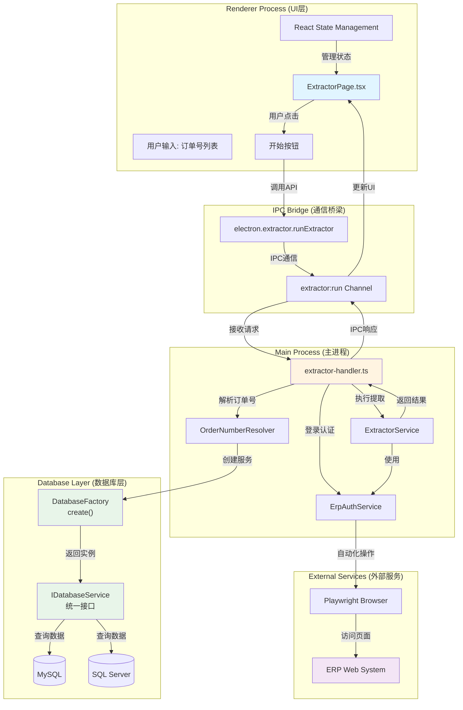
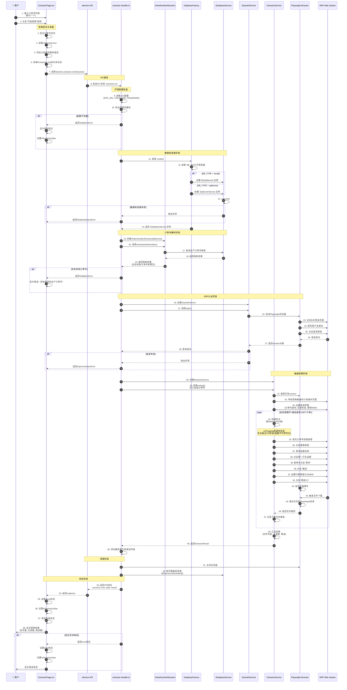
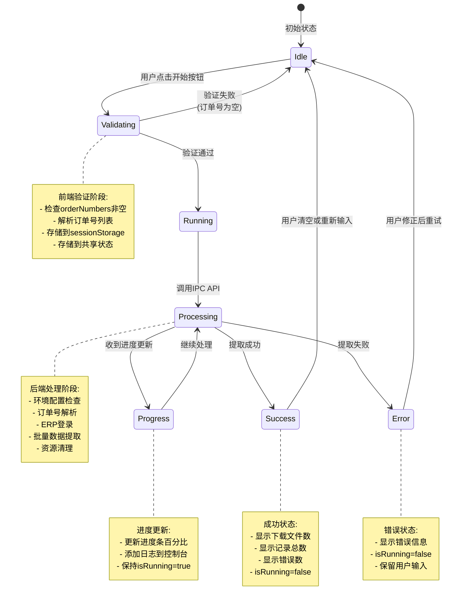
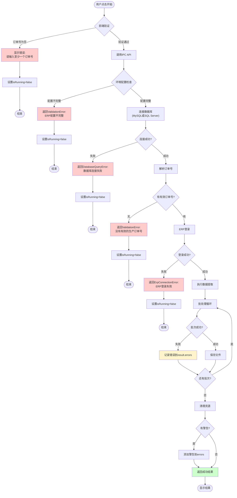
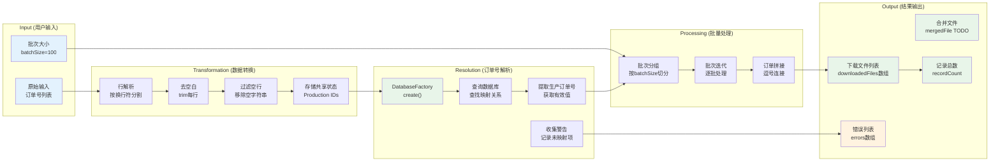

# 数据提取界面 - 开始按钮工作流程详解

> **文档版本**: 1.2
> **更新日期**: 2026-03-03
> **适用范围**: ERPAuto v1.0+
> **相关文件**:
> - `src/renderer/src/pages/ExtractorPage.tsx` (UI层)
> - `src/preload/index.ts` (IPC API 暴露)
> - `src/main/ipc/extractor-handler.ts` (IPC处理层)
> - `src/main/services/erp/extractor.ts` (业务逻辑层)
> - `src/main/services/erp/order-resolver.ts` (订单号解析服务)
> - `src/main/services/erp/erp-auth.ts` (ERP认证服务)
> - `src/main/services/database/index.ts` (数据库工厂)
> - `src/main/types/database.types.ts` (数据库类型定义)
> - `src/main/types/extractor.types.ts` (类型定义)

## 目录

1. [系统架构概览](#系统架构概览)
2. [完整执行流程](#完整执行流程)
3. [状态管理流程](#状态管理流程)
4. [错误处理机制](#错误处理机制)
5. [数据流转过程](#数据流转过程)
6. [关键代码引用](#关键代码引用)
7. [已知限制与待实现功能](#已知限制与待实现功能)

---

## 系统架构概览



### 架构说明

- **Renderer Process**: 负责UI展示和用户交互，使用React管理状态
- **IPC Bridge**: 安全的进程间通信桥梁，通过preload脚本暴露
- **Main Process**: 处理业务逻辑、数据库操作、浏览器自动化
- **Database Layer**: 数据库抽象层，通过工厂模式创建服务实例
  - 支持 MySQL 和 SQL Server 双数据库
  - 通过 `IDatabaseService` 统一接口操作
  - 由 `DB_TYPE` 环境变量决定使用哪种数据库
- **External Services**: ERP Web 系统

---

## 完整执行流程



---

## 状态管理流程



### 状态变量说明

| 状态变量 | 类型 | 说明 | 持久化 |
|---------|------|------|--------|
| `orderNumbers` | string | 用户输入的订单号列表 | ✅ sessionStorage |
| `batchSize` | number | 每批处理的订单数量 (默认100) | ✅ sessionStorage |
| `isRunning` | boolean | 是否正在执行提取 | ❌ 内存状态 |
| `progress` | ExtractorProgress \| null | 当前进度信息 (当前实现中未从后端接收) | ❌ 内存状态 |
| `result` | ExtractorResult \| null | 提取结果 | ❌ 内存状态 |
| `error` | string \| null | 错误信息 | ❌ 内存状态 |
| `logs` | string[] | 执行日志列表 | ❌ 内存状态 |

> **注意**: `progress` 状态目前未从后端接收实时更新。虽然 `ExtractorService` 内部调用 `onProgress` 回调，但函数无法通过 IPC 序列化传递。后续可通过 IPC 事件通道实现实时进度更新。

---

## 错误处理机制



### 错误类型与处理策略

| 错误类型 | 触发条件 | 用户反馈 | 恢复策略 |
|---------|---------|---------|---------|
| `ValidationError` | 订单号为空、配置不完整、无有效订单号 | 显示红色错误消息 | 修正输入后重试 |
| `DatabaseQueryError` | 数据库连接失败 (MySQL/SQL Server) | 显示数据库连接错误 | 检查数据库配置 |
| `ErpConnectionError` | ERP登录失败 | 显示ERP登录错误 | 检查ERP凭据 |
| `BatchError` | 单个批次处理失败 | 记录到错误列表，继续处理 | 查看错误详情 |
| `SystemError` | 未知系统错误 | 显示通用错误消息 | 查看日志 |

---

## 数据流转过程



### 数据转换详情

**阶段1: 用户输入 → Production IDs**
```
输入: "PO-20231024-001\nPO-20231024-002\nPO-20231024-003"
  ↓ 分割 + trim + 过滤
结果: ["PO-20231024-001", "PO-20231024-002", "PO-20231024-003"]
  ↓ 存储到共享状态
共享状态: Production IDs (供清理模块使用)
```

**阶段2: Production IDs → 生产订单号**
```
输入: ["PO-20231024-001", "PO-20231024-002", "INVALID"]
  ↓ MySQL查询 (production_order表)
映射结果: {
  "PO-20231024-001": "MO-20231024-001",
  "PO-20231024-002": "MO-20231024-002",
  "INVALID": null
}
  ↓ 提取有效值
有效订单号: ["MO-20231024-001", "MO-20231024-002"]
警告: ["INVALID: 未找到对应的生产订单号"]
```

**阶段3: 生产订单号 → 批次**
```
输入: ["MO-001", "MO-002", ..., "MO-250"] (250个)
批次大小: 100
  ↓ 分组
批次1: ["MO-001", ..., "MO-100"]
批次2: ["MO-101", ..., "MO-200"]
批次3: ["MO-201", ..., "MO-250"]
```

**阶段4: 批次 → ERP查询字符串**
```
批次: ["MO-001", "MO-002", "MO-003"]
  ↓ 逗号连接
查询字符串: "MO-001,MO-002,MO-003"
  ↓ 填充到ERP搜索框
ERP操作: 填入搜索框并点击搜索
```

---

## 关键代码引用

### 1. 前端开始按钮处理 (ExtractorPage.tsx:52-90)

```typescript
const handleExtract = async () => {
  // 1. 前端验证
  if (!orderNumbers.trim()) {
    setError('请输入至少一个订单号')
    return
  }

  // 2. 设置运行状态
  setIsRunning(true)
  setProgress(null)
  setResult(null)
  setError(null)

  try {
    // 3. 解析订单号列表
    const orderNumberList = orderNumbers
      .split('\n')
      .map((line) => line.trim())
      .filter((line) => line.length > 0)

    // 4. 存储到共享状态 (与Cleaner模块共享)
    await window.electron.validation.setSharedProductionIds(orderNumberList)

    // 5. 调用后端API
    const response = await window.electron.extractor.runExtractor({
      orderNumbers: orderNumberList,
      batchSize
    })

    // 6. 处理响应
    if (response.success && response.data) {
      setResult(response.data)
    } else {
      setError(response.error || '提取失败')
    }
  } catch (err) {
    setError(err instanceof Error ? err.message : '发生未知错误')
  } finally {
    // 7. 重置状态
    setIsRunning(false)
    setProgress(null)
  }
}
```

### 1.1 订单号实时同步到共享状态 (ExtractorPage.tsx:34-45)

```typescript
// 当用户输入订单号时，实时同步到共享状态
useEffect(() => {
  sessionStorage.setItem('extractor_orderNumbers', orderNumbers)
  // 实时更新共享的 Production IDs
  if (orderNumbers.trim()) {
    const orderNumberList = orderNumbers
      .split('\n')
      .map((line) => line.trim())
      .filter((line) => line.length > 0)
    window.electron.validation.setSharedProductionIds(orderNumberList)
  }
}, [orderNumbers])
```

> **设计说明**: 订单号通过两种方式存储到共享状态：
> 1. `useEffect` 在用户输入时实时更新
> 2. `handleExtract` 在提取开始前再次确认存储
>
> 这确保了即使用户在Cleaner页面刷新，数据也已同步。

### 2. IPC处理器核心逻辑 (extractor-handler.ts:17-145)

```typescript
ipcMain.handle(
  'extractor:run',
  async (_event, input: ExtractorInput): Promise<IpcResult<ExtractorResult>> => {
    return withErrorHandling(async () => {
      let authService: ErpAuthService | null = null
      let dbService: IDatabaseService | null = null

      try {
        // 1. 环境配置检查
        const erpUrl = process.env.ERP_URL || ''
        const erpUsername = process.env.ERP_USERNAME || ''
        const erpPassword = process.env.ERP_PASSWORD || ''

        if (!erpUrl || !erpUsername || !erpPassword) {
          throw new ValidationError('ERP 配置不完整')
        }

        // 2. 使用数据库工厂创建服务实例 (支持 MySQL 和 SQL Server)
        try {
          dbService = await create()  // 工厂方法，根据 DB_TYPE 自动选择数据库
        } catch (error) {
          throw new DatabaseQueryError('数据库连接失败', 'DB_CONNECTION_FAILED', error)
        }

        // 3. 解析订单号
        const resolver = new OrderNumberResolver(dbService)
        const mappings = await resolver.resolve(input.orderNumbers)
        const validOrderNumbers = resolver.getValidOrderNumbers(mappings)
        const warnings = resolver.getWarnings(mappings)

        if (validOrderNumbers.length === 0) {
          throw new ValidationError('没有有效的生产订单号可处理')
        }

        // 4. ERP登录
        authService = new ErpAuthService({ url, username, password, headless: true })
        await authService.login()

        // 5. 执行提取
        const extractor = new ExtractorService(authService)
        const result = await extractor.extract({
          ...input,
          orderNumbers: validOrderNumbers
        })

        // 6. 添加警告到结果
        if (warnings.length > 0) {
          result.errors = [...warnings, ...result.errors]
        }

        return result
      } finally {
        // 7. 资源清理
        if (authService) await authService.close()
        if (dbService) await dbService.disconnect()
      }
    }, 'extractor:run')
  }
)
```

### 2.1 数据库工厂模式 (database/index.ts)

```typescript
/**
 * 数据库工厂 - 创建数据库服务实例
 * 支持 MySQL 和 SQL Server 双数据库
 */
export async function create(type?: DatabaseType): Promise<IDatabaseService> {
  const dbType = type || getDatabaseType()  // 从 DB_TYPE 环境变量读取

  // 返回缓存的实例（单例模式）
  const cached = instances.get(dbType)
  if (cached && cached.isConnected()) {
    return cached
  }

  // 创建新实例
  let service: IDatabaseService

  if (dbType === 'sqlserver') {
    service = new SqlServerService(createSqlServerConfig())
  } else {
    service = new MySqlService(createMySqlConfig())
  }

  await service.connect()
  instances.set(dbType, service)  // 缓存实例

  return service
}

/**
 * 数据库类型判断
 */
export function getDatabaseType(): DatabaseType {
  const dbType = process.env.DB_TYPE?.toLowerCase()
  if (dbType === 'sqlserver' || dbType === 'mssql') {
    return 'sqlserver'
  }
  return 'mysql'
}
```

### 2.2 数据库服务接口 (types/database.types.ts)

```typescript
/**
 * 数据库服务统一接口
 */
export interface IDatabaseService {
  /** 数据库类型标识 */
  readonly type: DatabaseType

  /** 连接数据库 */
  connect(): Promise<void>

  /** 断开连接 */
  disconnect(): Promise<void>

  /** 检查连接状态 */
  isConnected(): boolean

  /** 执行查询 */
  query(sql: string, params?: any[]): Promise<QueryResult>

  /** 事务执行 */
  transaction(queries: { sql: string; params?: any[] }[]): Promise<void>
}

export type DatabaseType = 'mysql' | 'sqlserver'
```

### 3. 提取服务批处理逻辑 (extractor.ts:29-77)

```typescript
async extract(input: ExtractorInput): Promise<ExtractorResult> {
  const result: ExtractorResult = {
    downloadedFiles: [],
    mergedFile: null,
    recordCount: 0,
    errors: []
  }

  try {
    const session = this.authService.getSession()

    // 导航到提取页面并获取工作框架
    const { popupPage, workFrame } = await this.navigateToExtractorPage(session)

    // 批处理设置
    const batchSize = input.batchSize || 100
    const batches = this.createBatches(input.orderNumbers, batchSize)

    for (let i = 0; i < batches.length; i++) {
      const batch = batches[i]
      const progress = ((i + 1) / batches.length) * 100

      // 注意: onProgress 回调存在但无法通过 IPC 传递
      // 后续可通过 IPC 事件通道实现实时进度
      input.onProgress?.(`Processing batch ${i + 1}/${batches.length}`, progress)

      try {
        const filePath = await this.downloadBatch(
          session, popupPage, workFrame, batch, i, batches.length
        )
        result.downloadedFiles.push(filePath)
      } catch (error) {
        // 单批次失败不影响其他批次
        result.errors.push(`Batch ${i + 1}: ${error.message}`)
      }
    }

    // TODO: 合并文件功能待实现
  } catch (error) {
    result.errors.push(`Extraction failed: ${error.message}`)
  }

  return result
}
```

### 4. 浏览器自动化单批次处理 (extractor.ts:151-194)

```typescript
private async downloadBatch(
  session: ErpSession,
  popupPage: any,
  workFrame: any,
  orderNumbers: string[],
  batchIndex: number,
  totalBatches: number
): Promise<string> {
  // 1. 清空并填充订单号
  const textbox = workFrame.getByRole('textbox', { name: '来源生产订单号' })
  await textbox.fill('')
  await textbox.fill(orderNumbers.join(','))

  // 2. 点击搜索按钮
  await workFrame.locator('.search-component-searchBtn').click()

  // 3. 等待加载完成
  await this.waitForLoading(workFrame)

  // 4. 选择第一行（全选）
  await workFrame.getByRole('row', { name: '序号' }).getByLabel('').click()

  // 5. 悬停"更多"按钮并点击"输出"
  await workFrame.getByRole('button', { name: '更多' }).hover()
  await workFrame.getByText('输出', { exact: true }).click()

  // 6. 设置行数阈值
  const thresholdBox = workFrame
    .locator('div')
    .filter({ hasText: /^行数阈值$/ })
    .locator('input[type="text"]')
  await thresholdBox.fill('300000')

  // 7. 等待下载并保存
  const downloadPath = path.join(this.downloadDir, `temp_batch_${batchIndex + 1}.xlsx`)
  const downloadPromise = popupPage.waitForEvent('download')
  await workFrame.getByRole('button', { name: '确定(Y)' }).click()

  const download = await downloadPromise
  await download.saveAs(downloadPath)

  return downloadPath
}
```

### 5. Preload API 暴露 (preload/index.ts:24-26)

```typescript
// Extractor service
extractor: {
  runExtractor: (input: ExtractorInput) => ipcRenderer.invoke('extractor:run', input)
}
```

### 6. 类型定义 (types/extractor.types.ts)

```typescript
export interface ExtractorInput {
  orderNumbers: string[]
  batchSize?: number
  onProgress?: (message: string, progress: number) => void  // 注意: 函数无法通过IPC传递
}

export interface ExtractorResult {
  downloadedFiles: string[]
  mergedFile: string | null
  recordCount: number
  errors: string[]
}
```

---

## 总结

### 流程关键点

1. **三层验证机制**:
   - 前端验证: 非空检查
   - 配置验证: 环境变量完整性
   - 数据验证: 订单号有效性（通过数据库查询）

2. **数据库架构 (v1.2 更新)**:
   - 使用工厂模式 (`create()`) 创建数据库服务实例
   - 支持 MySQL 和 SQL Server 双数据库，通过 `DB_TYPE` 环境变量切换
   - 通过 `IDatabaseService` 统一接口实现数据库无关操作
   - 单例缓存机制，避免重复创建连接

3. **资源管理策略**:
   - 使用 try-finally 确保资源清理
   - 浏览器在使用后立即关闭
   - 数据库连接在使用后断开
   - 清理操作在 finally 块中独立 try-catch，避免清理失败影响结果返回

4. **错误容错设计**:
   - 单个批次失败不影响其他批次
   - 警告信息独立收集，不影响主流程
   - 详细错误信息返回给前端展示
   - 使用自定义错误类型 (`ValidationError`, `DatabaseQueryError`, `ErpConnectionError`)

5. **用户体验优化**:
   - sessionStorage 持久化用户输入（`orderNumbers`, `batchSize`）
   - 订单号实时同步到共享状态（供 Cleaner 模块使用）
   - 详细的日志记录
   - 结果面板显示文件数、记录数、错误数

### 已知限制

1. **进度更新未实现**:
   - `ExtractorInput.onProgress` 回调存在但无法通过 IPC 传递
   - 前端 `progress` 状态当前未从后端接收实时更新
   - 后续可通过 IPC 事件通道（`ipcRenderer.on` / `webContents.send`）实现

2. **文件合并未实现**:
   - `ExtractorResult.mergedFile` 当前始终为 `null`
   - 各批次文件独立保存在 `downloads` 目录

### 性能考虑

- **批处理**: 默认每批100个订单，平衡性能与稳定性
- **异步并发**: 使用 async/await 处理异步操作
- **下载监听**: 使用 Playwright 事件监听处理文件下载
- **数据库连接池**: 工厂模式缓存实例，复用连接

### 扩展性

- **数据库可切换**: 通过 `DB_TYPE` 环境变量切换 MySQL/SQL Server
- **配置化**: batchSize 可配置
- **模块化**: 服务独立，易于测试和维护
- **错误类型化**: 使用自定义错误类型便于精确处理
- **共享状态**: 通过 `validation.setSharedProductionIds` 实现跨页面数据共享

---

## 已知限制与待实现功能

### 进度更新机制

**当前状态**: 未实现

**原因**: IPC 通信无法序列化函数，`onProgress` 回调无法传递到主进程。

**当前实现**:
```typescript
// extractor.ts 中调用但无效
input.onProgress?.(`Processing batch ${i + 1}/${batches.length}`, progress)
```

**建议实现方案**:
```typescript
// 方案: 使用 IPC 事件通道

// 1. 主进程发送进度
event.sender.send('extractor:progress', { message, progress })

// 2. Preload 暴露事件监听
extractor: {
  onProgress: (callback) => {
    ipcRenderer.on('extractor:progress', (_event, data) => callback(data))
  }
}

// 3. 渲染进程监听
useEffect(() => {
  window.electron.extractor.onProgress((data) => {
    setProgress(data)
    setLogs(prev => [...prev, `[${new Date().toLocaleTimeString()}] ${data.message}`])
  })
}, [])
```

### 文件合并功能

**当前状态**: 未实现

**待实现**: 将多个批次下载的文件合并为单一 Excel 文件。

**相关代码位置**: `extractor.ts:69-70`

```typescript
// TODO: Merge files (implement in separate task)
// result.mergedFile = await this.mergeFiles(result.downloadedFiles);
```

---

**文档维护**: 如代码逻辑变更，请及时更新本文档和相关流程图。
