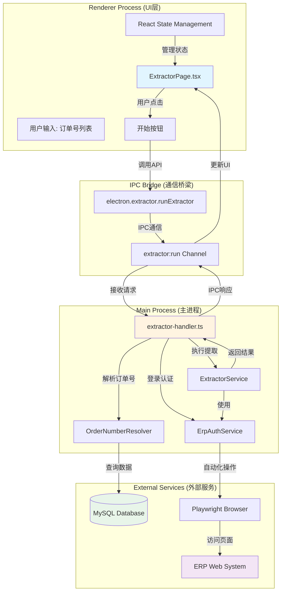
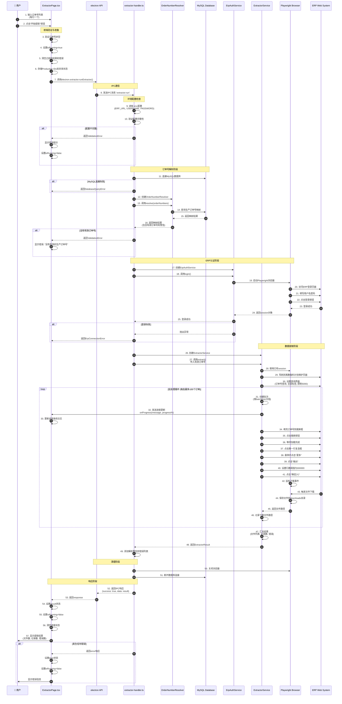
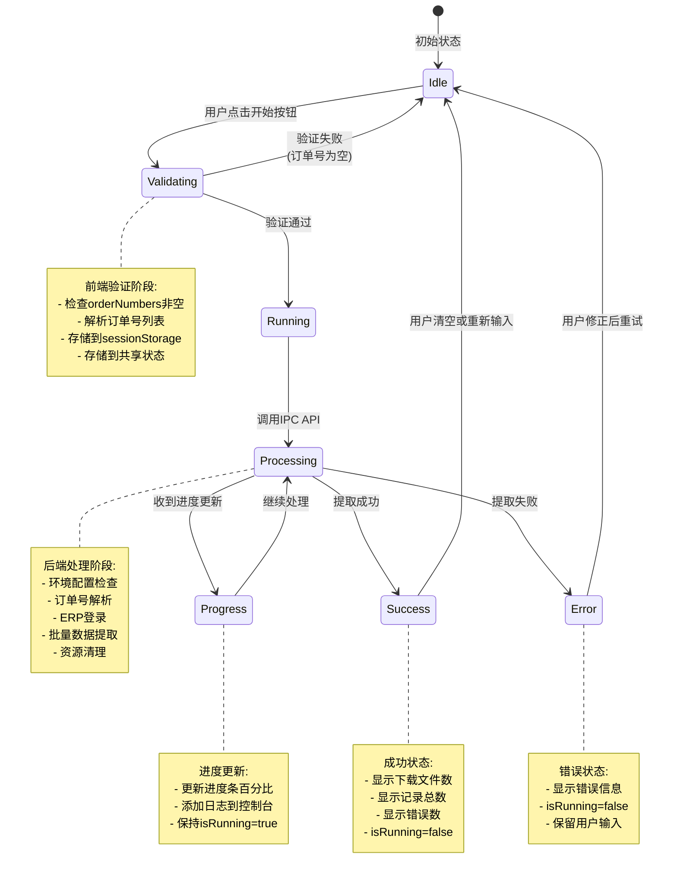
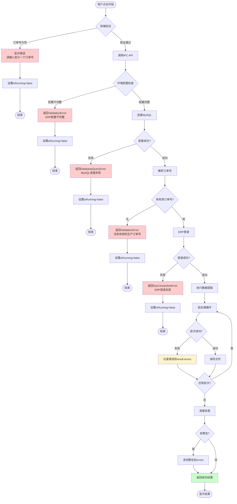
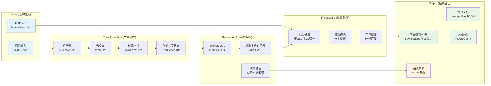

# 数据提取界面 - 开始按钮工作流程详解

> **文档版本**: 1.0
> **创建日期**: 2026-03-03
> **适用范围**: ERPAuto v1.0+
> **相关文件**:
>
> - `src/renderer/src/pages/ExtractorPage.tsx` (UI层)
> - `src/main/ipc/extractor-handler.ts` (IPC处理层)
> - `src/main/services/erp/extractor.ts` (业务逻辑层)
> - `src/main/services/erp/order-resolver.ts` (订单号解析服务)
> - `src/main/services/erp/erp-auth.ts` (ERP认证服务)

## 目录

1. [系统架构概览](#系统架构概览)
2. [完整执行流程](#完整执行流程)
3. [状态管理流程](#状态管理流程)
4. [错误处理机制](#错误处理机制)
5. [数据流转过程](#数据流转过程)
6. [关键代码引用](#关键代码引用)

---

## 系统架构概览



### 架构说明

- **Renderer Process**: 负责UI展示和用户交互，使用React管理状态
- **IPC Bridge**: 安全的进程间通信桥梁，通过preload脚本暴露
- **Main Process**: 处理业务逻辑、数据库操作、浏览器自动化
- **External Services**: MySQL数据库和ERP Web系统

---

## 完整执行流程



---

## 状态管理流程



### 状态变量说明

| 状态变量       | 类型                      | 说明                         | 持久化            |
| -------------- | ------------------------- | ---------------------------- | ----------------- |
| `orderNumbers` | string                    | 用户输入的订单号列表         | ✅ sessionStorage |
| `batchSize`    | number                    | 每批处理的订单数量 (默认100) | ✅ sessionStorage |
| `isRunning`    | boolean                   | 是否正在执行提取             | ❌ 内存状态       |
| `progress`     | ExtractorProgress \| null | 当前进度信息                 | ❌ 内存状态       |
| `result`       | ExtractorResult \| null   | 提取结果                     | ❌ 内存状态       |
| `error`        | string \| null            | 错误信息                     | ❌ 内存状态       |
| `logs`         | string[]                  | 执行日志列表                 | ❌ 内存状态       |

---

## 错误处理机制



### 错误类型与处理策略

| 错误类型             | 触发条件                             | 用户反馈                 | 恢复策略       |
| -------------------- | ------------------------------------ | ------------------------ | -------------- |
| `ValidationError`    | 订单号为空、配置不完整、无有效订单号 | 显示红色错误消息         | 修正输入后重试 |
| `DatabaseQueryError` | MySQL连接失败                        | 显示数据库连接错误       | 检查数据库配置 |
| `ErpConnectionError` | ERP登录失败                          | 显示ERP登录错误          | 检查ERP凭据    |
| `BatchError`         | 单个批次处理失败                     | 记录到错误列表，继续处理 | 查看错误详情   |
| `SystemError`        | 未知系统错误                         | 显示通用错误消息         | 查看日志       |

---

## 数据流转过程



### 数据转换详情

**阶段1: 用户输入 → Production IDs**

```
输入: "PO-20231024-001\nPO-20231024-002\nPO-20231024-003"
  ↓ 分割 + trim + 过滤
结果: ["PO-20231024-001", "PO-20231024-002", "PO-20231024-003"]
  ↓ 存储到共享状态
共享状态: Production IDs (供清理模块使用)
```

**阶段2: Production IDs → 生产订单号**

```
输入: ["PO-20231024-001", "PO-20231024-002", "INVALID"]
  ↓ MySQL查询 (production_order表)
映射结果: {
  "PO-20231024-001": "MO-20231024-001",
  "PO-20231024-002": "MO-20231024-002",
  "INVALID": null
}
  ↓ 提取有效值
有效订单号: ["MO-20231024-001", "MO-20231024-002"]
警告: ["INVALID: 未找到对应的生产订单号"]
```

**阶段3: 生产订单号 → 批次**

```
输入: ["MO-001", "MO-002", ..., "MO-250"] (250个)
批次大小: 100
  ↓ 分组
批次1: ["MO-001", ..., "MO-100"]
批次2: ["MO-101", ..., "MO-200"]
批次3: ["MO-201", ..., "MO-250"]
```

**阶段4: 批次 → ERP查询字符串**

```
批次: ["MO-001", "MO-002", "MO-003"]
  ↓ 逗号连接
查询字符串: "MO-001,MO-002,MO-003"
  ↓ 填充到ERP搜索框
ERP操作: 填入搜索框并点击搜索
```

---

## 关键代码引用

### 1. 前端开始按钮处理 (ExtractorPage.tsx:52-90)

```typescript
const handleExtract = async () => {
  // 1. 前端验证
  if (!orderNumbers.trim()) {
    setError('请输入至少一个订单号')
    return
  }

  // 2. 设置运行状态
  setIsRunning(true)
  setProgress(null)
  setResult(null)
  setError(null)

  try {
    // 3. 解析订单号列表
    const orderNumberList = orderNumbers
      .split('\n')
      .map((line) => line.trim())
      .filter((line) => line.length > 0)

    // 4. 存储到共享状态
    await window.electron.validation.setSharedProductionIds(orderNumberList)

    // 5. 调用后端API
    const response = await window.electron.extractor.runExtractor({
      orderNumbers: orderNumberList,
      batchSize
    })

    // 6. 处理响应
    if (response.success && response.data) {
      setResult(response.data)
    } else {
      setError(response.error || '提取失败')
    }
  } catch (err) {
    setError(err instanceof Error ? err.message : '发生未知错误')
  } finally {
    // 7. 重置状态
    setIsRunning(false)
    setProgress(null)
  }
}
```

### 2. IPC处理器核心逻辑 (extractor-handler.ts:17-154)

```typescript
ipcMain.handle('extractor:run', async (_event, input: ExtractorInput) => {
  return withErrorHandling(async () => {
    // 1. 环境配置检查
    const erpUrl = process.env.ERP_URL || ''
    const erpUsername = process.env.ERP_USERNAME || ''
    const erpPassword = process.env.ERP_PASSWORD || ''

    if (!erpUrl || !erpUsername || !erpPassword) {
      throw new ValidationError('ERP 配置不完整')
    }

    // 2. 订单号解析
    const mysqlService = new MySqlService(mysqlConfig)
    await mysqlService.connect()

    const resolver = new OrderNumberResolver(mysqlService)
    const mappings = await resolver.resolve(input.orderNumbers)
    const validOrderNumbers = resolver.getValidOrderNumbers(mappings)

    if (validOrderNumbers.length === 0) {
      throw new ValidationError('没有有效的生产订单号可处理')
    }

    // 3. ERP登录
    const authService = new ErpAuthService({...})
    await authService.login()

    // 4. 执行提取
    const extractor = new ExtractorService(authService)
    const result = await extractor.extract({
      ...input,
      orderNumbers: validOrderNumbers
    })

    // 5. 资源清理
    await authService.close()
    await mysqlService.disconnect()

    return result
  }, 'extractor:run')
})
```

### 3. 提取服务批处理逻辑 (extractor.ts:43-67)

```typescript
// 批处理循环
const batches = this.createBatches(input.orderNumbers, batchSize)

for (let i = 0; i < batches.length; i++) {
  const batch = batches[i]
  const progress = ((i + 1) / batches.length) * 100

  // 发送进度更新
  input.onProgress?.(`Processing batch ${i + 1}/${batches.length}`, progress)

  try {
    const filePath = await this.downloadBatch(
      session,
      popupPage,
      workFrame,
      batch,
      i,
      batches.length
    )
    result.downloadedFiles.push(filePath)
  } catch (error) {
    // 记录错误但继续处理
    result.errors.push(`Batch ${i + 1}: ${error.message}`)
  }
}
```

### 4. 浏览器自动化单批次处理 (extractor.ts:151-194)

```typescript
private async downloadBatch(...): Promise<string> {
  // 1. 填充订单号
  const textbox = workFrame.getByRole('textbox', { name: '来源生产订单号' })
  await textbox.fill(orderNumbers.join(','))

  // 2. 点击搜索
  await workFrame.locator('.search-component-searchBtn').click()

  // 3. 等待加载
  await this.waitForLoading(workFrame)

  // 4. 选择第一行
  await workFrame.getByRole('row', { name: '序号' }).getByLabel('').click()

  // 5. 点击更多 -> 输出
  await workFrame.getByRole('button', { name: '更多' }).hover()
  await workFrame.getByText('输出', { exact: true }).click()

  // 6. 设置阈值
  await thresholdBox.fill('300000')

  // 7. 等待下载
  const downloadPromise = popupPage.waitForEvent('download')
  await workFrame.getByRole('button', { name: '确定(Y)' }).click()
  const download = await downloadPromise

  // 8. 保存文件
  const downloadPath = path.join(this.downloadDir, `temp_batch_${batchIndex + 1}.xlsx`)
  await download.saveAs(downloadPath)

  return downloadPath
}
```

---

## 总结

### 流程关键点

1. **三层验证机制**:
   - 前端验证: 非空检查
   - 配置验证: 环境变量完整性
   - 数据验证: 订单号有效性

2. **资源管理策略**:
   - 使用try-finally确保资源清理
   - 浏览器在使用后立即关闭
   - 数据库连接在使用后断开

3. **错误容错设计**:
   - 单个批次失败不影响其他批次
   - 警告信息独立收集，不影响主流程
   - 详细错误信息返回给前端展示

4. **用户体验优化**:
   - sessionStorage持久化用户输入
   - 实时进度反馈
   - 共享状态支持跨页面数据传递
   - 详细的日志记录

### 性能考虑

- **批处理**: 默认每批100个订单，平衡性能与稳定性
- **异步并发**: 使用async/await处理异步操作
- **进度反馈**: 避免长时间无响应的用户体验

### 扩展性

- **配置化**: batchSize可配置
- **模块化**: 服务独立，易于测试和维护
- **错误类型化**: 使用自定义错误类型便于精确处理

---

**文档维护**: 如代码逻辑变更，请及时更新本文档和相关流程图。
