# 系统设置保存按钮工作流程分析

# System Settings Save Button Workflow Analysis

## 文档概述 / Document Overview

本文档详细分析了 ERPAuto 系统设置界面中保存按钮的完整工作流程，包括架构设计、数据流转、技术实现细节以及错误处理机制。

This document provides a comprehensive analysis of the save button workflow in the ERPAuto system settings interface, including architecture design, data flow, technical implementation details, and error handling mechanisms.

---

## 目录 / Table of Contents

1. [架构概览](#架构概览)
2. [数据流程图](#数据流程图)
3. [组件详解](#组件详解)
4. [数据结构](#数据结构)
5. [错误处理机制](#错误处理机制)
6. [安全考虑](#安全考虑)
7. [技术实现细节](#技术实现细节)

---

## 架构概览 / Architecture Overview

### 系统架构 / System Architecture

系统设置保存功能采用典型的 Electron 三层架构模式：

The system settings save functionality follows the classic Electron three-tier architecture pattern:

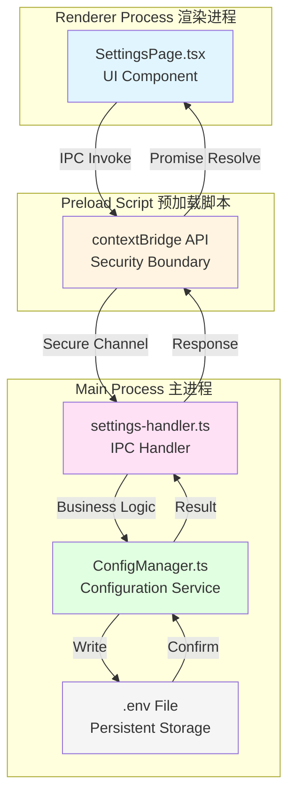

### 核心设计模式 / Core Design Patterns

1. **单向数据流**：数据从 UI → Main Process → File，响应沿相反路径返回
2. **安全隔离**：Preload 脚本作为安全桥梁，通过 `contextBridge` 暴露受限 API
3. **单例模式**：ConfigManager 使用单例确保配置一致性
4. **缓存优先**：配置读取优先从内存缓存获取，写入时同步到磁盘

---

## 数据流程图 / Data Flow Diagrams

### 完整保存流程 / Complete Save Flow

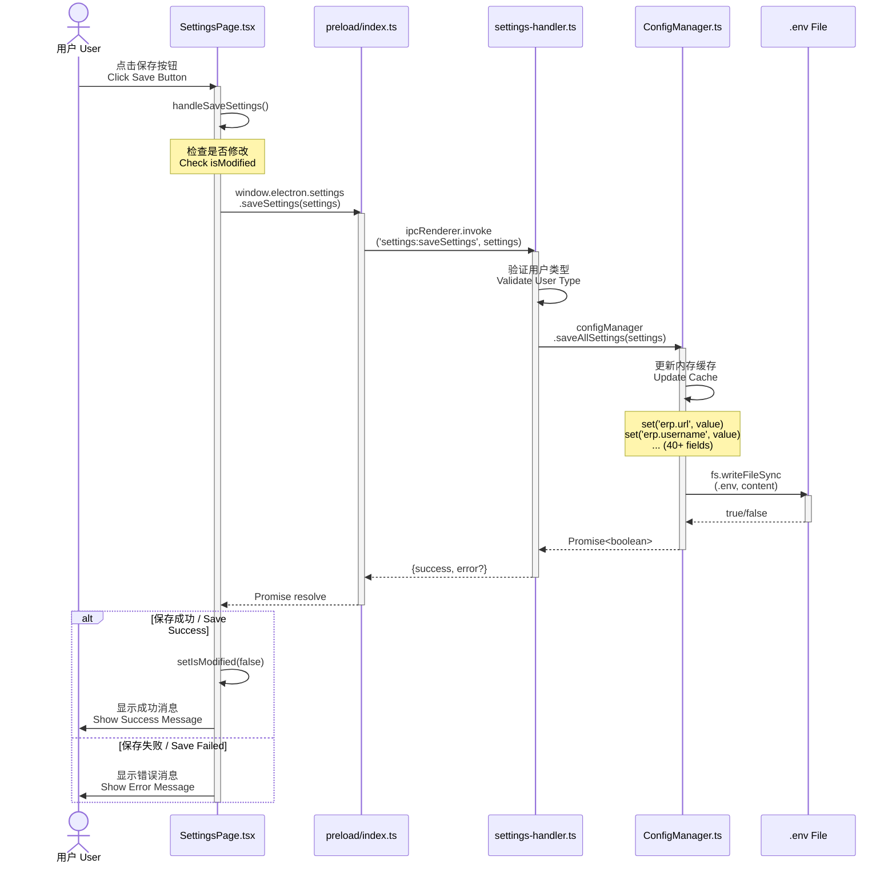

### 数据转换流程 / Data Transformation Flow

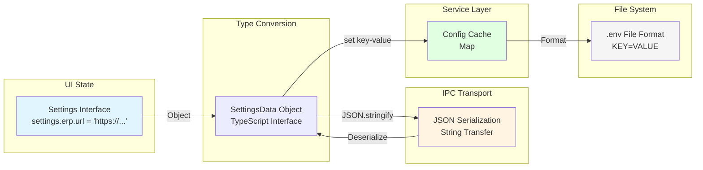

---

## 组件详解 / Component Details

### 1. 渲染进程 / Renderer Process

#### SettingsPage.tsx (`src/renderer/src/pages/SettingsPage.tsx`)

**主要职责 / Main Responsibilities:**

- 用户界面渲染和交互
- 本地状态管理（settings, isModified, message）
- 调用 IPC 通信

**关键函数 / Key Functions:**

```typescript
// 第 61-73 行 / Lines 61-73
const handleSaveSettings = async () => {
  try {
    const result = await window.electron.settings.saveSettings(settings as any)
    if (result.success) {
      setIsModified(false) // 清除修改标记
      showMessage('success', '设置保存成功')
    } else {
      showMessage('error', result.error || '保存失败')
    }
  } catch (error) {
    showMessage('error', '保存设置时发生错误')
  }
}
```

**状态管理 / State Management:**

| 状态变量     | 类型             | 用途                                                        |
| ------------ | ---------------- | ----------------------------------------------------------- |
| `settings`   | `Settings`       | 当前配置数据，结构为 `{ erp: { url, username, password } }` |
| `isModified` | `boolean`        | 标记配置是否已修改，控制保存按钮启用状态                    |
| `isLoading`  | `boolean`        | 加载状态，显示加载动画                                      |
| `message`    | `object \| null` | 临时消息，3秒后自动消失                                     |

**UI 交互逻辑 / UI Interaction Logic:**

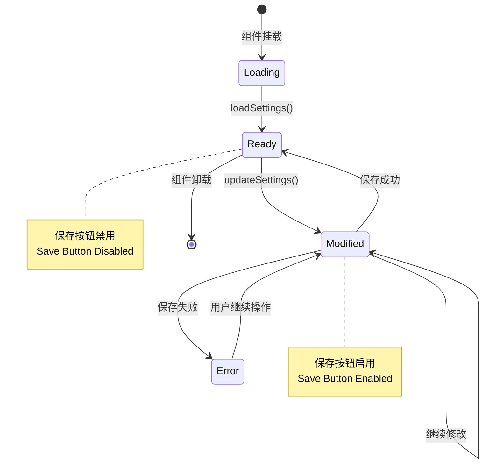

### 2. 预加载脚本 / Preload Script

#### preload/index.ts (`src/preload/index.ts`)

**主要职责 / Main Responsibilities:**

- 安全桥梁，暴露受限 API 到渲染进程
- 类型安全的 IPC 通道定义

**关键代码 / Key Code:**

```typescript
// 第 89-97 行 / Lines 89-97
settings: {
  getUserType: () => ipcRenderer.invoke('settings:getUserType'),
  getSettings: () => ipcRenderer.invoke('settings:getSettings'),
  saveSettings: (settings: SettingsData) =>
    ipcRenderer.invoke('settings:saveSettings', settings),
  resetDefaults: () => ipcRenderer.invoke('settings:resetDefaults'),
  testErpConnection: () => ipcRenderer.invoke('settings:testErpConnection'),
  testDbConnection: () => ipcRenderer.invoke('settings:testDbConnection')
}
```

**安全隔离机制 / Security Isolation:**

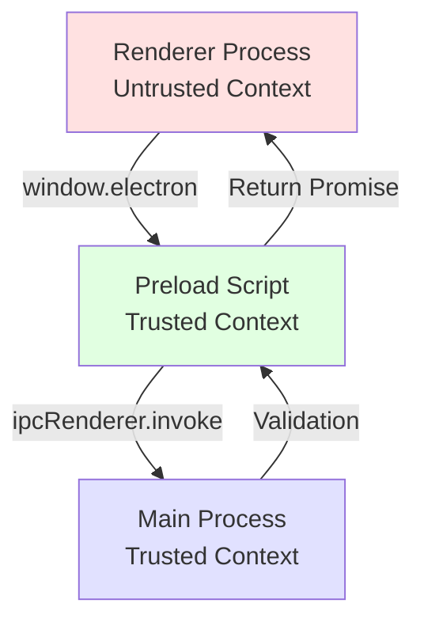

### 3. 主进程 / Main Process

#### settings-handler.ts (`src/main/ipc/settings-handler.ts`)

**主要职责 / Main Responsibilities:**

- IPC 通道注册和处理
- 权限验证（基于用户类型）
- 业务逻辑协调

**保存设置处理函数 / Save Settings Handler:**

```typescript
// 第 83-102 行 / Lines 83-102
ipcMain.handle(
  'settings:saveSettings',
  async (_event, settings: SettingsData): Promise<SaveSettingsResult> => {
    try {
      log.info('Saving settings')
      const success = await configManager.saveAllSettings(settings)
      if (success) {
        log.info('Settings saved successfully')
        return { success: true }
      } else {
        log.warn('Failed to save settings')
        return { success: false, error: '保存设置失败' }
      }
    } catch (error) {
      const message = error instanceof Error ? error.message : 'Unknown error'
      log.error('Error saving settings', { error: message })
      return { success: false, error: `保存设置失败：${message}` }
    }
  }
)
```

**用户类型过滤 / User Type Filtering:**

```typescript
// 第 31-54 行 / Lines 31-54
function filterSettingsByUserType(settings: SettingsData, userType: UserType): SettingsData {
  if (userType === 'Admin') {
    return settings // Admin 获取完整配置
  }

  // User 用户获取受限配置
  return {
    erp: {
      username: settings.erp.username,
      password: settings.erp.password,
      headless: settings.erp.headless,
      url: settings.erp.url,
      ignoreHttpsErrors: settings.erp.ignoreHttpsErrors,
      autoCloseBrowser: settings.erp.autoCloseBrowser
    },
    paths: settings.paths,
    execution: settings.execution,
    database: settings.database,
    extraction: settings.extraction,
    validation: settings.validation,
    ui: settings.ui
  }
}
```

**权限控制矩阵 / Permission Control Matrix:**

| 功能 / Feature | Admin | User    | Guest |
| -------------- | ----- | ------- | ----- |
| 查看所有设置   | ✅    | ⚠️ 部分 | ❌    |
| 保存设置       | ✅    | ✅      | ❌    |
| 恢复默认值     | ✅    | ❌      | ❌    |
| 测试 ERP 连接  | ✅    | ✅      | ❌    |
| 测试数据库连接 | ✅    | ✅      | ❌    |

### 4. 配置管理服务 / Configuration Manager Service

#### config-manager.ts (`src/main/services/config/config-manager.ts`)

**主要职责 / Main Responsibilities:**

- .env 文件读写
- 配置缓存管理
- 默认值管理
- 类型转换和验证

**类结构 / Class Structure:**

```typescript
export class ConfigManager {
  private static instance: ConfigManager | null = null // 单例模式
  private envPath: string // .env 文件路径
  private configCache: Map<string, string> // 内存缓存
  private initialized: boolean = false // 初始化标记

  // 单例获取方法
  public static getInstance(): ConfigManager

  // 配置读取
  public get(key: string, defaultValue?: string): string | undefined
  public getBoolean(key: string, defaultValue?: boolean): boolean
  public getNumber(key: string, defaultValue?: number): number

  // 配置写入
  public set(key: string, value: string | number | boolean): void

  // 持久化
  public async save(): Promise<boolean>

  // 高级操作
  public getAllSettings(): SettingsData
  public async saveAllSettings(settings: SettingsData): Promise<boolean>
  public resetToDefaults(): SettingsData
}
```

**保存详细流程 / Save Detailed Flow:**

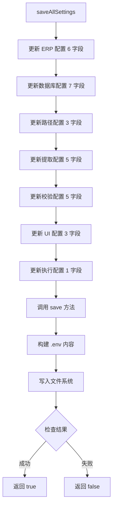

**.env 文件格式 / .env File Format:**

```bash
# ===========================
# ERP 系统配置
# ===========================
ERP_URL=https://68.11.34.30:8082/
ERP_USERNAME=
ERP_PASSWORD=
ERP_HEADLESS=true
ERP_IGNORE_HTTPS_ERRORS=true
ERP_AUTO_CLOSE_BROWSER=true

# ===========================
# 数据库配置 - MySQL
# ===========================
DB_TYPE=mysql
DB_NAME=BLD_DB
DB_USERNAME=remote_user
DB_PASSWORD=
DB_MYSQL_HOST=192.168.31.83
DB_MYSQL_PORT=3306
DB_MYSQL_CHARSET=utf8mb4

# ===========================
# 路径配置
# ===========================
PATH_DATA_DIR=D:/python/playwrite/data/
PATH_DEFAULT_OUTPUT=离散备料计划维护_合并.xlsx
PATH_VALIDATION_OUTPUT=物料状态校验结果.xlsx

# ... 更多配置节
```

---

## 数据结构 / Data Structures

### SettingsData 接口 / Interface Definition

**类型定义位置 / Type Definition Location:**
`src/main/types/settings.types.ts` (第 136-151 行)

```typescript
export interface SettingsData {
  erp: ErpConfig
  database: DatabaseConfig
  paths: PathsConfig
  extraction: ExtractionConfig
  validation: ValidationConfig
  ui: UiConfig
  execution: ExecutionConfig
}
```

### 完整数据结构树 / Complete Data Structure Tree

```mermaid
graph TB
    Settings[SettingsData]

    Settings --> Erp[ErpConfig]
    Erp --> Erp1[url: string]
    Erp --> Erp2[username: string]
    Erp --> Erp3[password: string]
    Erp --> Erp4[headless: boolean]
    Erp --> Erp5[ignoreHttpsErrors: boolean]
    Erp --> Erp6[autoCloseBrowser: boolean]

    Settings --> DB[DatabaseConfig]
    DB --> DB1[dbType: mysql or sqlserver]
    DB --> DB2[server: string]
    DB --> DB3[mysqlHost: string]
    DB --> DB4[mysqlPort: number]
    DB --> DB5[database: string]
    DB --> DB6[username: string]
    DB --> DB7[password: string]

    Settings --> Paths[PathsConfig]
    Paths --> Paths1[dataDir: string]
    Paths --> Paths2[defaultOutput: string]
    Paths --> Paths3[validationOutput: string]

    Settings --> Extract[ExtractionConfig]
    Extract --> Extract1[batchSize: number]
    Extract --> Extract2[verbose: boolean]
    Extract --> Extract3[autoConvert: boolean]
    Extract --> Extract4[mergeBatches: boolean]
    Extract --> Extract5[enableDbPersistence: boolean]

    Settings --> Valid[ValidationConfig]
    Valid --> Valid1[dataSource: ValidationDataSource]
    Valid --> Valid2[batchSize: number]
    Valid --> Valid3[matchMode: MatchMode]
    Valid --> Valid4[enableCrud: boolean]
    Valid --> Valid5[defaultManager: string]

    Settings --> UI[UiConfig]
    UI --> UI1[fontFamily: string]
    UI --> UI2[fontSize: number]
    UI --> UI3[productionIdInputWidth: number]

    Settings --> Exec[ExecutionConfig]
    Exec --> Exec1[dryRun: boolean]

    style Settings fill:#e1f5ff
    style Erp fill:#ffe1f5
    style DB fill:#e1ffe1
    style Paths fill:#fff4e1
    style Extract fill:#f5e1ff
    style Valid fill:#ffe1e1
    style UI fill:#e1f5ff
    style Exec fill:#f5f5f5
```

### IPC 通信数据格式 / IPC Communication Data Format

**请求格式 / Request Format:**

```json
{
  "erp": {
    "url": "https://68.11.34.30:8082/",
    "username": "admin",
    "password": "password123",
    "headless": true,
    "ignoreHttpsErrors": true,
    "autoCloseBrowser": true
  },
  "database": { ... },
  "paths": { ... },
  "extraction": { ... },
  "validation": { ... },
  "ui": { ... },
  "execution": { ... }
}
```

**响应格式 / Response Format:**

```json
// 成功 / Success
{
  "success": true
}

// 失败 / Failure
{
  "success": false,
  "error": "保存设置失败：Access denied"
}
```

---

## 错误处理机制 / Error Handling Mechanism

### 错误处理层次 / Error Handling Layers

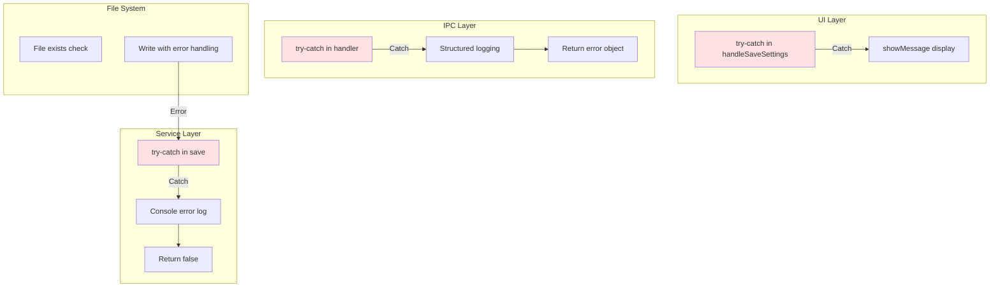

### 错误场景分析 / Error Scenario Analysis

| 错误场景 / Error Scenario | 触发位置 / Location | 处理方式 / Handling   | 用户反馈 / User Feedback |
| ------------------------- | ------------------- | --------------------- | ------------------------ |
| IPC 通信失败              | Renderer            | try-catch             | 显示"保存设置时发生错误" |
| 权限不足                  | Main Process        | 检查 UserType         | 返回权限错误信息         |
| 文件写入失败              | ConfigManager       | fs.writeFileSync 捕获 | 返回"保存设置失败"       |
| 无效数据类型              | IPC Handler         | TypeScript 类型检查   | 返回验证错误             |
| 磁盘空间不足              | File System         | OS 异常捕获           | 返回系统错误信息         |

### 日志记录策略 / Logging Strategy

```typescript
// Main Process 结构化日志 / Structured Logging
log.info('Saving settings')
log.info('Settings saved successfully')
log.warn('Failed to save settings')
log.error('Error saving settings', { error: message })
```

**日志级别使用 / Log Level Usage:**

- `info`: 正常操作流程
- `warn`: 潜在问题（如保存失败但未崩溃）
- `error`: 严重错误（如异常抛出）

---

## 安全考虑 / Security Considerations

### 安全机制层级 / Security Layers

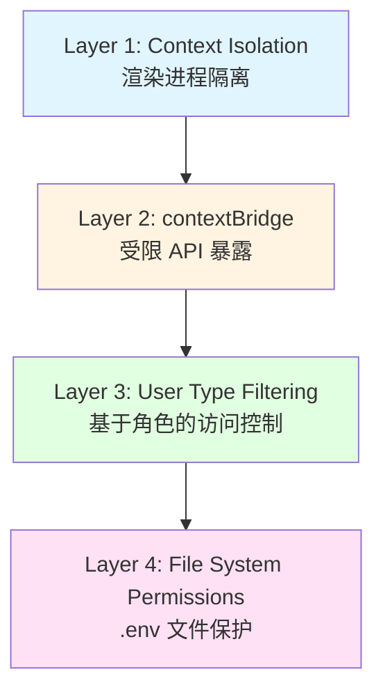

### 关键安全措施 / Key Security Measures

1. **密码明文存储风险 / Password Storage Risk**
   - ⚠️ 当前：密码以明文形式存储在 .env 文件中
   - 🔒 建议：实现加密存储机制

2. **用户权限隔离 / User Permission Isolation**
   - ✅ 实现：基于用户类型过滤可见配置
   - ✅ 实现：Guest 用户无法访问设置页面

3. **IPC 通信安全 / IPC Communication Security**
   - ✅ 实现：使用 `contextBridge` 而非直接暴露
   - ✅ 实现：类型安全的 TypeScript 接口

4. **文件系统访问 / File System Access**
   - ✅ 实现：.env 文件仅主进程可访问
   - ⚠️ 风险：文件权限取决于操作系统

### 敏感数据流向 / Sensitive Data Flow

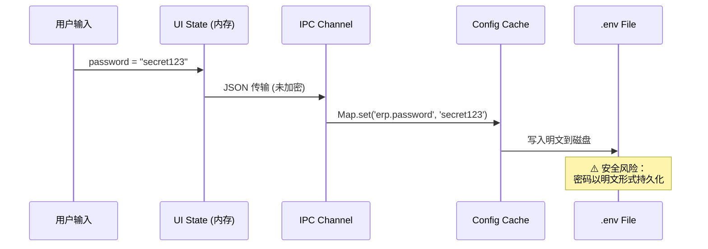

---

## 技术实现细节 / Technical Implementation Details

### 文件位置索引 / File Location Index

| 组件 / Component | 文件路径 / File Path                         | 关键行数 / Key Lines  |
| ---------------- | -------------------------------------------- | --------------------- |
| UI 组件          | `src/renderer/src/pages/SettingsPage.tsx`    | 61-73 (保存处理)      |
| 预加载脚本       | `src/preload/index.ts`                       | 89-97 (API 定义)      |
| IPC 处理器       | `src/main/ipc/settings-handler.ts`           | 83-102 (保存处理)     |
| 配置管理器       | `src/main/services/config/config-manager.ts` | 437-483 (保存方法)    |
| 类型定义         | `src/main/types/settings.types.ts`           | 136-171 (接口定义)    |
| IPC 注册         | `src/main/ipc/index.ts`                      | 导入 settings-handler |

### 性能特性 / Performance Characteristics

1. **异步操作 / Async Operations**
   - 所有 IPC 调用使用 `async/await` 模式
   - 避免阻塞主进程事件循环

2. **内存优化 / Memory Optimization**
   - 使用 Map 缓存配置，减少文件读取
   - 按需加载配置项

3. **写入策略 / Write Strategy**
   - 每次保存完整重写 .env 文件
   - 原子写入（writeFileSync）

### 依赖关系图 / Dependency Graph

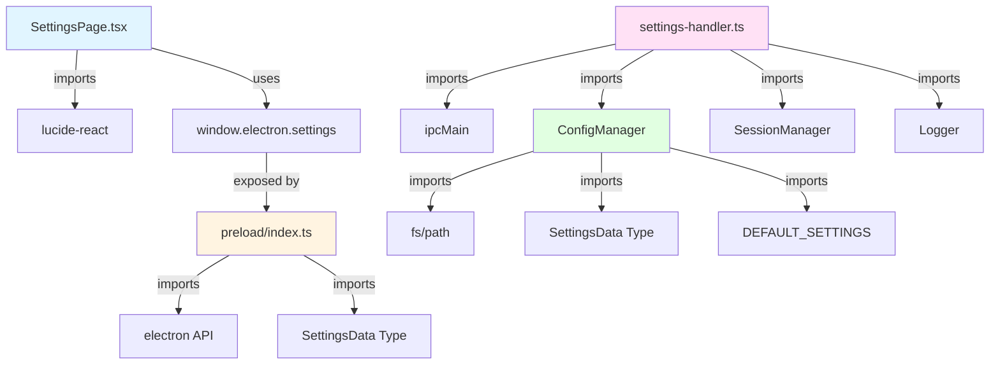

### 关键代码片段分析 / Key Code Snippet Analysis

**1. 状态更新逻辑 / State Update Logic**

```typescript
// SettingsPage.tsx 第 50-59 行
const updateSettings = (category: string, key: string, value: any) => {
  setSettings((prev) => ({
    ...prev,
    [category]: {
      ...(prev as any)[category],
      [key]: value
    }
  }))
  setIsModified(true) // 标记为已修改
}
```

**设计要点 / Design Points:**

- 不可变更新模式（Immutable Update Pattern）
- 使用展开运算符保持对象引用
- 自动启用保存按钮

**2. 配置保存逻辑 / Configuration Save Logic**

```typescript
// config-manager.ts 第 437-483 行
public async saveAllSettings(settings: SettingsData): Promise<boolean> {
  // 批量更新缓存 (40+ 字段)
  this.set('erp.url', settings.erp.url)
  this.set('erp.username', settings.erp.username)
  // ... 更多字段

  // 同步写入文件
  return this.save()
}
```

**设计要点 / Design Points:**

- 先更新内存，后写入磁盘
- 失败时缓存保持不变
- 返回布尔值表示成功/失败

**3. .env 文件生成逻辑 / .env File Generation**

```typescript
// config-manager.ts 第 179-345 行
public async save(): Promise<boolean> {
  const lines: string[] = []

  // 构建格式化的 .env 内容
  lines.push('# ===========================')
  lines.push('# ERP 系统配置')
  lines.push('# ===========================')
  lines.push(`ERP_URL=${this.configCache.get('erp.url') || DEFAULT_SETTINGS.erp.url}`)

  const content = lines.join('\n')
  fs.writeFileSync(this.envPath, content, 'utf-8')
  return true
}
```

**设计要点 / Design Points:**

- 添加注释分隔符提高可读性
- 使用默认值作为后备
- 同步写入确保一致性

---

## 扩展与改进建议 / Extension and Improvement Suggestions

### 短期改进 / Short-term Improvements

1. **输入验证 / Input Validation**
   - 添加 URL 格式验证
   - 密码强度检查
   - 端口号范围验证

2. **用户体验 / User Experience**
   - 添加保存进度指示器
   - 实现自动保存功能
   - 添加配置导入/导出

3. **错误处理 / Error Handling**
   - 更详细的错误消息
   - 错误恢复建议
   - 错误日志导出

### 长期改进 / Long-term Improvements

1. **安全性增强 / Security Enhancement**

   ```typescript
   // 建议实现密码加密
   interface SecureSettingsData extends SettingsData {
     erp: {
       ...ErpConfig
       encryptedPassword: string  // 替代明文密码
     }
   }
   ```

2. **配置版本控制 / Configuration Versioning**
   - 实现配置历史记录
   - 支持回滚到之前版本
   - 配置变更审计日志

3. **实时配置重载 / Live Config Reload**
   - 监听 .env 文件变化
   - 自动重载配置
   - 通知相关服务更新

---

## 测试建议 / Testing Recommendations

### 单元测试 / Unit Tests

```typescript
// 测试用例示例
describe('ConfigManager', () => {
  it('should save settings successfully', async () => {
    const manager = ConfigManager.getInstance()
    const settings: SettingsData = {
      /* mock data */
    }
    const result = await manager.saveAllSettings(settings)
    expect(result).toBe(true)
  })

  it('should handle file write errors', async () => {
    // Mock fs.writeFileSync to throw error
    const result = await manager.saveAllSettings(settings)
    expect(result).toBe(false)
  })
})
```

### 集成测试 / Integration Tests

```typescript
describe('Settings Save Flow', () => {
  it('should complete full save cycle', async () => {
    // 1. User modifies settings
    // 2. Clicks save button
    // 3. Verifies .env file updated
    // 4. Confirms UI feedback
  })
})
```

---

## 附录 / Appendix

### 完整配置字段列表 / Complete Configuration Field List

| 类别 / Category  | 字段数 / Field Count | 字段列表 / Field List                                                  |
| ---------------- | -------------------- | ---------------------------------------------------------------------- |
| ERP              | 6                    | url, username, password, headless, ignoreHttpsErrors, autoCloseBrowser |
| Database         | 7                    | dbType, server, mysqlHost, mysqlPort, database, username, password     |
| Paths            | 3                    | dataDir, defaultOutput, validationOutput                               |
| Extraction       | 5                    | batchSize, verbose, autoConvert, mergeBatches, enableDbPersistence     |
| Validation       | 5                    | dataSource, batchSize, matchMode, enableCrud, defaultManager           |
| UI               | 3                    | fontFamily, fontSize, productionIdInputWidth                           |
| Execution        | 1                    | dryRun                                                                 |
| **总计 / Total** | **30**               |                                                                        |

### 相关文档 / Related Documentation

- [Electron Security Guidelines](https://www.electronjs.org/docs/latest/tutorial/security)
- [IPC 通信最佳实践](https://www.electronjs.org/docs/latest/tutorial/ipc)
- [环境变量管理规范](.env.example)

### 版本历史 / Version History

| 版本 / Version | 日期 / Date | 变更 / Changes             |
| -------------- | ----------- | -------------------------- |
| 1.0            | 2025-03-03  | 初始版本 / Initial version |

---

**文档生成时间 / Document Generated:** 2025-03-03
**最后更新 / Last Updated:** 2025-03-03
**维护者 / Maintainer:** ERPAuto Development Team
