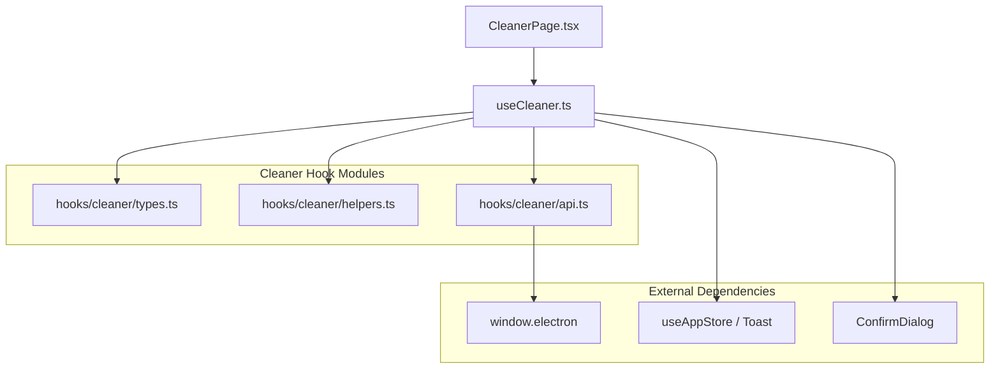
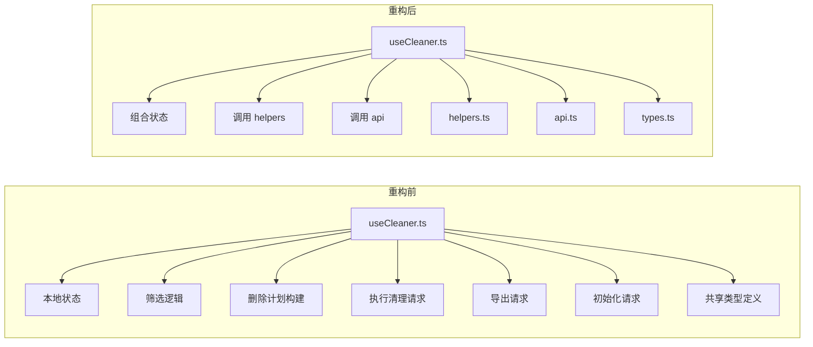

# useCleaner 重构说明

本文档记录 `src/renderer/src/hooks/useCleaner.ts` 的第一阶段重构工作。目标不是一次性把整个 Cleaner 页面完全组件化，而是优先拆出共享类型、纯函数和 IPC 编排逻辑，让 `useCleaner` 从“大而全逻辑容器”逐步收敛为“组合层”。

## 1. 重构背景

重构前，`useCleaner.ts` 同时负责：

- 页面初始化
- 权限判断
- sessionStorage 持久化
- 校验请求
- 结果筛选
- 勾选状态处理
- 删除计划构建
- 保存物料变更
- Cleaner 执行编排
- 导出编排
- 弹窗确认
- 报告状态维护

这导致它虽然名义上是一个 hook，但实际上已经接近一个“前端页面服务总线”。

## 2. 重构目标

本次重构目标是：

- 提取共享类型，消除重复定义
- 提取纯函数，隔离无副作用逻辑
- 提取 IPC / 异步编排，隔离对 `window.electron` 的直接调用
- 保持 `useCleaner()` 返回值和 `CleanerPage.tsx` 使用方式不变

## 3. 重构后结构

## 4. 本次拆分内容

### 4.1 共享类型

新增：

- `src/renderer/src/hooks/cleaner/types.ts`

统一收敛了以下类型：

- `ValidationRequest`
- `ValidationResult`
- `ValidationStats`
- `ValidationResponsePayload`
- `CleanerProgress`
- `CleanerReportData`
- `CleanerInitializationResult`
- `CleanerConfigResult`

这一步解决了原来多个文件重复定义同类类型的问题，比如：

- `useCleaner.ts`
- `useValidation.ts`
- `ExecutionReportDialog.tsx`

### 4.2 纯函数与数据构造

新增：

- `src/renderer/src/hooks/cleaner/helpers.ts`

提取出的纯函数包括：

- `getStoredBoolean()`
- `getStoredValidationMode()`
- `filterValidationResults()`
- `buildDeletionPlan()`
- `buildExportItems()`

这些逻辑之前都散落在 `useCleaner.ts` 的 `useMemo` 或事件处理函数里，现在可以单独测试。

### 4.3 IPC 与异步编排

新增：

- `src/renderer/src/hooks/cleaner/api.ts`

提取出的异步编排包括：

- `initializeCleanerPage()`
- `loadCleanerConfig()`
- `runValidationRequest()`
- `saveDeletionPlan()`
- `reloadManagers()`
- `runCleanerExecution()`
- `exportCleanerResults()`

这样做之后，`useCleaner.ts` 不再需要在每个 handler 里直接拼接 `window.electron.xxx` 调用细节。

## 5. useCleaner 的角色变化

重构后，`useCleaner.ts` 更接近“组合层”：

- 管理 React state
- 串联用户交互流程
- 调用 helpers 和 api
- 将最终能力暴露给页面

## 6. 受影响的文件

### 6.1 主体修改

- `src/renderer/src/hooks/useCleaner.ts`
- `src/renderer/src/hooks/useValidation.ts`
- `src/renderer/src/components/ExecutionReportDialog.tsx`

### 6.2 新增模块

- `src/renderer/src/hooks/cleaner/types.ts`
- `src/renderer/src/hooks/cleaner/helpers.ts`
- `src/renderer/src/hooks/cleaner/api.ts`

### 6.3 新增测试

- `tests/unit/cleaner-helpers.test.ts`

## 7. 具体收益

### 7.1 类型一致性提升

之前 `ValidationResult`、`CleanerProgress` 在多个文件重复定义，修改字段时容易遗漏。  
现在统一从 `hooks/cleaner/types.ts` 引用，降低了类型漂移风险。

### 7.2 可测试性提升

原先删除计划构建、筛选和导出映射逻辑只能通过 hook 间接覆盖。  
现在这些逻辑已经被抽成纯函数，可以直接做单测。

### 7.3 Hook 复杂度下降

虽然 `useCleaner.ts` 还没有变成一个很小的文件，但其中的“细节密度”已经明显下降：

- 数据变换逻辑外提
- API 编排逻辑外提
- 重复类型移除

### 7.4 为下一步组件拆分做准备

后续如果要拆 `CleanerPage.tsx`：

- 左侧筛选区
- 表格工具栏
- 底部执行区

这些组件就可以直接消费已经整理好的 hook 能力，而不是继续把逻辑往页面里塞。

## 8. 验证方式

本次重构后执行了以下验证：

- `npm run typecheck:node`
- `tests/unit/cleaner-helpers.test.ts`
- `tests/unit/cleaner.test.ts`

## 9. 新增测试覆盖点

`tests/unit/cleaner-helpers.test.ts` 覆盖了：

- 非管理员筛选逻辑
- 删除计划构建逻辑
- 导出数据构建逻辑

## 10. 仍然保留在 useCleaner 中的内容

为了控制改动风险，这次没有继续下沉以下能力：

- `ConfirmDialog` 的 Promise 封装
- 编辑状态 `editingCell / editValue`
- `isRunning / isExecuting / isReportDialogOpen` 等 UI 状态
- 页面层直接依赖的完整返回对象

这些能力仍然保留在 `useCleaner.ts`，因为它们和当前页面交互绑定较深。

## 11. 下一步建议

基于目前的结构，建议下一阶段继续做：

1. 拆 `CleanerPage.tsx` 为“左侧筛选区”和“右侧结果与执行区”两个子组件。
2. 将 `showConfirmDialog()` 封装为独立 hook，例如 `useConfirmDialogController()`。
3. 将 inline edit 相关逻辑提取到更专门的 manager-assignment controller。
4. 视情况把 Cleaner 相关状态进一步收敛到专门 store 或 domain hook 中。

## 12. 总结

这次 `useCleaner` 重构的核心价值，不是“让文件立刻变得很小”，而是先把最容易复用、最适合测试、最不应继续堆在 hook 里的部分拆出来。

它为接下来的页面组件拆分提供了一个更稳的基础，也让 Cleaner 模块开始从“页面驱动逻辑”向“模块化前端能力”转变。
