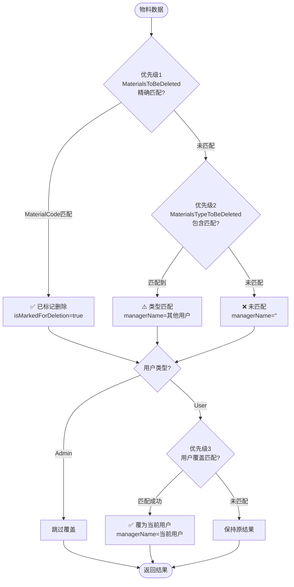

# 物料匹配算法增强 - 用户覆盖匹配功能

**实施日期**: 2026-03-03
**功能版本**: 1.0
**修改文件**: `src/main/ipc/validation-handler.ts`

---

## 功能概述

为 **User 用户类型** 在物料清理界面增加了 **优先级3：用户覆盖匹配** 功能，确保 User 用户能够优先看到并管理与自己关键词匹配的物料。

---

## 实现的更改

### 1. 获取当前用户信息

**位置**: `validation-handler.ts:218-239`

```typescript
// Get current user info
const sessionManager = (
  await import('../services/user/session-manager')
).SessionManager.getInstance()

const userInfo = sessionManager.getUserInfo()
if (!userInfo) {
  return {
    success: false,
    error: '用户未登录',
    stats: {
      totalRecords: 0,
      matchedCount: 0,
      markedCount: 0
    }
  }
}

const isAdmin = userInfo.userType === 'Admin'
const username = userInfo.username

log.info('Starting validation', { mode: request.mode, user: username, isAdmin })
```

**说明**:

- 在 `validation:validate` handler 开始时获取当前登录用户信息
- 提取 `isAdmin` 和 `username` 用于后续匹配逻辑
- 如果用户未登录，返回错误响应

### 2. 新增优先级3：用户覆盖匹配

**位置**: `validation-handler.ts:359-370`

```typescript
// Priority 3: User Override Match (only for non-admin users)
// Override with current user's typeKeyword if available
if (!isAdmin && username) {
  const userKeywords = typeKeywords.filter((tk) => tk.managerName === username)
  for (const userKeyword of userKeywords) {
    if (userKeyword.materialName && materialName.includes(userKeyword.materialName)) {
      matchedTypeKeyword = userKeyword.materialName
      managerName = userKeyword.managerName
      break // Force override with first match
    }
  }
}
```

**匹配逻辑**:

1. **适用范围**: 仅对 `isAdmin === false` 的 User 用户生效
2. **筛选关键词**: 从 `typeKeywords` 中筛选 `managerName === username` 的记录
3. **匹配规则**: 使用 `materialName.includes(userKeyword.materialName)` 包含关系匹配
4. **强制覆盖**: 只要匹配成功，立即覆盖原有的 `managerName` 和 `matchedTypeKeyword`
5. **无匹配时**: 保持优先级2的匹配结果不变

---

## 匹配优先级（更新后）



---

## 测试场景

### 场景1: User 用户匹配到自己的 typeKeyword

**输入**:

- 当前用户: `user1`
- 物料名称: `螺丝 M6`
- MaterialsTypeToBeDeleted: `{ materialName: "螺丝", managerName: "user1" }`

**预期输出**:

```json
{
  "materialName": "螺丝 M6",
  "managerName": "user1",
  "matchedTypeKeyword": "螺丝",
  "isMarkedForDeletion": false
}
```

### 场景2: User 用户覆盖其他用户的匹配

**输入**:

- 当前用户: `user1`
- 物料名称: `螺丝 M6`
- MaterialsTypeToBeDeleted:
  - `{ materialName: "螺丝", managerName: "user2" }`
  - `{ materialName: "螺丝", managerName: "user1" }`

**优先级2结果**: `managerName = "user2"`
**优先级3结果**: `managerName = "user1"` ✅ 强制覆盖

### 场景3: User 用户无匹配关键词

**输入**:

- 当前用户: `user1`
- 物料名称: `螺丝 M6`
- MaterialsTypeToBeDeleted:
  - `{ materialName: "螺丝", managerName: "user2" }`

**预期输出**:

```json
{
  "materialName": "螺丝 M6",
  "managerName": "user2",
  "matchedTypeKeyword": "螺丝",
  "isMarkedForDeletion": false
}
```

**说明**: 保持优先级2的匹配结果

### 场景4: Admin 用户不执行覆盖

**输入**:

- 当前用户: `admin` (isAdmin=true)
- 物料名称: `螺丝 M6`
- MaterialsTypeToBeDeleted:
  - `{ materialName: "螺丝", managerName: "user1" }`
  - `{ materialName: "螺丝", managerName: "admin" }`

**预期输出**:

```json
{
  "materialName": "螺丝 M6",
  "managerName": "user1",
  "matchedTypeKeyword": "螺丝",
  "isMarkedForDeletion": false
}
```

**说明**: Admin 不执行优先级3，保持原有匹配行为

### 场景5: 优先级1匹配不受影响

**输入**:

- 当前用户: `user1`
- 物料代码: `MAT001`
- MaterialsToBeDeleted: `{ materialCode: "MAT001", managerName: "user2" }`

**预期输出**:

```json
{
  "materialCode": "MAT001",
  "managerName": "user2",
  "isMarkedForDeletion": true,
  "matchedTypeKeyword": undefined
}
```

**说明**: 优先级1的精确匹配不受覆盖影响

---

## 数据库配置示例

### MaterialsTypeToBeDeleted 表数据

| MaterialName | ManagerName | 说明                           |
| ------------ | ----------- | ------------------------------ |
| 螺丝         | user1       | user1 负责所有包含"螺丝"的物料 |
| 螺母         | user2       | user2 负责所有包含"螺母"的物料 |
| 垫圈         | user1       | user1 也负责"垫圈"类物料       |
| 电缆         | admin       | admin 负责电缆类物料           |

### 匹配结果示例

| 物料名称 | 当前用户 | 原匹配 (优先级2) | 覆盖后 (优先级3)  |
| -------- | -------- | ---------------- | ----------------- |
| 螺丝 M6  | user1    | user2            | **user1** ✅      |
| 螺母 M8  | user1    | user2            | user2 (无匹配)    |
| 垫圈 φ10 | user1    | user2            | **user1** ✅      |
| 电缆 5m  | user1    | admin            | user1 (无匹配)    |
| 螺丝 M6  | admin    | user2            | user2 (Admin跳过) |

---

## 与前端协同

前端过滤器逻辑 (`CleanerPage.tsx`) 保持不变：

```typescript
const filteredResults = React.useMemo(() => {
  let results = validationResults
  if (!isAdmin && currentUsername) {
    // User 只看到自己的物料 + 未分配的物料
    results = results.filter((r) => r.managerName === currentUsername || !r.managerName)
  }
  return results
}, [validationResults, isAdmin, currentUsername, managers, selectedManagers, hiddenItems])
```

**协同效果**:

1. 后端匹配算法确保 User 用户的物料优先分配给自己
2. 前端过滤器只显示属于当前用户或未分配的物料
3. Admin 用户可以看到所有物料并切换查看不同负责人

---

## 代码审查检查点

- ✅ User 信息获取正确使用 `SessionManager`
- ✅ 只对 `!isAdmin` 的用户执行覆盖逻辑
- ✅ 使用相同的包含匹配规则 `materialName.includes(typeKeyword.materialName)`
- ✅ 优先级1（精确匹配）不受覆盖影响
- ✅ 无匹配时保持原有结果
- ✅ 日志记录包含用户信息 `{ user: username, isAdmin }`
- ✅ 未登录时返回明确的错误信息

---

## 潜在改进方向

1. **性能优化**: 如果 `typeKeywords` 数量很大，可以预先构建 `Map<username, typeKeyword[]>` 索引
2. **日志增强**: 添加覆盖匹配的统计信息（覆盖了多少条记录）
3. **配置开关**: 允许 Admin 用户通过配置启用/禁用覆盖功能
4. **UI 反馈**: 在前端显示哪些物料是通过覆盖匹配分配的

---

## 相关文件

- **实现文件**: `src/main/ipc/validation-handler.ts` (Lines 218-239, 359-370)
- **前端页面**: `src/renderer/src/pages/CleanerPage.tsx`
- **会话管理**: `src/main/services/user/session-manager.ts`
- **类型定义**: `src/main/types/validation.types.ts`

---

**文档结束**
