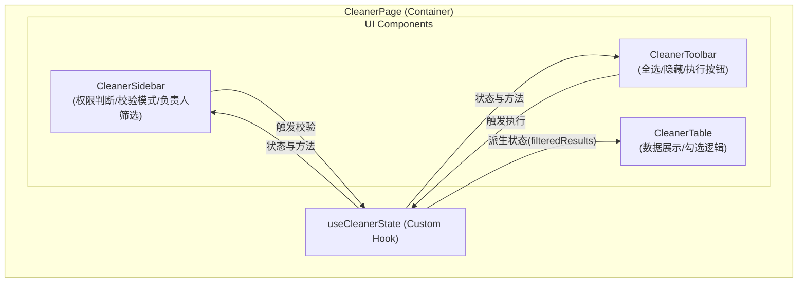
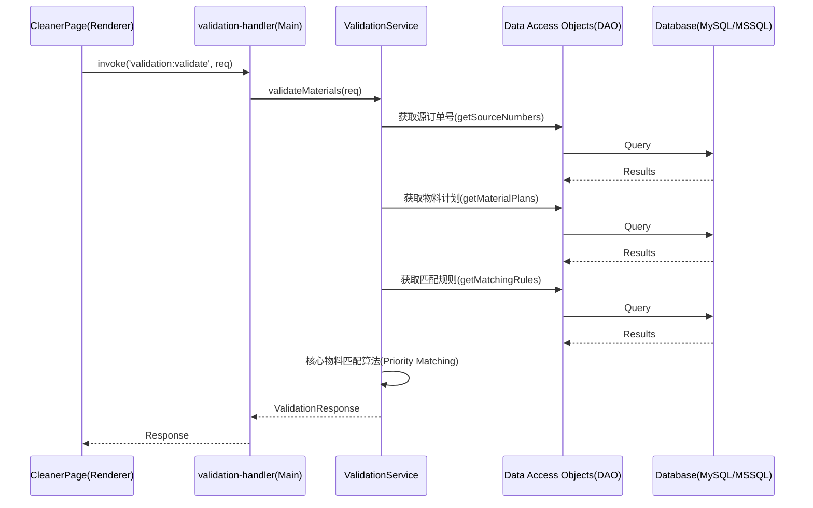

# CleanerPage 及 IPC 通信层优化计划

**文档版本**: 1.0
**目标文件**:
- `src/renderer/src/pages/CleanerPage.tsx`
- `src/main/ipc/validation-handler.ts`

## 1. 现状分析与代码审查

当前代码实现了清理界面的前后端逻辑，包含复杂的业务状态和数据库交互。经过代码审查，发现以下可优化点：

### 1.1 前端 (`CleanerPage.tsx`) 痛点
1. **组件过于庞大**: 单文件超过 400 行，包含了状态管理、业务逻辑（如 `handleConfirmDeletion`, `handleExecuteDeletion`）以及复杂的 UI 渲染（表单、数据表格）。
2. **逻辑耦合严重**: 权限判断 (`isAdmin`)、数据过滤 (`filteredResults` 的 `useMemo`) 和 UI 渲染混合在一起，导致可维护性差。
3. **副作用分散**: 多个 `useEffect` 负责不同的职责（初始化、SessionStorage 同步等），容易产生潜在的竞争或冗余渲染。
4. **状态碎片化**: 存在大量 `useState`，特别是 `selectedItems`、`hiddenItems` 等派生状态，更新逻辑复杂且容易出错。

### 1.2 后端 IPC (`validation-handler.ts`) 痛点
1. **上帝函数 (God Function)**: `validation:validate` handler 函数非常长（近 200 行），处理了数据库连接、模式判断、不同表的查询（物料计划、类型关键字、已标记物料）以及核心的匹配算法。
2. **数据库耦合与重复代码**:
   - `getValidationDatabaseService` 直接使用环境变量，缺乏统一的连接池管理。
   - `isSqlServer` 判断和差异化查询（如 `?` vs `@p0`）散落在各处，尤其是 `getSourceNumbersFromInputs` 和各个 handler 中。
   - `getTableName` 等辅助函数未能很好地封装在统一的工具库中。
3. **职责不清晰**: IPC Handler 理应只负责参数解析和路由，但当前直接包含了大量业务逻辑（特别是匹配算法）和 SQL 查询，违背了单一职责原则（SRP）。
4. **资源释放风险**: 尽管使用了 `try...finally`，但多次连接/断开数据库（如每次请求调用 `getValidationDatabaseService` 然后 `disconnect`）会导致高并发下的性能问题和连接耗尽。

---

## 2. 优化方案与架构重构

### 2.1 前端重构: 组件拆分与状态管理

**目标**: 将单体组件拆分为 **智能组件 (Smart Component)** 和 **展示组件 (Dumb Components)**。

1. **抽离自定义 Hook (`useCleanerState`)**: 将状态管理、初始化、过滤逻辑封装在一个 Hook 中。
2. **拆分 UI 组件**:
   - `CleanerSidebar` (左侧控制面板)
   - `CleanerTable` (右侧数据表格)
   - `CleanerToolbar` (顶部工具栏和底部分页/执行栏)

**前端重构架构图**:

### 2.2 后端重构: 服务分层与职责单一化

**目标**: 引入经典的 Controller - Service - DAO 三层架构，将业务逻辑从 IPC Handler 中抽离。

1. **抽象 ValidationService**: 将匹配算法（优先级匹配）和校验流程移动到专门的 `ValidationService` 类中。
2. **优化数据库访问**:
   - 提取通用的 `DatabaseManager` 管理连接池，避免每次请求频繁创建/销毁连接。
   - 将内联的 SQL 查询和 `isSqlServer` 分支判断下推到对应的 DAO 类中（例如扩展 `DiscreteMaterialPlanDAO` 等）。
3. **瘦身 IPC Handler**: IPC Handler 只负责接收请求参数、调用 Service 层方法、处理异常并返回统一格式的响应。

**后端重构架构图**:

---

## 3. 详细实施计划

### 步骤一：数据库层重构 (DAO & DB Manager)
1. 创建/完善通用的 `DatabaseManager`，统一处理连接池和跨库兼容（处理 `?` 和 `@param`）。
2. 将 `validation-handler.ts` 中散落的 SQL（如 `getSourceNumbersFromInputs` 的逻辑）提取到相应的 DAO 类中。

### 步骤二：业务逻辑层抽象 (Service)
1. 创建 `src/main/services/validation/validation-service.ts`。
2. 将 `validation:validate` 中从行号 250 至 360 左右的业务逻辑迁移到 `ValidationService.validate()`。
3. 保证匹配算法的可测试性，将匹配函数独立出来，便于后续编写单元测试。

### 步骤三：瘦身 IPC Handler
1. 重构 `validation-handler.ts`，使其成为纯粹的路由分发器。
2. 捕获 Service 层抛出的标准化异常，转译为前端友好的错误信息。

### 步骤四：前端组件化与 Hook 化
1. 在 `src/renderer/src/pages/cleaner/` 目录下创建新结构。
2. 提取 `hooks/useCleanerData.ts` 处理初始化、过滤和排序。
3. 提取子组件，通过 props 传递 `useCleanerData` 返回的状态和操作方法。

---

## 4. 预期收益

1. **可维护性提升**: 代码行数大幅减少，核心逻辑（特别是物料匹配）更易于阅读和修改。
2. **可测试性增强**: 业务逻辑与框架解耦，可以方便地对 `ValidationService` 编写 Jest 单元测试。
3. **性能改善**: 数据库连接池的引入解决了频繁建立连接的开销，避免资源泄漏。
4. **前端性能**: 拆分组件可以避免不必要的大规模重新渲染（如仅勾选一个 Checkbox 时，无需重新渲染左侧边栏）。