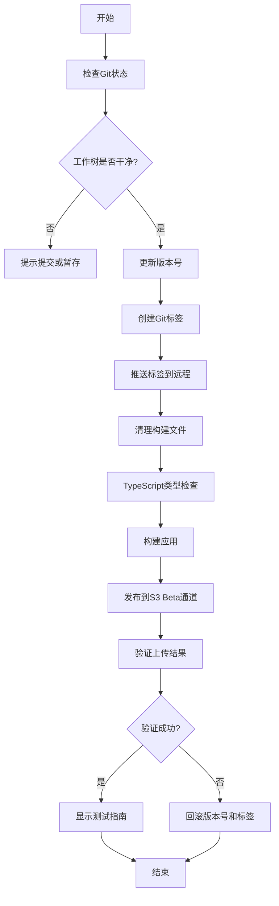

# Beta版本自动更新发布设计

**日期**: 2026-03-18
**状态**: 已批准
**版本**: 1.3.1-beta.0

## 📋 需求概述

发布ERPAuto的第一个支持自动更新功能的Beta版本，验证完整的更新流程。

### 核心需求
- **发布通道**: Beta（测试版，仅管理员可见）
- **版本号**: 1.3.1-beta.0（语义化版本）
- **Git标签**: 自动创建并推送 v1.3.1-beta.0 标签
- **测试验证**: 完整测试流程（发布→安装旧版本→检查更新→安装→回滚）

## 🎯 发布方案

采用**自动化发布脚本**方案，实现一键发布。

### 优势
- ✅ 一键执行，减少人为错误
- ✅ 自动处理版本号、标签、构建、发布
- ✅ 可重复使用
- ✅ 包含完整的测试验证步骤

## 🏗️ 架构设计

### 文件结构
```
scripts/
├── publish-beta.js          # Beta版本发布脚本（主脚本）
└── publish-utils.js         # 发布工具函数（可复用）
```

### 核心功能模块

#### 1. 版本管理模块
- 读取当前版本号
- 更新package.json版本号
- 创建Git标签
- 推送标签到远程

#### 2. 构建发布模块
- 清理旧的构建文件
- 执行TypeScript类型检查
- 运行electron-vite build
- 调用electron-builder发布到S3
- 指定channel=beta

#### 3. 验证模块
- 检查package.json版本号是否更新
- 验证Git标签是否创建
- 确认S3文件是否上传成功
- 检查latest.yml文件格式

#### 4. 测试指导模块
- 生成测试步骤清单
- 提供回滚命令
- 显示验证URL和文件路径

## 📊 执行流程



## 🛡️ 错误处理策略

### 1. 版本号冲突
- 检查标签是否已存在
- 提示使用新版本号或删除旧标签

### 2. 构建失败
- 回滚版本号
- 删除本地标签
- 保留错误日志供诊断

### 3. 上传失败
- 保留构建文件
- 提供重试命令
- 显示详细错误信息

### 4. 验证失败
- 回滚所有更改
- 提供诊断信息
- 建议手动检查S3配置

## 📤 预期输出

### 成功输出
```bash
✅ 发布成功！

📦 版本信息:
   版本号: 1.3.1-beta.0
   Git标签: v1.3.1-beta.0
   发布通道: beta

📤 S3上传文件:
   - updates/beta/erpauto-1.3.1-beta.0-setup.exe
   - updates/beta/latest-beta.yml

🧪 测试步骤:
   1. 安装旧版本 v1.3.0
   2. 启动应用，使用管理员账号登录
   3. 进入设置页面，确认当前在Beta通道
   4. 点击"检查更新"按钮
   5. 验证更新检测、下载、安装流程

🔄 回滚命令:
   git checkout dev
   git tag -d v1.3.1-beta.0
   git push origin :refs/tags/v1.3.1-beta.0
```

## 🧪 测试验证流程

### 1. S3文件验证
- 检查 `erpauto/updates/beta/` 目录
- 验证 `latest-beta.yml` 存在且格式正确
- 确认安装包文件完整

### 2. 更新功能测试
- 安装 v1.3.0 版本
- 使用管理员账号登录
- 进入设置页面
- 确认当前在Beta通道
- 点击"检查更新"
- 验证更新检测、下载、安装流程

### 3. 回滚清理
- 测试完成后切回dev分支
- 清理测试环境
- 记录测试结果

## 🔄 回滚策略

如果发布或测试失败：

```bash
# 1. 删除远程标签
git push origin :refs/tags/v1.3.1-beta.0

# 2. 删除本地标签
git tag -d v1.3.1-beta.0

# 3. 恢复package.json版本号
git checkout package.json

# 4. 切换回开发分支
git checkout dev
```

## 📝 后续改进

- [ ] 添加stable通道发布脚本
- [ ] 实现自动化测试集成
- [ ] 添加发布通知功能
- [ ] 创建版本变更日志生成器
- [ ] 集成CI/CD自动化发布
