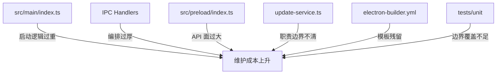
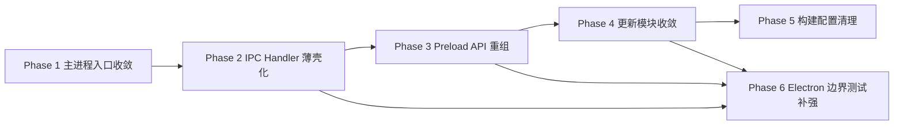

# Electron 最佳实践优化计划

本文档基于 `$electron-best-practices` 对当前项目的审查结果整理而成，目标不是一次性重构整个 Electron 应用，而是按照“低风险、可验证、逐步收敛”的方式，分阶段提升主进程、preload、IPC、更新模块和工程配置的可维护性。

## 1. 计划背景

当前项目已经具备了较好的 Electron 基础结构：

- 主进程、preload、renderer 三层已分离
- Renderer 通过 `contextBridge` 暴露能力
- IPC 统一采用 `invoke/handle` 模式
- 大部分主进程能力已经模块化到 `ipc/` 与 `services/`

但从长期维护角度看，项目仍存在几个明显问题：

- `src/main/index.ts` 入口文件承担职责过多
- 部分 IPC handler 仍然是“厚编排层”
- `src/preload/index.ts` 更像“接口总表”，不是按领域划分的 facade
- 更新链路实现较重，边界尚不清晰
- 打包配置存在模板残留，容易误导维护者
- Electron 边界层测试尚未系统化

## 2. 优化目标

本轮优化聚焦以下目标：

- 让主进程入口只负责启动顺序，不承载业务细节
- 让 IPC handler 回归“薄壳”，把编排逻辑下沉到应用服务层
- 让 preload API 按业务领域组织，而不是按主进程实现镜像
- 收敛更新模块的职责边界，降低后续维护复杂度
- 清理打包与发布配置中的模板残留
- 为 Electron 边界补足更稳定的测试支撑

## 3. 优化范围

本计划优先处理 Electron 工程化与可维护性问题，不把安全性作为唯一优先目标，但会顺带处理那些同时影响可维护性的边界设计问题。

本次计划重点覆盖：

- 主进程启动与应用初始化
- IPC handler 与 application service 分层
- preload API 结构
- 更新模块
- 打包配置
- Electron 边界层测试

暂不作为本轮首要目标：

- 大规模 UI 重构
- 业务流程重写
- ERP 自动化细节重构

## 4. 当前问题总览

## 5. 分阶段执行计划

### Phase 1: 收敛主进程入口

目标：

- 让 `src/main/index.ts` 只表达启动顺序
- 把运行时检查、窗口创建、异常守卫、模块初始化拆到独立函数或模块

建议涉及文件：

- `src/main/index.ts`
- `src/main/bootstrap/` 下新增或调整模块

建议拆分方向：

- `bootstrapApp()`
- `createMainWindow()`
- `setupProcessGuards()`
- `verifyPlaywrightRuntime()`
- `initializeAppServices()`

预期收益：

- 降低入口文件修改风险
- 提高启动问题排查效率
- 为多窗口、多实例策略预留更清晰的扩展点

风险等级：

- 低到中

验证方式：

- 应用冷启动成功
- 窗口创建与关闭流程正常
- 异常日志、更新初始化、IPC 注册行为不回归

### Phase 2: 让 IPC Handler 回归薄壳

目标：

- 把 `cleaner-handler`、`auth-handler` 这类厚编排层下沉到应用服务
- 明确 handler、application service、infrastructure service 的职责边界

建议涉及文件：

- `src/main/ipc/cleaner-handler.ts`
- `src/main/ipc/auth-handler.ts`
- `src/main/ipc/update-handler.ts`
- `src/main/services/`

建议拆分方向：

- `CleanerApplicationService`
- `AuthApplicationService`
- `UpdateApplicationService`

handler 只负责：

- 接收请求
- 调用 service
- 映射返回结构
- 统一错误包装

预期收益：

- 提升主进程业务编排的可测试性
- 降低 handler 文件复杂度
- 让业务流程更容易被复用和替换

风险等级：

- 中

验证方式：

- 关键 IPC 流程回归测试
- 原有 renderer 调用协议保持不变
- 清理、登录、更新等主流程手动验收通过

### Phase 3: 重组 Preload API

目标：

- 把 `src/preload/index.ts` 从“大总表”改造成“按领域组织的 facade”
- 稳定 renderer 对 Electron 能力的访问边界

建议涉及文件：

- `src/preload/index.ts`
- `src/preload/index.d.ts`
- `src/main/types/`

建议拆分方向：

- `authApi`
- `cleanerApi`
- `updateApi`
- `reportApi`
- `fileApi`

建议原则：

- renderer 只拿到业务语义接口
- preload 不原样映射主进程实现细节
- 类型定义集中管理，避免 renderer 和 main 双边漂移

预期收益：

- 降低渲染层对 IPC 细节的耦合
- 提高 preload 的可读性和可扩展性
- 为后续做 runtime schema 校验打基础

风险等级：

- 中

验证方式：

- `npm run typecheck`
- preload surface 测试通过
- 主要页面功能回归正常

### Phase 4: 收敛更新模块边界

目标：

- 把更新服务中的下载、状态管理、安装协调、日志处理边界进一步明确
- 降低自定义更新链路的维护成本

建议涉及文件：

- `src/main/services/update/update-service.ts`
- `src/main/ipc/update-handler.ts`
- `src/main/types/`

建议拆分方向：

- `UpdateStateMachine`
- `UpdateDownloadService`
- `UpdateInstallCoordinator`
- `UpdateEventBridge`

预期收益：

- 更新问题更容易定位
- 状态流转更容易测试
- 后续切换更新策略时影响面更小

风险等级：

- 中到高

验证方式：

- 更新检查、下载、安装提示链路验证
- 状态事件顺序测试
- 失败重试与异常日志验证

### Phase 5: 清理打包与发布配置

目标：

- 让构建配置更贴近当前项目实际维护范围
- 清理无效、模板化或误导性的配置项

建议涉及文件：

- `electron-builder.yml`
- `package.json`
- `scripts/` 下发布相关脚本
- `docs/releases/` 与构建说明文档

重点检查项：

- 实际支持的平台范围
- 发布目标与渠道
- 无关权限说明
- Windows 优先配置是否清晰

预期收益：

- 降低发版配置理解成本
- 减少“看似支持、实际无人维护”的伪能力
- 让发布文档与配置保持一致

风险等级：

- 低

验证方式：

- 本地构建通过
- 发布脚本执行链路无回归
- 文档与配置一致性核对完成

### Phase 6: 补强 Electron 边界层测试

目标：

- 让最容易劣化的 Electron 边界层拥有稳定回归保护

建议涉及文件：

- `tests/unit/preload-surface.test.ts`
- `tests/unit/ipc-index.test.ts`
- 新增 `tests/unit/update-service.*`
- 新增 `tests/unit/cleaner-handler.*`
- 新增 `tests/unit/auth-handler.*`

优先补测内容：

- 主进程启动编排
- preload surface 稳定性
- IPC 返回包装与错误路径
- update service 状态迁移
- handler 与 service 交互边界

预期收益：

- 降低后续拆分时的回归风险
- 提升主进程重构信心
- 让 Electron 工程层而非仅业务工具层获得测试保护

风险等级：

- 低

验证方式：

- 单元测试通过
- 关键流程 smoke test 通过

## 6. 推荐执行顺序

建议优先顺序：

1. 先做主进程入口收敛
2. 再做 IPC handler 薄壳化
3. 然后重组 preload API
4. 再处理更新模块
5. 清理打包配置
6. 在每一阶段同步补强测试

说明：

- `Phase 1` 与 `Phase 2` 性价比最高
- `Phase 3` 适合在 handler 边界稳定后推进
- `Phase 4` 风险相对更高，应放在前面边界清晰后再处理
- `Phase 6` 不应完全放到最后，建议伴随每阶段一起推进

## 7. 每阶段完成标准

每一阶段建议采用统一完成标准：

- 相关模块职责边界变清晰
- 对外接口保持兼容或完成显式迁移
- `npm run lint` 通过
- `npm run typecheck` 通过
- 相关单元测试通过
- 关键手工路径验证完成
- 对应文档同步更新

## 8. 本计划与现有重构工作的衔接

当前已经完成的两轮重构：

- `validation-handler` 第一阶段拆分
- `useCleaner` 第一阶段拆分

它们为本计划提供了两个基础：

- 团队已经验证“先拆超大文件，再保持对外行为不变”的策略可行
- 后续继续拆 `cleaner-handler`、`preload`、`App` 时，可以沿用相同方法论

因此，Electron 向优化建议优先从主进程和边界层继续推进，而不是立刻进入更深的 UI 重构。

## 9. 后续建议

建议后续执行方式如下：

1. 先按本计划完成 `Phase 1`
2. 每完成一个阶段，单独补一份重构说明文档
3. 每个阶段单独提交，避免一次性大改
4. 每阶段结束后重新运行 `lint`、`typecheck` 和对应测试

如果后续决定正式执行，本计划可作为 Electron 工程化重构的主索引文档持续维护。
