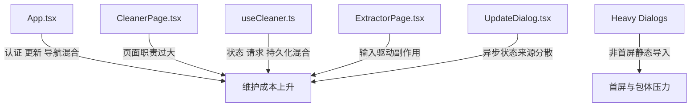
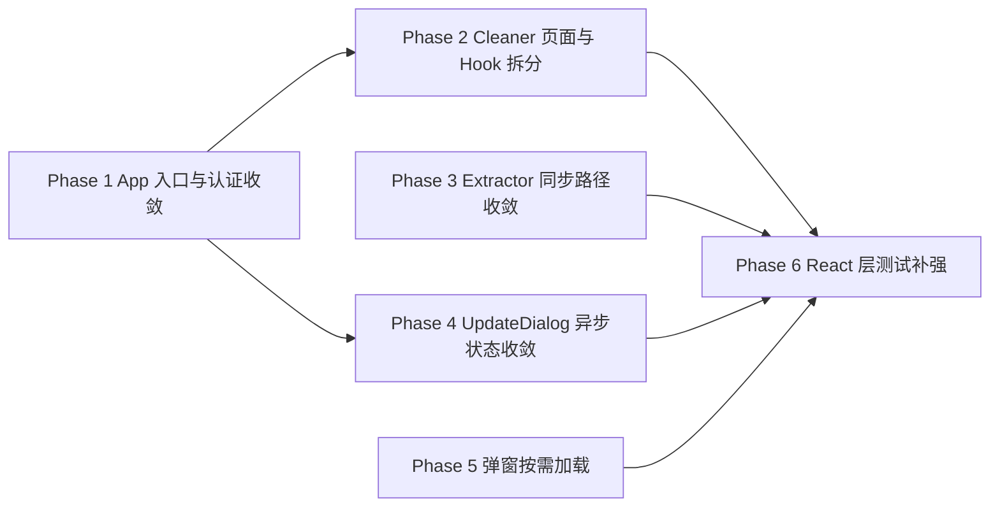

# React 最佳实践优化计划

本文档基于 `$vercel-react-best-practices` 对当前项目 React 渲染层的审查结果整理而成，目标不是立刻重写页面，而是按“先收敛数据流，再拆重型组件，最后做体验与性能微调”的顺序，逐步降低渲染层维护成本。

## 1. 审查背景

当前项目的 React 层已经具备一些不错的基础：

- 页面与 Electron 主进程通过 preload facade 通信
- 关键业务已经逐步抽到 hook 和 service
- `Cleaner` 相关逻辑已经做过第一轮拆分
- 更新、认证、日志、校验等流程已有一定模块意识

但从 `$vercel-react-best-practices` 的角度看，当前主要问题仍集中在：

- 页面容器组件承担过多状态与副作用
- 大 hook 同时管理初始化、交互状态、远程请求、持久化
- effect 数量偏多，且存在“启动时拉很多东西、认证后再拉一遍”的流程
- 重型 UI 区块还没有进一步拆成可稳定复用的小边界
- 某些异步请求与 UI 更新仍可进一步并行化、延后 await 或降低重渲染范围

## 2. Skill 视角下的主要问题

### 2.1 高优先级: `App.tsx` 仍是重型入口容器

涉及文件：

- `src/renderer/src/App.tsx`

问题表现：

- 认证初始化、更新订阅、页面导航、顶部壳层、登录/选人/更新弹窗都集中在一个组件里
- `initializeAuth()` 同时负责获取机器名、silent login、admin 用户分流、错误兜底
- `useEffect` 和回调之间仍有较强耦合，后续继续扩展容易变成新的“前端编排中心”

与 skill 对应：

- `rerender-split-combined-hooks`
- `rerender-move-effect-to-event`
- `advanced-init-once`

建议方向：

- 抽出 `useAppBootstrap`
- 抽出 `useUpdateController`
- 把顶部壳层拆成 `AppShell`
- 把未认证态与已认证态拆成两条渲染分支组件

### 2.2 高优先级: `CleanerPage` + `useCleaner` 仍然是“大页面 + 大 hook”模式

涉及文件：

- `src/renderer/src/pages/CleanerPage.tsx`
- `src/renderer/src/hooks/useCleaner.ts`

问题表现：

- `CleanerPage` 同时渲染左侧筛选区、顶部工具栏、结果表格、底部执行区和多个弹窗
- `useCleaner` 同时承担权限初始化、sessionStorage 同步、配置加载、进度订阅、校验请求、导出、执行删除、内联编辑、确认弹窗状态
- hook 返回面非常大，页面对 hook 的内部结构有明显耦合

与 skill 对应：

- `rerender-split-combined-hooks`
- `rerender-derived-state-no-effect`
- `rerender-no-inline-components`
- `rendering-content-visibility`

建议方向：

- `useCleanerPageState`
- `useCleanerExecution`
- `useCleanerSelection`
- `CleanerSidebar`
- `CleanerToolbar`
- `CleanerResultsTable`
- `CleanerExecutionBar`

### 2.3 中优先级: `ExtractorPage` 里存在“输入变化即触发跨模块副作用”的同步路径

涉及文件：

- `src/renderer/src/pages/ExtractorPage.tsx`

问题表现：

- `orderNumbers` 每次变化都会写 `sessionStorage`
- 同时每次变化都会调用 `window.electron.validation.setSharedProductionIds()` 或 `clearSharedProductionIds()`
- 这条路径把“输入态”和“共享业务态”绑得很紧，后续如果输入组件更复杂，容易造成高频桥接调用

与 skill 对应：

- `rerender-move-effect-to-event`
- `client-localstorage-schema`
- `js-cache-storage`

建议方向：

- 只在“格式化完成 / 用户提交 / debounce 稳定后”同步共享订单号
- 把 sessionStorage 读写抽到专门 persistence helper
- 为共享 Production ID 增加单独同步入口，而不是输入 effect 隐式触发

### 2.4 中优先级: 更新对话框的异步拉取和状态切换还可以再收敛

涉及文件：

- `src/renderer/src/components/UpdateDialog.tsx`
- `src/renderer/src/App.tsx`

问题表现：

- `App` 负责状态订阅和 catalog/status 刷新
- `UpdateDialog` 内部再负责根据选中版本拉 changelog
- 当前实现是可工作的，但状态来源分散，后续容易出现 “catalog 变了 / changelog 还在旧请求中” 的边界问题

与 skill 对应：

- `async-defer-await`
- `async-parallel`
- `rerender-dependencies`
- `rendering-usetransition-loading`

建议方向：

- 建立 `useUpdateDialogState`
- catalog/status/changelog 分层管理
- 选版本后的 changelog 拉取用请求标识或最新值保护
- 对切换版本时的 UI 更新引入 `startTransition`

### 2.5 中优先级: 页面级异步初始化还缺少统一“启动编排 hook”

涉及文件：

- `src/renderer/src/App.tsx`
- `src/renderer/src/hooks/useCleaner.ts`
- `src/renderer/src/pages/ExtractorPage.tsx`

问题表现：

- 认证初始化、Cleaner 初始化、配置加载、进度订阅分别散在多个组件和 hook 的 `useEffect` 中
- 目前逻辑可读，但入口分散，出现启动问题时需要在多个位置来回追

与 skill 对应：

- `advanced-init-once`
- `async-parallel`
- `rerender-split-combined-hooks`

建议方向：

- `useAppBootstrap`
- `useCleanerBootstrap`
- 把“初始加载”“事件订阅”“持久化恢复”拆成更小的 effect 组

### 2.6 中优先级: 组件树里还有一些可延迟加载的重型弹窗

涉及文件：

- `src/renderer/src/App.tsx`
- `src/renderer/src/pages/CleanerPage.tsx`
- `src/renderer/src/components/UpdateDialog.tsx`
- `src/renderer/src/components/ReportViewerDialog.tsx`
- `src/renderer/src/components/ExecutionReportDialog.tsx`
- `src/renderer/src/components/MaterialTypeManagementDialog.tsx`

问题表现：

- 多个重型弹窗在页面初始渲染时就参与静态导入
- 像 `ReportViewerDialog`、Markdown 渲染、报告浏览、类型管理这类功能明显不是首屏关键路径

与 skill 对应：

- `bundle-dynamic-imports`
- `bundle-conditional`
- `bundle-defer-third-party`

建议方向：

- 对非首屏弹窗引入 `React.lazy`
- 在用户点击前后再加载重型内容
- 优先收敛 `ReportViewerDialog` 与 `UpdateDialog`

## 3. 当前问题总览

## 4. 优化目标

本轮 React 向优化聚焦以下目标：

- 让页面容器组件回归“组装层”
- 让 hook 边界按职责拆清，不再兼做状态、初始化、请求和交互编排
- 让跨模块副作用从输入/渲染 effect 中收敛到更稳定的事件或 bootstrap 层
- 让重型弹窗按需加载，减少首屏包体负担
- 让异步加载流程更并行、更可追踪、更容易测试

## 5. 分阶段执行计划

### Phase 1: 收敛应用入口与认证启动流

目标：

- 把 `App.tsx` 从“大容器”拆成更清晰的组装层
- 明确认证、更新、壳层 UI 的职责边界

建议涉及文件：

- `src/renderer/src/App.tsx`
- `src/renderer/src/hooks/useAuth.ts`
- `src/renderer/src/hooks/useLogger.ts`
- 新增 `src/renderer/src/hooks/useAppBootstrap.ts`
- 新增 `src/renderer/src/components/app/`

建议拆分方向：

- `useAppBootstrap()`
- `AuthenticatedApp`
- `UnauthenticatedApp`
- `AppShell`
- `UpdateEntryButton`

预期收益：

- 减少 `App.tsx` 的状态面
- 降低启动 effect 的复杂度
- 让认证与更新逻辑更容易测试

风险等级：

- 中

验证方式：

- silent login / 登录 / 管理员选人流程回归正常
- 更新状态订阅正常
- `npm run typecheck` 与相关测试通过

### Phase 2: 拆分 `CleanerPage` 与 `useCleaner`

目标：

- 进一步拆解 Cleaner 的页面结构和 hook 职责
- 降低单个 hook / 页面承载的状态数量

建议涉及文件：

- `src/renderer/src/pages/CleanerPage.tsx`
- `src/renderer/src/hooks/useCleaner.ts`
- `src/renderer/src/hooks/cleaner/`
- 新增 `src/renderer/src/components/cleaner/`

建议拆分方向：

- `useCleanerBootstrap`
- `useCleanerSelection`
- `useCleanerExecution`
- `CleanerSidebar`
- `CleanerToolbar`
- `CleanerResultsTable`
- `CleanerExecutionFooter`

预期收益：

- 降低重渲染范围
- 提高 Cleaner 页面可读性
- 为表格和执行区单独补测试创造条件

风险等级：

- 中到高

验证方式：

- 校验、筛选、勾选、编辑负责人、执行删除、导出流程手工验证
- `cleaner` 相关单测通过

### Phase 3: 收敛 Extractor 与共享 Production ID 同步

目标：

- 把输入态和共享业务态解耦
- 降低输入变化带来的高频副作用

建议涉及文件：

- `src/renderer/src/pages/ExtractorPage.tsx`
- `src/renderer/src/hooks/useExtractor.ts`
- 新增 `src/renderer/src/hooks/useSharedProductionIds.ts`
- 新增 `src/renderer/src/lib/session-storage/`

建议拆分方向：

- 仅在提交或 debounce 后同步共享 ID
- 抽出 `usePersistentTextState`
- 把 sessionStorage 与 Electron bridge 副作用集中管理

预期收益：

- 提高输入响应稳定性
- 降低桥接调用频率
- 更符合“interaction in event handlers, not passive effects”的原则

风险等级：

- 低到中

验证方式：

- 提取页输入、重置、共享订单号联动正常
- Cleaner 过滤模式仍能读取共享订单号

### Phase 4: 收敛更新弹窗与异步加载路径

目标：

- 把 `UpdateDialog` 的异步状态切换和版本详情拉取独立出来
- 降低 `App` 与弹窗之间的状态耦合

建议涉及文件：

- `src/renderer/src/components/UpdateDialog.tsx`
- `src/renderer/src/App.tsx`
- 新增 `src/renderer/src/hooks/useUpdateDialogState.ts`

建议拆分方向：

- `useUpdateCatalog`
- `useReleaseChangelog`
- 版本切换时用 `startTransition`
- changelog 拉取加最新请求保护

预期收益：

- 更新弹窗行为更稳定
- 降低状态竞争和旧请求覆盖新状态的风险
- 提升大型 Markdown 内容切换时的交互流畅度

风险等级：

- 中

验证方式：

- User/Admin 更新流程验证
- 版本切换与 changelog 展示正常

### Phase 5: 做弹窗与重型模块按需加载

目标：

- 把非首屏关键弹窗改成按需加载
- 降低 renderer 初始包体

建议涉及文件：

- `src/renderer/src/App.tsx`
- `src/renderer/src/pages/CleanerPage.tsx`
- `src/renderer/src/components/ReportViewerDialog.tsx`
- `src/renderer/src/components/MaterialTypeManagementDialog.tsx`
- `src/renderer/src/components/ExecutionReportDialog.tsx`
- `src/renderer/src/components/UpdateDialog.tsx`

建议拆分方向：

- `React.lazy`
- 懒加载弹窗容器
- 打开前预加载关键模块

预期收益：

- 降低首屏 JS 负担
- 让常用流程优先加载

风险等级：

- 低

验证方式：

- 首屏功能正常
- 弹窗首次打开正常
- 打包后 smoke test 正常

### Phase 6: 补强 React 渲染层测试

目标：

- 给这轮 React 收敛提供稳定回归保护

建议涉及文件：

- 新增 `App` 相关组件测试
- 新增 `CleanerPage` / `useCleaner` 相关测试
- 新增 `UpdateDialog` 状态流测试
- 新增 `ExtractorPage` 共享订单号同步测试

优先补测内容：

- 认证启动分支
- 更新弹窗状态切换
- Cleaner 筛选与执行状态切换
- Extractor 输入与共享 ID 同步

预期收益：

- 降低后续 UI/状态重构风险
- 提高页面容器层的修改信心

风险等级：

- 低

验证方式：

- 单元测试 / 组件测试通过
- 关键页面 smoke test 正常

## 6. 推荐执行顺序

建议优先顺序：

1. 先做 `App` 入口与认证启动流收敛
2. 再做 `CleanerPage + useCleaner`
3. 然后收敛 `ExtractorPage` 的共享 ID 同步
4. 再处理 `UpdateDialog`
5. 最后做弹窗按需加载
6. 测试补强贯穿整个过程

## 7. 每阶段完成标准

每一阶段建议采用统一完成标准：

- 页面或 hook 的职责边界明显变清晰
- 对外行为保持兼容
- `npm run typecheck` 通过
- 相关单元测试 / 组件测试通过
- 关键页面功能手工验证通过
- 对应说明文档同步更新

## 8. 与现有重构工作的衔接

当前已经完成的工作为这轮 React 优化提供了基础：

- `validation-handler` 已拆成更清晰的主进程结构
- `useCleaner` 已做过第一轮内部 helpers/api 抽离
- Electron 侧 preload、update、handler、bootstrap 已经收敛

这意味着 React 侧现在可以更放心地继续拆：

- 页面入口不会再同时背负太多主进程耦合
- 更新弹窗可以直接依托已收敛的 update service / preload facade
- Cleaner 页面可以聚焦 UI 与状态，不必再同时处理主进程边界混乱问题

## 9. 后续建议

建议执行方式如下：

1. 先从 `Phase 1` 开始，优先收敛 `App.tsx`
2. 每完成一个阶段，单独提交
3. 对 `Cleaner` 和 `UpdateDialog` 每完成一轮都补测试
4. 在大页面拆分后，再做 bundle 与懒加载优化

如果后续决定正式执行，本计划可作为 React 渲染层重构的主索引文档持续维护。
