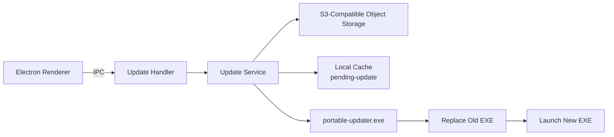
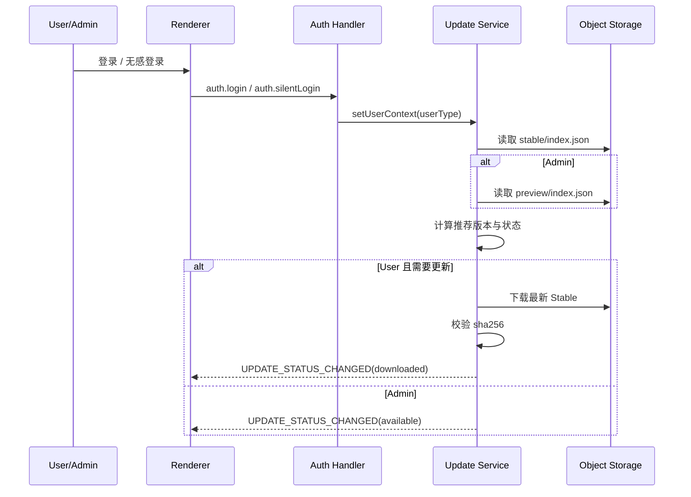
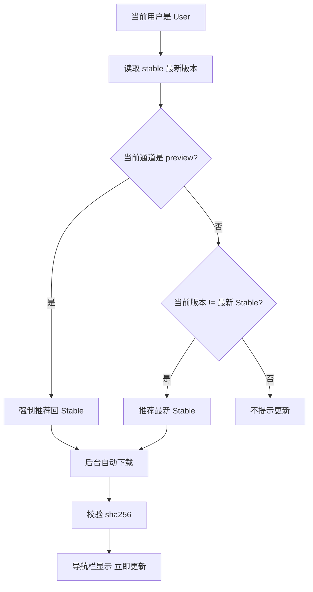
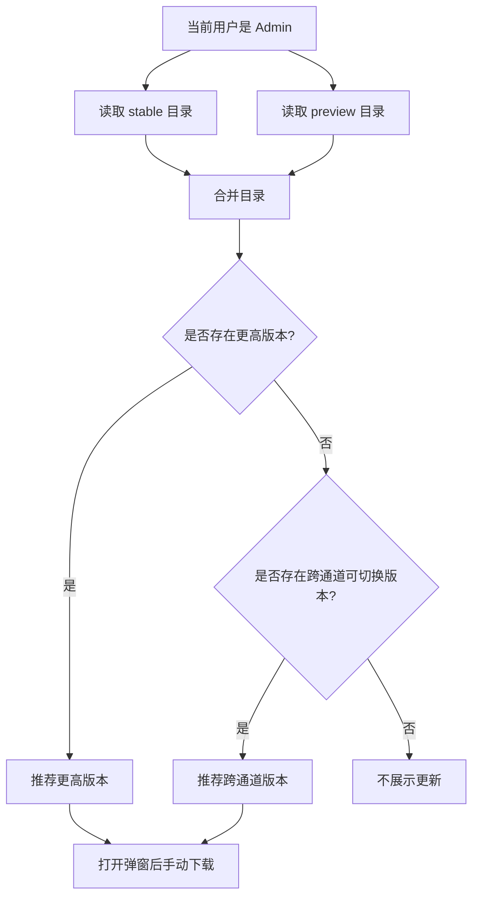
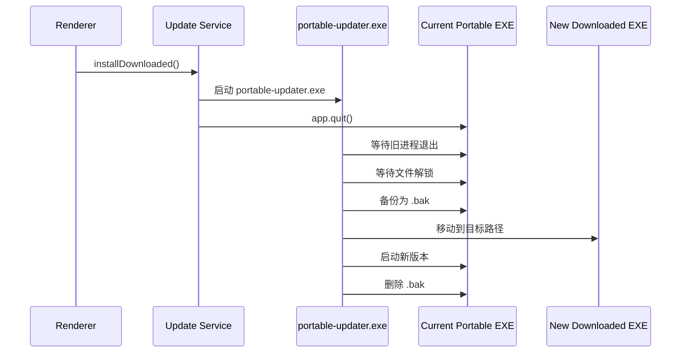
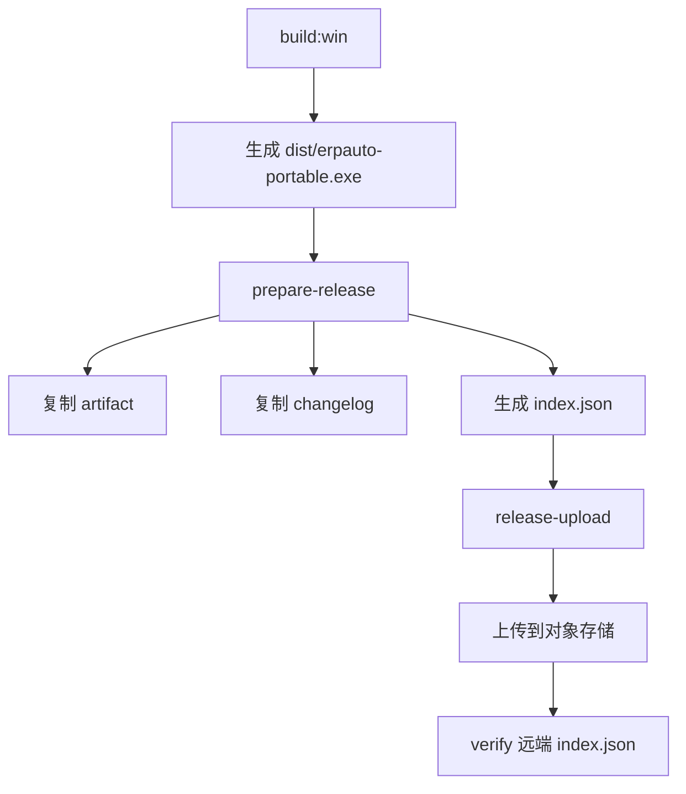

# ERPAuto 便携版自动更新说明

## 概览

当前实现的是一套面向 Windows 便携版的自定义更新系统，核心特点如下：

- 基于 S3 兼容对象存储分发更新包
- 按登录用户角色决定更新通道和行为
- `User` 只跟随 `Stable`
- `Admin` 同时可见 `Stable` 和 `Preview`
- 更新包可后台下载，但安装必须由用户触发
- 安装阶段使用独立的原生 `portable-updater.exe` 完成 exe 替换

## 核心组件

- 主进程更新服务
  路径：[`src/main/services/update/update-service.ts`](/d:/FileLib/Projects/CodeMigration/ERPAuto/src/main/services/update/update-service.ts)
- 更新规则工具
  路径：[`src/main/services/update/update-utils.ts`](/d:/FileLib/Projects/CodeMigration/ERPAuto/src/main/services/update/update-utils.ts)
- 更新 IPC
  路径：[`src/main/ipc/update-handler.ts`](/d:/FileLib/Projects/CodeMigration/ERPAuto/src/main/ipc/update-handler.ts)
- 前端更新弹窗
  路径：[`src/renderer/src/components/UpdateDialog.tsx`](/d:/FileLib/Projects/CodeMigration/ERPAuto/src/renderer/src/components/UpdateDialog.tsx)
- 前端更新入口
  路径：[`src/renderer/src/App.tsx`](/d:/FileLib/Projects/CodeMigration/ERPAuto/src/renderer/src/App.tsx)
- 原生更新器
  路径：[`build/PortableUpdater.cs`](/d:/FileLib/Projects/CodeMigration/ERPAuto/build/PortableUpdater.cs)
- 更新器编译脚本
  路径：[`scripts/compile-updater.js`](/d:/FileLib/Projects/CodeMigration/ERPAuto/scripts/compile-updater.js)
- 发布准备脚本
  路径：[`scripts/prepare-release.js`](/d:/FileLib/Projects/CodeMigration/ERPAuto/scripts/prepare-release.js)
- 发布上传脚本
  路径：[`scripts/upload-release.js`](/d:/FileLib/Projects/CodeMigration/ERPAuto/scripts/upload-release.js)

## 角色策略

### `User`

- 只读取 `stable/index.json`
- 目标版本永远是最新 `Stable`
- 如果当前客户端是 `Preview`，即使本地版本号更高，也会被视为“需要更新回稳定版”
- 后台会自动下载推荐的 `Stable`
- 用户点击后执行安装

### `Admin`

- 同时读取 `stable/index.json` 和 `preview/index.json`
- 不自动下载
- 只展示可选版本和更新说明
- 由管理员手动选择版本并触发下载、安装

## 当前安装包身份

构建时会注入 `__APP_CHANNEL__`，用于标识当前客户端自身是 `stable` 还是 `preview`。

这个值的作用非常关键：

- 决定 `User` 是否需要从 `Preview` 洗回 `Stable`
- 决定 `Admin` 当前处于哪条版本线
- 决定更新弹窗中当前通道的展示

相关声明：

- [`src/shared/app-env.d.ts`](/d:/FileLib/Projects/CodeMigration/ERPAuto/src/shared/app-env.d.ts)
- [`src/renderer/src/env.d.ts`](/d:/FileLib/Projects/CodeMigration/ERPAuto/src/renderer/src/env.d.ts)

## 远端目录结构

更新目录按通道分开：

```text
updates/win-portable/stable/index.json
updates/win-portable/stable/artifacts/erpauto-<version>-stable-portable.exe
updates/win-portable/stable/changelogs/<version>.md

updates/win-portable/preview/index.json
updates/win-portable/preview/artifacts/erpauto-<version>-preview-portable.exe
updates/win-portable/preview/changelogs/<version>.md
```

`index.json` 的每个条目至少包含：

- `version`
- `channel`
- `artifactKey`
- `sha256`
- `size`
- `publishedAt`
- `changelogKey`
- `notesSummary`

## 总体架构图



## 登录后的更新时序



## `User` 更新决策图



## `Admin` 更新决策图



## 安装阶段时序



## 本地目录与日志

### 下载缓存

```text
%APPDATA%\erpauto\pending-update\
```

### 更新器运行文件与日志

```text
%APPDATA%\erpauto\updates\
  portable-updater.exe
  portable-update.log
  portable-launch.log
```

## 发布流程

### 1. 构建

```powershell
$env:APP_CHANNEL="stable"
npm run build:win
```

### 2. 准备发布目录

```powershell
node scripts/prepare-release.js --channel stable --changelog docs/releases/1.3.2-rebuild.md
```

### 3. 上传到对象存储

```powershell
npm run release:upload -- --channel stable --verify
```

## 发布流程图



## 版本排序规则

为了避免“后发布低版本覆盖高版本”的问题，当前排序规则是：

- 优先按版本号降序
- 同版本再按 `publishedAt` 降序

这条规则同时存在于：

- [`src/main/services/update/update-utils.ts`](/d:/FileLib/Projects/CodeMigration/ERPAuto/src/main/services/update/update-utils.ts)
- [`scripts/prepare-release.js`](/d:/FileLib/Projects/CodeMigration/ERPAuto/scripts/prepare-release.js)

## 失败保护

当前实现包含这些基本保护：

- 缺失 `preview/index.json` 时，按空列表处理，不中断整体更新检查
- 更新包下载完成后必须校验 `sha256`
- `portable-updater.exe` 会等待旧进程退出和目标文件解锁
- 替换前先备份旧 exe 为 `.bak`
- 替换失败时尝试回滚

## 当前已验证通过的能力

- `1.3.1 -> 1.3.2` 的 `Stable` 发布链路已打通
- 新分支实现能够成功构建 Windows 便携版
- 原生 `portable-updater.exe` 能成功编译并被打包带入资源目录
- 本地发布目录生成正常
- 上传脚本可将更新包和索引发布到对象存储
- 客户端真实升级流程已验证通过

## 后续可继续优化的点

- 将 `UpdateService` 进一步拆分，降低文件复杂度
- 将日志策略区分成“正式日志”和“诊断日志”
- 增加更多针对下载与安装阶段的单测
- 将完整构建发布链路整理为一键化脚本
