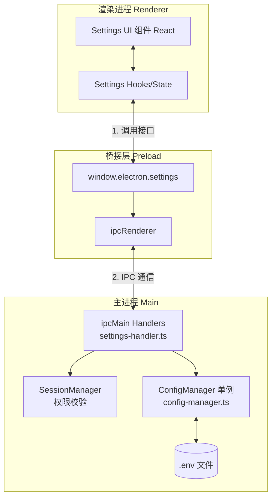
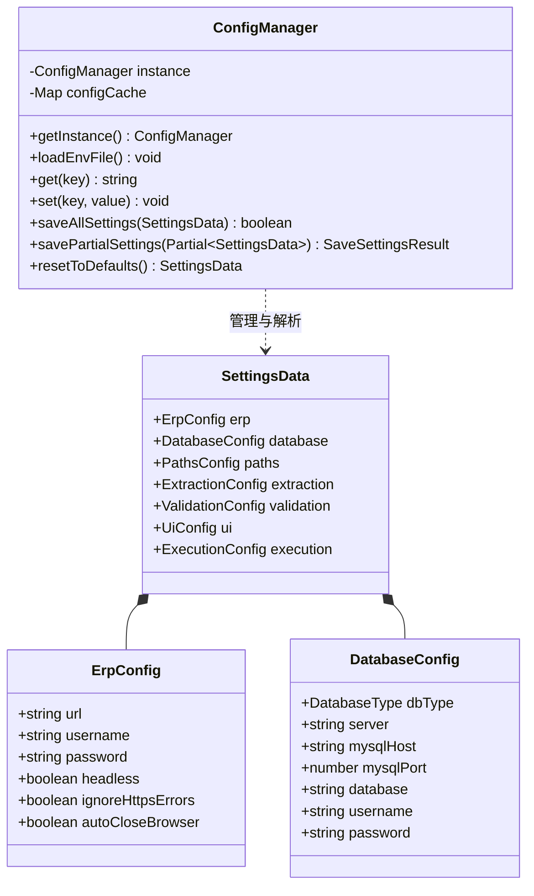
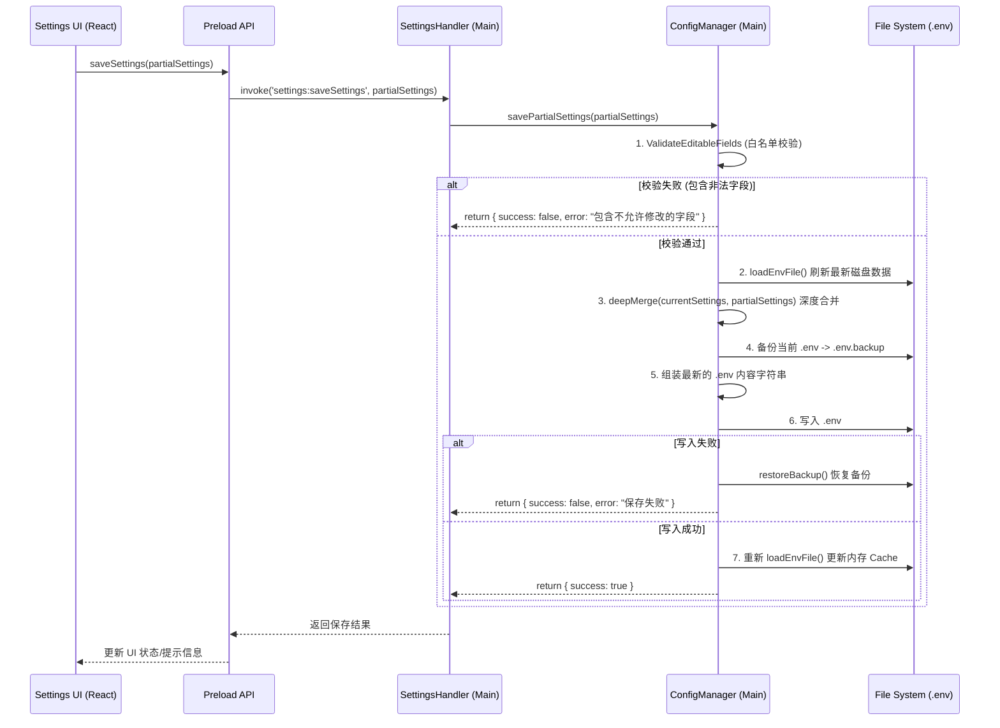

# ERPAuto 项目参数配置管理工作逻辑与框架分析

## 1. 概述 (Overview)
ERPAuto 项目采用 Electron + React + TypeScript 技术栈。参数配置管理系统负责处理应用在不同环境中的配置信息（例如 ERP 连接、数据库连接、文件路径、数据提取与校验等）。
由于 Electron 应用区分主进程 (Main Process) 和渲染进程 (Renderer Process)，配置的持久化与读取集中在主进程通过 `ConfigManager` 对 `.env` 文件进行操作，渲染进程则通过安全桥接（Preload）与主进程 IPC 进行交互。

## 2. 核心模块与架构 (Architecture & Core Modules)

整个参数配置管理的框架分为三层结构：

- **渲染进程层 (Renderer Layer - React UI)**
  负责展示 Settings 界面，收集用户的修改，并调用全局注入的 `window.electron.settings` 接口提交数据。

- **安全桥接层 (Preload Layer - Context Bridge)**
  位于 `src/preload/index.ts` 中，通过 `contextBridge.exposeInMainWorld` 暴露 `settings` 对象，将渲染进程的 API 调用映射为对 IPC Main 的 `invoke` 请求。包含以下核心接口：
  - `getSettings()`
  - `saveSettings(settings)`
  - `resetDefaults()`
  - `testErpConnection()`
  - `testDbConnection()`

- **主进程层 (Main Layer - Node.js)**
  由以下核心组件构成：
  - **`SettingsHandler` (`src/main/ipc/settings-handler.ts`)**: 接收前端发来的 IPC 请求，根据当前用户的权限（Admin、User）对返回或保存的数据进行过滤与拦截，并分发请求到具体的服务类进行处理。
  - **`ConfigManager` (`src/main/services/config/config-manager.ts`)**: 采用单例模式实现的核心配置管理类。负责：
    - 在内存中通过 Map 缓存配置参数 (`configCache`)。
    - 读写磁盘上的 `.env` 文件，实现配置的持久化。
    - 处理增量更新（`savePartialSettings`），利用白名单和深度合并 (`deepMerge`) 保护禁止修改的核心配置项不受非授权篡改。
    - 备份与恢复 (`backupEnvFile` / `restoreBackup`)，保证配置文件安全。
  - **Types (`src/main/types/settings.types.ts`)**: 定义严格的 TypeScript 类型接口（如 `SettingsData`、`ErpConfig` 等），保证前后端数据结构一致性。

## 3. 架构流程图 (Architecture Diagram)

使用 Mermaid 展示应用如何流转配置数据：

## 4. 配置文件结构与数据模型 (Data Model)

所有的配置最终被序列化并聚合成一个大的接口：`SettingsData`，主要包含以下子模块：
- **erp**: ERP系统配置（URL、用户名、密码、无头模式等）
- **database**: 数据库配置（支持 MySQL 和 SQL Server，包含 Host、Port、DB Name 等）
- **paths**: 文件路径配置（数据目录、默认输出文件名等）
- **extraction**: 提取策略配置（Batch Size、开启持久化等）
- **validation**: 校验模块配置（数据源类型、匹配模式等）
- **ui**: 界面设定（字体、字号等）
- **execution**: 执行模式（如 dryRun）

相关类型声明（类图）：

## 5. 保存配置工作逻辑 (Save Settings Workflow)

当用户修改配置并点击保存时，为了避免覆盖未展示在 UI 上的高权限或敏感配置，系统实现了局部更新 (Partial Update) 与白名单机制，其工作流如下：

## 6. 总结
当前配置管理架构设计合理，职责分离清晰。主进程作为单源真相（Single Source of Truth），通过 `ConfigManager` 进行 `.env` 文件的集中托管；渲染层利用 IPC 仅作数据渲染与请求发起，确保了应用的安全性（白名单校验）与稳定性（备份/恢复机制）。
