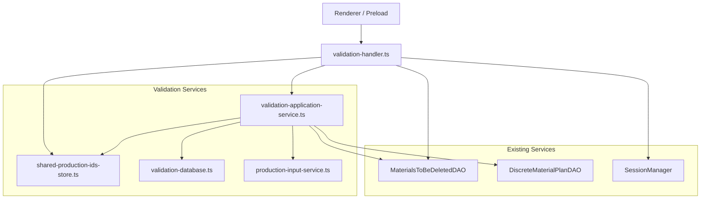
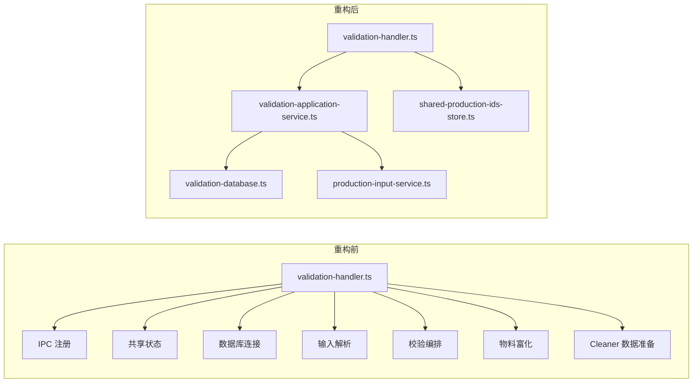

# validation-handler 重构说明

本文档记录 `src/main/ipc/validation-handler.ts` 的第一阶段重构工作，目标是把“超大 IPC Handler”拆回到更清晰的职责边界中，同时保持对外 IPC 协议和业务行为不变。

## 1. 重构背景

重构前，`validation-handler.ts` 同时承担了以下职责：

- IPC 通道注册
- 跨页面共享 `Production ID` 状态
- 数据库连接创建与释放
- MySQL / SQL Server 方言分支
- 输入识别与订单号解析
- 物料校验结果组装
- Cleaner 执行前数据准备
- 物料查询与富化

这种结构的主要问题是：

- 文件过大，理解成本高
- 数据库和业务规则直接堆叠在 IPC 层
- 复用困难，后续其他模块无法直接复用这些逻辑
- 单元测试难以细粒度编写

## 2. 重构目标

本次重构聚焦在“职责下沉、行为不变”：

- 保留原有 IPC channel 和返回结构
- 将共享状态、数据库工厂、输入解析、验证业务流程拆出
- 让 `validation-handler.ts` 回归为薄 IPC 壳层
- 为后续继续拆 `cleaner-handler`、前端校验流程提供复用基础

## 3. 重构后结构

## 4. 新增与调整的文件

### 4.1 IPC 薄壳

- `src/main/ipc/validation-handler.ts`

职责收敛为：

- 注册 IPC handler
- 从 `SessionManager` 读取当前用户
- 调用应用服务
- 对简单 DAO 操作做最轻量转发

### 4.2 共享状态模块

- `src/main/services/validation/shared-production-ids-store.ts`

职责：

- 管理按 `senderId` 隔离的共享 `Production IDs`
- 提供 `set/get/clear`

价值：

- 将原本散落在 handler 文件顶部的状态提升为独立服务
- 后续如果要迁移到更持久的 session store，只需替换这一层

### 4.3 数据库创建与表名适配

- `src/main/services/validation/validation-database.ts`

职责：

- 创建用于 validation 相关流程的数据库服务
- 提供 `getValidationTableName()` 做表名方言转换

价值：

- 收敛 MySQL / SQL Server 的连接逻辑
- 避免 IPC 文件里反复出现数据库构造代码

### 4.4 输入解析服务

- `src/main/services/validation/production-input-service.ts`

职责：

- 读取 Production ID 文件
- 识别输入是 `production_id`、`order_number` 还是 `unknown`
- 从输入解析出订单号列表

价值：

- 把“输入解析规则”变成可复用、可测试的纯业务模块

### 4.5 应用服务

- `src/main/services/validation/validation-application-service.ts`

职责：

- 校验流程编排
- Cleaner 数据准备
- 物料按负责人查询 / 全量查询的富化逻辑
- 统一管理数据库生命周期

价值：

- 形成明确的 application service 层
- 让后续业务扩展不再从 IPC 文件开刀

## 5. 重构前后职责对比

## 6. 本次保留不变的部分

为了控制风险，这次没有修改以下内容：

- IPC channel 名称
- Preload / Renderer 调用方式
- 物料匹配规则
- Cleaner 数据准备规则
- DAO 层的既有 SQL 结构

也就是说，这次更像是一次“结构性搬迁”，不是业务规则改造。

## 7. 验证方式

本次重构完成后，做了以下验证：

- `npm run typecheck:node`
- `tests/unit/shared-production-ids-store.test.ts`
- `tests/unit/production-input-service.test.ts`
- 既有 `tests/unit/ipc-index.test.ts`

## 8. 新增测试

新增测试文件：

- `tests/unit/shared-production-ids-store.test.ts`
- `tests/unit/production-input-service.test.ts`

覆盖内容：

- sender 隔离存储
- 去重行为
- 清空逻辑
- 输入类型识别

## 9. 收益总结

这次重构带来的直接收益：

- `validation-handler.ts` 不再承担过多业务职责
- validation 相关逻辑形成了可复用服务层
- 输入解析与共享状态有了独立测试入口
- 后续继续拆 `cleaner-handler` 时，可以直接复用订单号解析和 cleaner 数据准备逻辑

## 10. 后续建议

建议在这个基础上继续推进：

1. 将 `validation-application-service.ts` 中的 SQL Server / MySQL 分支继续下沉到 repository 或 dialect adapter。
2. 逐步给 `getCleanerData()`、`getMaterialsByManager()` 这类编排逻辑补更多单测。
3. 把和 validation 强耦合的 renderer 逻辑改成显式依赖 application contract，而不是隐式依赖 payload shape。

